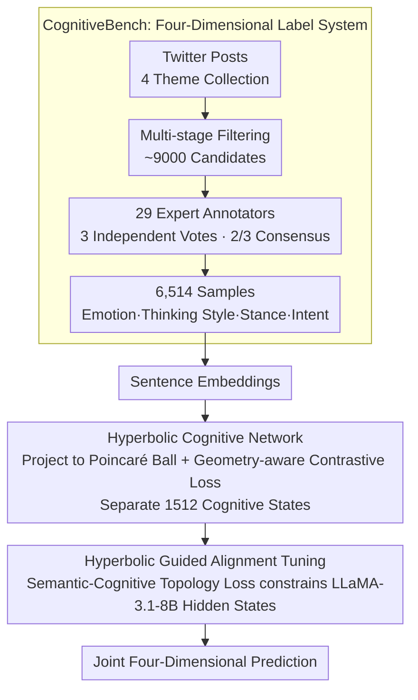

# Modeling Multi-Dimensional Cognitive States in Large Language Models under Cognitive Crowding

**Conference**: ACL 2026  
**arXiv**: [2604.17174](https://arxiv.org/abs/2604.17174)  
**Code**: [GitHub](https://github.com/Chips98/HyCoLLM_for_ACL2026)  
**Area**: LLM Evaluation  
**Keywords**: Cognitive state modeling, cognitive crowding, hyperbolic space, multi-dimensional joint prediction, CognitiveBench

## TL;DR

This paper identifies a "Cognitive Crowding" effect where LLM accuracy plummets to 5.7% when jointly predicting four cognitive dimensions (Emotion-Thinking Style-Stance-Intent). Through Gromov $\delta$-hyperbolicity analysis, cognitive states are proven to possess a hierarchical structure. The proposed HyCoLLM framework models these states in hyperbolic space, enabling an 8B model to outperform GPT-4o.

## Background & Motivation

**Background**: LLMs perform well in isolated tasks such as sentiment analysis, stance detection, and intent recognition. However, psychology indicates that these cognitive dimensions form an interactive system—for instance, an opposing stance might originate from a deliberate analytical style or an angry emotional state.

**Limitations of Prior Work**: (1) Existing benchmarks cover at most two cognitive dimensions (e.g., stance + emotion), failing to support the study of four-way interactions; (2) There is a lack of annotation for "thinking style," which serves as a critical bridge between emotion and stance; (3) LLMs exhibit a sharp performance drop during joint multi-dimensional modeling despite high single-task performance—GPT-4o achieves only 5.7% joint accuracy across four dimensions.

**Key Challenge**: Cognitive states possess a hierarchical/tree-like structure (Gromov $\delta \approx 1\%$), requiring an exponentially growing representation space, whereas the Euclidean space of LLMs grows only polynomially. This "Cognitive Crowding" causes different cognitive states to overlap and become indistinguishable in Euclidean space.

**Goal**: (1) Construct CognitiveBench, the first four-dimensional cognitive benchmark; (2) Diagnose and explain the joint modeling bottlenecks in LLMs; (3) Propose a geometry-aware solution.

**Key Insight**: Utilize the natural exponential volume growth and hierarchical structure support of hyperbolic space to mitigate cognitive crowding.

**Core Idea**: Model cognitive states in hyperbolic space (Poincaré ball), separate different states via geometry-aware contrastive loss, and align the internal representations of the LLM through Hyperbolic Guided Alignment Tuning.

## Method

### Overall Architecture

HyCoLLM models "joint four-dimensional cognitive state prediction" as a two-stage process: first establishing a cognitive coordinate system in hyperbolic space, then aligning the LLM to this system. Given a social media post, the first stage, Hyperbolic Cognitive Network (HCN), projects sentence embeddings onto a Poincaré ball and uses geometry-aware contrastive loss to spread 1,512 cognitive state combinations across the hyperbolic manifold. The second stage, Hyperbolic Guided Alignment Tuning (HGAT), fine-tunes LLaMA-3.1-8B-Instruct using a semantic-cognitive topology loss to constrain the model's hidden states to fit the geometry learned by HCN, ultimately outputting joint predictions for emotion, thinking style, stance, and intent.

### Key Designs

**1. CognitiveBench: Integrating "Thinking Style" into the Cognitive Label System**

Existing benchmarks cover at most stance and emotion. The missing "thinking style" is the crucial bridge connecting emotion to stance, which prevents research into cross-dimensional interactions. The authors collected posts from Twitter across four themes: US-China trade, the US election, DEI, and Fed interest rates. Following multi-stage filtering, ~9,000 candidates were annotated by 29 experts with backgrounds in psychology or affective computing. Only samples with at least 2/3 consensus among three independent annotators were kept, resulting in 6,514 high-quality samples. The labels are grounded in established psychological theories: Plutchik’s model for emotion, Dual-process theory for thinking style (intuitive vs. analytical), Social Judgment Theory for stance, and Speech Act Theory for intent.

**2. Hyperbolic Cognitive Network: Exponential Space for Cognitive States**

The number of label combinations across four dimensions reaches $9\times8\times3\times7=1512$. Since Euclidean volume grows only polynomially with the radius, it cannot accommodate these hierarchical states without significant overlap—the geometric root of "Cognitive Crowding." HCN maps sentence embeddings to the Poincaré ball and uses a geometry-aware contrastive loss to cluster similar states while pushing dissimilar ones apart. Hyperbolic space, with volume growing exponentially with the radius, naturally fits tree-like hierarchies (CognitiveBench shows a relative Gromov $\delta\approx1\%$), allowing the 1,512 states to remain distinct.

**3. Hyperbolic Guided Alignment Tuning: Injecting Hyperbolic Priors into LLM Reasoning**

Learning cognitive embeddings in hyperbolic space is insufficient if the LLM still performs reasoning in a Euclidean hidden space. HGAT introduces a Semantic-Cognitive Topology Loss during fine-tuning, which constrains the topological structure of LLM hidden states to align with the learned hyperbolic cognitive space, optimized alongside standard generation loss. This ensures geometric priors are embedded into the model's reasoning process, allowing it to rely on hierarchical relationships between cognitive dimensions rather than treating them as independent classification heads.

## Key Experimental Results

### Main Results

| Model | Avg. Single-Dimension Acc | Joint 4-Dimension Acc |
|------|----------------|----------------|
| GPT-4o | ~50-60% | 5.7% |
| LLaMA-3.1-8B (SFT) | ~45-55% | ~4% |
| **Ours (HyCoLLM-8B)** | **Gain** | **Significant Gain (Exceeds GPT-4o)** |

### Ablation Study

| Configuration | Joint Accuracy | Description |
|------|----------|------|
| HyCoLLM (Full) | Highest | Complete framework |
| w/o HCN | Decrease | No hyperbolic cognitive network |
| w/o HGAT | Decrease | No alignment tuning |
| Euclidean Contrastive Replace | Decrease | Confirms necessity of hyperbolic geometry |

### Key Findings

- GPT-4o performs reasonably in single dimensions, but achieving only 5.7% in joint prediction indicates a geometric limitation of the representation space rather than a lack of capability.
- Gromov $\delta$-hyperbolicity analysis confirms that CognitiveBench has a relative $\delta \approx 1\%$, indicating a strong hierarchical structure.
- The HyCoLLM-8B model outperforms GPT-4o in joint modeling, proving the effectiveness of geometric priors.
- Inclusion of the "thinking style" dimension significantly impacts stance and intent prediction—confirming cross-dimension interactions.

## Highlights & Insights

- The concept of "Cognitive Crowding" accurately diagnoses the bottleneck in LLM multi-dimensional modeling as a geometric constraint rather than a capacity issue.
- Utilizing Gromov $\delta$-hyperbolicity to analyze data structure provides a data-driven justification for when to employ hyperbolic space.
- The fact that an 8B model outperforms GPT-4o strongly demonstrates the value of geometric inductive biases.

## Limitations & Future Work

- CognitiveBench is limited to English Twitter data; cross-cultural and cross-linguistic generalization remains unknown.
- Hyperbolic operations increase training complexity and the risk of numerical instability.
- The four-dimensional system may still be incomplete—deeper cognitive dimensions like personality or values are not yet included.
- High annotation costs (29 experts over two months) limit scalability.

## Related Work & Insights

- **vs. SemEval-16**: Only covers stance and emotion, lacking thinking styles.
- **vs. DoT (Chen et al.)**: DoT focuses on detecting single cognitive distortions, whereas this work addresses multi-dimensional joint modeling.
- **vs. Hyperbolic Embeddings**: Previously utilized in NLP for word embeddings and Knowledge Graphs; this is the first application to multi-dimensional cognitive state modeling.

## Rating

- Novelty: ⭐⭐⭐⭐⭐ (Cognitive crowding concept + Hyperbolic solution + 4D benchmark)
- Experimental Thoroughness: ⭐⭐⭐⭐ (Extensive ablation, though limited to one base model)
- Writing Quality: ⭐⭐⭐⭐ (Clear framework, high technical density)
- Value: ⭐⭐⭐⭐⭐ (Identifies fundamental bottleneck and provides effective solution)

<!-- RELATED:START -->

## Related Papers

- [\[ACL 2026\] Erosion of Correct Beliefs: A Study of LLM Cognitive Resilience under Clinical Stress](when_correct_beliefs_collapse_epistemic_resilience_of_llms_under_clinical_pressu.md)
- [\[ACL 2026\] HumanLLM: Benchmarking and Improving LLM Anthropomorphism via Human Cognitive Patterns](humanllm_benchmarking_and_improving_llm_anthropomorphism_via_human_cognitive_pat.md)
- [\[ICML 2025\] MultiCogEval: Evaluating LLMs Across Multi-Cognitive Levels](../../ICML2025/llm_evaluation/evaluating_llms_across_multi-cognitive_levels_from_medical_knowledge_mastery_to_.md)
- [\[ACL 2026\] SciImpact: A Multi-Dimensional, Multi-Field Benchmark for Scientific Impact Prediction](sciimpact_a_multi-dimensional_multi-field_benchmark_for_scientific_impact_predic.md)
- [\[ACL 2026\] Evaluating Temporal Consistency in Multi-Turn Language Models](evaluating_temporal_consistency_in_multi-turn_language_models.md)

<!-- RELATED:END -->
