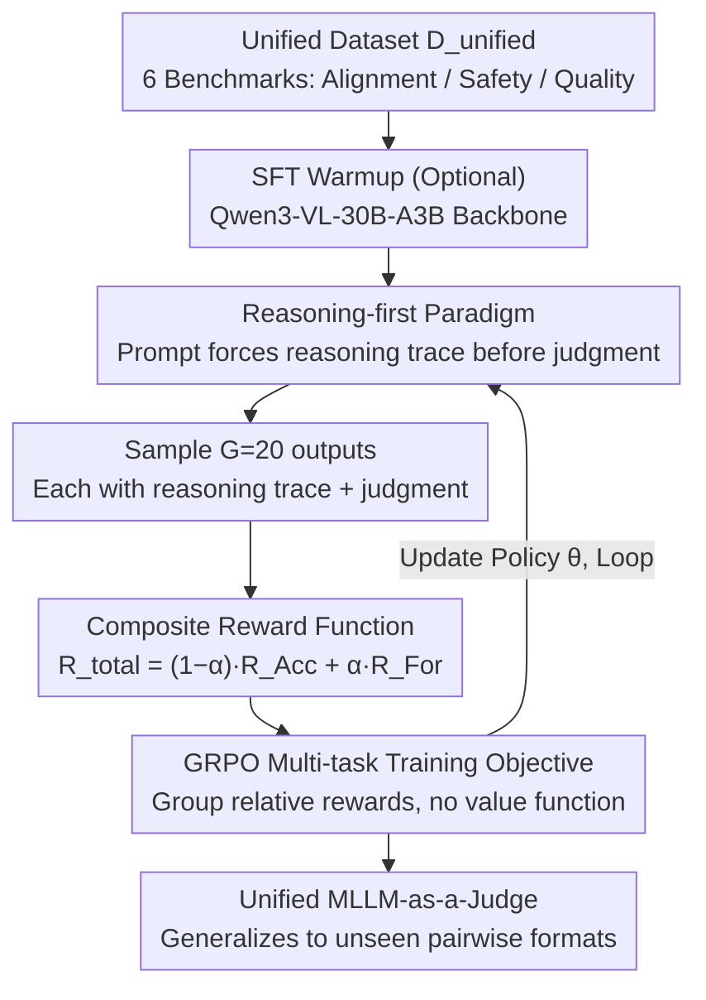

# Multi-Task Reinforcement Learning for Enhanced Multimodal LLM-as-a-Judge

**Conference**: ACL 2026  
**arXiv**: [2603.11665](https://arxiv.org/abs/2603.11665)  
**Code**: None  
**Area**: Multimodal VLM / Automated Evaluation  
**Keywords**: MLLM-as-a-Judge, Multi-task Reinforcement Learning, GRPO, Unified Evaluation, Out-of-Distribution Generalization

## TL;DR

This paper proposes MT-RL-Judge, a multi-task reinforcement learning framework that jointly optimizes multiple evaluation tasks using GRPO to train a unified MLLM-as-a-Judge model. It consistently outperforms SFT baselines across six benchmarks, including text-image alignment, safety compliance, and visual quality assessment. Furthermore, it demonstrates robust out-of-distribution generalization on the unseen MJ-Bench pairwise comparison format (82.23% on Safety vs. 49.40% for SFT-Unified).

## Background & Motivation

**Background**: The MLLM-as-a-Judge paradigm has become the mainstream solution for large-scale multimodal content evaluation. Existing methods are categorized into two types: (1) Prompt-based judges—direct use of off-the-shelf MLLMs with evaluation guidelines injected via prompt engineering; (2) Fine-tuned judges—SFT or RL training on specific evaluation datasets to enhance judgment capabilities.

**Limitations of Prior Work**: (1) Prompt-only judges perform poorly on complex tasks and require task-specific tuning; (2) Existing trainable judges usually focus on a single task (e.g., safety or quality) and fail to generalize to diverse scenarios; (3) SFT-trained judges easily overfit to specific instruction formats—models trained on pointwise evaluation cannot handle pairwise comparison tasks, which is impractical for industrial scenarios with frequently changing requirements; (4) Deploying multiple specialized judge models incurs high maintenance costs and inference overhead.

**Key Challenge**: The Maximum Likelihood Estimation (MLE) objective of SFT encourages models to memorize the surface statistical correlations of input-output pairs rather than internalizing the logic of evaluation reasoning. This leads to models performing well on the training distribution but collapsing under slight changes in format or task.

**Goal**: To build a unified, RL-enhanced MLLM-as-a-Judge framework capable of handling diverse evaluation tasks simultaneously while maintaining generalization to unseen task formats.

**Key Insight**: Leveraging RL (specifically GRPO) encourages the model to generate reasoning steps before providing a verdict, thereby internalizing evaluation logic rather than memorizing surface patterns. Multi-task training exposes the model to shared standards across different evaluation dimensions, further enhancing generalization.

**Core Idea**: Multi-task RL + reasoning-first approach = a unified judge that is both accurate and generalizable.

## Method

### Overall Architecture

MT-RL-Judge aims to train a "precise and generalizable" unified multimodal judgment model. The approach involves concatenating six evaluation benchmarks into a unified dataset $D_{unified}=\bigcup_{k=1}^{K}D_k$ (covering SeeTRUE/ImageReward for text-image alignment, UnsafeBench for safety compliance, and AGIN sub-datasets for visual quality). Based on a Qwen3-VL-30B-A3B-Instruct backbone, the model undergoes optional SFT warmup followed by joint optimization using multi-task GRPO. During training, for each input sample, the model is prompted with a "reasoning-first" instruction to output a reasoning trace before the final judgment. Multiple outputs are sampled for the same prompt, and a composite reward—addressing both format and accuracy—is used for scoring. GRPO updates the policy based on group-wise relative rewards, internalizing evaluation logic into reasoning capabilities rather than memorizing prompt templates.

### Key Designs

**1. Reasoning-first Paradigm: Forcing the Judge to "Think" Before "Judging"**

The MLE objective of SFT essentially mimics the statistical mapping between input and output without learning the reasoning process, causing the model to fail when the input format changes (e.g., from single image to dual images). The reasoning-first paradigm requires the model to output a reasoning trace first in the RL prompt, which is enforced by the format reward $R_{For}$. By compelling the model to unfold its analysis logic within the reasoning trace, its judgment logic aligns more closely with human preferences. This "thinking ability" is crucial when encountering task formats not seen during training (such as pairwise comparison), serving as the fundamental reason why RL generalizes to new formats where SFT fails.

**2. Composite Reward Function: Binding "Thinking" and "Correctness" into a Scalar**

If only accuracy is rewarded, the model may skip to conclusions and degenerate into memorizing surface mappings; if only format is rewarded, judgment quality cannot be guaranteed. The authors define the total reward as a linear combination of two terms: $R_{total}=(1-\alpha)\cdot R_{Acc}+\alpha\cdot R_{For}$. Here, $R_{Acc}$ is 1.0 if the prediction is correct and 0.0 otherwise; $R_{For}$ is 1.0 if the output follows the "reasoning-first" structure and 0.0 otherwise, with $\alpha$ adjusting the weight. The format reward forces the model to expand on CoT-like analysis before judging, enhancing both quality and interpretability, while the accuracy reward directly aligns with correctness. Together, they reinforce both reasoning ability and judgment precision.

**3. Multi-task GRPO: Optimizing via Group-wise Relative Rewards on a Unified Dataset**

Standards learned from single-task RL tend to be tied to specific evaluation types and fail on different formats. For each prompt in the unified dataset, MT-RL-Judge samples $G=20$ outputs from the current judge and performs group-wise relative policy optimization based on the composite reward, eliminating the need for an explicit value function. The optimization objective maximizes the expected reward over the unified dataset: $\theta^*=\arg\max_\theta\mathbb{E}_{(x,p,y)\sim D_{unified}}[R_{total}(M_\theta(x))]$. By mixing multiple evaluation domains during training, the model is forced to capture shared evaluation standards and latent correlations across domains rather than overfitting to a specific prompt template, which is the source of its out-of-distribution generalization.

### Loss & Training

The SFT phase uses AdamW with a learning rate of $1.0\times10^{-5}$, a batch size of 256, and full-parameter fine-tuning. The RL phase utilizes GRPO with $N=20$ rollouts, a global batch size of 256, and a rollout batch size of 512. Training stops once performance on the validation set plateaus, and the best checkpoint is selected.

## Key Experimental Results

### Main Results

**Macro-F1 Comparison across Six Evaluation Tasks**

| Method | AGIN-Nat | AGIN-Tech | AGIN-Rat | SeeTRUE | ImageReward | UnsafeBench |
|------|----------|-----------|----------|---------|-------------|-------------|
| Off-the-shelf | 67.99 | 63.24 | 64.77 | 80.01 | 55.07 | 72.78 |
| SFT-Single | 78.64 | 77.04 | 78.08 | 80.41 | 64.95 | 90.28 |
| SFT-Unified | 81.75 | 81.22 | 81.31 | 82.32 | 63.34 | 89.49 |
| RL-Single | 80.50 | 80.77 | 82.71 | 83.41 | 65.07 | 86.92 |
| **MT-RL-Judge** | 81.63 | **81.37** | 81.58 | **83.67** | 64.97 | 85.22 |

### Ablation Study

**MJ-Bench Out-of-Distribution Generalization (Unseen Pairwise Format)**

| Method | Image-text Alignment | Safety Judge |
|------|---------------------|--------------|
| Off-the-shelf | 59.41 | 73.07 |
| SFT-Unified | 55.82 | 49.40 |
| **MT-RL-Judge** | **60.59** | **82.23** |

### Key Findings

- RL consistently outperforms SFT: RL-Single exceeds SFT-Single in 5 out of 6 tasks, particularly in reasoning-intensive tasks (SeeTRUE +3.0, AGIN-Rat +4.63).
- Unified training enhances performance: SFT-Unified outperforms SFT-Single on most tasks, suggesting that multi-task exposure allows the model to learn shared evaluation standards across domains.
- SFT suffers from severe format overfitting: SFT-Unified collapses to 49.40% on MJ-Bench Safety, far below the 73.07% zero-shot baseline—despite having seen safety evaluation tasks during training, it fails entirely simply because the input changed from single to dual images.
- MT-RL-Judge exhibits significant generalization: On the completely unseen pairwise format, it achieves 82.23% on Safety (surpassing SFT-Unified by 32.83 percentage points), verifying that RL-driven reasoning capabilities can transfer to new formats.

## Highlights & Insights

- The catastrophic degradation of SFT-Unified on MJ-Bench is the most compelling evidence in the paper—it clearly demonstrates the fundamental flaw of SFT in memorizing formats rather than learning logic.
- The "1+1>2" effect of multi-task RL: Joint training does not sacrifice single-task performance; instead, it improves overall performance through cross-task knowledge sharing.
- The reasoning-first design philosophy aligns with recent trends in reasoning models (e.g., DeepSeek-R1, QwQ), but its application in evaluation scenarios is a novel contribution.
- Sophisticated experimental design: The four-group comparison (SFT-Single vs. SFT-Unified vs. RL-Single vs. MT-RL-Judge) clearly isolates the respective contributions of unified training and RL.

## Limitations & Future Work

- Experiments primarily focus on binary classification evaluation tasks and do not cover multi-level scoring or open-ended evaluations.
- The base model is Qwen3-VL-30B-A3B (MoE); its effectiveness on other architectures has not been verified.
- The coverage of the six training tasks is still limited; adding more evaluation dimensions might yield even stronger generalization.
- The quality and diversity of reasoning traces were not analyzed; further verification is needed to determine if the reasoning process truly reflects evaluation logic.

## Related Work & Insights

- **vs. SFT-based Judges (MLLM-as-a-Judge)**: SFT judges overfit prompt templates; MT-RL-Judge internalizes evaluation logic through RL-based reasoning.
- **vs. Mr. Judge / Flex-Judge**: Existing works mostly focus on single-task training, while MT-RL-Judge is the first to achieve a unified multi-task RL judge.
- **vs. Self-Consistency methods**: Sampling multiple candidates and voting is computationally expensive and may include similar errors; MT-RL-Judge improves accuracy through the quality of latent reasoning.

## Rating

- Novelty: ⭐⭐⭐⭐ First unified multi-task RL framework for MLLM-as-a-Judge; deep insights into SFT format overfitting.
- Experimental Thoroughness: ⭐⭐⭐ Six benchmarks are substantial, but more OOD tests and reasoning quality analysis are missing.
- Writing Quality: ⭐⭐⭐⭐ Clear motivation and sophisticated experimental design, though some methodological details are concise.
- Value: ⭐⭐⭐⭐ Provides a unified and generalizable solution for industrial-grade multimodal evaluation; MJ-Bench results are convincing.

<!-- RELATED:START -->

## Related Papers

- [\[ACL 2026\] Contrastive Decoding Mitigates Score Range Bias in LLM-as-a-Judge](contrastive_decoding_mitigates_score_range_bias_in_llm-as-a-judge.md)
- [\[ACL 2026\] Reasoning Model Is Superior LLM-Judge, Yet Suffers from Biases](reasoning_model_is_superior_llm-judge_yet_suffers_from_biases.md)
- [\[ICML 2026\] Agent World Model: Infinity Synthetic Environments for Agentic Reinforcement Learning](../../ICML2026/llm_evaluation/agent_world_model_infinity_synthetic_environments_for_agentic_reinforcement_lear.md)
- [\[ACL 2026\] SessionIntentBench: A Multi-Task Inter-Session Intention-Shift Modeling Benchmark](sessionintentbench_a_multi-task_inter-session_intention-shift_modeling_benchmark.md)
- [\[ICLR 2026\] Detecting Data Contamination from Reinforcement Learning Post-training for Large Language Models](../../ICLR2026/llm_evaluation/detecting_data_contamination_from_reinforcement_learning_post-training_for_large.md)

<!-- RELATED:END -->
