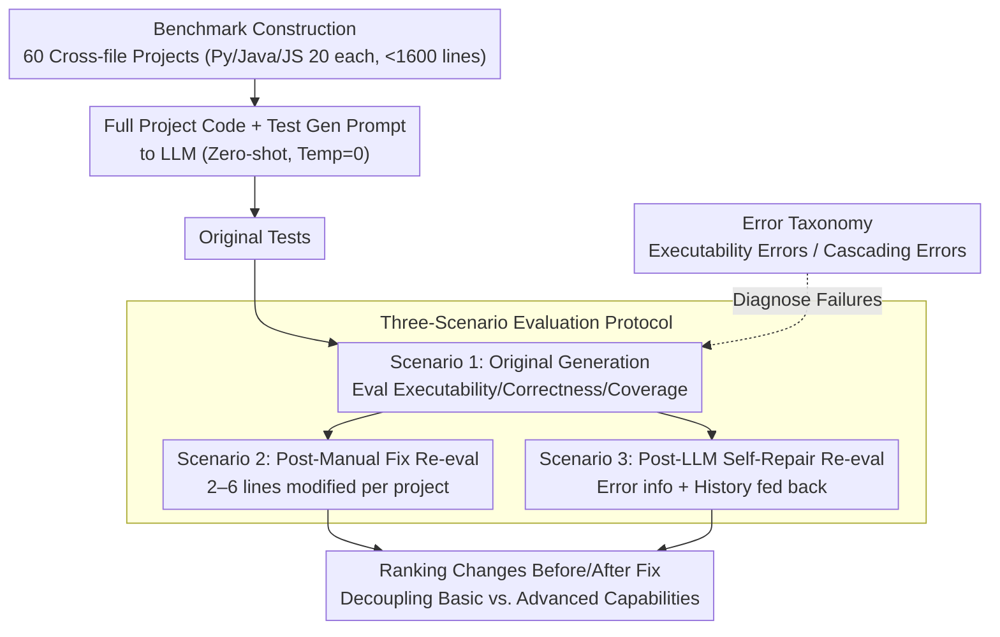

# MultiFileTest: A Multi-File-Level LLM Unit Test Generation Benchmark and Impact of Error Fixing Mechanisms

**Conference**: ACL 2026 Findings  
**arXiv**: [2502.06556](https://arxiv.org/abs/2502.06556)  
**Code**: [GitHub](https://github.com/MultiFileTest)  
**Area**: LLM Evaluation  
**Keywords**: Unit test generation, multi-file benchmark, cross-file dependency, error fixing, code quality

## TL;DR
Ours proposes MultiFileTest, the first multi-file level LLM unit test generation benchmark, covering 20 projects each for Python/Java/JavaScript. It evaluates 11 frontier LLMs and analyzes the impact of manual fixing and self-repair mechanisms on test quality, revealing that even the strongest models exhibit numerous basic executability errors.

## Background & Motivation

**Background**: LLM-driven unit test generation has become a significant use case for code assistance, greatly improving test readability and generation efficiency. Existing benchmarks primarily evaluate test generation capabilities for function-level or class-level (single-file) code.

**Limitations of Prior Work**: (1) In real-world projects, functions interact across files with complex dependencies, but existing benchmarks ignore multi-file level test generation challenges; (2) DevBench, the only work involving multi-file tests, contains only 16 projects and is designed for breadth rather than depth, lacking systematic analysis of cross-file dependencies and errors; (3) A large number of basic errors (non-executable, cascading failures) in LLM-generated tests hinder the evaluation of higher-level capabilities (correctness, coverage).

**Key Challenge**: The core difficulty of multi-file test generation lies not in generating the test logic itself, but in correctly understanding cross-file dependencies and properly setting up the test environment—which is precisely the weak point of LLM reasoning.

**Goal**: (1) Construct a high-quality multi-file test benchmark; (2) Systematically evaluate frontier LLMs on this task; (3) Analyze error types and evaluate the effectiveness of repair mechanisms.

**Key Insight**: By re-evaluating after manually fixing basic errors, one can distinguish between the "lack of basic capabilities" and "lack of advanced capabilities" of LLMs, revealing the true potential differences between various models.

**Core Idea**: Evaluate under three scenarios—original generation (Scenario 1), after manual fixing (Scenario 2), and after LLM self-repair (Scenario 3)—to reveal essential differences between models through ranking changes before and after error fixing.

## Method

### Overall Architecture

MultiFileTest is an evaluation benchmark rather than a training method. The core is quantifying "LLM unit test generation under cross-file dependencies" using a controlled project set and a three-scenario protocol. The benchmark collects 60 selected GitHub projects (20 each for Python/Java/JavaScript), with each project having 2–15 files, under 1600 lines, and mandatory cross-file dependencies. During evaluation, the complete project code and test generation prompts are fed to LLMs (zero-shot, temperature=0). Original tests are evaluated for executability, correctness, and coverage, followed by re-evaluation after manual fixing and LLM self-repair respectively. Ranking changes before and after fixing separate "lack of basic capabilities" from "lack of advanced capabilities."

### Key Designs

**1. Benchmark Construction: Keeping projects within context windows while forcing cross-file dependencies**

Real-world projects are either too large for the context window or single-file, making multi-file reasoning difficult to test fairly. Projects were filtered from GitHub using three criteria: moderate scale (2–15 files, <1600 lines), existence of cross-file dependencies, and high star/fork counts. For large projects, self-contained sub-projects were extracted and dependency paths adjusted. Scale limits ensure fair comparison under the same context budget, while the "mandatory cross-file dependency" constraint makes multi-file reasoning a necessary attribute rather than an optional bonus.

**2. Three-Scenario Evaluation Protocol: Decoupling basic error interference via "Before vs. After Fix"**

Executability errors, such as a missing import, are simple but can drop correctness and coverage to zero, masking the model's true gap in test logic design. The protocol uses three scenarios: Scenario 1 evaluates original quality; Scenario 2 involves manual fixing of executability and cascading errors by CS PhDs (modifying only 2–6 lines on average per project) to reveal true potential; Scenario 3 feeds error messages and history back for LLM self-repair. The comparison provides fairer rankings and quantifies how far self-repair is from human performance.

**3. Error Taxonomy: Independent statistics for executability and cascading errors**

Without distinguishing error types, it is impossible to understand model failure modes. The benchmark categorizes errors into two types: executability errors refer to the entire test suite failing to run (e.g., `ModuleNotFoundError`), while cascading errors refer to a single root cause triggering multiple test failures (e.g., a missing NumPy import causing a batch of tests to error). Separating "overall non-executability" from "individual test failure" explains why original correctness is severely underestimated and supports why manual fixes of a few lines can significantly shift rankings.

## Key Experimental Results

### Main Results (Python, Original Generation Scenario 1)

| Model | Correctness Rate (CR) | Executability Rate (ER) | Line Coverage (LC) | Branch Coverage (BC) |
|------|-----------|-------------|-----------|-------------|
| Gemini-3.0-Pro | 77% | 85% | 76% | 73% |
| Claude-3.5-Sonnet | 64% | 70% | 51% | 47% |
| GPT-o1 | 60% | 65% | 56% | 54% |
| GPT-5-mini | 53% | 60% | 51% | 50% |
| GPT-4-Turbo | 47% | 65% | 40% | 36% |

### Cross-language Comparison

| Language | Best Model | Best CR | Description |
|------|---------|--------|------|
| Python | Gemini-3.0-Pro | 77% | Relatively easiest |
| Java | Gemini-3.0-Pro | 62% | Strict syntax increases difficulty |
| JavaScript | GPT-o1 | Highest | Optimal model varies by language |

### Key Findings
- Model rankings shift significantly after manual fixing, showing that error distributions and improvement potentials vary greatly across models.
- Even Gemini-3.0-Pro (the strongest model) has 15% non-executability in Python, revealing fundamental challenges in multi-file understanding.
- Java is the most difficult language due to stricter type systems and syntax requirements.
- LLM self-repair capabilities are effective but fall far short of manual repair quality.

## Highlights & Insights
- The three-scenario evaluation design is ingenious—it distinguishes "solvable simple fixes" from "intrinsic capability deficiencies" by re-evaluating after basic error fixes, providing a fairer model assessment.
- The concept of cascading errors is vital for practical applications: a single missing import can lead to 20 failed tests, inflating error counts.
- Open-source models (CodeQwen, DeepSeek-Coder, etc.) show a massive gap compared to closed-source models in multi-file test generation, highlighting a bottleneck in complex reasoning.

## Limitations & Future Work
- Project scale is limited to <1600 lines to fit context windows; test generation for real-world large projects remains a bigger challenge.
- Current evaluation uses zero-shot; few-shot or agentic iterative generation strategies might significantly improve performance.
- The standardization of manual fixes depends on annotators; though protocols exist, subjectivity remains.

## Related Work & Insights
- **vs DevBench**: DevBench has only 16 multi-file projects and does not mandate cross-file dependencies; MultiFileTest provides 3.75x more projects and ensures cross-file reasoning.
- **vs HumanEval/MBPP**: These benchmarks only evaluate function-level code generation and cannot reflect dependency understanding in real projects.
- **vs SWT-Bench**: SWT-Bench focuses on bug fixing rather than test generation; MultiFileTest focuses on test completeness and coverage.

## Rating
- Novelty: ⭐⭐⭐⭐ First systematic multi-file unit test benchmark.
- Experimental Thoroughness: ⭐⭐⭐⭐⭐ 11 models, 3 languages, 3 scenarios, detailed error analysis.
- Writing Quality: ⭐⭐⭐⭐ Clear structure, intuitive error classification.
- Value: ⭐⭐⭐⭐⭐ Fills a critical gap in multi-file test evaluation.

<!-- RELATED:START -->

## Related Papers

- [\[ACL 2026\] SciImpact: A Multi-Dimensional, Multi-Field Benchmark for Scientific Impact Prediction](sciimpact_a_multi-dimensional_multi-field_benchmark_for_scientific_impact_predic.md)
- [\[ACL 2026\] AgentEval: DAG-Structured Step-Level Evaluation for Agentic Workflows with Error Propagation Tracking](agenteval_dag-structured_step-level_evaluation_for_agentic_workflows_with_error_.md)
- [\[ICLR 2026\] How Many Code and Test Cases Are Enough? Evaluating Test Cases Generation from a Binary-Matrix Perspective](../../ICLR2026/llm_evaluation/how_many_code_and_test_cases_are_enough_evaluating_test_cases_generation_from_a_.md)
- [\[ICML 2026\] CapBencher: Give Your LLM Benchmark a Built-in Alarm for Test-Set Overfitting](../../ICML2026/llm_evaluation/capbencher_give_your_llm_benchmark_a_built-in_alarm_for_test-set_overfitting.md)
- [\[ACL 2026\] SessionIntentBench: A Multi-Task Inter-Session Intention-Shift Modeling Benchmark](sessionintentbench_a_multi-task_inter-session_intention-shift_modeling_benchmark.md)

<!-- RELATED:END -->
