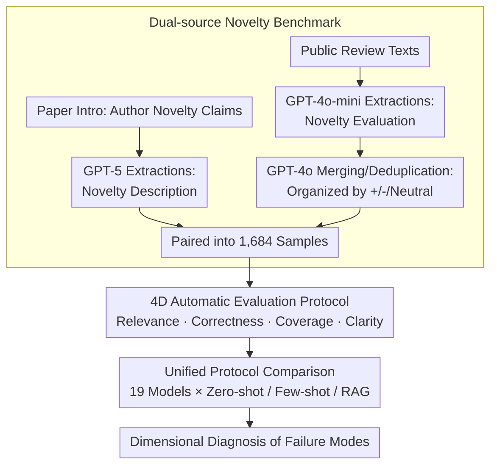

# NovBench: Evaluating Large Language Models on Academic Paper Novelty Assessment

**Conference**: ACL2026  
**arXiv**: [2604.11543](https://arxiv.org/abs/2604.11543)  
**Code**: https://github.com/njust-winchy/llm4novelty  
**Area**: AIGC Detection / Automated Peer Review / Academic Text Evaluation  
**Keywords**: Academic Novelty Assessment, Automated Peer Review, LLM Evaluation, Review Text Generation, Semantic Evaluation Metrics

## TL;DR
NovBench pairs "novelty claims in paper introductions" with "textual novelty evaluations from reviewers" to create a benchmark of 1,684 samples. Using four dimensions—Relevance, Correctness, Coverage, and Clarity—it systematically reveals that while current general-purpose and specialized LLMs can generate fluent evaluations, they still struggle to truly understand and comprehensively judge academic novelty.

## Background & Motivation
**Background**: Academic peer review has long regarded novelty as a core criterion. Especially in fields with rapidly growing submission volumes like NLP and Machine Learning, reviewers must determine whether a paper proposes new tasks, methods, resources, experimental setups, or theoretical observations. Existing research on automated peer review primarily focuses on overall scoring, full review generation, or paper-level recommendations. Some works also use bibliometric indicators, text embeddings, or LLMs to score paper novelty.

**Limitations of Prior Work**: Most of these methods treat "novelty" as a single score or a generalized review segment, lacking specialized evaluation of free-text novelty assessment. Metrics like ROUGE, BLEU, and BERTScore rely on lexical or sentence-vector similarity and cannot determine if a model covers the specific novelty points that reviewers actually care about. Furthermore, LLM-as-a-judge approaches are opaque and risk delegating evaluation authority to another uncalibrated model.

**Key Challenge**: Novelty evaluation requires both a faithful understanding of the contributions claimed by authors in the introduction and a reviewer-like judgment of whether these contributions are sufficient, merely routine combinations, or involve exaggeration or omission. If a model only paraphrases the introduction, it achieves high surface relevance but lacks reviewer judgment; if it merely mimics review tone, it may produce seemingly professional but groundless criticism.

**Goal**: The authors aim to decouple novelty assessment from broad automated review tasks to establish a reproducible benchmark. They also design evaluation dimensions that are more interpretable than lexical overlap to check whether a model understands the source text, aligns with human reviewer judgment, covers novelty points noted by humans, and produces clear, specific output.

**Key Insight**: Rather than requiring the model to read the entire paper, the authors select novelty descriptions from the introduction as input, as introductions typically state the claimed contributions most explicitly. They then extract novelty-related evaluations from public review texts as the human reference. This design sacrifices some full-text information in exchange for standardized task inputs and large-scale constructability.

**Core Idea**: Use paired data of "author-claimed novelty" and "reviewer-evaluated novelty" to specifically measure the ability of LLMs to generate novelty review text, rather than looking only at overall reviews or individual novelty scores.

## Method

### Overall Architecture

NovBench aims to answer a question often conflated in previous automated review research: whether LLMs can evaluate paper novelty as human reviewers do. To this end, the authors narrow the task input to the author's own novelty declaration in the introduction and define the output as novelty evaluation text organized by positive/neutral/negative sentiment, using real reviewer evaluations as a reference. The pipeline consists of a data construction layer and an evaluation protocol: the former extracts and pairs author declarations and expert judgments from 1,684 papers; the latter decomposes generated text quality into Relevance, Correctness, Coverage, and Clarity rather than overall similarity.

### Key Designs

**1. Dual-source Novelty Benchmark: Aligning Author Claims with Reviewer Judgments**
The difficulty of novelty evaluation lies in its two endpoints: what the author claims as innovation and whether the reviewer agrees. Manual annotation cannot scale, while relying solely on introductions ignores expert judgment. Thus, a dual-source construction is used. On the author side, 87 papers from COLING 2020 were manually annotated to select extraction methods; after comparing prompts, GPT-5 with contextual prompts was used to extract novelty sentences from EMNLP 2023 introductions. On the reviewer side, novelty aspect data from existing peer review resources was reused, and GPT-4o-mini was selected to extract evaluations, followed by GPT-4o merging and organizing comments by sentiment. This ensures models cannot pass by simply paraphrasing the introduction.

**2. Four-Dimensional Automatic Evaluation Protocol: Decomposing Mixed Scores**
Novelty evaluation failures vary: models may be relevant but have the wrong stance, have the correct stance but miss key points, or cover many points but remain vague. Thus, the authors use dimensional diagnosis. Relevance uses Maximum Matching Average IMS to measure if the generated evaluation covers the input novelty description. Correctness uses sentiment distribution distance $DistAcc=1-\sum_i |p_i-t_i|/2$ to compare proportions. Coverage uses sentence vector cosine similarity with a threshold $\tau=0.7$ to check how many human novelty points are covered. Clarity integrates keyword coverage, sentence length sufficiency, and perplexity-based fluency.

**3. Unified Protocol Comparing General LLMs, Specialized Models, and Prompting Strategies**
Automated review research often assumes stronger LLMs or fine-tuning on review data automatically leads to better performance. However, novelty is a fine-grained judgment task that requires comparison under identical inputs and metrics. The authors placed 11 general models (GPT-4o, GPT-5, Gemini-2.5-flash, DeepSeek-R1, Qwen3, gpt-oss, etc.) and 8 specialized models (CycleReviewer, DeepReviewer, Llama-OpenReviewer, Reviewer2, SEA-E, SEA-S, etc.) under the same protocol using greedy decoding and a 4096 token limit across zero-shot, few-shot, and RAG strategies.

### Loss & Training
This work does not train a new novelty model or use new supervised loss functions. Settings are focused on data extraction and baseline inference: GPT-5 context prompts for novelty descriptions, GPT-4o-mini zero-shot for novelty evaluations, and GPT-4o for deduplication. During evaluation, all LLMs use deterministic greedy decoding. The RAG retrieval bank comprises titles and abstracts from ACL, EMNLP, and NAACL (2019–2022), with 5 samples retrieved as additional context per sample.

## Key Experimental Results

### Main Results
The final NovBench data is derived from EMNLP 2023 (1,684 papers), with a subset of 87 COLING 2020 papers used for pilot studies.

| Resource | Papers | Avg. Novelty Description Sentences | Avg. Novelty Evaluation Points | Purpose |
|----------|--------|-----------------------------------|-------------------------------|---------|
| COLING 2020 Subset | 87 | 6.1 | - | Manual annotation for extraction method selection |
| NovBench / EMNLP 2023 | 1,684 | 5.3 | 7.7 | Main benchmark: paired claims and judgments |

Core results show that closed-source general models lead in Relevance, while specialized models like the SEA series excel in Coverage and DistAcc. No model universally approaches the ideal novelty reviewer.

| Model / Strategy | Relevance | Coverage | Clarity | DistAcc | Key Interpretation |
|-------------|-----------|----------|---------|---------|----------|
| GPT-4o / zero-shot | 3.6983 | 0.2332 | 0.6595 | 0.6979 | Strongest relevance; captures intro claims well |
| GPT-4o / few-shot | 3.5609 | 0.2391 | 0.6587 | 0.7091 | Few-shot improves sentiment alignment but hurts relevance |
| Gemini-2.5-flash / RAG | 3.5089 | 0.2270 | 0.6682 | 0.5923 | High clarity under RAG; DistAcc is mediocre |
| SEA-S / zero-shot | 3.6304 | 0.2576 | 0.6630 | 0.7162 | Strong balanced performance; high DistAcc |
| SEA-E / RAG | 3.3807 | 0.2712 | 0.6585 | 0.5965 | Highest Coverage; captures more reviewer points |
| Reviewer2 / RAG | 0.1556 | 0.0000 | 0.0184 | 0.0709 | Severe instruction-following failure |

Human preference validation on 100 samples confirmed that the four-dimensional metrics align with expert judgment.

| Validation Item | Value | Meaning |
|--------|------|------|
| Human Eval Samples | 100 | Random sampling to compare model outputs |
| Evaluators | 4 NLP Experts | Including PhD students and professors |
| Fleiss' $\kappa$ | 0.72 | Substantial agreement among annotators |
| Spearman $\rho$ | 0.61 | Significant correlation with human preference ($p<0.001$) |
| Agreement | 78% | Metric-selected "better" output matches human consensus |

### Ablation Study
Rather than module ablation of a single model, the authors analyzed prompting strategies and model types as core variables.

| Configuration / Comparison | Key Metric Change | Explanation |
|-------------|--------------|------|
| zero-shot | GPT-4o Rel 3.6983, SEA-S Rel 3.6304 | Most models peak in relevance here, avoiding deviation from source text |
| few-shot | GPT-4o DistAcc 0.7091, SEA-S DistAcc 0.7149 | Examples help mimic human review sentiment but encourage template-style output |
| RAG | Gemini RAG Clarity 0.6682 | Retrieval increases specificity but may drift focus from the target paper |
| General vs Specialized | SEA series > General in Coverage/DistAcc | Fine-tuning on review data helps learn style but not necessarily better judgment |
| Human Relevance | Human Relevance 2.7899 | Humans don't just paraphrase the intro; they use domain knowledge for high-level judgment |

### Key Findings
- LLMs excel at information extraction and clarity: they can identify methods or tasks from novelty descriptions and produce structured evaluations.
- The most significant weakness is "reviewer-like judgment": low Coverage shows models miss many points emphasized by human reviewers.
- Few-shot prompting helps models adopt a "reviewer's voice" and sentiment distribution (improving DistAcc) but often at the cost of Relevance.
- RAG does not inherently help novelty assessment; if the retrieved content is not a perfect match, it causes focus drift.
- Risks in specialized models: some fine-tuned models fail on structural constraints, leading to repetitive or empty outputs.

## Highlights & Insights
- The most valuable contribution is isolating "review text evaluation" from general automated reviewing. Novelty evaluation exposes whether a model truly understands academic contributions.
- The dual-source design is clever: introductions represent explicit claims, while review texts represent external validation. The tension between them is the essence of novelty assessment.
- The 4D metrics, while not a perfect gold standard, are more task-aligned than ROUGE/BLEU. Specifically, DistAcc and Coverage separate "stance similarity" from "content coverage."
- The low Relevance score of human reviewers is insightful: good reviews aren't just paraphrases. True novelty judgment relies on external knowledge and experience.
- The negative results for specialized LLMs are crucial. Fine-tuning on specific formats can sacrifice general instruction-following capabilities.

## Limitations & Future Work
- **Input Constraint**: Using only introductions may miss novelty points described in the methodology or experiment sections.
- **Selection Bias**: Data mainly comes from COLING and EMNLP and primarily features accepted papers, which may limit generalizability to rejected submissions or other disciplines.
- **Coarse Taxonomy**: Different types of papers (method vs. resource vs. analysis) have different novelty standards, which were only broadly categorized here.
- **Metric Proxies**: Coverage and Clarity rely on embeddings and perplexity, which are proxies for, rather than direct measures of, expert judgment.
- **RAG Implementation**: The RAG setup is relatively simple. Future work could explore multi-agent setups or knowledge-graph-enhanced retrieval.

## Related Work & Insights
- **vs Automated Peer Review Generation**: Unlike PeerRead or ReviewRobot which target full reviews, this work isolates the novelty dimension for clearer diagnosis.
- **vs Novelty Score Prediction**: While prior works output numerical scores, NovBench emphasizes interpretable textual evaluation required for actual feedback.
- **vs LLM-as-judge**: This work avoids high-level black-box judgments by using interpretable automatic metrics validated against human preferences.
- **Insight**: To build a reliable AI review assistant, models should output evidence-grounded novelty claims and comparisons with related work rather than just fluent summaries.

## Rating
- Novelty: ⭐⭐⭐⭐☆ First large-scale benchmark specifically for textual novelty evaluation; however, construction relies heavily on LLM extraction.
- Experimental Thoroughness: ⭐⭐⭐⭐☆ Covers 19 models and 3 strategies with human validation; limited by the NLP-centric and accepted-paper-centric dataset.
- Writing Quality: ⭐⭐⭐⭐☆ Clear structure and comprehensive analysis; minor improvements possible in table referencing.
- Value: ⭐⭐⭐⭐⭐ Vital for the community to distinguish between "writing like a reviewer" and "actually evaluating novelty."

<!-- RELATED:START -->

## Related Papers

- [\[ACL 2026\] Zero-shot Large Language Models for Automatic Readability Assessment](zero-shot_large_language_models_for_automatic_readability_assessment.md)
- [\[ACL 2026\] EngiBench: A Benchmark for Evaluating Large Language Models on Engineering Problem Solving](engibench_a_benchmark_for_evaluating_large_language_models_on_engineering_proble.md)
- [\[ACL 2026\] SciCustom: A Framework for Custom Evaluation of Scientific Capabilities in Large Language Models](scicustom_a_framework_for_custom_evaluation_of_scientific_capabilities_in_large_.md)
- [\[ACL 2026\] Question Difficulty Estimation for Large Language Models via Answer Plausibility Scoring](question_difficulty_estimation_for_large_language_models_via_answer_plausibility.md)
- [\[ACL 2026\] SCAN: Structured Capability Assessment and Navigation for LLMs](scan_structured_capability_assessment_and_navigation_for_llms.md)

<!-- RELATED:END -->
