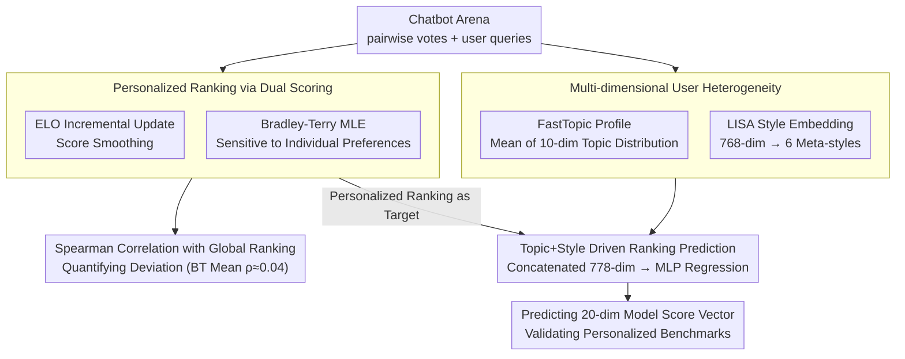

# Personalized Benchmarking: Evaluating LLMs by Individual Preferences

**Conference**: ACL 2026 Findings  
**arXiv**: [2604.18943](https://arxiv.org/abs/2604.18943)  
**Code**: None  
**Area**: LLM Evaluation / Personalized Recommendation  
**Keywords**: Personalized benchmark evaluation, LLM ranking, user preference heterogeneity, Bradley-Terry model, topic and style analysis

## TL;DR

Ours conducts a personalized ranking analysis of 115 active users in Chatbot Arena, finding that the average Spearman correlation between Bradley-Terry personalized rankings and global rankings is only $\rho=0.04$ (with 57% of users showing near-zero or negative correlation). This demonstrates that aggregated benchmarks fail to reflect the individual preferences of most users. Furthermore, ours successfully predicts user-specific model rankings through topic and style features.

## Background & Motivation

**Background**: Benchmarks such as Chatbot Arena, AlpacaEval, and MT-Bench establish global model rankings by aggregating preference votes from all users, implicitly assuming that user preferences are homogeneous. These rankings are widely used to guide model selection and development directions.

**Limitations of Prior Work**: (1) User needs vary significantly—software developers prefer concise and precise technical answers, while creative writers prefer imaginative responses; aggregate rankings may be suboptimal for both. (2) As LLMs are deployed to increasingly diverse user groups, aggregate metrics might recommend a model that is "mediocre" for everyone rather than "best" for a specific group. (3) There is a lack of quantitative evidence regarding how far individual preferences deviate from the global consensus.

**Key Challenge**: The contradiction between "one-size-fits-all" model rankings and the fundamental heterogeneity of user preferences—users do not merely have minor deviations around a common ordering, but often possess model preferences that are distinctly different or even opposite to the global ranking.

**Goal**: (1) Calculate personalized model rankings for each user to quantify their deviation from the global ranking. (2) Analyze the heterogeneity of user queries in terms of topic and style. (3) Verify whether user-specific model rankings can be predicted using topic and style features.

**Key Insight**: Utilizing existing pairwise comparison data from Chatbot Arena, ours calculates personalized rankings using both ELO and Bradley-Terry scoring systems, and then characterizes user heterogeneity through topic modeling (FastTopic) and style analysis (LISA).

**Core Idea**: Personalized benchmarking—instead of pursuing a single global ranking, ours provides different model ranking recommendations for different types of users, using topic and style features as bridges to connect user profiles and model preferences.

## Method

### Overall Architecture

Ours does not train new models but treats pairwise votes from Chatbot Arena as a microscope to examine whether "global rankings can represent individual users." The analysis flows in three stages: first, using ELO and Bradley-Terry systems to calculate personalized model rankings for 115 active users and measuring Spearman correlation with global rankings; second, characterizing user query heterogeneity from the dimensions of "what is asked" (FastTopic modeling) and "how it is asked" (LISA style embeddings); finally, concatenating topic and style features as inputs to a regression model to predict model score vectors for each user, verifying that personalized benchmarks can be inferred solely from user profiles.

### Key Designs

**1. Dual Scoring Systems for Personalized Ranking: Benchmarking ELO and Bradley-Terry**

To clarify how far individual preferences deviate from the global consensus, relying on a single scoring system might bias the conclusions toward a specific algorithm's characteristics. Therefore, ours runs two systems simultaneously. ELO uses incremental updates to maintain model scores $ELO_u(m_a) \leftarrow ELO_u(m_a) + K(1 - E_a)$ with $K=32$, a mechanism that naturally smoothes preference signals. Bradley-Terry (BT) uses Maximum Likelihood Estimation for user-specific model strengths $\beta_{u,m}$, where the preference probability is $P(m_a \succ_u m_b) = \frac{\beta_{u,m_a}}{\beta_{u,m_a} + \beta_{u,m_b}}$, making it more sensitive to individual preference variations. Crucially, correlations are only calculated for models the user has actually evaluated. The discrepancy between the two systems is a finding in itself—ELO tends to overestimate consistency with the global ranking, while BT better exposes true divergence.

**2. Multi-dimensional User Heterogeneity: Orthogonal Profiles of Topic and Style**

To explain the origin of preference divergence, user query behavior must be represented as comparable and interpretable features. For the topic dimension, ours trains a global FastTopic model (10 topics) on the collection of all user queries. Each user's topic profile is the mean of their query topic distributions $\mathbf{t}_{u_i} \in \mathbb{R}^{10}$, ensuring direct comparability across users. For the style dimension, LISA is used to generate 768-dimensional style embeddings, which are compressed via LDA into 6 meta-styles (Theatrical, Academic, Fervent, Hostile, Inquisitive, Fragmented), with natural language style hypotheses generated via HypoGeniC. Topics capture "what the user asks" and styles capture "how the user asks"; the two are orthogonal and complementary.

**3. Topic + Style Driven Ranking Prediction: Making Personalized Benchmarking Practical**

If personalized rankings could only be obtained through massive amounts of preference voting, they would have little practical value. Ours verifies whether they can be predicted from lightweight profiles. Specifically, each user's topic profile and LISA style embedding are concatenated into a 778-dimensional input $\mathbf{x}_{u_i} = [\mathbf{t}_{u_i}; \mathbf{s}_{u_i}]$. The regression target is a 20-dimensional model score vector. ELO rankings are predicted using an ensemble of 50 MLPs, while BT rankings are predicted using a single MLP with dropout. Successful prediction implies that personalized benchmarks can be implemented by inferring user profiles from a few queries, bypassing heavy preference collection.

### Loss & Training

The regression models use the Adam optimizer, with both features and targets standardized. ELO prediction employs an ensemble of 50 MLPs with early stopping to suppress overfitting, while BT prediction uses a single MLP with dropout.

## Key Experimental Results

### Main Results

**Correlation: Personalized vs. Global Ranking**

| Scoring System | Mean $\rho$ | Std Dev | Median | Users with near-zero/neg $\rho$ |
| :--- | :--- | :--- | :--- | :--- |
| ELO | 0.432 | 0.257 | 0.442 | 70% ($\rho < 0.5$) |
| Bradley-Terry | 0.043 | 0.283 | 0.011 | 57% ($\rho < 0.1$) |

### Ablation Study

**Ranking Prediction MAE**

| Model | ELO MAE | BT MAE |
| :--- | :--- | :--- |
| Mean-Predictor (Global Mean) | 0.688 | 0.510 |
| Topic + Style (Ours) | 0.450 ($\downarrow 35\%$) | 0.450 ($\downarrow 12\%$) |

### Key Findings

- The average $\rho=0.043$ for BT personalized rankings is statistically indistinguishable from zero ($p=0.165$), meaning that for most users,personalized BT rankings are no better than a random ordering compared to the global ranking.
- The difference between ELO and BT is statistically significant (paired Wilcoxon $p < 10^{-13}$), showing they capture fundamentally different signals.
- User topic diversity varies greatly—from concentration in only 4 topics to expansion over 20 diverse topics.
- The 6 meta-styles (Theatrical, Academic, etc.) effectively distinguish user groups, forming 3 interpretable style clusters through k-means.

## Highlights & Insights

- The BT model reveals preference divergence more sensitively than ELO—this is an advantage, not a flaw, as ELO’s incremental update mechanism naturally smoothes preference signals. This reminds the community that the choice of ranking algorithm affects the "visibility of personalization."
- The predictive power of topic and style features proves that personalized benchmarks are achievable in the near term—models can be matched by inferring user profiles from a small number of queries without complex preference collection.
- User preferences are not "minor perturbations" around a global ranking but "fundamentally different orderings"—this challenges the current basic paradigm of LLM evaluation.

## Limitations & Future Work

- Sample size is limited to 115 active users ($\ge 25$ votes).
- Only English queries were covered; cross-lingual heterogeneity remains unknown.
- The analysis shows correlation rather than causation—further experiments are needed to determine if topic/style differences directly cause preference differences.
- Scalability to real-time personalized recommendations on platforms like Chatbot Arena.

## Related Work & Insights

- **vs. Chatbot Arena**: Aggregates all user preferences for a global ranking; ours proves this is actually misleading for 57% of users.
- **vs. HyPerAlign**: Focuses on interpretable personalized alignment; ours provides a framework for quantifying preference divergence.
- **vs. RLHF**: Treats human preference as a single aggregated signal; ours demonstrates that individual differences should be modeled.

## Rating

- Novelty: ⭐⭐⭐⭐⭐ First systematic quantification of personalized vs. global ranking divergence with impactful findings.
- Experimental Thoroughness: ⭐⭐⭐⭐ Dual scoring systems + topic/style analysis + regression prediction, though limited by sample size.
- Writing Quality: ⭐⭐⭐⭐⭐ Smooth narrative, logically advancing arguments with sufficient quantitative evidence.
- Value: ⭐⭐⭐⭐⭐ Fundamentally challenges LLM evaluation paradigms with a clear practical path.

<!-- RELATED:START -->

<!-- RELATED:END -->

## Related Papers

- [\[ACL 2026\] ResearchBench: Benchmarking LLMs in Scientific Discovery via Inspiration-Based Task Decomposition](researchbench_benchmarking_llms_in_scientific_discovery_via_inspiration-based_ta.md)
- [\[ACL 2026\] BizCompass: Benchmarking the Reasoning Capabilities of LLMs in Business Knowledge and Applications](bizcompass_benchmarking_the_reasoning_capabilities_of_llms_in_business_knowledge.md)
- [\[ACL 2026\] RoleConflictBench: A Benchmark of Role Conflict Scenarios for Evaluating LLMs' Contextual Sensitivity](roleconflictbench_a_benchmark_of_role_conflict_scenarios_for_evaluating_llms39_c.md)
- [\[ICLR 2026\] Benchmarking Overton Pluralism in LLMs](../../ICLR2026/llm_evaluation/benchmarking_overton_pluralism_in_llms.md)
- [\[ACL 2026\] Do LLMs Overthink Basic Math Reasoning? Benchmarking the Accuracy-Efficiency Tradeoff](do_llms_overthink_basic_math_reasoning_benchmarking_the_accuracy-efficiency_trad.md)

<!-- RELATED:END -->
