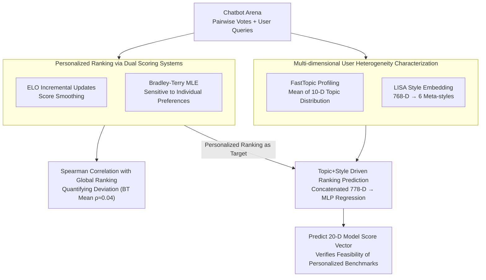

# Personalized Benchmarking: Evaluating LLMs by Individual Preferences

**Conference**: ACL 2026 Findings  
**arXiv**: [2604.18943](https://arxiv.org/abs/2604.18943)  
**Code**: None  
**Area**: LLM Evaluation / Personalized Recommendations  
**Keywords**: Personalized Benchmarking, LLM Ranking, User Preference Heterogeneity, Bradley-Terry Model, Topic and Style Analysis

## TL;DR

This paper performs a personalized ranking analysis of 115 active users on Chatbot Arena, finding that the average Spearman correlation between personalized Bradley-Terry rankings and global rankings is only $\rho=0.04$ (with 57% of users showing near-zero or negative correlation). This demonstrates that aggregated benchmarks fail to reflect the individual preferences of most users. Furthermore, the study successfully predicts user-specific model rankings using topic and style features.

## Background & Motivation

**Background**: Benchmarks such as Chatbot Arena, AlpacaEval, and MT-Bench establish global model rankings by aggregating preference votes from all users, implicitly assuming that user preferences are homogeneous. These rankings are widely used to guide model selection and development directions.

**Limitations of Prior Work**: (1) User needs vary significantly—software developers prefer concise and precise technical answers, while creative writers prefer imaginative responses; aggregated rankings may provide suboptimal recommendations for both. (2) As LLMs are deployed to increasingly diverse user groups, aggregated metrics might recommend a "mediocre" model for everyone rather than finding the "best" model for a specific group. (3) There is a lack of quantitative evidence showing how far individual preferences deviate from the global consensus.

**Key Challenge**: The "one-size-fits-all" model ranking versus the fundamental heterogeneity of user preferences—users do not just have minor deviations around a common ordering; they often possess model preferences that are entirely different from or even opposite to the global ranking.

**Goal**: (1) Calculate personalized model rankings for each user and quantify their deviation from global rankings; (2) Analyze the heterogeneity of user queries in terms of topic and style; (3) Verify whether user-specific model rankings can be predicted using topic and style features.

**Key Insight**: Utilizing existing pairwise comparison data from Chatbot Arena, the study calculates personalized rankings using both ELO and Bradley-Terry scoring systems, then characterizes user heterogeneity through topic modeling (FastTopic) and style analysis (LISA).

**Core Idea**: Personalized Benchmarking—instead of pursuing a single global ranking, the goal is to provide different model ranking recommendations for different types of users, using topic and style features as bridges to connect user profiles with model preferences.

## Method

### Overall Architecture

This work does not train a new model but treats the pairwise votes from Chatbot Arena as a microscope to examine whether global rankings represent individual users. The analysis follows three steps: first, using ELO and Bradley-Terry scoring systems to calculate personalized model rankings for 115 active users and performing Spearman correlation with global rankings to quantify deviation; second, using FastTopic modeling and LISA style embeddings to characterize query heterogeneity across "what is asked" and "how it is asked"; finally, concatenating topic and style features as input for a regression model to predict model score vectors for each user, verifying the feasibility of inferring personalized rankings from user profiles.

### Key Designs

**1. Personalized Ranking via Dual Scoring Systems: Cross-referencing ELO and Bradley-Terry**

To clarify how far individual preferences deviate from the global norm, relying on a single scoring system might bias the conclusions toward a specific algorithm's characteristics. Thus, the authors use two. ELO maintains scores via incremental updates $ELO_u(m_a) \leftarrow ELO_u(m_a) + K(1 - E_a)$ with $K=32$, a mechanism that naturally smoothes preference signals. Bradley-Terry uses Maximum Likelihood Estimation to estimate user-specific model strengths $\beta_{u,m}$, where the preference probability is $P(m_a \succ_u m_b) = \frac{\beta_{u,m_a}}{\beta_{u,m_a} + \beta_{u,m_b}}$, making it more sensitive to individual variance. Crucially, correlations are only calculated for models the user has actually evaluated to avoid artifacts from unseen models. The difference between the two systems is itself a finding—ELO tends to overestimate consistency with the global ranking, while BT better exposes true divergence.

**2. Multi-dimensional User Heterogeneity Characterization: Orthogonal Profiles of Topic and Style**

To explain the source of preference divergence, user query behavior is represented as comparable and interpretable features. For topics, a global FastTopic model (10 topics) is trained on the union of all user queries; each user's topic profile is the mean of their query topic distributions $\mathbf{t}_{u_i} \in \mathbb{R}^{10}$, ensuring comparability. For styles, LISA generates 768-dimensional style embeddings, compressed via LDA into 6 meta-styles (Theatrical, Academic, Fervent, Hostile, Inquisitive, Fragmented), with natural language hypotheses generated by HypoGeniC. Topics capture "what the user asks," and styles capture "how the user asks," forming an orthogonal and complementary user profile.

**3. Topic + Style Driven Ranking Prediction: Making Personalized Benchmarking Practical**

If personalized rankings could only be obtained through massive amounts of preference votes, they would lack practical utility. The authors verify whether rankings can be predicted from lightweight profiles. Each user's topic profile and LISA style embeddings are concatenated into a 778-dimensional input $\mathbf{x}_{u_i} = [\mathbf{t}_{u_i}; \mathbf{s}_{u_i}]$, targeting a 20-dimensional model score vector. ELO rankings are predicted using an ensemble of 50 MLPs, while BT rankings use a single MLP with dropout. Success in this prediction implies that personalized benchmarks can be implemented by inferring user profiles from a few queries, bypassing heavy preference collection.

### Loss & Training

The regression models use the Adam optimizer with standardized features and targets. ELO predictions utilize an ensemble of 50 MLPs with early stopping to mitigate overfitting, while BT predictions use a single MLP with dropout.

## Key Experimental Results

### Main Results

**Correlation: Personalized vs. Global Rankings**

| Scoring System | Mean $\rho$ | Std Dev | Median | Users with Near-zero/Neg Correlation |
| :--- | :--- | :--- | :--- | :--- |
| ELO | 0.432 | 0.257 | 0.442 | 70% ($\rho < 0.5$) |
| Bradley-Terry | 0.043 | 0.283 | 0.011 | 57% ($\rho < 0.1$) |

### Ablation Study

**Ranking Prediction MAE**

| Model | ELO MAE | BT MAE |
| :--- | :--- | :--- |
| Mean-Predictor (Global Mean) | 0.688 | 0.510 |
| Topic + Style (Ours) | 0.450 ($\downarrow 35\%$) | 0.450 ($\downarrow 12\%$) |

### Key Findings

- The mean $\rho=0.043$ for BT personalized rankings is statistically indistinguishable from zero ($p=0.165$), meaning that for most users, personalized BT rankings are essentially random relative to the global ranking.
- The difference between ELO and BT is statistically significant (paired Wilcoxon $p < 10^{-13}$), showing they capture fundamentally different signals.
- User topic diversity varies greatly—from concentration in 4 topics to over 20 diverse topics.
- The 6 meta-styles (Theatrical, Academic, etc.) effectively distinguish user groups, yielding 3 interpretable style clusters via k-means.

## Highlights & Insights

- The BT model reveals preference divergence more sensitively than ELO—this is an advantage rather than a defect, as ELO’s incremental mechanism smoothes signals. This cautions the community that the choice of ranking algorithm affects the visibility of personalization.
- The predictive power of topic and style features proves that personalized benchmarking is achievable in the near term—models can be matched by inferring user profiles from a few queries without complex preference collection.
- User preferences are not "minor perturbations" around a global ranking but "fundamentally different orderings"—this challenges the current basic paradigm of LLM evaluation.

## Limitations & Future Work

- Sample size is limited to 115 active users ($\ge 25$ votes).
- Coverage is limited to English queries; cross-lingual heterogeneity remains unknown.
- The analysis shows correlation rather than causation—further experiments are needed to determine if topic/style differences directly cause preference differences.
- Scalability to real-time personalized recommendations on platforms like Chatbot Arena.

## Related Work & Insights

- **vs. Chatbot Arena**: Arena aggregates all user preferences for a global ranking; Ours proves this is actually misleading for 57% of users.
- **vs. HyPerAlign**: While HyPerAlign focuses on interpretable personalized alignment, Ours provides a framework for quantifying preference divergence.
- **vs. RLHF**: RLHF treats human preference as a single aggregated signal; Ours demonstrates that individual differences should be modeled.

## Rating

- Novelty: ⭐⭐⭐⭐⭐ First systematic quantification of personalized vs. global ranking divergence with impactful findings.
- Experimental Thoroughness: ⭐⭐⭐⭐ Dual scoring systems + topic/style analysis + regression prediction, though limited by sample size.
- Writing Quality: ⭐⭐⭐⭐⭐ Fluent narrative, well-supported arguments, and solid quantitative evidence.
- Value: ⭐⭐⭐⭐⭐ Fundamental challenge to LLM evaluation paradigms with a clear practical path forward.

<!-- RELATED:START -->

## Related Papers

- [\[ICLR 2026\] PrefDisco: Benchmarking Proactive Personalized Reasoning](../../ICLR2026/llm_evaluation/prefdisco_benchmarking_proactive_personalized_reasoning.md)
- [\[ACL 2026\] ResearchBench: Benchmarking LLMs in Scientific Discovery via Inspiration-Based Task Decomposition](researchbench_benchmarking_llms_in_scientific_discovery_via_inspiration-based_ta.md)
- [\[ACL 2026\] BizCompass: Benchmarking the Reasoning Capabilities of LLMs in Business Knowledge and Applications](bizcompass_benchmarking_the_reasoning_capabilities_of_llms_in_business_knowledge.md)
- [\[ACL 2026\] Do LLMs Overthink Basic Math Reasoning? Benchmarking the Accuracy-Efficiency Tradeoff](do_llms_overthink_basic_math_reasoning_benchmarking_the_accuracy-efficiency_trad.md)
- [\[ACL 2026\] RoleConflictBench: A Benchmark of Role Conflict Scenarios for Evaluating LLMs' Contextual Sensitivity](roleconflictbench_a_benchmark_of_role_conflict_scenarios_for_evaluating_llms39_c.md)

<!-- RELATED:END -->
