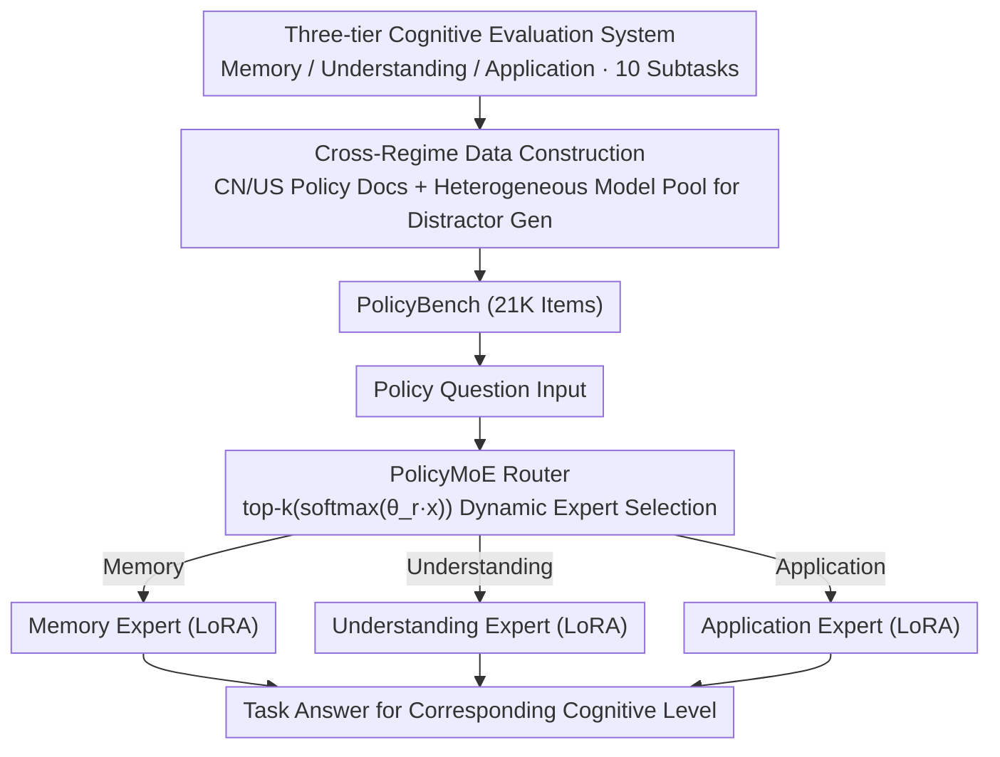

# PolicyLLM: Towards Excellent Comprehension of Public Policy for Large Language Models

**Conference**: ACL 2026 (Findings)  
**arXiv**: [2604.12995](https://arxiv.org/abs/2604.12995)  
**Code**: [https://github.com/wad3birch/PolicyLLM](https://github.com/wad3birch/PolicyLLM)  
**Area**: Signal and Communication  
**Keywords**: Public Policy Understanding, Cross-Regime Benchmark, Bloom's Taxonomy, Mixture of Experts (MoE), Policy Reasoning

## TL;DR
This paper introduces PolicyBench (a 21K-item cross-regime policy understanding benchmark for China and the US) and PolicyMoE (a Mixture-of-Experts model based on cognitive levels). It systematically evaluates the capabilities of 11 SOTA LLMs across three cognitive tiers—memory, understanding, and application—revealing that while models perform well in structured reasoning, they remain weak in abstract policy concepts.

## Background & Motivation

**Background**: LLMs are increasingly being deployed in high-stake decision-making fields such as education, law, and healthcare, with public policy being one of the most socially impactful application scenarios. Policy analysis requires a synthesis of factual knowledge, contextual reasoning, and value-sensitive judgment.

**Limitations of Prior Work**: (1) Absence of evaluation—there is no systematic benchmark to measure the policy understanding capabilities of LLMs, preventing researchers from objectively comparing and identifying specific model weaknesses; (2) Absence of diagnosis—aggregate metrics mask specific performance variations across different cognitive levels, policy domains, and languages; (3) Difficulty in adaptation—general-purpose LLMs struggle to meet the diverse requirements of policy tasks, necessitating domain specialization.

**Key Challenge**: Policy understanding is a multi-level cognitive task—ranging from factual memory to conceptual understanding and scenario application—yet the training optimization of existing LLMs primarily focuses on general reasoning, lacking structured evaluation and adaptation for the policy domain.

**Goal**: (1) Construct a large-scale policy benchmark covering both Chinese and American systems; (2) Diagnose the strengths and weaknesses of LLMs across three cognitive levels; (3) Propose a domain-adapted MoE scheme to verify the potential of specialization.

**Key Insight**: The authors design a three-tier evaluation system based on Bloom’s Taxonomy (Memory → Understanding → Application) and refine the task design for the understanding level by drawing on the 3I framework (Ideas/Interests/Institutions) from policy studies.

**Core Idea**: A three-tier cognitive benchmark + cross-regime comparison + cognitive-level-aligned MoE specialization.

## Method

### Overall Architecture

PolicyLLM integrates "evaluation" and "adaptation" into a single pipeline. On the evaluation side is PolicyBench: 21K items covering Chinese and American policy systems, split into three levels—Memory, Understanding, and Application—comprising 10 subtasks. This allows for a granular assessment of whether a model has memorized, understood, or applied policy logic. On the adaptation side is PolicyMoE: using the Qwen2.5-7B-Instruct base, three experts (Memory, Understanding, Application) are trained via LoRA. A trainable linear router dynamically selects experts based on the input to verify if specialized alignment with cognitive levels can address existing weaknesses.

### Key Designs

**1. Three-tier Cognitive Evaluation System: Deconstructing "Policy Understanding"**

Standard QA accuracy fails to distinguish between rote memorization, institutional logic comprehension, and scenario application, each of which has different training requirements. The authors adopt Bloom's Taxonomy to build three levels: Level 1 (Memory) tests factual recall of dates, terms, and agencies; Level 2 (Understanding) utilizes the 3I framework (Ideas, Interests, Institutions) to test policy concepts, power relations, and institutional logic; Level 3 (Application) tests numerical reasoning, scenario-based decision-making, implementation flows, and policy logic explanation.

**2. Cross-Regime Data Construction and Distractor Generation**

The Chinese and American policy systems differ significantly in governance logic, linguistic complexity, and institutional design, providing an ideal field for cross-system generalization testing. Data includes 721 Chinese policy documents with 1,890 supplementary materials from the State Council, and 603 US documents with 1,082 materials from 12 federal departments. Multiple-choice distractors are generated via a heterogeneous model pool: by marking the correct answer as "incorrect," another LLM generates plausible but wrong options to avoid systematic bias.

**3. PolicyMoE: Cognitive-Level-Aligned Mixture of Experts**

Analysis shows that different cognitive levels rely on different capabilities—Memory depends on knowledge storage during pre-training, while Application relies on reasoning during post-training. Instead of a single model, specific experts manage each level. Using Qwen2.5-7B-Instruct with LoRA (rank=16, $\alpha=32$), individual experts are trained for Memory, Understanding, and Application. A linear router calculates $\alpha = \text{top-k}(\text{softmax}(\theta_r x))$ to select the most relevant expert based on input features, separating optimization for memorization and reasoning.

### Loss & Training

Experts were trained for 3 epochs and the router for 4 epochs using standard cross-entropy loss. The learning rate was set to 5e-5 with an effective batch size of 16. Data was partitioned by policy source documents to ensure that training and testing sets did not share the same policy files, preventing data leakage.

## Key Experimental Results

### Main Results (Average Accuracy of 11 Models on PolicyBench)

| Model | Level 1 (Memory) | Level 2 (Understanding) | Level 3 (Application) | Total Avg |
|------|---------------|---------------|---------------|------|
| GPT-4o | 49.35% | 59.87% | 69.19% | 59.47% |
| DeepSeek-R1 | **60.68%** | **64.15%** | 74.19% | **66.34%** |
| Claude-3.7 | 57.00% | 64.35% | 71.05% | 64.13% |
| QwQ-32B | 51.14% | 58.75% | **75.12%** | 61.67% |
| Gemma-3-27B | 45.83% | 58.87% | 69.94% | 58.21% |

### Ablation Study (PolicyMoE, Qwen2.5-7B-Instruct)

| Level | Region | Original | Post-FT | Gain |
|-------|--------|------|--------|------|
| Level 1 | CN | 36.85% | 41.83% | ↑13.5% |
| Level 1 | US | 23.35% | 35.43% | **↑51.7%** |
| Level 2 | CN | 45.68% | 47.02% | ↑2.9% |
| Level 3 | US | 46.65% | 57.48% | ↑23.2% |

### Key Findings
- **Counter-intuitive Hierarchical Trend**: Models perform best at the Application level (Level 3) and worst at the Memory level (Level 1). This is because memory depends on pre-training knowledge storage, while application relies on post-training reasoning—the latter being the focus of RLHF optimization.
- Models generally perform better on US policies than Chinese ones (avg. difference ~1.4%), reflecting the dominance of English in training corpora and the high density and complexity of Chinese policy texts.
- QwQ-32B is the only model performing better on Chinese policy than US policy (65.33% vs 58.00%), likely due to its training data distribution.
- PolicyMoE provides the largest improvement in Level 1 (US +51.7%) and the smallest in Level 2 (~3%), suggesting that abstract understanding is the hardest to improve via fine-tuning.

## Highlights & Insights
- The finding that **"models are better at application than memory"** is highly insightful: it challenges the naive assumption that models must "remember before they can reason," highlighting that contemporary LLMs are essentially reasoning engines rather than static knowledge bases.
- The combination of Bloom’s Taxonomy and the 3I policy framework is elegant, providing both educational psychology support and domain-specific grounding in policy science.
- The use of a heterogeneous model pool to generate distractors is a valuable technique—directing models to generate high-quality decoys by labeling the correct answer as "wrong" is more efficient than manual design.

## Limitations & Future Work
- The scope is limited to China and the US, lacking diverse policy environments from the EU or developing nations.
- The benchmark primarily relies on multiple-choice and true/false questions; coverage of open-ended tasks is limited, leaving a gap with the complexity of real-world policy analysis.
- The PolicyMoE router currently selects only the top-1 expert, whereas complex policy tasks might require multi-expert collaboration.
- Improvements in Level 2 are extremely limited (~3%), indicating that abstract policy understanding requires fundamental methodological innovation rather than simple fine-tuning.

## Related Work & Insights
- **vs LegalBench (Guha et al. 2023)**: While LegalBench evaluates legal reasoning within the US system, PolicyBench covers a broader range of public policies and adds a cross-regime comparative dimension.
- **vs MoE Domain Adaptation (Kang et al. 2024)**: Unlike general MoE adaptations, PolicyLLM explicitly aligns MoE experts with cognitive levels, making the router's behavior more interpretable.

## Rating
- Novelty: ⭐⭐⭐⭐ The benchmark design (cross-regime + cognitive levels) is novel, though the MoE approach itself is relatively standard.
- Experimental Thoroughness: ⭐⭐⭐⭐⭐ Extremely comprehensive, involving 11 SOTA models, human baselines, router analysis, and ablations.
- Writing Quality: ⭐⭐⭐⭐ Structured clearly with insightful findings, though somewhat lengthy.

<!-- RELATED:START -->

## Related Papers

- [\[ICLR 2026\] Agentic Reinforced Policy Optimization](../../ICLR2026/llm_evaluation/agentic_reinforced_policy_optimization.md)
- [\[ACL 2026\] Zero-shot Large Language Models for Automatic Readability Assessment](zero-shot_large_language_models_for_automatic_readability_assessment.md)
- [\[ACL 2026\] NovBench: Evaluating Large Language Models on Academic Paper Novelty Assessment](novbench_evaluating_large_language_models_on_academic_paper_novelty_assessment.md)
- [\[ACL 2026\] Question Difficulty Estimation for Large Language Models via Answer Plausibility Scoring](question_difficulty_estimation_for_large_language_models_via_answer_plausibility.md)
- [\[ACL 2026\] SciCustom: A Framework for Custom Evaluation of Scientific Capabilities in Large Language Models](scicustom_a_framework_for_custom_evaluation_of_scientific_capabilities_in_large_.md)

<!-- RELATED:END -->
## Related Papers

- [\[ACL 2026\] Inverting the Shield: Systematically Generating Safety Tests from Policy Specifications](inverting_the_shield_systematically_generating_safety_tests_from_policy_specific.md)
- [\[ACL 2026\] Zero-shot Large Language Models for Automatic Readability Assessment](zero-shot_large_language_models_for_automatic_readability_assessment.md)
- [\[ACL 2026\] NovBench: Evaluating Large Language Models on Academic Paper Novelty Assessment](novbench_evaluating_large_language_models_on_academic_paper_novelty_assessment.md)
- [\[ACL 2026\] Question Difficulty Estimation for Large Language Models via Answer Plausibility Scoring](question_difficulty_estimation_for_large_language_models_via_answer_plausibility.md)
- [\[ACL 2026\] SciCustom: A Framework for Custom Evaluation of Scientific Capabilities in Large Language Models](scicustom_a_framework_for_custom_evaluation_of_scientific_capabilities_in_large_.md)

<!-- RELATED:END -->
