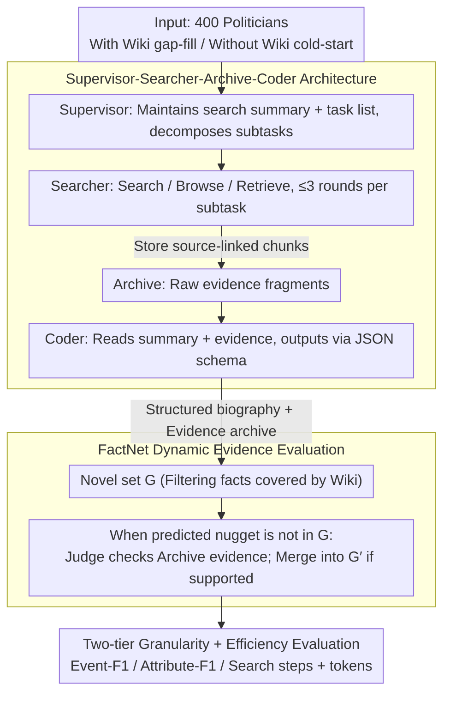

# PolitNuggets: Benchmarking Agentic Discovery of Long-Tail Political Facts

**Conference**: ACL2026  
**arXiv**: [2605.14002](https://arxiv.org/abs/2605.14002)  
**Code**: https://github.com/yifeifrank/poli_searcher  
**Area**: Information Retrieval  
**Keywords**: agentic retrieval, political biographies, long-tail facts, multilingual retrieval, FactNet

## TL;DR
PolitNuggets proposes a multilingual agentic discovery benchmark featuring 400 global political figures and over 10,000 career facts. Using the FactNet dynamic evidence verification protocol, it finds that current agents exhibit high precision but low recall, with the primary bottlenecks being long-tail fact discovery, non-English evidence, and efficient tool utility.

## Background & Motivation
**Background**: Long-context LLMs allow models to perform "Reasoning in Context" within given materials. Tool-augmented agents further enable models to actively search the web, read documents, and organize evidence, forming "Reasoning through Context." "Deep Research" in production systems has demonstrated the potential of this workflow.

**Limitations of Prior Work**: Many existing benchmarks still lean toward short-range QA, single-fact lookups, or static long-document extraction. Real-world research tasks resemble "reconstructing a person's career trajectory": facts are scattered across government websites, news archives, non-English materials, and legacy pages. Models must decide what to search, what to read, when to stop, and how to synthesize fragmented evidence into a structured timeline.

**Key Challenge**: Strong long-context capability does not equate to strong agentic discovery. A model might extract facts from a clean piece of evidence, but when evidence must be independently found, languages are inconsistent, sources data conflict, and relevant facts are weakly linked, failure often occurs in search strategy and evidence coverage rather than final generation.

**Goal**: The authors aim to establish a reproducible benchmark to measure the discovery capability of long-tail political facts, fine-grained attribute extraction, and search costs. They further analyze whether agent success stems from short-context extraction, long-context recall, parametric knowledge, multilingual ability, or tool-calling reliability.

**Key Insight**: Political biographies serve as an excellent real-world task. Wikipedia covers US and prominent figures well but lacks coverage for non-US officials and fine-grained appointment months, official titles, or organizational changes. PolitNuggets views these gaps as a latent fact network, requiring agents to traverse weakly connected fact nodes on the open web.

**Core Idea**: Use an evidence-conditioned dynamic fact network, FactNet, to evaluate whether agents truly discover verifiable political biography "nuggets" beyond Wikipedia, rather than merely evaluating static context QA or simple string matching.

## Method
PolitNuggets introduces three components: benchmark construction, an agent system, and an evaluation protocol. Rather than reinventing a retrieval algorithm, it establishes measurement methods for "discovering long-tail facts on the open web" that align with real research workflows. Political biographies are modeled as sequences of timestamped events (role, organization, time interval). Wikipedia-covered portions are filtered to test the discovery of non-covered but verifiable long-tail facts.

### Overall Architecture
The dataset consists of 400 entities: 200 non-US cabinet politicians and 200 US legislators/senators from WhoGov. The system runs under two conditions: *With Wiki enhancement* (providing existing Wikipedia text for gap-filling) and *Without Wiki reconstruction* (cold-starting from a name only). Each agent run produces a structured biography and an evidence archive. Subsequently, FactNet determines if predicted nuggets are supported by evidence, calculating Event-Level F1, Attribute-Level F1, and search costs.

### Key Designs

**1. Supervisor-Searcher-Archive-Coder Architecture: Decomposing open-ended search into four roles.**
Long-tail facts often require multi-step queries and referencing original texts. Details are easily lost if relying solely on a continuously compressed summary. The system assigns tasks to four roles: the Supervisor maintains the global search summary and task list, decomposing the biography into subtasks; the Searcher executes searches, browsing, and retrieval, storing relevant evidence chunks in the Archive; finally, the Coder reads both the Supervisor's summary and raw evidence from the Archive to output via a strict JSON schema. To control budgets, each subtask allows a maximum of 3 focused search-retrieve rounds, with a global limit of 100 LLM calls. Storing source-linked chunks in the Archive is critical—it prevents "contextual amnesia" and provides verifiable evidence for dynamic validation.

**2. FactNet Dynamic Evidence Evaluation: Avoiding the misclassification of new true facts as false positives.**
Open-world fact discovery cannot pre-exhaust all correct answers. Using a static set would penalize genuine new discoveries. FactNet first aggregates a Consolidated Ground Truth from multiple agent runs, then applies a Wikipedia coverage filter to obtain a novel set $G=G_e\setminus W_e$. When a predicted nugget is not in the current $G$, it is not immediately penalized. Instead, a gpt-5-mini judge verifies if the nugget is supported by evidence in the system's own Archive. If supported and not covered by Wikipedia, it is added to the dynamic ground truth $G'$. This rewards verifiable new discoveries while requiring sources for every claim, ensuring fabricated facts receive no points.

**3. Two-tier Granularity + Efficiency Evaluation: Distinguishing between discovery failure and extraction inaccuracy.**
In biography tasks, models often identify that a person held a position but fail on the exact month or official title. Merging these into a single score obscures the specific failure mode. Evaluation is split into two levels: Event-Level F1 requires the correct role, organization, and year; Attribute-Level F1 further requires correct start/end months and exact titles. An Efficiency dimension measures average search steps and token usage to expose systems where recall is gained at the cost of excessive search overhead.

### Mechanism Example: Reconstructing a Non-US Minister's Biography
In the "Without-Wiki" condition for a non-US cabinet politician, the system receives only the name. The Supervisor decomposes the task into subtasks like "career history / organizational changes / timeline." The Searcher uses Serper for search and Jina/Exa to crawl government announcements and local language news, saving hits as source-linked chunks in the Archive. Upon finding a record not in Wikipedia but supported by local news, the Coder includes it in the JSON. FactNet identifies it as missing from the initial ground truth, triggers a judge to verify the Archive evidence, and merges it into $G'$. A full reconstruction might involve over a dozen search steps (Grok averages 14.5 in Without-Wiki), providing both an evidenced timeline and measurable costs.

### Loss & Training
This work presents a benchmark and evaluation system rather than training new models. Experiments evaluate Grok-4-Fast, Gemini-2.5-Flash, Qwen-3-225B/80B, and Gemini DeepResearch. Agentic runs are tracked via OpenRouter, utilizing Serper for search and Jina/Exa for retrieval. Static long-context (LRM) baselines use the same evidence collected by Grok-4-Fast's With-Wiki run, configured into "Short Archive context," "Long raw pages context," and "Memory-only bio" to isolate the gap between active search and passive extraction.

## Key Experimental Results

### Main Results
Grok-4-Fast emerged as the strongest agentic setting, maintaining similar F1 scores even in the cold-start "Without-Wiki" condition. Gemini performed closely in some settings but with higher search costs. The Qwen series lagged significantly. Attribute-Level F1 was consistently lower than Event-Level F1, indicating that fine-grained month and title extraction remains difficult.

| Context | Model | Region | EventF1 | AttrF1 | Main Findings |
|---------|-------|--------|---------|--------|----------|
| With Wiki | Gemini DR | US / Non-US | 0.778 / 0.701 | 0.505 / 0.489 | High precision, conservative |
| With Wiki | Grok-4-Fast | US / Non-US | 0.768 / 0.712 | 0.501 / 0.475 | Best overall agentic setting |
| With Wiki | Gemini | US / Non-US | 0.638 / 0.679 | 0.407 / 0.485 | Non-US EventF1 improved, but higher cost |
| With Wiki | Qwen-225B | US / Non-US | 0.499 / 0.440 | 0.335 / 0.306 | Weak discovery and granularity |
| Without Wiki| Grok-4-Fast| US / Non-US | 0.766 / 0.708 | 0.506 / 0.475 | Stable performance, increased steps |
| Without Wiki| Gemini | US / Non-US | 0.671 / 0.618 | 0.439 / 0.468 | Requires more search to maintain performance |

Efficiency analysis shows that removing Wikipedia significantly increases search steps and tokens, though F1 does not necessarily collapse. Grok's steps rose from 11.17 (With-Wiki) to 14.52 (Without-Wiki); Gemini rose from 13.53 to 18.04. Grok resides on a better Pareto frontier, achieving higher F1 with fewer steps.

| Comparison | Metric | Mean (With Wiki) | Mean (Without Wiki) | Gain | 95% CI | Sig. |
|------|------|----------------|-------------------|------|--------|--------|
| Gemini | steps | 13.533 | 18.043 | +4.510 | [3.032, 5.931] | Yes |
| Gemini | tokens | 770,151 | 1,062,534 | +292,383 | [143,694, 449,363] | Yes |
| Grok-4-Fast | steps | 11.169 | 14.519 | +3.350 | [2.314, 4.344] | Yes |
| Grok-4-Fast | tokens | 394,522 | 461,227 | +66,705 | [32,970, 99,278] | Yes |

### Ablation Study
The key ablation involves Archive memory versus static LRM baselines. Removing the Archive dropped Event-Level F1 by approximately 0.05, proving that raw evidence fragments are more reliable than summaries. The static long-context baseline revealed a counter-intuitive phenomenon: longer, noisier raw pages do not necessarily outperform curated Short Archives.

| Config | Key Metric | Description |
|------|----------|------|
| Full Supervisor-Searcher + Archive | Grok With-Wiki US EventF1 0.768 | Archive preserves raw evidence, aiding detail filling |
| No-Archive | Event-Level ΔF1≈-0.05 | Summaries lose fine-grained evidence (contextual amnesia) |
| Short Archive LRM, Gemini | US/Non-US EventF1 0.667/0.674 | Clean evidence is better for extraction than long web pages |
| Long raw pages LRM, Gemini | US/Non-US EventF1 0.621/0.655 | Long context impacted by noise; no significant gain |
| Memory-only LRM, Gemini | US/Non-US EventF1 0.251/0.192 | Parametric memory is insufficient; must be evidence-grounded |
| Grok short→long, US EventF1 | 0.626→0.538 | Raw long context performed ~14.1% worse than Archive |

### Key Findings
- The primary issue for current agents is recall rather than precision. With-Wiki Grok-4-Fast achieved Event precision of 0.890/0.872 (US/Non-US) but recall of only 0.703/0.620.
- A significant "International Evidence Gap" exists. Grok-4-Fast's Non-US EventF1 was 0.0557 lower than US; the gap for Qwen-80B reached -0.0989.
- Long-context capability is not a sufficient condition for agentic success. Short-context extraction, tool-calling reliability, multilingual robustness, and parametric knowledge are all vital.
- Wikipedia removal increases costs but does not always tank F1, suggesting agents can compensate for missing context with longer search trajectories, though efficiency issues are amplified.

## Highlights & Insights
- FactNet's dynamic ground truth design is highly suitable for open-world tasks. It avoids penalizing genuine new discoveries while using evidence support as a hard threshold to prevent hallucinations.
- Separating "Reasoning in Context" from "Reasoning through Context" provides crucial analysis. Many models with high long-context benchmarks fail in open-web research due to query planning or source selection.
- The political biography task places multilingual issues at the core of evaluation. Non-US entities are treated as standard scenarios rather than "extra hard cases."
- Reporting F1 alongside cost avoids the race for high scores at any price. For real Deep Research, the most expensive parts are repeated searches and reading; efficiency curves offer more product value than single-point accuracy.

## Limitations & Future Work
- Due to budget constraints, the study did not evaluate the most expensive frontier models; conclusions may shift as models and retrieval products update.
- The benchmark depends on search engines and web states. Despite the release of cached pages, online runs are subject to ranking drift and content updates.
- The static LRM baseline uses agent-collected evidence, so it does not strictly prove agentic search is superior to a massive long-context dump; it only confirms extraction differences on identical snapshots.
- Evaluation relies on LLM judges. While human audit correlation reached 0.87 and false positives were ~3.66%, boundary cases for multilingual titles and historical organizations persist.
- Focusing on public political figures carries the risk of transfer to sensitive profiling; downstream use requires clear ethical boundaries and factual auditing.

## Related Work & Insights
- **vs LongBioBench / HELMET / MRCR**: These focus on long-document comprehension within given contexts; PolitNuggets shifts difficulty to active discovery and open-web synthesis.
- **vs GAIA / BrowseComp / WebSailor**: While those emphasize tool use or hard-to-find facts, PolitNuggets focuses on longitudinal, multi-event, structured biography synthesis with multilingual scenarios.
- **vs Deep Research Evaluations**: Commercial systems are often black boxes. PolitNuggets releases code, cached pages, and an LRM evaluation package for high reproducibility.
- **Insight for Retrieval Agents**: Future systems should explicitly optimize query planning, evidence persistence, source diversity, and multilingual routing rather than solely expanding context windows.

## Rating
- Novelty: ⭐⭐⭐⭐☆ Excellent evidence-conditional agentic benchmark; FactNet is highly valuable.
- Experimental Thoroughness: ⭐⭐⭐⭐⭐ Solid data scale, model coverage, efficiency stats, significance tests, and LRM baselines.
- Writing Quality: ⭐⭐⭐⭐☆ Clear framing and comprehensive tables, though multiple conditions require careful reading.
- Value: ⭐⭐⭐⭐⭐ Directly applicable to agentic search, Deep Research evaluation, and multilingual fact discovery.

<!-- RELATED:START -->

## Related Papers

- [\[ACL 2026\] ResearchBench: Benchmarking LLMs in Scientific Discovery via Inspiration-Based Task Decomposition](researchbench_benchmarking_llms_in_scientific_discovery_via_inspiration-based_ta.md)
- [\[AAAI 2026\] Benchmarking LLMs for Political Science: A United Nations Perspective](../../AAAI2026/llm_evaluation/benchmarking_llms_for_political_science_a_united_nations_perspective.md)
- [\[ICML 2026\] PoliticsBench: Benchmarking Political Values in Large Language Models with Multi-Stage Roleplay](../../ICML2026/llm_evaluation/politicsbench_benchmarking_political_values_in_large_language_models_with_multi-.md)
- [\[ICLR 2026\] LFQA-E: Carefully Benchmarking Long-form QA Evaluation](../../ICLR2026/llm_evaluation/lfqa-e_carefully_benchmarking_long-form_qa_evaluation.md)
- [\[ICML 2026\] Estimating Tail Risks in Language Model Output Distributions](../../ICML2026/llm_evaluation/estimating_tail_risks_in_language_model_output_distributions.md)

<!-- RELATED:END -->
