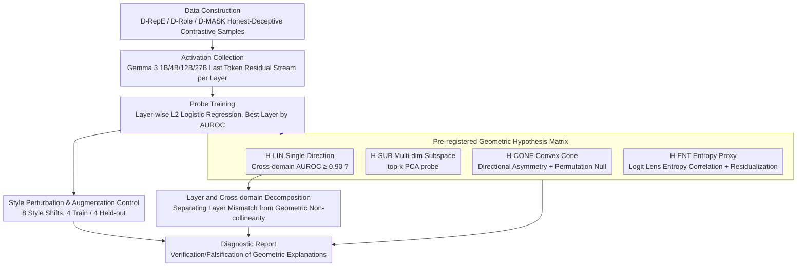

# Pressure-Testing Deception Probes in LLMs: Scaling, Robustness, and the Geometry of Deceptive Representations

**Conference**: ACL2026  
**arXiv**: [2605.27958](https://arxiv.org/abs/2605.27958)  
**Code**: https://github.com/techsachinkr/llm-deception-probe-stress-test  
**Area**: LLM Evaluation / AI Safety  
**Keywords**: Deception detection, activation probes, representation geometry, style robustness, Gemma 3  

## TL;DR
This paper systematically stress-tests deception probes trained on internal LLM activations and discovers that near-perfect AUROC on clean data does not equate to deployable robustness: single-direction and entropy-proxy explanations are untenable; instead, deceptive signals appear to be distributed across multi-dimensional weak features. Style-augmented training can restore probes on a 27B model, which were near-random, to a held-out style AUROC of 0.983.

## Background & Motivation
**Background**: Increasing efforts in AI safety aim to directly read internal model states using linear probes on residual stream activations to determine whether an output originates from an "honest" or "deceptive" state. The appeal of these methods lies in their independence from output text labels and manual review, theoretically serving as automated deception monitors.

**Limitations of Prior Work**: Existing deception probes often report AUROCs close to 1.0 on clean benchmarks but fail when encountering distribution shifts. This paper cites phenomena including adversarial suffixes reducing recall to nearly 0, distractor behaviors decoupling deceptive outputs from probe-detectable representations, and RL-obfuscation depressing probe scores while retaining deceptive outputs. In other words, high scores do not necessarily indicate an understanding of what is being measured.

**Key Challenge**: Probe failure can stem from various causes: deception might truly be a linear direction that is easily obscured by style; it could be a multi-dimensional subspace or convex cone structure; or the probe might actually be measuring proxy variables such as "cognitive load/entropy." Without disentangling these explanations, merely stating that "probes are fragile" cannot guide improvements in data, models, or geometric assumptions.

**Goal**: The authors aim to answer three specific questions. First, is the deceptive representation a single transferable direction? Second, how does the geometric structure change across deception types and model scales? Third, is the collapse caused by style distribution shifts a fundamental limitation or a methodological issue resulting from narrow training distributions?

**Key Insight**: The paper selects the architecturally homogeneous Gemma 3 instruction-tuned series (1B, 4B, 12B, 27B) to separate scaling effects from architectural differences. It pre-registers four falsifiable hypotheses and uses cross-domain transfer, multi-dimensional PCA probes, entropy residualization, and 8 types of style perturbations for systematic exclusion.

**Core Idea**: To reframe the question from "are deception probes effective?" based on a single benchmark score to a "stress-test problem across four dimensions: scale, style, geometry, and proxy variables."

## Method
The paper does not propose a new deception probe but constructs a diagnostic framework. It uses system prompts to construct honest/deceptive contrastive data, trains probes on the final token residual stream of different model layers, and performs a battery of experiments designed to point toward different explanations to verify what the probes have actually learned.

### Overall Architecture
The overall pipeline is divided into five steps. First, three primary datasets are constructed: D-RepE uses factual questions and honest vs. intentional lying system prompts; D-Role uses role-playing scenarios to induce deception; D-MASK uses samples from the MASK benchmark where the output answer contradicts internal belief estimates. Sandbagging data was ultimately excluded from the main experiments due to low model compliance.

Second, for each Gemma 3 model (1B/4B/12B/27B), residual stream activations of the final token across all layers are collected after generating responses. The authors emphasize that this position represents the internal state after the model has selected an honest or deceptive strategy.

Third, L2 logistic regression probes are trained on each model, dataset, and layer, with AUROC as the primary metric. Hyperparameter $C\in\{0.01,0.1,1.0,10.0\}$ is selected via 3-fold CV, and confidence intervals are obtained via 10,000 bootstrap iterations.

Fourth, discrimination experiments are designed around four geometric hypotheses: cross-dataset transfer to test for a single direction, PCA top-$k$ probes for multi-dimensional encoding, permutation null for significant subspaces, and Logit Lens entropy and residualization for the entropy proxy explanation.

Fifth, 8 style perturbations (pirate, Shakespearean, childlike, formal academic, slang, robotic, poetic, sarcastic) are constructed to test distribution shifts. Furthermore, 4 styles are used for augmented training, while the remaining 4 are used for held-out testing.

### Key Designs

**1. Pre-registered Geometric Hypothesis Matrix: Dissecting Probe Success/Failure into Falsifiable Geometric Explanations**

The root cause of probe failure could be diametrically opposed—deception might be a linear direction obscured by style, it might be a multi-dimensional subspace, or the probe might detect proxy variables like entropy. Rather than selecting a narrative post-hoc, the authors fixed four mutually exclusive hypotheses and their quantitative predictions before experiments: H-LIN requires a single-direction probe trained on one domain to achieve AUROC $\geq 0.90$ in others; H-SUB expects top-$k$ multi-dimensional probes to significantly outperform 1D probes; H-CONE requires directional asymmetry and evidence from NMF/PCA reconstruction; H-ENT expects probe scores to correlate strongly with Logit Lens entropy and AUROC to collapse significantly after entropy residualization.

**2. Layer and Cross-domain Decomposition: Distinguishing Cross-domain Failures as "Wrong Layer" vs. "Misaligned Geometry"**

Low cross-domain AUROC could be excused by layer misalignment between the source and target. To eliminate this, the authors compare three conditions: the source probe tested on the source's best layer for the target (C1); applying source weights to the target's best layer activations (C2); and retraining on target best layer activations using source data (C3). Here, $C2-C1$ isolates layer mismatch impacts, $C3-C2$ isolates feature relearning, and the remaining gap indicates true geometric disjointness.

**3. Style Perturbation & Augmentation Control: Determining if Fragility is "No Internal Signal" or "Narrow Training Shortcut"**

If a probe trained only on neutral text fails under style shifts, two possibilities arise: either the model lacks stable internal deception signals, or the probe took a "shortcut" by learning prompt-regime features. The authors separate this by testing a clean-trained probe against 8 style perturbations and then comparing it to an augmented probe trained on clean data plus 4 styles, tested on the remaining 4 **unseen** styles. This held-out set is crucial: if performance improves on unseen styles, the probe has aggregated more robust weak features rather than memorizing specific styles.

### Loss & Training
The primary probe is L2-regularized logistic regression, trained per layer. Multi-dimensional experiments extract top-$k$ PCA components ($k\in\{1,3,5,10,20,50\}$) from activations or difference vectors before training a linear classifier. An MLP probe (2 layers, 256 hidden units, ReLU, dropout 0.3) serves as an upper bound. Style augmentation on 4B and 27B models uses clean data plus 4 styles, testing on clean, seen, and held-out styles.

## Key Experimental Results

### Main Results
On clean D-RepE, best-layer probes for all scales achieve near-perfect scores; however, this does not imply deployable reliability, as subsequent style and cross-domain experiments reveal heavy dependence on the training distribution.

| Model | D-RepE AUROC | Acc | F1 | Best Layer | MLP Upper Bound | Note |
|------|--------------|-----|----|------------|-----------------|------|
| Gemma 3 1B-IT | 0.999 [0.998, 1.000] | 0.983 | 0.985 | 8/26 | 1.000 | Near-perfect on clean |
| Gemma 3 4B-IT | 0.998 [0.996, 1.000] | 0.983 | 0.985 | 33/34 | 0.999 | Late best layer |
| Gemma 3 12B-IT | 0.999 [0.998, 1.000] | 0.980 | 0.985 | 23/48 | 0.998 | Text-only baseline < 0.5 |
| Gemma 3 27B-IT | 1.000 [0.999, 1.000] | 0.980 | 0.990 | 27/62 | 0.999 | Highest clean, most fragile to style |

Multi-dimensional probes reject the "single deception direction" explanation: $k=1$ yields only 0.609 to 0.804 AUROC, whereas $k=5$ exceeds 0.90 for all models.

| PCA Dimensions | 1B | 4B | 12B | 27B | Conclusion |
|----------------|----|----|-----|-----|------------|
| $k=1$ | 0.609 | 0.661 | 0.804 | 0.672 | Single direction insufficient |
| $k=3$ | 0.816 | 0.963 | 0.845 | 0.819 | Significant recovery |
| $k=5$ | 0.908 | 0.981 | 0.938 | 0.990 | All > 0.90 |
| $k=10$ | 0.977 | 0.994 | 0.984 | 0.997 | Near perfect |
| $k=50$ | 0.999 | 0.997 | 0.994 | 0.999 | Near MLP bound |

### Ablation Study
Style perturbation is the critical robustness ablation. Clean probes collapse under 8 style shifts, especially at larger scales; the 27B mean AUROC is 0.485 (random). After style augmentation, both 12B and 27B recover to near-perfect AUROC on held-out styles.

| Configuration | 4B mean AUROC | 27B mean AUROC | Description |
|---------------|---------------|----------------|-------------|
| clean probe, 8 styles | 0.759 | 0.485 | Neutral D-RepE only; 27B most fragile |
| style-augmented, seen styles | 0.997 | 1.000 | Clean + 4 training styles |
| style-augmented, held-out styles | 0.979 | 0.983 | 4 unseen styles; indicates non-memorization |
| Gain (held-out) | +0.063 | +0.062 | Transferable improvement |

Cross-domain transfer and entropy tests yielded clear negative results.

| Diagnostic Item | Key Numbers | Hypothesis Supported/Rebutted |
|-----------------|-------------|-------------------------------|
| 12B layer-mismatch decomposition | remaining gap 0.336, net improvement -0.048 | Rebuts "just layer mismatch" |
| 27B layer-mismatch decomposition | remaining gap 0.425, net improvement -0.028 | Supports geometric disjointness |
| entropy correlation | max $|\rho|=0.454$ | Rebuts entropy proxy |
| residualization drop | max $\Delta$AUROC = 0.004 | Probe does not merely measure entropy |
| per-domain PCA | $k^*=0$ on 4B/27B | No significant coherent subspace |

### Key Findings
- AUROC $\geq 0.998$ on clean data easily leads to a misjudgment of probe reliability; the 27B model's drop to 0.485 under style shift shows a massive gap between benchmark performance and deployment robustness.
- The single-direction steering/probing explanation is invalidated. $k=1$ loses 20%-40% discriminative power, while $k=5$ recovers most signals, suggesting deception info is scattered across multiple weak directions.
- The entropy proxy explanation is thoroughly excluded. If probes detected cognitive load, entropy correlation should approach 0.8, with significant AUROC drops after residualization; observed max correlation was 0.454 and max drop was 0.004.
- Style augmentation is the most practical finding. It shows probes are not inherently fragile but require diverse behavioral distribution coverage to avoid learning prompt-regime or style shortcuts.

## Highlights & Insights
- The most valuable aspect of this paper is transforming "is the probe accurate?" into "how should the probe perform under specific hypotheses?". The pre-registered matrix gives every experiment clear diagnostic power.
- Style augmentation experiments provide a pragmatic conclusion: usable signals exist in internal representations, but probes prioritize "cheap" features when the training set is narrow. This is more instructive for data construction of activation monitors than for model architecture itself.
- The paper "cools down" deception detection by clarifying that D-RepE probes more accurately detect a "deceptive prompt regime" rather than whether the output is a successful deception. This avoids conflating intent monitors with output-level verifiers.

## Limitations & Future Work
- The main limitation is the reliance on system prompts for contrastive data; probes might learn prompt-regime features rather than spontaneous strategic deception. Naturalistic deception data without system-prompt manipulation is needed to distinguish the two.
- 29% to 41% of D-RepE labels might not represent true deception, as models sometimes answer correctly even when "asked to lie." While this does not affect AUROC, it highlights that probes cannot distinguish between successful and failed deception.
- Scaling analysis was limited to Gemma 3. Verification across architectures like Llama or Qwen is required.
- Sandbagging data was excluded due to low compliance, yet this is a critical deception type in AI safety. Future work should use task-oriented environments and human-annotated traces for more reliable data.

## Related Work & Insights
- **vs RepE / logistic probe**: While retaining the RepE training methodology, this work shifts focus from "benchmark separation" to "robustness across style, domain, and scale."
- **vs truth direction / representation engineering**: Contrasting with works by Marks and Tegmark that emphasize linear directionality, the $k=1$ and cross-domain transfer results here show deception is not a universal single-direction problem.
- **vs adversarial probe evasion**: While prior work shows probes can be evaded, this paper demonstrates that a significant portion of this vulnerability stems from narrow training distributions and can be mitigated by style augmentation.
- **vs entropy-based lying analysis**: Rebutting suggestions that lying correlates with higher token entropy, this work uses Logit Lens tools to show probe signals do not primarily originate from entropy.

## Rating
- Novelty: ⭐⭐⭐⭐☆ Reframes probe evaluation as a systematic geometric and robustness diagnosis.
- Experimental Thoroughness: ⭐⭐⭐⭐☆ Scaling, cross-domain, style, and entropy tests are comprehensive, though limited by model family.
- Writing Quality: ⭐⭐⭐⭐☆ Hypothesis matrix and discussions are clear; conclusions are well-guided.
- Value: ⭐⭐⭐⭐⭐ Highly relevant for developing activation probes for safety monitoring, particularly regarding the clean-AUROC vs. robustness gap.

<!-- RELATED:START -->

## Related Papers

- [\[ACL 2026\] Stress Testing Factual Consistency Metrics for Long-Document Summarization](stress_testing_factual_consistency_metrics_for_long-document_summarization.md)
- [\[ICML 2026\] Top-W: Geometry-Aware Decoding with Wasserstein-Regularized Truncation and Mass Penalties for LLMs](../../ICML2026/llm_evaluation/geometry-aware_decoding_with_wasserstein-regularized_truncation_and_mass_penalti.md)
- [\[AAAI 2026\] OptScale: Probabilistic Optimality for Inference-time Scaling](../../AAAI2026/llm_evaluation/optscale_probabilistic_optimality_for_inference-time_scaling.md)
- [\[ACL 2026\] Stability vs. Manipulability: Evaluating Robustness Under Post-Decision Interaction in LLM Judges](stability_vs_manipulability_evaluating_robustness_under_post-decision_interactio.md)
- [\[ICLR 2026\] Same Content, Different Representations: A Controlled Study for Table QA](../../ICLR2026/llm_evaluation/same_content_different_representations_a_controlled_study_for_t.md)

<!-- RELATED:END -->
