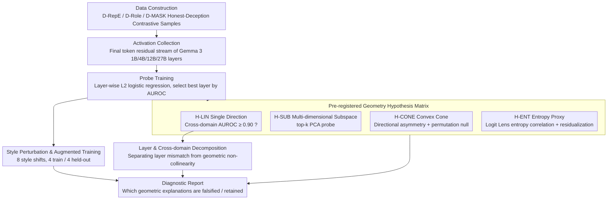

# Pressure-Testing Deception Probes in LLMs: Scaling, Robustness, and the Geometry of Deceptive Representations

**Conference**: ACL2026  
**arXiv**: [2605.27958](https://arxiv.org/abs/2605.27958)  
**Code**: https://github.com/techsachinkr/llm-deception-probe-stress-test  
**Area**: LLM Evaluation / AI Safety  
**Keywords**: Deception detection, activation probes, representation geometry, style robustness, Gemma 3  

## TL;DR
This paper conducts systematic pressure tests on deception probes using internal activations of LLMs, finding that near-perfect AUROC on clean data does not equate to deployable robustness: single-direction and entropy proxy explanations are untenable; instead, deceptive signals appear dispersed across multi-dimensional weak features. Style-augmented training can restore probes on 27B models from near-random performance to a held-out style AUROC of 0.983.

## Background & Motivation
**Background**: In AI safety, increasing efforts focus on reading internal model states using linear probes on residual stream activations to determine whether an output originates from an "honest" or "deceptive" state. The appeal of these methods lies in their independence from output text labels and manual review, theoretically serving as automated deception monitors.

**Limitations of Prior Work**: Existing deception probes often report AUROCs near 1.0 on clean benchmarks but fail when encountering distribution shifts. This paper cites phenomena including adversarial suffixes reducing recall to nearly zero, distractor behaviors decoupling deceptive output from probe-detectable representations, and RL-obfuscation depressing probe scores while retaining deceptive output. In essence, high scores do not guarantee an understanding of what is being measured.

**Key Challenge**: Probe failure may stem from various causes: deception might truly be a linear direction but is easily masked by style; it could be a multi-dimensional subspace or convex cone structure; or the probe may actually be measuring proxy variables such as "cognitive load/entropy." Without disentangling these explanations, merely stating that "probes are fragile" fails to guide the next steps in data, model, or geometric hypothesis refinement.

**Goal**: The authors aim to answer three specific questions: First, is the deceptive representation a transferable single direction? Second, how does the geometric structure change across deception types and model scales? Third, is the collapse caused by style distribution shift a fundamental limitation or a methodological issue arising from narrow training distributions?

**Key Insight**: The paper selects the architecturally homogeneous Gemma 3 instruction-tuned series (1B, 4B, 12B, 27B) to separate scaling effects from architectural differences. It pre-registers four falsifiable hypotheses and evaluates them through cross-domain transfer, multi-dimensional PCA probes, entropy residualization, and eight types of style perturbations.

**Core Idea**: Reframe the question of "whether deception probes are effective" from a single benchmark score into a "pressure test across scaling, style, geometry, and proxy variables."

## Method
The methodology does not propose a new deception probe but constructs a diagnostic framework. It uses system prompts to construct honest/deceptive contrastive data, trains probes on the residual stream of the final token at different model layers, and performs experiments to examine what the probes have learned.

### Overall Architecture
The pipeline consists of five steps. First, three primary datasets are constructed: D-RepE uses factual questions with system prompts for honesty or intentional lying; D-Role uses role-playing scenarios to induce deception; D-MASK uses samples where outputs contradict internal belief estimates. Sandbagging data was ultimately excluded due to low model compliance.

Second, for each Gemma 3 model (1B, 4B, 12B, 27B), residual stream activations are collected from the final token across all layers after the model generates a response. This position represents the internal state after the model has selected an honest or deceptive strategy.

Third, L2 logistic regression probes are trained on each model, dataset, and layer, using AUROC as the primary metric. Hyperparameter $C\in\{0.01,0.1,1.0,10.0\}$ is selected via 3-fold CV, with confidence intervals obtained through 10,000 bootstrap iterations.

Fourth, discriminatory experiments are designed around four geometric hypotheses: cross-dataset transfer to test single directionality, top-$k$ PCA probes for multi-dimensional encoding, permutation null for significant subspaces, and Logit Lens entropy residualization to test the entropy proxy explanation.

Fifth, eight style perturbations (pirate, Shakespearean, childlike, formal academic, slang, robotic, poetic, sarcastic) are constructed to test distribution shift. Further, four styles are used for augmented training, and the remaining four serve as held-out tests.

### Key Designs

**1. Pre-registered Geometry Hypothesis Matrix: Disentangling why probes succeed or fail into four falsifiable geometric explanations.**
The root cause of probe failure varies significantly—deception might be a linear direction masked by style, a multi-dimensional subspace, or the probe might simply measure a proxy like entropy. Rather than post-hoc storytelling based on high scores, the authors pre-defined four mutually exclusive hypotheses and their quantitative predictions. H-LIN requires a single-direction probe trained on one deception domain to achieve AUROC $\geq 0.90$ cross-domain; H-SUB expects top-$k$ multi-dimensional probes to significantly outperform 1D; H-CONE requires directional asymmetry and NMF/PCA evidence; H-ENT expects probe scores to correlate strongly with Logit Lens entropy and AUROC to collapse after residualizing entropy.

**2. Layer and Cross-Domain Decomposition: Attributing poor transfer to "wrong layer selection" versus "lack of geometric collinearity."**
Low cross-domain AUROC could be dismissed as layer misalignment between source and target. To address this, the authors compared three conditions: the source probe tested on the target at the source's best layer (C1); the source weights applied to the target's best layer activation (C2); and retraining on the target's best layer using source data (C3). The $C2-C1$ gap isolates the effect of layer mismatch, while $C3-C2$ isolates the need for feature relearning. The remaining gap indicates true geometric disjointness.

**3. Style Perturbation vs. Style Augmentation: Determining if poor robustness is due to "no internal signal" or "narrow training distributions causing shortcut learning."**
When a probe trained on neutral text fails under style shift, it is unclear if there is no stable deception signal or if the probe merely captured shortcut features like style. The authors used a control experiment: first testing probes trained only on clean D-RepE against 8 style perturbations, then training an augmented probe with clean data plus 4 styles, testing it specifically on the 4 **unseen** styles.

## Key Experimental Results

### Main Results
On clean D-RepE, best-layer probes across all scales reached near-perfect scores. However, this does not imply deployable reliability, as subsequent style and cross-domain experiments showed high dependence on the training distribution.

| Model | D-RepE AUROC | Acc | F1 | Best Layer | MLP Upper Bound | Note |
|------|--------------|-----|----|------------|-----------------|------|
| Gemma 3 1B-IT | 0.999 [0.998, 1.000] | 0.983 | 0.985 | 8/26 | 1.000 | Near-perfect on clean data |
| Gemma 3 4B-IT | 0.998 [0.996, 1.000] | 0.983 | 0.985 | 33/34 | 0.999 | Best layer is very late |
| Gemma 3 12B-IT | 0.999 [0.998, 1.000] | 0.980 | 0.985 | 23/48 | 0.998 | Text-only baseline < 0.5 |
| Gemma 3 27B-IT | 1.000 [0.999, 1.000] | 0.980 | 0.990 | 27/62 | 0.999 | Highest on clean, most fragile to style |

Multi-dimensional probes directly refuted the "single deception direction" explanation: $k=1$ only yielded AUROC between 0.609 and 0.804, while $k=5$ exceeded 0.90 for all models.

| PCA Dim | 1B | 4B | 12B | 27B | Conclusion |
|----------|----|----|-----|-----|------------|
| $k=1$ | 0.609 | 0.661 | 0.804 | 0.672 | Single direction insufficient |
| $k=3$ | 0.816 | 0.963 | 0.845 | 0.819 | Significant recovery for some |
| $k=5$ | 0.908 | 0.981 | 0.938 | 0.990 | All models > 0.90 |
| $k=10$ | 0.977 | 0.994 | 0.984 | 0.997 | Near-perfect |
| $k=50$ | 0.999 | 0.997 | 0.994 | 0.999 | Approaching MLP bound |

### Ablation Study
Style perturbation was the most critical robustness ablation. While the clean probe was nearly perfect on standard data, its performance collapsed under 8 style shifts as the model scale increased; the mean AUROC for the 27B model was only 0.485 (random). After style augmentation, both 4B and 27B models recovered near-perfect AUROC on held-out styles.

| Configuration | 4B mean AUROC | 27B mean AUROC | Description |
|---------------|---------------|----------------|-------------|
| clean probe, 8 styles | 0.759 | 0.485 | Trained only on neutral D-RepE; 27B most fragile |
| style-augmented, seen styles | 0.997 | 1.000 | clean + 4 training styles |
| style-augmented, held-out styles | 0.979 | 0.983 | Remaining 4 unseen styles, indicates generalization |
| held-out Gain | +0.063 | +0.062 | Augmentation benefits transfer to unseen styles |

Cross-domain transfer and entropy tests yielded clear negative results.

| Diagnostic Item | Key Figure | Explanation Supported/Refuted |
|-----------------|------------|-------------------------------|
| 12B layer-mismatch decomposition | remaining gap 0.336, net improvement -0.048 | Refutes "just layer mismatch" |
| 27B layer-mismatch decomposition | remaining gap 0.425, net improvement -0.028 | Supports geometric disjointness |
| entropy correlation | max $|\rho|=0.454$ | Refutes entropy proxy hypothesis |
| residualization drop | max $\Delta$AUROC = 0.004 | Probes do not just measure entropy |

### Key Findings
- AUROC $\geq 0.998$ on clean data often leads to a misjudgment of probe reliability; the 27B model's mean AUROC drop to 0.485 under style shifts highlights the massive gap between benchmark ceilings and deployable robustness.
- The single-direction steering/probing explanation does not hold. $k=1$ loses 20% to 40% of discriminative power, whereas $k=5$ restores most signals, suggesting deception-related information is dispersed across multiple weak directions.
- The entropy proxy explanation is thoroughly eliminated. If probes only measured cognitive load, entropy correlations should approach 0.8, and AUROC should drop significantly after residualization.
- Style augmentation is the most practical finding. It shows that probes are not inherently fragile but require diversity in behavior distributions to avoid learning prompt-regime or style shortcuts.

## Highlights & Insights
- The most valuable contribution is transposing the question from "is the probe accurate" to a diagnostic inquiry of "under what hypotheses should the probe perform in a certain way." The pre-registered matrix provides clear discriminatory power.
- Style augmentation experiments offer a pragmatic conclusion: viable signals likely exist in internal representations, but probes prioritize "cheaper" features when the training set is too narrow. This is more instructive for data construction in activation monitoring than for model architecture per se.
- The paper provides a necessary "cooldown" for deception detection: D-RepE probes are more accurately detecting a deceptive prompt regime rather than whether the output actually succeeded in deceiving. This avoids conflating intent monitors with output-level verifiers.

## Limitations & Future Work
- The primary limitation is the reliance on system prompts to induce honest/deceptive contrasts, meaning probes might learn prompt-regime features rather than natural strategic deception.
- In D-RepE, 29% to 41% of deceptive labels might not be "true" deception because the model occasionally provides a truthful answer even when instructed to lie.
- Style augmentation was only tested on 4B and 27B; cross-domain decomposition only covered 12B and 27B.
- All experiments were conducted within the Gemma 3 family. Generalizability to Llama, Qwen, or more advanced agentic models requires cross-architectural replication.
- Sandbagging data was excluded due to low compliance, despite being a critical deception type for AI safety.

## Related Work & Insights
- **vs RepE / logistic probe**: While retaining the RepE training paradigm, this work pivots from "separability on benchmarks" to robustness across style, domain, and scale.
- **vs truth direction / representation engineering**: Contrary to works emphasizing the interpretability of a single linear direction, the $k=1$ and cross-domain transfer results suggest deception is not a universal single-direction problem.
- **vs adversarial probe evasion**: While previous work has shown probes can be evaded, this paper points out that much of this vulnerability arises from narrow training distributions and can be partially mitigated via style augmentation.
- **vs entropy-based lying analysis**: While some findings suggest lying correlates with higher token entropy, this work shows the current probe signal is not primarily derived from entropy via Logit Lens analysis and residualization.

## Rating
- Novelty: ⭐⭐⭐⭐☆ (Systematic diagnosis of geometry and robustness over new probe architecture.)
- Experimental Thoroughness: ⭐⭐⭐⭐☆ (Comprehensive across scale, domain, style, and entropy, though limited model families.)
- Writing Quality: ⭐⭐⭐⭐☆ (Clear hypotheses and discussion, though some tables are dense.)
- Value: ⭐⭐⭐⭐⭐ (Highly relevant for using activation probes as safety monitors, particularly the distinction between clean AUROC and robustness.)

<!-- RELATED:START -->

## Related Papers

- [\[ICML 2026\] Top-W: Geometry-Aware Decoding with Wasserstein-Regularized Truncation and Mass Penalties for LLMs](../../ICML2026/llm_evaluation/geometry-aware_decoding_with_wasserstein-regularized_truncation_and_mass_penalti.md)
- [\[ACL 2026\] Stability vs. Manipulability: Evaluating Robustness Under Post-Decision Interaction in LLM Judges](stability_vs_manipulability_evaluating_robustness_under_post-decision_interactio.md)
- [\[ACL 2026\] Stress Testing Factual Consistency Metrics for Long-Document Summarization](stress_testing_factual_consistency_metrics_for_long-document_summarization.md)
- [\[AAAI 2026\] OptScale: Probabilistic Optimality for Inference-time Scaling](../../AAAI2026/llm_evaluation/optscale_probabilistic_optimality_for_inference-time_scaling.md)
- [\[ICLR 2026\] Same Content, Different Representations: A Controlled Study for Table QA](../../ICLR2026/llm_evaluation/same_content_different_representations_a_controlled_study_for_t.md)

<!-- RELATED:END -->
