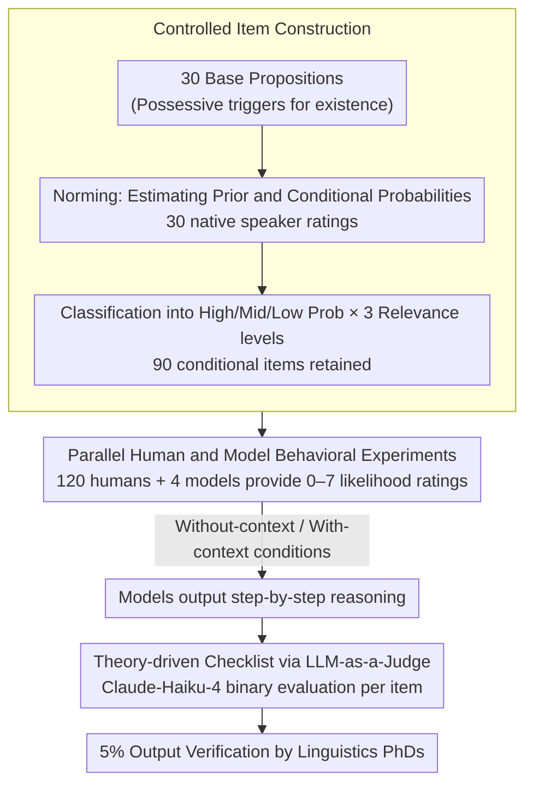

# Presupposition and Reasoning in Conditionals: A Theory-Based Study of Humans and LLMs

**Conference**: ACL2026  
**arXiv**: [2605.18352](https://arxiv.org/abs/2605.18352)  
**Code**: https://github.com/proviso-bench/Presupposition-and-Reasoning-in-Conditionals  
**Area**: LLM Evaluation / Semantic-Pragmatic Reasoning  
**Keywords**: Presupposition projection, conditional reasoning, pragmatic competence evaluation, human-AI comparison, LLM-as-a-Judge  

## TL;DR
This paper compares humans and four LLMs on a conditional presupposition projection task based on linguistic theory. It finds that while humans jointly utilize probability, antecedent-presupposition relevance, and contextual cues, LLM scoring similarity is significantly decoupled from the quality of theorized reasoning; many human-like judgments likely stem from surface pattern matching.

## Background & Motivation
**Background**: Evaluation of semantic and pragmatic capabilities in LLMs is shifting from simple NLI or classification towards more granular linguistic phenomena, such as implicature, presupposition, reference, and discourse context. Presupposition projection is particularly suitable as a stress test because it requires models to simultaneously process formal semantics, pragmatic accommodation, world knowledge, and probabilistic reasoning.

**Limitations of Prior Work**: Existing presupposition benchmarks focus primarily on entailment or simple trigger identification, rarely comparing human behavioral data and model behavior within the same controlled experiment. More importantly, a model providing a human-like final score does not guarantee it follows linguistic theory; it may simply capture lexical co-occurrence or commonsense associations.

**Key Challenge**: The "proviso problem" in conditionals lacks a simple answer. For sentences like "If A, Bp," a listener might interpret the presupposition $p$ in the consequent as unconditionally true or as true only when $A$ holds. This choice depends on the relationship between $Pr(p\mid c)$ and $Pr(p\mid A,c)$, the relevance between the antecedent and the presupposition, and how the context constrains possible worlds.

**Goal**: Ours aims to answer four questions: how humans utilize antecedent-presupposition relevance in conditional judgments; how close LLM Likert judgments are to humans; how minimal context affects humans and models; and whether model explanations truly reflect presupposition projection and pragmatic reasoning.

**Key Insight**: The authors combine traditional psycholinguistic experiments with LLM benchmarks. First, a norming study constructs items across low/mid/high probability and relevant/somewhat relevant/irrelevant relationships. Then, 120 human participants and four LLMs rate the same 90 items on a 0-7 scale. Finally, theory-driven checklists evaluate model reasoning traces.

**Core Idea**: Instead of only asking "do LLM answers resemble humans," one should simultaneously compare behavioral distributions and theorized reasoning processes to check for consistency.

## Method
The methodology consists of a two-layer evaluation: a behavioral layer comparing human and model likelihood ratings for the target presupposition, and an explanation layer using LLM-as-a-Judge to verify if the model's generated reasoning satisfies key semantic/pragmatic constraints.

### Overall Architecture
First, the authors construct 30 base propositions around possessive pronoun triggers, such as "someone has a guitar / apron / boat / smartphone / sibling." These propositions cover high, medium, and low probability possession relations with neutral context constraints.

Each proposition is expanded into four norming conditions: a baseline measuring $Pr(p\mid c)$, and three conditions measuring $Pr(p\mid A,c)$ with high/mid/low antecedent relevance. Norming is completed by 30 native English speakers; after confirming monotonic separation, 90 conditional items are retained for the main experiment.

In the main experiment, 120 humans and four models (GPT-5, Gemini-2.5-flash, Llama-3.1-8B-Instruct, Qwen2.5-7B-Instruct) rate the likelihood of the target presupposition on a 0-7 scale. There are two conditions: without-context and with-context (providing a minimal background, e.g., the origin of the person).

LLMs provide both numerical judgments and step-by-step reasoning. Subsequently, Claude-Haiku-4 acts as a judge, using an expert-designed checklist to determine if reasoning traces meet theoretical standards. Finally, 5% of outputs are manually verified by two PhDs in linguistics.

### Key Designs

**1. Controlled item construction for probability and relevance: Treating the "antecedent's boost to presupposition likelihood" as a controllable variable.**

Whether a presupposition $p$ in "If A, Bp" should project has no simple answer—it depends on whether $A$ makes $p$ more plausible. Rather than relying on subjective labels of "relevant," the authors quantify it via norming: for each $p$, they estimate baseline $Pr(p\mid c)$ and conditional $Pr(p\mid A,c)$. If $A$ significantly raises the likelihood of $p$, it is categorized as relevant. This ensures human-LLM comparisons rest on clean, controlled stimuli.

**2. Parallel human and model behavioral experiments: Direct alignment of humans and models within the same task and scale.**

Many pragmatic evaluations only check if a model's binary answer is "correct," missing the graded, confidence-based nature of human judgment. By having humans and models rate the same 90 sentences on a 0–7 scale with and without context, the study captures subtle behavioral distributions via Spearman correlation and MAE rather than crude accuracy.

**3. Theory-driven checklist for LLM-as-a-Judge: Inspecting reasoning processes rather than final scores.**

A human-like score does not imply theorized reasoning; models might rely on lexical co-occurrence. To address this, Claude-Haiku-4 checks reasoning traces against an expert checklist covering Accuracy, Context, Pragmatic, Presupposition Handling, and Coherence. The score for each response is the average proportion of satisfied items:

$$S=\frac{1}{|K|}\sum_j J\big((c,s,\tau,r),\kappa_j\big)$$

This structured binary evaluation narrows the interpretation space compared to holistic preference scoring.

### Loss & Training
Ours does not train a new model but designs an evaluation pipeline. Statistical analysis uses linear mixed-effects models with proposition probability, A-p relevance, and their interaction as fixed effects, and participant as a random intercept. Model generation does not use self-consistency; open-source models use temperature 0.7, top_p 0.9, and max_new_tokens 1024 with bfloat16 inference. Closed-source models use identical parameters via official APIs. For the judge model, the inter-annotator exact match was 89%, with 79.46% agreement with the judge.

## Key Experimental Results

### Main Results
Human Main Results show that humans consider both the inherent commonality of the proposition and whether the antecedent provides a reason for the presupposition to hold.

| Experimental Part | Key Result | Interpretation |
|----------|----------|------|
| Norming low probability | M = 2.76 | Lowest ratings for low-prob possession |
| Norming mid probability | M = 4.38 | Median ratings |
| Norming high probability | M = 5.52 | Highest ratings |
| low → mid | $\beta=1.62$, $p<.001$ | Probability level significantly boosts ratings |
| low → high | $\beta=2.75$, $p<.001$ | High and low probability are significantly separated |

Mixed-effects results indicate that without context, irrelevant relations strongly suppress low/mid probability items; with context, humans more stably distinguish between probability and relevance cues.

| Condition | Intercept/Clear cases | Significant Negative Effects | Interaction Effects | Implication |
|------|---------------|------------|----------|------|
| With-context | Intercept 5.377 | low: -0.977, irrelevant: -0.377, somewhat relevant: -0.258 | low × irrelevant: -0.310, mid × irrelevant: -0.493 | Context enables more granular use of cues |
| Without-context | Intercept 5.340 | low: -0.347, irrelevant: -0.356 | low × irrelevant: -0.734, mid × irrelevant: -0.572 | Without context, irrelevance acts as a gating factor |

### Ablation Study
There is a clear decoupling between behavioral alignment and explanation quality. Qwen2.5-7B-IT is the most human-like in Likert ratings but has the lowest checklist compliance.

| Model | Human Alignment | MAE / Correlation | With-context checklist total | Observation |
|------|--------------|--------------|------------------------------|------|
| Qwen2.5-7B-IT | Most stable alignment | $\rho=0.25$ (no ctx), $\rho=0.38$ (ctx); MAE 1.32 | 39.08% | Human-like behavior, weakest theoretical reasoning |
| Llama3.1-8B-IT | Moderate alignment | $\rho=0.21$ (no ctx), $\rho=0.30$ (ctx); MAE 1.14 | 40.53% | Lowest MAE, but low checklist score |
| Gemini-2.5-flash | Context-dependent alignment | $\rho=0.26$ (with ctx); MAE 1.90 | 60.81% | Strong reasoning, large behavioral error |
| GPT-5 | Correlation mostly insignificant | MAE 1.34 | 63.18% | Highest checklist score, but Likert distribution deviates from humans |

### Key Findings
- Human judgment is an interaction of prior probability and relevance. Without context, irrelevant antecedents lead humans to fall back on priors; with context, they integrate cues more consistently.
- Qwen2.5-7B-IT and Llama3.1-8B-IT align better with human distributions but have checklist compliance of only 39%-41%, suggesting "scoring like a human" is not equivalent to "reasoning like a human."
- GPT-5 and Gemini show stronger reasoning but do not align better with humans in behavior, indicating a dissociation between performance alignment and explicit reasoning quality.
- The LLM-as-a-Judge approach is cost-effective, costing ~55 CAD for 40,000 checklist items, proving fine-grained pragmatic evaluation is accessible.

## Highlights & Insights
- The standout feature is the integration of linguistic theory into benchmark design, moving beyond "detecting presupposition" to manipulating explainable variables (probability, relevance, context).
- The behavior-explanation decoupling is insightful; while CoT is often prioritized, human-like behavior and theoretical explanation quality can diverge.
- The checklist approach decomposes presupposition handling and context integration, offering a template that can be ported to other pragmatic tasks like anaphora or discourse coherence.
- Small models may approximate human distributions through surface knowledge, while large models produce fluent theoretical explanations; neither necessarily represents stable pragmatic competence.

## Limitations & Future Work
- The task scope is narrow, focusing only on "If A, Bp" structures and possessive pronoun triggers. Results may not generalize to factive verbs or change-of-state verbs.
- Human data is limited to English speakers, leaving cross-linguistic and cross-cultural generalization unclear.
- The checklist evaluates satisfaction-theoretic principles, which may not capture the heuristic or probabilistic processes humans actually use.
- Human validation covered only 5% of outputs; larger-scale verification is needed to detect biases across specific checklist dimensions.
- CoT may be post-hoc rationalization rather than representative of the actual internal reasoning process.

## Related Work & Insights
- **vs IMPPRES / NOPE / PROPRES**: These focus on entailment or trigger identification in classification; ours shifts to graded likelihood and behavioral alignment.
- **vs CONFER / Proviso problem work**: While previous work noted generalization failures, ours uses normed probability/relevance and checklist analysis to explain these failures.
- **vs Pragmatics Understanding Benchmark**: PUB is broader; ours is narrower but deeper, focusing on conditional projection with parallel human data.
- **vs General LLM-as-a-Judge**: Instead of holistic preference, ours uses expert-designed checklists to provide a structured diagnostic tool.

## Rating
- Novelty: ⭐⭐⭐⭐☆ Combines linguistics, human experiments, and diagnostic reasoning.
- Experimental Thoroughness: ⭐⭐⭐⭐☆ Solid norming and parallel testing, though scope of triggers is limited.
- Writing Quality: ⭐⭐⭐⭐☆ Clear questions, sufficient detail, and data-backed conclusions.
- Value: ⭐⭐⭐⭐☆ Valuable for discussions on behavioral alignment versus reasoning capacity.

<!-- RELATED:START -->

## Related Papers

- [\[ACL 2026\] BizCompass: Benchmarking the Reasoning Capabilities of LLMs in Business Knowledge and Applications](bizcompass_benchmarking_the_reasoning_capabilities_of_llms_in_business_knowledge.md)
- [\[ACL 2026\] Do LLMs Overthink Basic Math Reasoning? Benchmarking the Accuracy-Efficiency Tradeoff](do_llms_overthink_basic_math_reasoning_benchmarking_the_accuracy-efficiency_trad.md)
- [\[ACL 2026\] Are They Lovers or Friends? Evaluating LLMs' Social Reasoning in English and Korean Dialogues](are_they_lovers_or_friends_evaluating_llms39_social_reasoning_in_english_and_kor.md)
- [\[AAAI 2026\] Where Norms and References Collide: Evaluating LLMs on Normative Reasoning](../../AAAI2026/llm_evaluation/where_norms_and_references_collide_evaluating_llms_on_normative_reasoning.md)
- [\[ACL 2026\] SCAN: Structured Capability Assessment and Navigation for LLMs](scan_structured_capability_assessment_and_navigation_for_llms.md)

<!-- RELATED:END -->
