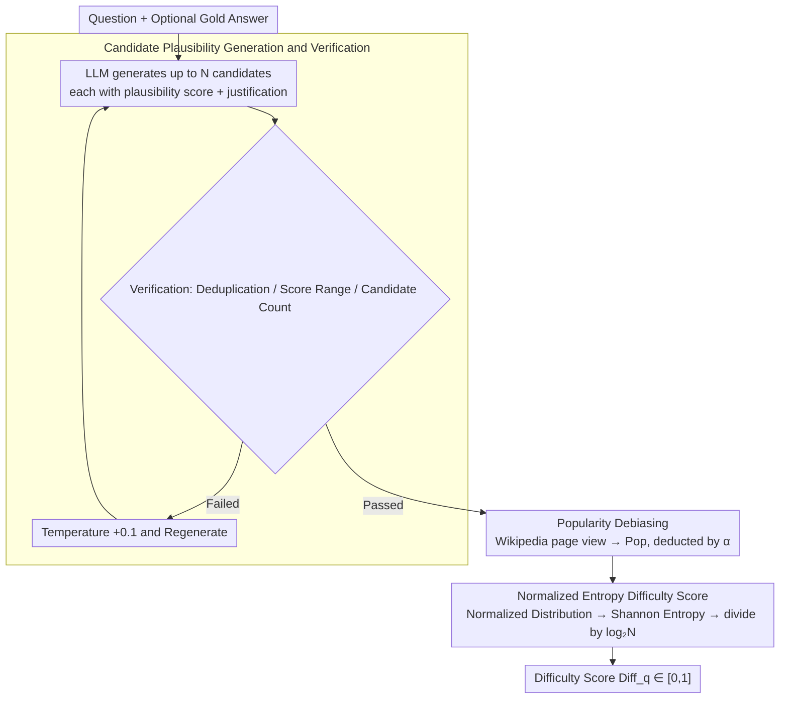

# Question Difficulty Estimation for Large Language Models via Answer Plausibility Scoring

**Conference**: ACL2026  
**arXiv**: [2605.12398](https://arxiv.org/abs/2605.12398)  
**Code**: https://github.com/DataScienceUIBK/Q-DAPS  
**Area**: Interpretability / Question Answering Difficulty Estimation  
**Keywords**: Question Difficulty, Answer Plausibility, Entropy, Popularity Bias, Hallucination Risk

## TL;DR
Q-Daps estimates LLM question-answering difficulty by generating multiple candidate answers and calculating the Shannon entropy of the plausibility distribution after debiasing for popularity. It systematically outperforms readability, retrieval complexity, prompt-based scoring, and uncertainty baselines on TriviaQA, NQ, MuSiQue, and QASC.

## Background & Motivation
**Background**: Question difficulty estimation is widely utilized in educational assessment, information retrieval, and QA system evaluation. Traditional methods typically rely on text readability, question popularity, retrieval result quality, or direct difficulty scoring by models.

**Limitations of Prior Work**: These signals are often designed for human readers or retrieval systems and may not accurately reflect the actual ambiguity and reasoning risks encountered by modern LLMs during inference. For an LLM, the difficulty of a question often depends on whether incorrect answers also appear "plausible."

**Key Challenge**: Difficult questions are not necessarily long or rare; simple surface features fail to capture the uncertainty within the candidate answer space. When multiple incorrect answers are highly persuasive, the model is more susceptible to hallucinations or selection errors.

**Goal**: This paper aims to propose an interpretable, scalable difficulty metric aligned with LLM behavior, and to verify its ability to distinguish between easy and hard questions, maintain consistency with human judgment, and remain robust across different model settings without requiring gold standard answers.

**Key Insight**: The authors focus on the "answer plausibility distribution." If only a few candidate answers for a question appear credible, the plausibility distribution is sharp, indicating low difficulty. If many candidate answers are nearly equally credible, the distribution entropy is high, indicating high difficulty.

**Core Idea**: The entropy of candidate answer plausibility is used as an LLM-oriented difficulty score, incorporating a lightweight correction for popularity bias using Wikipedia page views.

## Method
The Q-Daps method consists of three stages: candidate answer generation, popularity debiasing, and entropy scoring. Instead of directly asking an LLM to rate difficulty, it prompts the LLM to list multiple plausible but incorrect candidate answers along with their plausibility, subsequently inferring difficulty from the shape of the candidate answer space.

### Overall Architecture
Given a question and an optional gold answer, Q-Daps first uses an LLM (e.g., Llama 3.3) to generate up to 20 candidate answers, each accompanied by a plausibility score and justification. A verification module then performs deduplication and checks score ranges and candidate counts. Subsequently, Wikipedia page views for the candidates are queried to obtain popularity scores, which are subtracted from the plausibility according to a hyperparameter $\alpha$. Finally, the debiased plausibility is normalized into a probability distribution to calculate Shannon entropy, which is normalized to $[0,1]$ by dividing by $\log_2 N$.

### Key Designs

**1. Candidate Answer Plausibility Generation and Verification: Expanding the "Competitive Answer Space"**

For an LLM, difficulty often stems from how "real" incorrect answers appear rather than text length. Standard distractor generation only determines correctness, lacking the continuous signal of "how much like the correct answer" a candidate is. Q-Daps utilizes a listwise prompt to output up to $N$ candidate answers simultaneously, each with a plausibility score and justification. A verification module ensures quality; if failed, it increases temperature by 0.1 and regenerates. This produces a distribution across the answer space with plausibility scales rather than discrete labels.

**2. Wikipedia Page View-based Debiasing: Removing LLM Preference for Famous Entities**

LLMs tend to generate well-known entities first and assign them higher plausibility scores, which can contaminate difficulty signals with entity popularity. The authors crawl monthly Wikipedia page views from 2015-01-01 to 2024-12-31 for each candidate, normalize them to $[0,1]$, and remove outliers via IQR to obtain a popularity score $Pop_i$. The plausibility is then debiased:

$$DePls_i = Pls_i \times (1 - \alpha \times Pop_i)$$

After debiasing, "famous but incorrect" answers are no longer over-amplified, allowing the entropy score to focus on genuine semantic competition.

**3. Normalized Entropy Difficulty Score: Compressing Uncertainty into an Interpretable [0,1] Score**

Difficulty is reflected in the shape of the debiased distribution: a few dominant answers (sharp distribution) indicate ease, while many equally matched answers (flat distribution) indicate difficulty. The scores are normalized into a probability distribution $DePls_i^{norm}=DePls_i / \sum_i DePls_i$. Shannon entropy is calculated as $H(q)=-\sum_i DePls_i^{norm}\log_2 DePls_i^{norm}$ and normalized to $Diff_q=H(q)/\log_2 N \in [0,1]$. High entropy indicates high hallucination risk and difficulty in distinction.

### Loss & Training
Q-Daps is an evaluation and scoring method and does not involve training the target QA model. The experiment compares three plausibility elicitation strategies: Pointwise ($O(n)$), Pairwise (Bradley-Terry aggregation, $O(n^2)$), and Listwise ($O(1)$), with Listwise as the core configuration. Difficulty assessment uses two metrics: Spearman correlation (negative correlation between score and the number of LLMs answering correctly) and Cohen's d (measuring the accuracy gap between easy and hard groups across different LLMs).

## Key Experimental Results

### Main Results

| Category | Method | MuSiQue d / rho | QASC d / rho | NQ d / rho | TriviaQA d / rho |
|------|------|-----------------|--------------|------------|------------------|
| Readability | Flesch-Kincaid | -0.543 / 0.5545 | 0.1496 / 0.1909 | -0.424 / 0.6363 | -0.2689 / 0.5181 |
| Prompt-based | LLaMA 3.3 70B | 0.2453 / -0.109 | 0.2032 / -0.2909 | 0.0307 / -0.3363 | 0.4566 / -0.4272 |
| Retriever-based | Retrieval Complexity | 0.1284 / -0.3451 | 0.2225 / -0.3126 | 0.2781 / -0.4518 | 0.4394 / -0.5129 |
| Uncertainty | LLaMA 3.3 70B | 0.4219 / -0.5518 | 0.2119 / -0.5621 | 0.3265 / -0.5071 | 0.4823 / -0.452 |
| Q-Daps | Avg-Plausibility | -0.2242 / 0.0272 | 0.4784 / -0.3 | 0.1869 / -0.2545 | 0.564 / -0.509 |
| Q-Daps | Entropy-Plausibility | 1.0888 / -0.9001 | 0.803 / -0.6181 | 0.9448 / -0.9636 | 0.7498 / -0.8818 |

### Ablation Study

| Configuration | MuSiQue d | QASC d | NQ d | TriviaQA d | Description |
|------|-----------|--------|------|------------|------|
| Without gold answer | 0.8325 | 0.5144 | 0.6319 | 0.6647 | Still outperforms all baselines without gold answers |
| With gold answer | 1.0888 | 0.803 | 0.9448 | 0.7498 | Higher quality candidate generation |
| Without debiasing | 0.894 | 0.5614 | 0.88 | 0.6511 | Entropy signal remains strong but slightly weaker |
| With debiasing | 1.0888 | 0.803 | 0.9448 | 0.7498 | Page view debiasing brings significant improvement |
| Qwen 2.5 7B core | 0.8434 | 0.1465 | 0.2465 | 0.3162 | Small models are usable but more volatile |
| LLaMA 3.1 8B core | 0.5467 | 0.2484 | 0.3886 | 0.3481 | Resource-friendly configuration |
| LLaMA 3.3 70B core | 1.0888 | 0.803 | 0.9448 | 0.7498 | Strongest main configuration |

### Key Findings
- Entropy-Plausibility significantly outperforms Avg-Plausibility, indicating that difficulty arises from uncertainty in the plausibility distribution rather than the average credibility of candidates.
- Listwise is more effective and cheaper than Pointwise and Pairwise: it requires only one prompt, whereas Pairwise generates millions of comparisons on full datasets.
- Q-Daps is independent of gold answers: Cohen's d still reaches 0.8325, 0.5144, 0.6319, and 0.6647 on MuSiQue/QASC/NQ/TriviaQA without them.
- Popularity debiasing provides statistically significant gains (paired t-test $p=0.0356$, $t=3.6474$).
- Human evaluation shows that 6 evaluators reached 0.74 mean accuracy for questions labeled hard by Q-Daps and 0.68 for easy, suggesting hard labels are more consistent.

## Highlights & Insights
- This paper shifts the focus of "difficulty" from surface text complexity to the structure of the answer space, which aligns closely with LLM error mechanisms: high plausibility across multiple incorrect answers naturally increases hallucination risk.
- The unstable performance of direct prompt-based scoring suggests that asking an LLM "is this hard?" is less effective than forcing it to explicitly expand the competitive candidate space.
- Popularity debiasing is a subtle but critical design. Without correction, difficulty scores might over-amplify "famous but incorrect" answers simply due to LLM training bias.
- Q-Daps outputs candidate answers, plausibility, and difficulty scores, providing better interpretability than single uncertainty metrics and facilitating manual audits or QA routing.

## Limitations & Future Work
- The method is best suited for questions where compact candidate answer sets can be constructed (e.g., entities, dates, categories, multiple-choice); it may struggle with open-ended long-form answers.
- Experiments only covered English questions; candidate generation and popularity calibration in multilingual and low-resource settings remain unverified.
- The pipeline relies on LLM-generated candidates and plausibility; underlying model biases may affect the final difficulty score.
- Popularity relies on Wikipedia page views, which may not be an appropriate proxy for specialized domains (e.g., medicine, finance, internal corporate knowledge).
- Low entropy does not guarantee ease when the gold label follows specific historical conventions or implicit definitions not captured by the model.

## Related Work & Insights
- **vs readability metrics**: Flesch-Kincaid and Gunning-Fog focus on surface features like sentence length; Q-Daps characterizes the answer competition space, making it more suitable for LLM QA.
- **vs PopQA**: While PopQA uses entity popularity to approximate difficulty, Q-Daps treats popularity as a source of bias and uses it to correct candidate plausibility.
- **vs retrieval complexity**: Retrieval complexity focuses on whether passages support the answer, while Q-Daps focuses on whether incorrect candidates remain plausible regardless of support.
- **vs uncertainty-based scoring**: Logit-based confidence reflects model certainty but does not reveal specific distractors; Q-Daps' candidate lists are more interpretable.

## Rating
- Novelty: ⭐⭐⭐⭐ Estimating LLM-oriented difficulty via candidate plausibility entropy is a clear and effective angle.
- Experimental Thoroughness: ⭐⭐⭐⭐⭐ Solid evaluation across four datasets, multiple model sizes, three scoring paradigms, and human assessment.
- Writing Quality: ⭐⭐⭐⭐ Methodological diagrams and tables are comprehensive, and the narrative remains clear despite dense results.
- Value: ⭐⭐⭐⭐ High potential for application in hallucination risk assessment, question routing, model selection, and educational tools.

<!-- RELATED:START -->

## Related Papers

- [\[ICLR 2026\] RankLLM: Weighted Ranking of LLMs by Quantifying Question Difficulty](../../ICLR2026/llm_evaluation/rankllm_weighted_ranking_of_llms_by_quantifying_question_difficulty.md)
- [\[ACL 2026\] ReTraceQA: Evaluating Reasoning Traces of Small Language Models in Commonsense Question Answering](retraceqa_evaluating_reasoning_traces_of_small_language_models_in_commonsense_qu.md)
- [\[ACL 2026\] Zero-shot Large Language Models for Automatic Readability Assessment](zero-shot_large_language_models_for_automatic_readability_assessment.md)
- [\[ACL 2026\] NovBench: Evaluating Large Language Models on Academic Paper Novelty Assessment](novbench_evaluating_large_language_models_on_academic_paper_novelty_assessment.md)
- [\[ACL 2026\] SciCustom: A Framework for Custom Evaluation of Scientific Capabilities in Large Language Models](scicustom_a_framework_for_custom_evaluation_of_scientific_capabilities_in_large_.md)

<!-- RELATED:END -->
