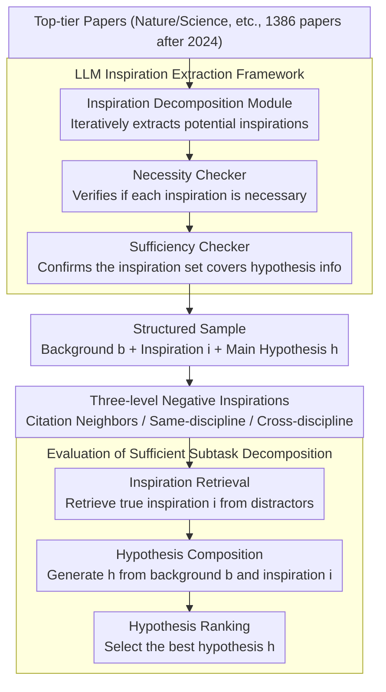

# ResearchBench: Benchmarking LLMs in Scientific Discovery via Inspiration-Based Task Decomposition

**Conference**: ACL 2026 Findings  
**arXiv**: [2503.21248](https://arxiv.org/abs/2503.21248)  
**Code**: None  
**Area**: Scientific Discovery  
**Keywords**: Scientific discovery, inspiration retrieval, hypothesis generation, LLM benchmark, interdisciplinary

## TL;DR

ResearchBench is proposed as the first large-scale benchmark to evaluate the scientific discovery capabilities of LLMs. Based on the theoretical decomposition of "inspiration-driven hypothesis generation," it covers 1386 papers across 12 disciplines. By decomposing scientific discovery into three sufficient subtasks—inspiration retrieval, hypothesis composition, and hypothesis ranking—the study finds that LLMs perform exceptionally well in cross-disciplinary inspiration retrieval.

## Background & Motivation

**Background**: LLMs have demonstrated potential in assisting scientific research, yet a systematic benchmark for evaluating their ability to generate valid and novel hypotheses is still lacking.

**Limitations of Prior Work**: (1) Lack of dedicated scientific discovery benchmarks—existing benchmarks (Chatbot Arena, MixEval) evaluate general capabilities rather than discovery; (2) IdeaBench only covers biomedical hypothesis generation and does not evaluate a complete set of discovery subtasks; (3) DiscoveryBench and ScienceAgentBench focus on specific subtasks (e.g., code writing) without analyzing the fundamental decomposition of scientific discovery.

**Key Challenge**: The non-decomposability of the scientific discovery process makes evaluation difficult. A theoretically "sufficient" subtask decomposition is needed, such that perfectly solving these subtasks is equivalent to perfectly solving the overall discovery task.

**Goal**: To construct the first interdisciplinary, large-scale scientific discovery capability benchmark based on a theoretically sufficient subtask decomposition.

**Key Insight**: Building on cognitive science findings—where creativity often originates from the associative combination of two seemingly unrelated pieces of knowledge—hypothesis generation is decomposed into Inspiration Retrieval $\rightarrow$ Hypothesis Composition $\rightarrow$ Hypothesis Ranking.

**Core Idea**: Most hypotheses $h = f(b, i_1, ..., i_k)$ can be viewed as a combination of research background $b$ and inspiration knowledge $i$. Based on this, it is decomposed into three independently evaluable subtasks, where a perfect solution to these three subtasks constitutes a perfect solution to the discovery task.

## Method

### Overall Architecture

ResearchBench is an evaluation pipeline involving "data collection $\rightarrow$ hypothesis decomposition $\rightarrow$ distractor generation $\rightarrow$ model evaluation." It first crawls 1386 papers published after 2024 from top-tier journals such as Nature and Science. An agentic LLM framework automatically extracts research problems, background overviews, inspiration knowledge, and main hypotheses. Subsequently, three levels of negative samples (citation neighbors, same-discipline, and cross-discipline) are constructed for each inspiration. Finally, LLMs are evaluated on three subtasks: inspiration retrieval, hypothesis composition, and hypothesis ranking. The starting point of this design is a provably sufficient decomposition: splitting "discovering new hypotheses" into these three steps ensures that perfectly solving them is equivalent to completing the discovery task.

### Key Designs

**1. Theoretically Sufficient Subtask Decomposition: Allowing local evaluation to reflect global capability**

Based on $P(h|b) \approx \prod_{j=1}^{k} P(i_j|b,h_{j-1},I) \cdot P(h_j|b,h_{j-1},i_j)$, the paper treats hypothesis generation as a chained combination of research background $b$ and a set of inspiration knowledge $i$. This corresponds to three subtasks: inspiration retrieval (finding $i_j$), hypothesis composition (generating $h_j$ from background and inspiration), and hypothesis ranking (selecting the best $h$). The key property of this decomposition is "sufficiency"—perfectly solving the three subtasks is equivalent to perfectly solving the overall discovery, thus scores on subtasks can reliably generalize to discovery capability. This is grounded in cognitive science—the idea that "ideas are just new combinations of old elements"—and verified across 12 disciplines by experts.

**2. LLM Inspiration Extraction Framework: Automated and updateable over time**

The framework coordinates across three stages: the Inspiration Decomposition Module iteratively extracts potential inspirations (represented by titled abstracts of cited papers), the Necessity Checker verifies if the inspiration is essential for the main hypothesis, and the Sufficiency Checker confirms that the extracted set of inspirations adequately covers the scope of the hypothesis. Expert review confirmed an accuracy of 91.9%. The advantage of this automated design goes beyond saving labor—it can automatically incorporate newer papers as LLM pre-training cutoffs advance, thereby continuously avoiding data leakage.

**3. Three-level Negative Inspirations: Creating a difficulty gradient for inspiration retrieval**

Distractors are divided into three levels based on discrimination difficulty: Level 1 consists of neighbors cited by the paper or with similar title semantics, which are the hardest to distinguish; Level 2 contains same-discipline papers with medium difficulty; Level 3 contains papers from entirely different disciplines, which are the easiest to exclude. Simple negative samples would allow all models to easily achieve full scores, losing discriminative power, while the three-level gradient finely characterizes how closely an LLM can isolate true inspiration from noise.

## Key Experimental Results

### Main Results (Inspiration Retrieval - Selecting top 4% candidates)

| Model | Overall Accuracy |
|------|----------|
| GPT-4o | 45.7% |
| GPT-4o-mini | 42.3% |
| Qwen2.5-72B | ~40% |
| Llama-3.1-70B | ~35% |

### Key Findings
- LLMs perform surprisingly well in inspiration retrieval—when selecting the top 4% of candidates, the probability of including the true inspiration reached 45.7%.
- Inspiration retrieval is essentially an OOD (Out-Of-Distribution) task—inspirations should be knowledge "not previously considered relevant to the research problem but actually useful." LLMs are capable of finding these non-obvious associations.
- LLMs also performed well on hypothesis composition and ranking tasks.
- Results were consistent across 12 disciplines, validating the universality of the inspiration-based decomposition framework.
- LLMs are positioned as "research hypothesis mines"—better performing LLMs act as richer mines, and more reasoning computation equals more miners.

## Highlights & Insights
- **Solid Theoretical Foundation**: Based on a sufficient decomposition from cognitive science, rather than an ad hoc evaluation design.
- **Profound Implications of OOD Inspiration Retrieval**: Demonstrates that LLMs possess the capability to discover non-obvious knowledge associations.
- **12 Discipline Coverage**: From physics to law, validating the broad applicability of the method.
- **Automated and Updateable**: The framework can automatically extract new papers over time to prevent data leakage.

## Limitations & Future Work
- **Hypothesis Evaluation Relies on Semantic Matching**: Difficult to evaluate truly novel hypotheses.
- **Inspiration Extraction Accuracy (91.9%)**: Still has room for improvement.
- **Evaluation Limited to Hypothesis Discovery**: Does not evaluate experimental validation of hypotheses.
- Future Directions: Integrating with experimental Agents to complete the full scientific discovery cycle and evaluating the novelty and impact of hypotheses.

## Related Work & Insights
- **vs IdeaBench**: Only covers biomedicine, lacks inspiration retrieval evaluation, relies on rule extraction (non-LLM), and is limited to a single domain.
- **vs DiscoveryBench/ScienceAgentBench**: Focuses on specific subtasks like code writing without analyzing the fundamental decomposition of discovery.
- **vs MOOSE-Chem**: Proposes an inspiration-driven discovery framework but is limited to chemistry and materials science; ResearchBench extends this to 12 disciplines.

## Rating
- Novelty: ⭐⭐⭐⭐⭐ First interdisciplinary scientific discovery benchmark based on theoretical sufficient decomposition; unique insight regarding inspiration retrieval as an OOD task.
- Experimental Thoroughness: ⭐⭐⭐⭐ Coverage of 12 disciplines, multi-model comparisons, and expert validation, although some task evaluation details are sparse.
- Writing Quality: ⭐⭐⭐⭐ Clear exposition of the theoretical framework; intuitive examples of inspiration like backpropagation.
- Value: ⭐⭐⭐⭐⭐ Provides the first systematic evaluation framework for AI-assisted scientific discovery; the "research hypothesis mine" positioning is insightful.

<!-- RELATED:START -->

## Related Papers

- [\[ICML 2025\] LLM-SRBench: A New Benchmark for Scientific Equation Discovery with LLMs](../../ICML2025/llm_evaluation/llm-srbench_a_new_benchmark_for_scientific_equation_discovery_with_large_languag.md)
- [\[ACL 2026\] PolitNuggets: Benchmarking Agentic Discovery of Long-Tail Political Facts](politnuggets_benchmarking_agentic_discovery_of_long-tail_political_facts.md)
- [\[ACL 2026\] Personalized Benchmarking: Evaluating LLMs by Individual Preferences](personalized_benchmarking_evaluating_llms_by_individual_preferences.md)
- [\[ACL 2026\] BizCompass: Benchmarking the Reasoning Capabilities of LLMs in Business Knowledge and Applications](bizcompass_benchmarking_the_reasoning_capabilities_of_llms_in_business_knowledge.md)
- [\[ACL 2026\] Do LLMs Overthink Basic Math Reasoning? Benchmarking the Accuracy-Efficiency Tradeoff](do_llms_overthink_basic_math_reasoning_benchmarking_the_accuracy-efficiency_trad.md)

<!-- RELATED:END -->
