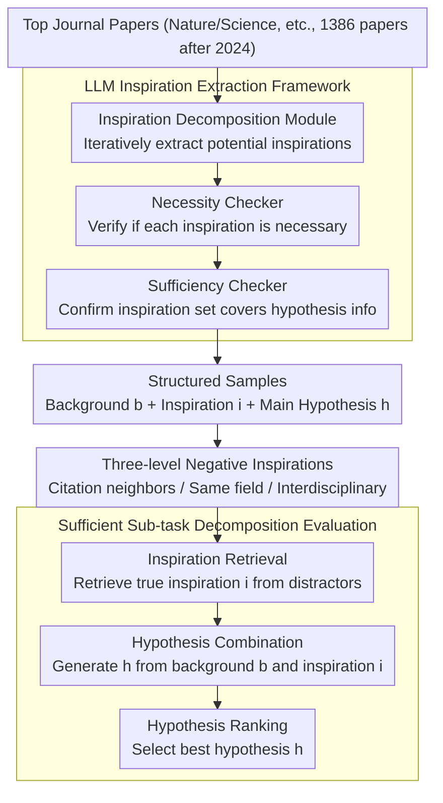

# ResearchBench: Benchmarking LLMs in Scientific Discovery via Inspiration-Based Task Decomposition

**Conference**: ACL 2026 Findings  
**arXiv**: [2503.21248](https://arxiv.org/abs/2503.21248)  
**Code**: None  
**Area**: Scientific Discovery  
**Keywords**: Scientific Discovery, Inspiration Retrieval, Hypothesis Generation, LLM Benchmark, Interdisciplinary

## TL;DR

ResearchBench is proposed as the first large-scale benchmark for evaluating the scientific discovery capabilities of LLMs. Based on the theoretical decomposition of "inspiration-driven hypothesis generation," it covers 1,386 papers across 12 disciplines. By decomposing scientific discovery into three sufficient sub-tasks—inspiration retrieval, hypothesis combination, and hypothesis ranking—it discloses that LLMs perform exceptionally well in cross-disciplinary inspiration retrieval.

## Background & Motivation

**Background**: LLMs have demonstrated the potential to assist scientific research, but a systematic benchmark for evaluating their ability to generate effective new hypotheses is currently lacking.

**Limitations of Prior Work**: (1) Lack of specialized scientific discovery benchmarks—existing benchmarks (Chatbot Arena, MixEval) evaluate general capabilities rather than discovery; (2) IdeaBench only covers hypothesis generation in biomedicine and does not evaluate the complete set of discovery sub-tasks; (3) DiscoveryBench and ScienceAgentBench focus on specific sub-tasks (e.g., code writing) without analyzing the fundamental decomposition of scientific discovery.

**Key Challenge**: The non-decomposable nature of the scientific discovery process makes evaluation difficult. A theoretically "sufficient" sub-task decomposition is required, such that perfectly solving these sub-tasks is equivalent to perfectly solving the overall discovery task.

**Goal**: To build the first interdisciplinary, large-scale scientific discovery capability benchmark based on a theoretically sufficient sub-task decomposition.

**Key Insight**: Drawing from cognitive science, creativity typically originates from the associative combination of two seemingly unrelated pieces of knowledge. Hypothesis generation is thus decomposed into: Inspiration Retrieval → Hypothesis Combination → Hypothesis Ranking.

**Core Idea**: Most hypotheses $h = f(b, i_1, ..., i_k)$ can be viewed as the combination of research background $b$ and inspiration knowledge $i$. Accordingly, it is decomposed into three independently evaluable sub-tasks, where perfectly solving these three tasks equates to perfectly solving the discovery task.

## Method

### Overall Architecture

ResearchBench follows an evaluation pipeline of "data collection → hypothesis decomposition → distractor generation → model evaluation." It first crawls 1,386 papers published after 2024 from top journals like Nature and Science. An LLM agentic framework is used to automatically extract research problems, background reviews, inspiration knowledge, and main hypotheses. For each piece of inspiration, three levels of negative samples (citation neighbors, same discipline, and cross-discipline) are constructed. Finally, LLMs are evaluated on three sub-tasks: inspiration retrieval, hypothesis combination, and hypothesis ranking. This design stems from a provably sufficient decomposition: splitting "finding new hypotheses" into these three steps, where solving them perfectly is equivalent to completing the discovery task perfectly.

### Key Designs

**1. Theoretically Sufficient Sub-task Decomposition: Linking Local Evaluation to Global Capability**

Based on $$P(h|b) \approx \prod_{j=1}^{k} P(i_j|b,h_{j-1},I) \cdot P(h_j|b,h_{j-1},i_j)$$, the paper treats hypothesis generation as a chain combination of research background $b$ and a set of inspiration knowledge $i$, corresponding to three sub-tasks: inspiration retrieval (finding $i_j$), hypothesis combination (generating $h_j$ from background and inspiration), and hypothesis ranking (selecting the best $h$). The key property of this decomposition is "sufficiency"—solving the three sub-tasks perfectly is equivalent to solving the discovery task perfectly, allowing scores on sub-tasks to generalize reliably to discovery capability. This is grounded in the cognitive science view that "ideas are nothing but new combinations of old elements" and is validated across 12 disciplines.

**2. LLM Inspiration Extraction Framework: Automated and Updatable**

The framework collaborates across three stages: the Inspiration Decomposition Module iteratively extracts potential inspirations (represented by the title and abstract of cited papers); the Necessity Checker verifies if each inspiration is necessary for the main hypothesis; and the Sufficiency Checker confirms that the extracted inspiration set adequately covers the hypothesis's information range. Expert review showed an accuracy of 91.9%. The automated design saves labor and allows the framework to update with newer papers as LLM pre-training cutoffs shift, continuously avoiding data leakage.

**3. Three-Level Negative Inspirations: Creating a Difficulty Gradient for Retrieval**

Distractors are divided into three levels based on discrimination difficulty: Level 1 consists of neighbor papers cited by the original paper or with high semantic similarity, making them the hardest to distinguish; Level 2 contains papers from the same discipline; Level 3 contains papers from entirely different disciplines, which are the easiest to exclude. This gradient allows for a fine-grained characterization of the distance at which an LLM can successfully distinguish true inspiration from interference.

## Key Experimental Results

### Main Results (Inspiration Retrieval - Top 4% Candidates)

| Model | Overall Accuracy |
|------|----------|
| GPT-4o | 45.7% |
| GPT-4o-mini | 42.3% |
| Qwen2.5-72B | ~40% |
| Llama-3.1-70B | ~35% |

### Key Findings
- LLMs perform surprisingly well on inspiration retrieval—when selecting top 4% candidates, the probability that the true inspiration is included reaches 45.7%.
- Inspiration retrieval is essentially an OOD (Out-of-Distribution) task—inspirations are typically "knowledge not previously considered relevant to the research problem but actually useful." LLMs can identify these non-obvious associations.
- LLMs also perform well on hypothesis combination and ranking tasks.
- Results are consistent across 12 disciplines, verifying the universality of the discovery-based decomposition framework.
- LLMs are positioned as "research hypothesis mines"—better LLMs represent richer mines, and more reasoning computation equals more miners.

## Highlights & Insights
- **Solid Theoretical Foundation**: Based on a sufficient decomposition from cognitive science rather than an ad hoc evaluation design.
- **Profound Insights in OOD Inspiration Retrieval**: Demonstrates that LLMs possess the capability to discover non-obvious knowledge associations.
- **12-Discipline Coverage**: Wide applicability verified across fields ranging from Physics to Law.
- **Automated and Updatable**: The framework can automatically extract new papers over time to prevent data leakage.

## Limitations & Future Work
- **Reliance on Semantic Matching for Hypothesis Evaluation**: Difficult to evaluate truly novel hypotheses that lack semantic overlap.
- **91.9% Inspiration Extraction Accuracy**: Room for improvement remains.
- **Focus on Hypothesis Discovery Only**: Does not evaluate the experimental validation of hypotheses.
- Future Directions: Integrating with experimental agents to complete the full scientific discovery loop and evaluating the novelty and impact of generated hypotheses.

## Related Work & Insights
- **vs IdeaBench**: IdeaBench covers only biomedicine, lacks inspiration retrieval evaluation, relies on rule-based extraction rather than LLMs, and is limited to a single domain.
- **vs DiscoveryBench/ScienceAgentBench**: These focus on specific sub-tasks like coding without analyzing the fundamental decomposition of scientific discovery.
- **vs MOOSE-Chem**: Proposes an inspiration-driven discovery framework but is limited to chemistry and materials science; ResearchBench extends this to 12 disciplines.

## Rating
- Novelty: ⭐⭐⭐⭐⭐ The first interdisciplinary scientific discovery benchmark based on a theoretically sufficient decomposition; unique insights into inspiration retrieval as an OOD task.
- Experimental Thoroughness: ⭐⭐⭐⭐ Coverage of 12 disciplines, multi-model comparisons, and expert validation, although some task evaluation details are brief.
- Writing Quality: ⭐⭐⭐⭐ Clear elaboration of the theoretical framework; intuitive examples of the inspiration process.
- Value: ⭐⭐⭐⭐⭐ Provides the first systematic evaluation framework for AI-assisted scientific discovery; the "hypothesis mine" analogy is thought-provoking.

<!-- RELATED:START -->

## Related Papers

- [\[ICML 2025\] LLM-SRBench: A New Benchmark for Scientific Equation Discovery with LLMs](../../ICML2025/llm_evaluation/llm-srbench_a_new_benchmark_for_scientific_equation_discovery_with_large_languag.md)
- [\[ACL 2026\] PolitNuggets: Benchmarking Agentic Discovery of Long-Tail Political Facts](politnuggets_benchmarking_agentic_discovery_of_long-tail_political_facts.md)
- [\[ACL 2026\] Personalized Benchmarking: Evaluating LLMs by Individual Preferences](personalized_benchmarking_evaluating_llms_by_individual_preferences.md)
- [\[ACL 2026\] BizCompass: Benchmarking the Reasoning Capabilities of LLMs in Business Knowledge and Applications](bizcompass_benchmarking_the_reasoning_capabilities_of_llms_in_business_knowledge.md)
- [\[ACL 2026\] Do LLMs Overthink Basic Math Reasoning? Benchmarking the Accuracy-Efficiency Tradeoff](do_llms_overthink_basic_math_reasoning_benchmarking_the_accuracy-efficiency_trad.md)

<!-- RELATED:END -->
