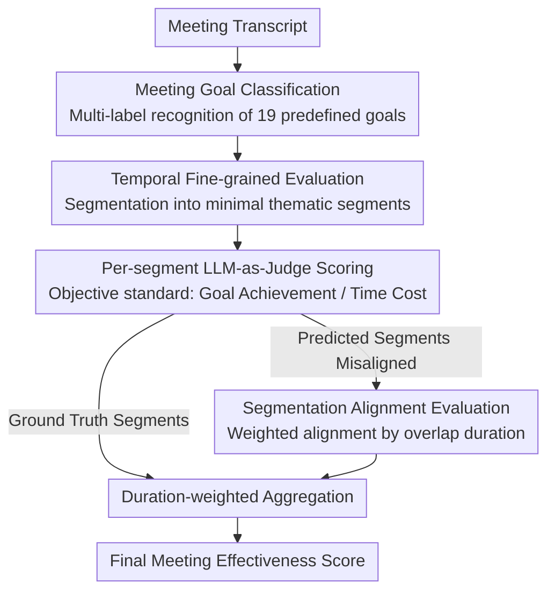

# Rethinking Meeting Effectiveness: A Benchmark and Framework for Temporal Fine-grained Automatic Meeting Effectiveness Evaluation

**Conference**: ACL 2026  
**arXiv**: [2604.17260](https://arxiv.org/abs/2604.17260)  
**Code**: [GitHub](https://github.com)  
**Area**: LLM Evaluation  
**Keywords**: Meeting Effectiveness Evaluation, Temporal Fine-grained Evaluation, LLM-as-Judge, Topic Segmentation, Multi-party Dialogue

## TL;DR

This paper redefines meeting effectiveness evaluation by proposing an objective "Goal Achievement / Time Cost" standard and a temporal fine-grained evaluation paradigm. The authors constructed the AMI-ME dataset containing 2,459 annotated segments from 130 meetings and developed an LLM-based automatic evaluation framework that achieves a Spearman correlation of 0.64.

## Background & Motivation

**Background**: Meetings are cornerstones of organizational collaboration, yet effectiveness evaluation has long relied on post-hoc surveys, yielding a single coarse-grained score for an entire meeting. Such methods are costly, difficult to scale, and lack reproducibility.

**Limitations of Prior Work**: (1) A single score fails to capture the dynamic nature of meetings—a session may alternate between highly efficient and inefficient phases; (2) existing evaluation standards vary and are often based on subjective perceptions, lacking universality; (3) meeting data is scarce and involves privacy concerns, hindering large-scale quantitative analysis.

**Key Challenge**: There is a need for an evaluation method that is both objective and universal while capturing temporal dynamics, all while overcoming the scalability bottlenecks of manual annotation.

**Goal**: (1) Define objective and universal meeting effectiveness standards; (2) propose a temporal fine-grained evaluation method; (3) construct a meta-evaluation dataset; (4) develop an LLM automatic evaluation framework.

**Key Insight**: By segmenting meetings into continuous thematic segments and evaluating the efficiency of each segment independently, the reliability of annotations is improved, and the data volume is significantly increased (expanding from 130 data points to 2,459).

**Core Idea**: Meeting effectiveness is defined as "Goal Achievement / Time Cost," evaluated automatically using LLM-as-a-Judge on fine-grained thematic segments.

## Method

### Overall Architecture

The evaluation framework decomposes "meeting quality" into an automated three-step pipeline. Given a meeting transcript, it first performs meeting goal classification—identifying which of 19 predefined goals the meeting aims to achieve via multi-label recognition. Next, it performs topic segmentation, cutting the long transcript into continuous fine-grained thematic segments. Finally, it uses LLM-as-a-Judge to score each segment, measuring its contribution to the overall goal and its time utilization. These are aggregated into a meeting-wide effectiveness score via duration weighting. When segments are model-predicted and misaligned with ground-truth segments, a segmentation alignment step is performed before aggregation.

### Key Designs

**1. Objective Evaluation Standard: Quantifying Efficiency as Achievement-to-Cost Ratio**

The paper discards subjective measures like "participant satisfaction" in favor of "Effectiveness = Goal Achievement / Time Cost." Here, "Goal" does not refer to a pre-planned agenda but to goals that emerge comprehensively from the actual content after the meeting, accommodating the natural drift of topics. This definition allows for independent evaluation; while satisfaction requires querying participants, goal achievement can be determined directly from the transcript, removing reliance on post-hoc surveys.

**2. Temporal Fine-grained Evaluation: Capturing Dynamics in Minimal Thematic Units**

The framework employs reference-guided segmentation. Using AMI original annotations as a reference, Gemini-2.5-Pro produces finer, indivisible minimal thematic segments. The overall efficiency is the duration-weighted average of per-segment scores. This step simultaneously ensures shorter segments are more accurately annotated, scales 130 meetings into 2,459 data points, and makes the dynamics of "alternating efficient and inefficient phases" observable for the first time.

**3. Segmentation Alignment Evaluation: Fair Scoring under Boundary Mismatch**

Model-generated segments often disagree with ground-truth segments in number and boundaries, preventing one-to-one comparison. For each ground-truth segment, the paper uses a duration-weighted average of all overlapping predicted segments: $\hat{e}_{t_i}^{t_{i+1}} = \sum_j \hat{e}_j \cdot \Delta_{i,j} / \sum_j \Delta_{i,j}$, where $\Delta_{i,j}$ represents the overlap duration between segments. This isolates "boundary misalignment" noise from evaluation error, making model scores comparable.

### Loss & Training

As a pure evaluation framework, no training is involved. Annotations were conducted by 6 trained professional annotators (split into two groups) using a 5-point Likert scale, achieving an ICC of 0.82-0.88 ("Good" reliability).

## Key Experimental Results

### Main Results

| Model | Spearman (All Meetings) | Kendall (All Meetings) |
|------|-------------------|------------------|
| Qwen3-32B (Non-reasoning) | **0.6445** | **0.4803** |
| GPT-4o | 0.6341 | 0.4756 |
| Llama3.3-70B | 0.6072 | 0.4854 |
| DeepSeek-R1-70B | 0.6132 | 0.4663 |
| Gemini-2.5-Flash | 0.5624 | 0.4122 |

### Ablation Study

| Setting | Spearman | Description |
|------|----------|------|
| GT Segments + GT Goals | 0.6445 | Performance Upper Bound |
| Predicted Segments | 0.2256 | Seg. error significantly degrades performance |
| End-to-End (Speech → Eval) | 0.2180 | Minimal impact from ASR errors (close to Pred. Seg.) |
| Theoretical Upper Bound | 0.6417 | Inherent penalty for segmentation inconsistency |

### Key Findings

- Topic segmentation quality is the primary bottleneck—Spearman drops from 0.64 to 0.23 when moving from ground-truth to predicted segments.
- ASR errors have negligible impact on effectiveness evaluation (0.23 vs 0.22), suggesting LLMs are robust to noisy text.
- Gemini-2.5-Flash performs the worst due to a tendency to overuse the lowest scores.
- Reasoning models (DeepSeek-R1) do not necessarily outperform non-reasoning models (Qwen3 in non-reasoning mode performed best).

## Highlights & Insights

- The definition of "Effectiveness = Goal Achievement / Time" is concise and universal, transforming vague "meeting quality" into a quantifiable ratio.
- Temporal fine-grained evaluation serves a triple purpose: more accurate annotation, increased data volume, and dynamic analysis.
- The segmentation alignment mechanism elegantly addresses the problem of boundary inconsistency in evaluation.

## Limitations & Future Work

- Current topic segmentation quality severely limits end-to-end performance (0.64 → 0.23).
- Validation was restricted to the AMI corpus, which contains limited meeting types.
- The limit of 3 goals per meeting may not be suitable for highly complex sessions.
- The impact of multi-modal signals (video, screen sharing, etc.) on effectiveness was not considered.

## Related Work & Insights

- **vs. Traditional Meeting Evaluation**: Traditional methods produce a single score and rely on surveys; this work achieves automated temporal fine-grained evaluation for the first time.
- **vs. G-Eval**: The evaluation component adopts the CoT and form-filling paradigms of G-Eval but targets a completely different task.
- **vs. Multi-party Dialogue Research**: Provides an evaluative foundation for proactive intervention by multi-party dialogue agents.

## Rating

- Novelty: ⭐⭐⭐⭐ The evaluation paradigm is novel, though the core method (LLM-as-Judge) is a standard practice.
- Experimental Thoroughness: ⭐⭐⭐⭐⭐ Extremely comprehensive, including end-to-end evaluation, cross-meeting types, and segmentation impact analysis.
- Writing Quality: ⭐⭐⭐⭐⭐ Logical and clear, with precise problem definitions and a transparent dataset construction process.
- Value: ⭐⭐⭐⭐ Provides a new paradigm and benchmark for meeting analysis, though practical application requires solving the segmentation bottleneck.

<!-- RELATED:START -->

## Related Papers

- [\[ACL 2026\] K-MetBench: A Multi-Dimensional Benchmark for Fine-Grained Evaluation of Expert Reasoning, Locality, and Multimodality in Meteorology](k-metbench_a_multi-dimensional_benchmark_for_fine-grained_evaluation_of_expert_r.md)
- [\[ACL 2026\] IF-Critic: Towards a Fine-Grained LLM Critic for Instruction-Following Evaluation](if-critic_towards_a_fine-grained_llm_critic_for_instruction-following_evaluation.md)
- [\[ICML 2026\] On Effectiveness and Efficiency of Agentic Tool-calling and RL Training](../../ICML2026/llm_evaluation/on_effectiveness_and_efficiency_of_agentic_tool-calling_and_rl_training.md)
- [\[ACL 2026\] LoCar: Localization-Aware Evaluation of In-Vehicle Assistants through Fine-Grained Sociolinguistic Control](locar_localization-aware_evaluation_of_in-vehicle_assistants_through_fine-graine.md)
- [\[ACL 2026\] Comprehensiveness Metrics for Automatic Evaluation of Factual Recall in Text Generation](comprehensiveness_metrics_for_automatic_evaluation_of_factual_recall_in_text_gen.md)

<!-- RELATED:END -->
