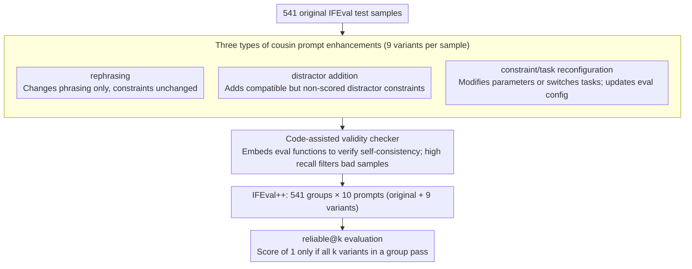

# Revisiting the Reliability of Language Models in Instruction-Following

**Conference**: ACL2026  
**arXiv**: [2512.14754](https://arxiv.org/abs/2512.14754)  
**Code**: https://github.com/jianshuod/IFEval-pp  
**Area**: LLM Evaluation  
**Keywords**: Instruction following, reliability evaluation, IFEval++, cousin prompts, reliable@k

## TL;DR
This paper introduces nuance-oriented reliability and the reliable@k metric, utilizing IFEval++ to examine whether models can consistently handle "cousin prompts" with similar semantics but varying details. It reveals that even high-performing models experience significant performance drops under subtle prompt variations.

## Background & Motivation
**Background**: Instruction-following capabilities are typically evaluated via benchmarks such as IFEval, FollowBench, and CFBench, which focus on whether models satisfy explicit constraints like format, length, keywords, and structure. As models iterate, many strong models have approached saturation on IFEval; for instance, GPT-5 achieves an IFEval accuracy of 95.9%.

**Limitations of Prior Work**: High benchmark accuracy does not equate to reliability in real-world services. Users frequently change phrasing, contextual frameworks, numeric constraints, or task instances. Many evaluations only consider the success or failure of individual prompts, failing to measure whether a model is consistently reliable across a group of similar prompts.

**Key Challenge**: A model might succeed on an original prompt but fail on a "cousin prompt" with only minor detail changes. Traditional accuracy treats each prompt as an independent sample, failing to distinguish between "covering many types" and being "stably reliable for the same intent."

**Goal**: The authors aim to construct an evaluation framework capable of assessing stability under subtle variations, answering whether current LLMs possess "nuance-oriented reliability" and analyzing how this reliability evolves with model scale, temporal iteration, reasoning capabilities, and improvement strategies.

**Key Insight**: Starting from IFEval, the paper automatically generates multiple cousin prompts for each original test sample. These preserve the original user intent but introduce detailed differences through paraphrasing, adding compatible distractor constraints, or reconfiguring tasks/constraints. A sample is considered "reliable" only if the model passes the entire set of prompts.

**Core Idea**: Upgrade "single-task correctness" to "set-level correctness for semantically proximate tasks," using the reliable@k metric to measure model stability against subtle prompt variations.

## Method
The core of this paper is not a new model, but a new evaluation dimension, a benchmark construction pipeline, and a set of systematic experiments. It decomposes instruction-following reliability into two orthogonal dimensions: comprehensiveness-oriented reliability (focusing on task and constraint coverage) and nuance-oriented reliability (focusing on stability across different expressions of the same intent).

### Overall Architecture
The workflow begins with 541 original test samples from IFEval. For each sample, the system generates 9 cousin prompts, which, combined with the original prompt, form a test set of 10. Each cousin prompt belongs to one of three enhancement categories: rephrasing, distractor addition, or constraint/task reconfiguration. After generation, a code-assisted validity checker ensures the prompts are consistent with the evaluation configurations and verifiable by IFEval's automated evaluation functions.

The resulting IFEval++ includes 541 test groups, each consisting of 10 prompts. During model evaluation, the authors report the original IFEval accuracy, reliable@2 and reliable@4 on different enhancement subsets, and reliable@10 across the entire IFEval++.

### Key Designs

**1. Three types of cousin prompt enhancements: Inducing subtle but reasonable instruction perturbations**

To measure the stability of a specific capability, perturbations must remain close to real user behavior rather than switching to entirely new tasks. Each original sample is expanded into a set of variants: *rephrasing* changes wording without altering constraints; *distractor addition* introduces requirements compatible with original constraints but ignored by the scorer; *constraint/task reconfiguration* alters configurable parameters or task scenarios while synchronizing evaluation settings. These cover variations in "expression, requirement, and instance," testing intent stability more rigorously than simply changing topics.

**2. Code-assisted validity checker: Ensuring variant legality before attribution**

If a cousin prompt is inherently invalid or misconfigured, a failure in reliable@k cannot be attributed to model unreliability, contaminating the metric. The checker embeds evaluation function implementations and configuration descriptions into the prompt, allowing an LLM to judge if the enhanced sample is self-consistent with the executable evaluation logic. The strategy favors high recall, preferring to flag suspicious samples to ensure failures are cleanly attributable to the model. This checker achieved 99.7% recall on 900 injected error samples and 99.9% on 3,000 additional flawed cases.

**3. reliable@k metric: Upgrading from single-prompt success to proximity-set success**

Traditional accuracy treats each prompt as an independent sample, masking whether a model is stable for a single intent. reliable@k incorporates this local stability directly into the metric: for a group of $k$ cousin prompt outputs, a score of 1 is assigned only if all $k$ outputs pass their respective automated evaluations; otherwise, the group scores 0. When $k=1$, it reduces to standard accuracy. Thus, reliable@k serves as a second-order promotion of accuracy, specifically exposing vulnerability where the original is correct but variants fail.

### Loss & Training
The evaluation portion does not involve training. In improvement experiments, the authors test three paths: predicting whether a prompt will be followed, SFT using semantically similar data, and extending test-time compute via reasoning effort or rejection sampling. Training experiments utilize Qwen2.5-7B-Instruct, performing SFT for 312 steps on Alpaca and decontaminated IFEval cousin prompts to compare reliability changes.

## Key Experimental Results

### Main Results
The authors evaluate 46 models, including 20 proprietary and 26 open-source models, covering various scales, vendors, reasoning modes, and release dates.

| Model | IFEval Accuracy | IFEval++ reliable@10 | Relative Drop | Observation |
|--------|------|------|----------|------|
| GPT-5 | 95.9 | 78.4 | -18.3% | Most reliable, but still drops significantly |
| o3 | 94.3 | 75.0 | -21.3% | Reasoning models perform strongly |
| LLaMA-3.3-70B-Instruct | 92.1 | 71.0 | -22.9% | One of the strongest open-source models |
| Gemma-3-IT-27B | 84.3 | 61.6 | -27.0% | Lower accuracy rank, but reliable@10 rank rises |
| Qwen3-0.6B | 58.0 | 22.2 | -61.8% | Small models are most fragile under subtle changes |
| GPT-3.5-turbo-1106 | 61.6 | 27.9 | -54.7% | Legacy proprietary models show significant drops |

Results indicate that IFEval accuracy is highly correlated with but not equivalent to IFEval++ reliable@10. Some models do not stand out in original IFEval rankings but are more stable across cousin prompts, suggesting nuance-oriented reliability is a capability distinct from single-point accuracy.

### Ablation Study
The paper tests three types of methods for reliability improvement: prediction, training, and test-time scaling.

| Configuration / Method | Key Metric | Description |
|------|---------|------|
| verbalized confidence | AUROC 0.549 / 0.518 | Qwen3-8B and Qwen2.5-7B are near random; confidence is unreliable |
| prompt perplexity | AUROC 0.497 / 0.529 | Prompt familiarity does not predict following success |
| hidden-state probing | AUROC 0.757 / 0.759 | Intermediate states provide some predictive signal |
| Alpaca SFT | reliable@10 slight drop | General instruction data may not improve subtle stability |
| curated cousin-prompt SFT | >45% after 200 steps | Semantically proximate data is more effective |
| rejection sampling | Plateaus around $n=12$ | Reliability increases significantly with a response selector |

### Key Findings
- Reliability drops caused by subtle variations are universal, reaching up to 61.8%. This suggests that saturation on instruction-following benchmarks does not imply saturation in real-world stability.
- *rephrasing* is generally the easiest, while *distractor* and *constraint/task reconfiguration* are harder due to increased pressure on response planning and constraint execution.
- Model scale generally helps but is not the sole factor. Qwen3-14B outperforms the larger Qwen3-32B on certain reliability metrics, indicating training methods and data quality are critical.
- Reasoning capabilities typically improve reliability but are not a strictly necessary condition. LLaMA-3.3-70B-Instruct is not a reasoning model yet remains one of the strongest open-source models.
- reliable@10 differs from pass@10. The former measures stability across semantically proximate prompts, while the latter measures random stability via multiple samplings of the same prompt. On LLaMA-3.3-70B, accuracy is 92.1, reliable@10 is 71.0, and pass@10 is 85.6.

## Highlights & Insights
- Decomposing "reliability" from a vague concept into executable metrics is the primary contribution. reliable@k is simple yet diagnostic, particularly for revealing benchmark overfitting and prompt sensitivity.
- The construction of cousin prompts is broader than traditional paraphrase robustness, encompassing compatible distractors and micro-adjusted constraints, which closer mirrors diverse user expressions.
- Training experiments provide a practical signal: improving reliability may not require more general instruction data, but rather targeted training on semantically proximate samples.
- Test-time scaling analysis is realistic. Rejection sampling can significantly boost reliability if a programmatically verifiable selector exists; however, this highlights the gap between verifiable and open-ended tasks.

## Limitations & Future Work
- The full evaluation cost of IFEval++ is 10x that of IFEval due to more response generation. Future work needs efficient selection of the most discriminative cousin prompts.
- Evaluation focuses primarily on format and constraint following, without simultaneous content quality assessment. Models might satisfy formats but provide mediocre content.
- Study is primarily English-based. The methodology can be migrated to other languages but requires translation, constraint function adaptation, and language-specific validity checks.
- While the validity checker has high recall, it still relies on LLM judgments, which may introduce subtle biases. Stronger programmatic checks or human auditing could enhance credibility.
- Improvement strategies only cover representative methods and do not systematically reproduce all instruction-following enhancement techniques.

## Related Work & Insights
- **vs IFEval**: IFEval assesses whether a single prompt meets constraints; IFEval++ assesses whether multiple subtle expressions of the same intent are met.
- **vs Multi-constraint benchmarks**: FollowBench and CFBench emphasize constraint types and complexity coverage, while this work emphasizes consistency across semantically proximate samples.
- **vs pass@k**: pass@k represents stability across multiple samplings of the same prompt; reliable@k represents stability across different cousin prompts.
- **Insight**: Future LLM evaluations should include a local perturbation family for every core sample. Model scores should reflect not just "how many tasks were solved" but "consistency across the same capability."

## Rating
- Novelty: ⭐⭐⭐⭐⭐ reliable@k is simple and powerful, making prompt-level stability evaluable at scale.
- Experimental Thoroughness: ⭐⭐⭐⭐⭐ Covers 46 models and analyzes scale, time, reasoning, enhancement types, and improvement paths.
- Writing Quality: ⭐⭐⭐⭐☆ Clear structure with intuitive examples; dense tables require attention to metric definitions.
- Value: ⭐⭐⭐⭐⭐ Direct reference value for LLM evaluation, model release reports, and reliable service monitoring.

<!-- RELATED:START -->

## Related Papers

- [\[ACL 2026\] WildIFEval: Instruction Following in the Wild](wildifeval_instruction_following_in_the_wild.md)
- [\[ACL 2026\] IF-RewardBench: Benchmarking Judge Models for Instruction-Following Evaluation](if-rewardbench_benchmarking_judge_models_for_instruction-following_evaluation.md)
- [\[ACL 2026\] IF-Critic: Towards a Fine-Grained LLM Critic for Instruction-Following Evaluation](if-critic_towards_a_fine-grained_llm_critic_for_instruction-following_evaluation.md)
- [\[ACL 2026\] Revisiting a Pain in the Neck: A Semantic Reasoning Benchmark for Language Models](revisiting_a_pain_in_the_neck_a_semantic_reasoning_benchmark_for_language_models.md)
- [\[ACL 2025\] StructFlowBench: A Structured Flow Benchmark for Multi-turn Instruction Following](../../ACL2025/llm_evaluation/structflowbench_a_structured_flow_benchmark_for_multi-turn_instruction_following.md)

<!-- RELATED:END -->
