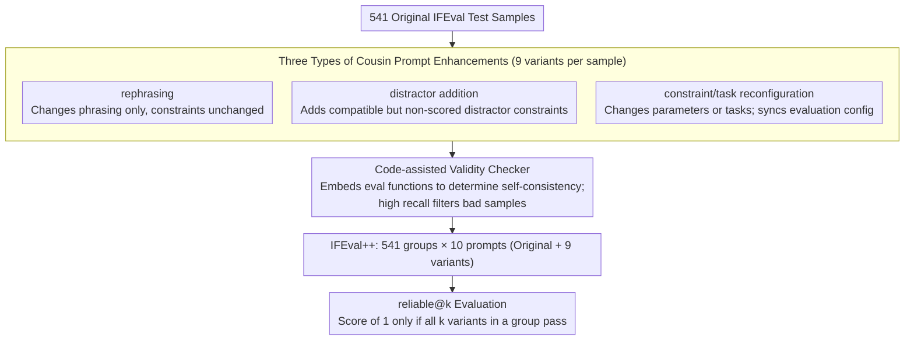

# Revisiting the Reliability of Language Models in Instruction-Following

**Conference**: ACL2026  
**arXiv**: [2512.14754](https://arxiv.org/abs/2512.14754)  
**Code**: https://github.com/jianshuod/IFEval-pp  
**Area**: LLM Evaluation  
**Keywords**: Instruction Following, Reliability Evaluation, IFEval++, cousin prompts, reliable@k

## TL;DR
This paper introduces nuance-oriented reliability and the reliable@k metric, utilizing IFEval++ to examine whether models can stably handle "cousin prompts" that share similar semantics but differ in details. The study finds that even high-performing models experience significant performance drops under subtle prompt variations.

## Background & Motivation
**Background**: Instruction-following capabilities are typically evaluated through benchmarks such as IFEval, FollowBench, and CFBench, focusing on whether a model satisfies explicit constraints regarding format, length, keywords, and structure. As models iterate, many powerful models have nearly saturated IFEval; for instance, GPT-5 achieves an IFEval accuracy of 95.9%.

**Limitations of Prior Work**: High benchmark accuracy does not equate to reliability in real-world services. Users in practical scenarios change phrasing, contextual frameworks, numerical constraints, or task instances. Many evaluations only look at the success or failure of a single prompt, failing to measure whether a model is consistently reliable across a set of similar prompts.

**Key Challenge**: A model might succeed on an original prompt but fail on a "cousin prompt" with only minor detail changes. Traditional accuracy treats every prompt as an independent sample, failing to distinguish between "covering many types" and "being stable and reliable for the same intent."

**Goal**: The authors aim to construct an evaluation framework capable of assessing stability under subtle changes to answer whether current LLMs possess nuance-oriented reliability in instruction following and to further analyze how this reliability changes with model scale, temporal iteration, reasoning capability, and improvement strategies.

**Key Insight**: Starting from IFEval, the paper automatically generates multiple "cousin prompts" for each original test sample. These retain similar user intent but introduce detailed differences through rephrasing, adding compatible distractor constraints, or reconfiguring tasks/constraints. A model is considered "reliable" for a sample only if it passes all prompts in the same group.

**Core Idea**: Upgrade "correctness on a single question" to "correctness on a group of semantically neighboring questions," using reliable@k to measure the model's stability against subtle prompt variations.

## Method
The core contribution is not a new model but an evaluation dimension, a benchmark construction pipeline, and a set of systematic experiments. It deconstructs the reliability of instruction following into two orthogonal dimensions: comprehensiveness-oriented reliability (focusing on task and constraint coverage) and nuance-oriented reliability (focusing on stability across different expressions of the same intent).

### Overall Architecture
The workflow begins with 541 original test samples from IFEval. For each sample, the system generates 9 cousin prompts, which, together with the original prompt, form a test group of 10. Each cousin prompt belongs to one of three enhancement categories: rephrasing, distractor addition, or constraint/task reconfiguration. After generation, a code-assisted validity checker ensures the prompt is consistent with the evaluation configuration and can be verified by IFEval's automatic evaluation functions.

The final IFEval++ contains 541 test groups, each with 10 prompts. During evaluation, the authors report original IFEval accuracy, reliable@2 and reliable@4 on different enhancement subsets, and reliable@10 on the entire IFEval++.

### Key Designs

**1. Three Types of Cousin Prompt Enhancements: Inducing subtle but reasonable instruction perturbations from three angles.**

To measure whether a specific capability is stable, perturbations must remain close to real user behavior rather than switching to entirely different tasks. Each original sample is expanded into a group of variants categorized as: *rephrasing* (changing wording only, corresponding to users saying the same thing differently); *distractor addition* (adding requirements compatible with original constraints but not scored, corresponding to extraneous user requests); and *constraint/task reconfiguration* (changing configurable parameters or task scenarios while updating evaluation configurations, corresponding to variations in task instances). These three categories cover "changes in wording, changes in requirements, and changes in instances," probing model stability more effectively than simply replacing the task.

**2. Code-Assisted Validity Checker: Ensuring variant legality before attributing failure to the model.**

If a cousin prompt is inherently illegal or misconfigured, a failure in reliable@k cannot be attributed to model unreliability, thus polluting the metric. The checker embeds the evaluation function implementation and configuration descriptions into the prompt, allowing an LLM to judge whether the enhanced sample is self-consistent with the executable evaluation logic. The strategy prioritizes high recall, preferring to flag suspicious samples to ensure bad samples are filtered out. This checker achieved 99.7% recall on 900 injected error samples and 99.9% on 3,000 additional flawed cases, providing sufficient support to attribute failures cleanly to the models.

**3. reliable@k Metric: Upgrading "single question correctness" to "all-correct in a neighborhood."**

Traditional accuracy treats every prompt as an independent sample, which fails to reveal if a model is stable for the same intent—it distinguishes "covering many types" but not "repeated reliability for the same intent." The reliable@k metric builds local stability directly into the score: for the outputs of $k$ cousin prompts in a group, the group is scored as 1 only if all outputs pass their respective automatic evaluation functions; otherwise, it is 0. When $k=1$, it reduces to standard accuracy. Thus, reliable@k can be viewed as a second-order generalization of accuracy, specifically exposing vulnerability where the original sentence is correct but the variant fails.

### Loss & Training
The evaluation section does not involve training. In improvement experiments, the authors test three paths: predicting whether a prompt will be followed, SFT with semantically similar data, and extending test-time computation via reasoning effort or rejection sampling. For training experiments, Qwen2.5-7B-Instruct was used for SFT for 312 steps on Alpaca and decontaminated IFEval cousin prompts to compare changes in reliability.

## Key Experimental Results

### Main Results
The authors evaluate 46 models, including 20 proprietary and 26 open-source models, covering various scales, vendors, inference modes, and eras.

| Model | IFEval Accuracy | IFEval++ reliable@10 | Relative Drop | Observation |
|--------|------|------|----------|------|
| GPT-5 | 95.9 | 78.4 | -18.3% | Most reliable, but still drops significantly |
| o3 | 94.3 | 75.0 | -21.3% | Strong performance from reasoning models |
| LLaMA-3.3-70B-Instruct | 92.1 | 71.0 | -22.9% | One of the strongest open-source models |
| Gemma-3-IT-27B | 84.3 | 61.6 | -27.0% | Lower accuracy rank, but higher reliable@10 rank |
| Qwen3-0.6B | 58.0 | 22.2 | -61.8% | Small models are most vulnerable to subtle changes |
| GPT-3.5-turbo-1106 | 61.6 | 27.9 | -54.7% | Significant drop for older proprietary models |

The results indicate that IFEval accuracy is highly correlated with but not equivalent to IFEval++ reliable@10. Some models do not stand out in original IFEval accuracy but are more stable across cousin prompts, suggesting that nuance-oriented reliability is a capability independent of single-point accuracy.

### Ablation Study
The paper tests three methods for improving reliability: prediction, training, and test-time scaling.

| Configuration / Method | Key Metric | Description |
|------|---------|------|
| verbalized confidence | AUROC 0.549 / 0.518 | Qwen3-8B and Qwen2.5-7B are near random; model confidence is unreliable |
| prompt perplexity | AUROC 0.497 / 0.529 | Prompt familiarity does not predict instruction following |
| hidden-state probing | AUROC 0.757 / 0.759 | Intermediate hidden states provide some predictive signals |
| Alpaca SFT | slight drop in reliable@10 | General instruction data does not necessarily improve subtle stability |
| curated cousin-prompt SFT | > 45% after 200 steps | Semantically neighboring data is more effective |
| rejection sampling | Plateaus around $n=12$ | Reliability increases significantly if a response selector is available |

### Key Findings
- Reliability drops caused by subtle variations are widespread, reaching up to 61.8%. This suggests that saturation of instruction-following benchmarks does not represent saturation of real-world stability.
- Rephrasing is generally the easiest, while distractor addition and constraint/task reconfiguration are harder as they increase pressure on response planning and constraint execution.
- Model scale generally helps but is not the sole factor. Qwen3-14B exceeds the larger Qwen3-32B on certain reliability metrics, indicating that training methods and data quality are equally critical.
- Reasoning capability usually improves reliability but is not a strictly necessary condition. LLaMA-3.3-70B-Instruct is not a reasoning model yet remains one of the strongest open-source models.
- reliable@10 differs from pass@10. The former measures stability across semantically neighboring prompts, while the latter measures random stability across multiple samplings of the same prompt. For LLaMA-3.3-70B, accuracy is 92.1, reliable@10 is 71.0, and pass@10 is 85.6, showing clear differentiation.

## Highlights & Insights
- The paper's primary contribution is deconstructing "reliability" from a vague concept into actionable metrics. reliable@k is simple yet diagnostic, particularly for revealing benchmark overfitting and prompt sensitivity.
- The construction of cousin prompts is broader than traditional paraphrase robustness. It considers not only synonymous rephrasing but also stability under compatible distractors and fine-tuned constraints, which is closer to the diverse expressions of real users.
- Training experiments provide a practical signal: improving reliability does not necessarily require more general instruction data but rather targeted training around semantically neighboring samples.
- The analysis of test-time scaling is realistic. As long as a program-verifiable selector exists, rejection sampling can significantly boost reliability; however, this also highlights the important gap between verifiable and open-ended tasks.

## Limitations & Future Work
- The full evaluation cost of IFEval++ is 10x that of IFEval due to more response generation. Future work needs more efficient selection of the most discriminative cousin prompts.
- The evaluation mainly focuses on format and constraint following, without simultaneous assessment of content quality. A model might satisfy the format but provide mediocre content, which remains insufficient for real services.
- This work is primarily based on the English version of IFEval. The methodology can be transferred to other languages, but it requires translation, constraint function adaptation, and language-specific validity checks.
- While the validity checker has high recall, it still relies on LLM judgment, which might introduce subtle biases. Stronger programmatic checks or manual audits could further enhance credibility.
- Improvement strategies only covered representative methods and did not systematically replicate all instruction-following enhancement techniques, making it impossible to conclude which training or alignment strategy is optimal.

## Related Work & Insights
- **vs IFEval**: IFEval evaluates whether a single prompt satisfies constraints; IFEval++ builds on this to evaluate whether various subtle expressions of the same intent are all satisfied.
- **vs Multi-constraint benchmarks**: FollowBench, CFBench, and ComplexBench emphasize constraint types and complexity coverage; this paper emphasizes consistency across semantically neighboring samples.
- **vs pass@k**: pass@k represents stability over multiple samplings of the same prompt, while reliable@k represents stability across different cousin prompts. They capture different risks.
- **Insights**: Future LLM benchmark construction should accompany each core sample with a family of local perturbations. Model scores should not only reflect "how many questions were answered correctly" but also "whether the same capability is stable."

## Rating
- Novelty: ⭐⭐⭐⭐⭐ The reliable@k concept is simple and powerful, turning prompt-level stability into a scalable evaluation.
- Experimental Thoroughness: ⭐⭐⭐⭐⭐ Covers 46 models and analyzes scale, time, reasoning, enhancement types, and improvement paths.
- Writing Quality: ⭐⭐⭐⭐☆ Structure is clear, and examples are intuitive; dense information in long tables requires careful attention to metric definitions.
- Value: ⭐⭐⭐⭐⭐ Direct reference value for LLM evaluation, model release reports, and reliable service monitoring.

<!-- RELATED:START -->

## Related Papers

- [\[ACL 2026\] IF-RewardBench: Benchmarking Judge Models for Instruction-Following Evaluation](if-rewardbench_benchmarking_judge_models_for_instruction-following_evaluation.md)
- [\[ACL 2026\] IF-Critic: Towards a Fine-Grained LLM Critic for Instruction-Following Evaluation](if-critic_towards_a_fine-grained_llm_critic_for_instruction-following_evaluation.md)
- [\[ACL 2026\] Revisiting a Pain in the Neck: A Semantic Reasoning Benchmark for Language Models](revisiting_a_pain_in_the_neck_a_semantic_reasoning_benchmark_for_language_models.md)
- [\[ACL 2025\] StructFlowBench: A Structured Flow Benchmark for Multi-turn Instruction Following](../../ACL2025/llm_evaluation/structflowbench_a_structured_flow_benchmark_for_multi-turn_instruction_following.md)
- [\[ACL 2026\] The Silent Vote: Improving Zero-Shot LLM Reliability by Aggregating Semantic Neighborhoods](the_silent_vote_improving_zero-shot_llm_reliability_by_aggregating_semantic_neig.md)

<!-- RELATED:END -->
