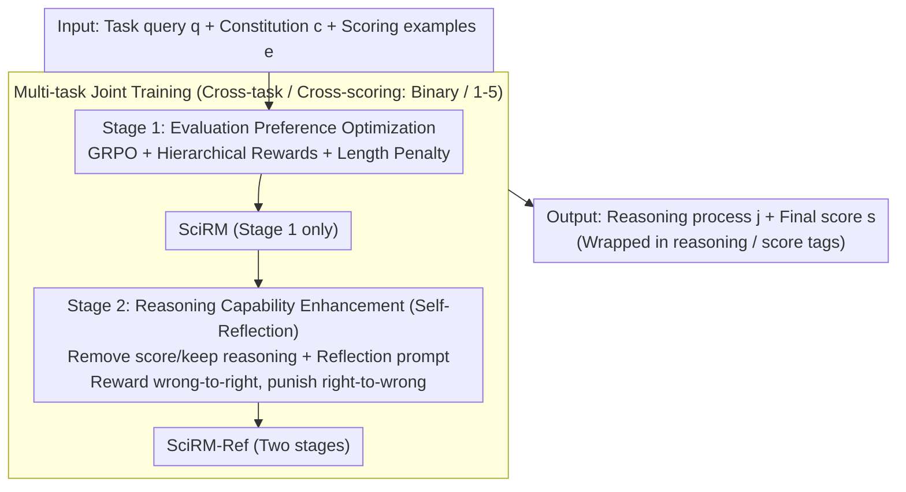

# Reward Modeling for Scientific Writing Evaluation

**Conference**: ACL 2026  
**arXiv**: [2601.11374](https://arxiv.org/abs/2601.11374)  
**Code**: [https://github.com/UKPLab/acl2026-expert-rm](https://github.com/UKPLab/acl2026-expert-rm)  
**Area**: LLM Alignment / Scientific Writing Evaluation  
**Keywords**: Reward Model, Scientific Writing Evaluation, GRPO, Multi-aspect Evaluation, Reasoning Enhancement

## TL;DR

This paper proposes SciRM and SciRM-Ref, two open-source reward models tailored for scientific writing evaluation. By employing two-stage reinforcement learning (GRPO) to optimize evaluation preferences and reasoning capabilities respectively, the models achieve fine-grained multi-aspect evaluation across various scientific writing tasks and demonstrate generalization to unseen evaluation tasks and criteria.

## Background & Motivation

**Background**: LLMs are widely utilized in scientific text generation (e.g., related work writing, review generation, paper revision), yet evaluating these outputs remains an open challenge. The prevailing method is LLM-as-a-judge, which directly uses LLMs for scoring.

**Limitations of Prior Work**: (1) General LLM judges struggle to reason about domain knowledge and task-specific preferences in scientific writing, often producing self-contradictory evaluations; (2) Existing reward models are optimized for general benchmarks (math reasoning, code, helpfulness, etc.) and are unsuitable for the nuanced requirements of scientific writing; (3) Most reward models utilize pairwise comparisons and cannot perform independent evaluations based on explicit criteria; (4) Existing models are optimized for fixed scoring rubrics, with performance declining when criteria change.

**Key Challenge**: Scientific writing evaluation must dynamically adapt to different tasks, aspects, and scoring rubrics (where different aspects of the same text may even have conflicting criteria), but existing models solidify evaluation preferences during training, lacking flexible adaptation at inference time.

**Goal**: Construct open-source scientific writing evaluation reward models that can dynamically adapt to explicit constitutions (evaluation criteria + scoring rules + examples) during inference.

**Key Insight**: Treat evaluation as a conditional generation task where the model receives the constitution as context and explains and follows evaluation criteria through a reasoning process. Two-stage training teaches the model to "score according to criteria" and "reflect on criteria to correct its own reasoning."

**Core Idea**: Train a reward reasoning model using two-stage GRPO: the first stage learns to follow constitutions for evaluation, while the second stage learns reflection and self-correction. Joint multi-task training is used to enhance cross-task generalization.

## Method

### Overall Architecture

SciRM treats scientific writing evaluation as a conditional generation task: the input consists of a task query $q$ (scientific text to be evaluated), evaluation criteria $c$ (constitution, containing scoring rules and descriptions), and scoring examples $e$. The model outputs a reasoning process $j$ wrapped in `<reasoning>` tags and a final score $s$ wrapped in `<score>` tags. Training follows a two-stage GRPO process: Stage 1 teaches the model to score accurately according to the constitution; Stage 2 appends a reflection step, teaching the model to re-examine the criteria and correct its reasoning. Training data is combined across multiple tasks (e.g., binary labels for related work, 1-5 scales for review quality) to achieve cross-task generalization.

### Key Designs

**1. Stage 1: Evaluation Preference Optimization using hierarchical rewards to distinguish error severity**

In this stage, GRPO is used to teach the model to score accurately according to a given constitution. The key is a hierarchical reward function: format errors (no `<score>` tag) receive -0.5, non-numeric outputs receive 0, numbers outside the valid range receive 0.25, valid but incorrect scores receive 0.5, and correct scores receive 1.5. This separates "bad format" from "semantic error," guiding the model toward incremental improvement. Additionally, a length penalty function $f(L,T)$ is introduced to apply quadratic penalties for overly short or long outputs, preventing reward hacking where the model skips reasoning.

**2. Stage 2: Reasoning Capability Enhancement (Self-Reflection) by rewarding "wrong-to-right" and punishing "right-to-wrong"**

Stage 2 takes the output of the Stage 1 model, removes the score while retaining reasoning, and appends a reflection prompt requiring the model to re-evaluate the criteria before providing a final score. The reward considers both the initial score $s_i$ and the final score $s_f$: self-correction ($s_i \neq s^*$ and $s_f = s^*$) receives the highest reward of 1.0, while degradation ($s_i = s^*$ and $s_f \neq s^*$) receives the heaviest penalty of -1.0. This encourages active error correction during reasoning and suppresses unstable oscillating behavior, addressing the issue where constitutional AI internalizes rules into weights and fails to adapt dynamically to new criteria.

**3. Multi-task Joint Training: Avoiding over-fitting to specific patterns across scoring criteria**

Single-task training leads to memorizing specific rubrics, causing performance to collapse when criteria change. This work combines various scientific writing tasks (coherence/location type/location consistency in related work; actionability/grounding/verifiability/helpfulness in review quality) across different scoring systems (binary vs. 1-5 scales). This forces the model to learn "evaluation meta-capabilities" rather than memorizing specific patterns, allowing generalization to unseen evaluation aspects and tasks.

### Loss & Training

Based on Qwen2.5-7B, fine-tuning is conducted via LoRA using GRPO in both stages. Inference uses temperature 1.0 and top-p 0.95. Each experiment is repeated 5 times, reporting mean and standard deviation. The model trained only through Stage 1 is denoted as SciRM, while the two-stage model is SciRM-Ref.

## Key Experimental Results

### Main Results

| Task | SciRM-Ref | Qwen2.5-7B | Qwen3-8B | GPT-5.2 | Prometheus |
|------|-----------|------------|----------|---------|------------|
| Review-Actionability | **Optimal** | Low | Mid | High | Low |
| Review-Verifiability | **Optimal** | Mid | Mid | High | Mid |
| Related Work-Coherence | **Optimal** | Low | Mid | Mid | Low |
| Related Work-Loc. Consist. | **Near-perfect** | Mid | Mid | High | Low |

### Ablation Study (Unseen Aspect/Task Generalization)

| Configuration | Effect | Description |
|------|------|------|
| SciRM-Masked (2 aspects removed) | Outperforms most baselines on unseen aspects | Demonstrates generalization over overfitting |
| Unseen Task - Novelty Eval | 0.71+ alignment acc | Generalizes to completely unseen tasks |
| Unseen Task - Revision Eval | Outperforms most baselines | Effective cross-task transfer |

### Key Findings

- Two-stage training consistently improves performance, with Stage 2 (Reflection) providing the most benefit in tasks requiring strong reasoning.
- SciRM-Masked still outperforms most baselines on unseen aspects, proving the model learns a general structure for evaluation rather than overfitting specific aspects.
- SciRM outperforms general baselines on entirely unseen tasks like novelty evaluation and paper revision evaluation, demonstrating robust generalization.
- Reasoning models like Qwen3 and o3-mini perform exceptionally well on specific aspects (e.g., Grounding), likely due to their inherent reasoning capabilities.

## Highlights & Insights

- The "Constitution-conditioned evaluation" design concept is highly valuable; it does not internalize evaluation criteria into weights but uses them as explicit conditions during inference. This allows the same model to evaluate different tasks using different criteria, significantly enhancing utility.
- The reflection reward design in Stage 2 is ingenious: it looks not only at final correctness but also at whether a correction occurred from an error (reward 1.0) or a degradation from correctness (penalty -1.0), effectively encouraging stable self-correction behavior.
- The hierarchical reward function design can be transferred to other RLHF tasks requiring structured output—applying different penalties based on error severity.

## Limitations & Future Work

- Restricted to a 7B model; larger models may exhibit different scaling behaviors.
- Training data is primarily centered on NLP/ML scientific literature; generalization to other disciplines (e.g., biology, physics) remains unverified.
- Evaluation effectiveness is directly influenced by the quality of the Constitution; low-quality criteria may mislead the model.
- The hyperparameter $k$ for the length penalty requires manual tuning; an adaptive solution might be preferable.

## Related Work & Insights

- **vs Prometheus/Selene**: General LLM-as-judge models not optimized for scientific writing. SciRM significantly outperforms them through domain-specific training data and constitution conditioning.
- **vs DeepSeek-GRM**: A general reward model using pairwise evaluation, which cannot perform pointwise evaluation based on explicit criteria. SciRM's independent multi-aspect evaluation is better suited for scientific writing scenarios.

## Rating

- Novelty: ⭐⭐⭐⭐ First to specialize reward reasoning models for scientific writing evaluation with a novel two-stage training design.
- Experimental Thoroughness: ⭐⭐⭐⭐⭐ Comprehensive coverage of seen/unseen aspects and tasks, multiple baselines, and detailed analysis.
- Writing Quality: ⭐⭐⭐⭐ Clear structure with well-argued motivation.
- Value: ⭐⭐⭐⭐ Provides a practical open-source solution for automated scientific writing evaluation.

<!-- RELATED:START -->

## Related Papers

- [\[ACL 2026\] HoWToBench: Holistic Evaluation for LLM's Capability in Human-level Writing using Tree of Writing](howtobench_holistic_evaluation_for_llms_capability_in_human-level_writing_using_.md)
- [\[ACL 2026\] SciCustom: A Framework for Custom Evaluation of Scientific Capabilities in Large Language Models](scicustom_a_framework_for_custom_evaluation_of_scientific_capabilities_in_large_.md)
- [\[ACL 2026\] Modeling Multi-Dimensional Cognitive States in Large Language Models under Cognitive Crowding](modeling_multi-dimensional_cognitive_states_in_large_language_models_under_cogni.md)
- [\[ACL 2026\] SessionIntentBench: A Multi-Task Inter-Session Intention-Shift Modeling Benchmark](sessionintentbench_a_multi-task_inter-session_intention-shift_modeling_benchmark.md)
- [\[ACL 2026\] ResearchBench: Benchmarking LLMs in Scientific Discovery via Inspiration-Based Task Decomposition](researchbench_benchmarking_llms_in_scientific_discovery_via_inspiration-based_ta.md)

<!-- RELATED:END -->
