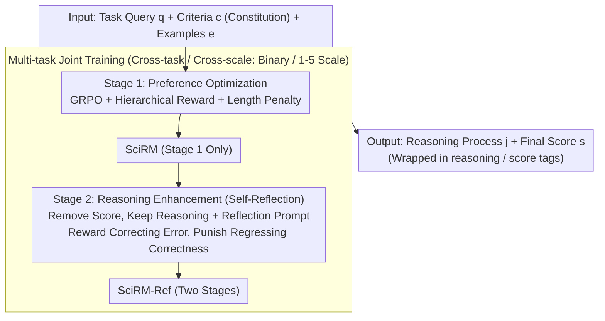

# Reward Modeling for Scientific Writing Evaluation

**Conference**: ACL 2026  
**arXiv**: [2601.11374](https://arxiv.org/abs/2601.11374)  
**Code**: [https://github.com/UKPLab/acl2026-expert-rm](https://github.com/UKPLab/acl2026-expert-rm)  
**Area**: LLM Alignment / Scientific Writing Evaluation  
**Keywords**: Reward Model, Scientific Writing Evaluation, GRPO, Multi-aspect Evaluation, Reasoning Enhancement

## TL;DR

This paper proposes SciRM and SciRM-Ref, two open-source reward models specifically designed for scientific writing evaluation. By employing a two-stage reinforcement learning (GRPO) approach, the models optimize evaluation preferences and reasoning capabilities respectively, achieving fine-grained multi-aspect evaluation across various scientific writing tasks and generalizing to unseen evaluation tasks and criteria.

## Background & Motivation

**Background**: LLMs are widely utilized in scientific text generation (e.g., related work writing, peer review generation, manuscript revision). However, evaluating these outputs remains an open challenge. The most common current approach is LLM-as-a-judge, where LLMs are used directly for scoring and evaluation.

**Limitations of Prior Work**: (1) General LLM judges struggle to reason with domain knowledge and task-specific preferences in scientific writing, often producing self-contradictory evaluations (as shown in Figure 1). (2) Existing reward models are optimized for general benchmarks (mathematical reasoning, code, helpfulness, etc.) and do not cater to the nuanced requirements of scientific writing. (3) Most reward models use pairwise comparisons, which prevents independent evaluation based on explicit criteria. (4) Existing models are optimized for fixed scoring criteria; performance drops significantly when criteria are changed.

**Key Challenge**: Scientific writing evaluation requires dynamic adaptation to different tasks, aspects, and scoring criteria (where different aspects of the same text may even have conflicting criteria). Existing models fix evaluation preferences within their weights, lacking the flexibility to adapt during inference.

**Goal**: Construct open-source reward models for scientific writing evaluation that can dynamically adapt during inference based on an explicit constitution (evaluation criteria + scoring rules + examples).

**Key Insight**: Evaluation is treated as a conditional generation task—the model accepts a constitution as a context condition and explains and follows evaluation criteria through a reasoning process. Two-stage training focuses on teaching the model to "score according to criteria" and "reflect on criteria to correct its own reasoning."

**Core Idea**: A two-stage GRPO approach is used to train reward reasoning models: the first stage focuses on following the constitution for evaluation, while the second stage enhances reflection and self-correction. Multi-task training is incorporated to improve cross-task generalization.

## Method

### Overall Architecture

SciRM treats scientific writing evaluation as a conditional generation task: the input consists of a task query $q$ (the scientific text to be evaluated), evaluation criteria $c$ (constitution, containing scoring rules and criteria descriptions), and scoring examples $e$. The model outputs a reasoning process $j$ wrapped in `<reasoning>` tags and a final score $s$ wrapped in `<score>` tags. Training follows a two-stage GRPO process: Stage 1 teaches the model to accurately score according to the constitution; Stage 2 adds a reflection step to teach the model to revisit criteria and correct its reasoning. Multi-task training across various tasks (binary labels for related work evaluation, 1-5 point scales for review quality) is used to achieve cross-task generalization.

### Key Designs

**1. Stage 1: Preference Optimization with Hierarchical Rewards to Distinguish Error Severity**

In this stage, GRPO is used to teach the model to score accurately based on the given constitution. A hierarchical reward function is designed to distinguish between types of errors: format errors (missing `<score>` tags) receive -0.5, non-numeric outputs receive 0, numeric outputs out of the valid range receive 0.25, valid but incorrect scores receive 0.5, and correct scores receive 1.5. This separates "format failures" from "semantic errors," guiding the model to improve progressively. Additionally, a length penalty function $f(L, T)$ is introduced to prevent reward hacking where the model skips reasoning and only outputs a score.

**2. Stage 2: Reasoning Enhancement (Self-Reflection) — Rewarding "Correction" and Punishing "Regression"**

Stage 2 takes outputs from the Stage 1 model, removes the score while keeping the reasoning, and appends a reflection prompt requiring the model to revisit the criteria before providing a final score. The reward considers both the initial score $s_i$ and the final score $s_f$: self-correction ($s_i \neq s^*$ and $s_f = s^*$) receives the highest reward of 1.0, while regression ($s_i = s^*$ and $s_f \neq s^*$) receives the heaviest penalty of -1.0. This encourages active error correction during reasoning and stabilizes output, addressing the issue where constitutional AI internalizes rules into weights and fails to adapt dynamically to new criteria.

**3. Multi-task Joint Training: Avoiding Overfitting to Specific Patterns**

Single-task training often results in the model memorizing a specific set of criteria, leading to performance collapse when criteria change. This work combines multiple scientific writing tasks (consistency, location type, and grounding consistency in related work evaluation; actionability, grounding, verifiability, and usefulness in peer reviews) and different scoring scales (binary vs. 1-5) for joint training. This forces the model to learn "evaluation meta-capabilities" rather than memorizing patterns, enabling generalization to unseen evaluation aspects and tasks.

### Loss & Training

The models are fine-tuned using LoRA on Qwen2.5-7B, with GRPO applied in both stages. The reasoning temperature is 1.0, top-p is 0.95, and results are reported as the mean and standard deviation across 5 runs. The model trained only in the first stage is referred to as SciRM, while the two-stage model is SciRM-Ref.

## Key Experimental Results

### Main Results

| Task | SciRM-Ref | Qwen2.5-7B | Qwen3-8B | GPT-5.2 | Prometheus |
|------|-----------|------------|----------|---------|------------|
| Review-Actionability | **Best** | Low | Med | High | Low |
| Review-Verifiability | **Best** | Med | Med | High | Med |
| Related Work-Consistency | **Best** | Low | Med | Med | Low |
| Related Work-Grounding | **Near Perfect** | Med | Med | High | Low |

### Ablation Study (Generalization to Unseen Aspects/Tasks)

| Configuration | Effect | Description |
|------|------|------|
| SciRM-Masked (2 aspects removed) | Outperforms most baselines on unseen aspects | Proves generalization rather than overfitting |
| Unseen Task - Novelty Eval | 0.71+ alignment acc | Generalizes to completely unseen tasks |
| Unseen Task - Revision Eval | Outperforms most baselines | Effective cross-task transfer |

### Key Findings

- Two-stage training consistently improves performance; the second stage (reflection) provides the most significant boost for tasks requiring strong reasoning.
- SciRM-Masked continues to outperform most baselines on unseen evaluation aspects, proving that the model learns the general structure of evaluation rather than overfitting to specific aspects.
- On completely unseen novelty evaluation and manuscript revision tasks, SciRM still performs better than general baselines, demonstrating strong generalization.
- Reasoning models like Qwen3 and o3-mini perform exceptionally well in specific aspects (e.g., Grounding), likely due to their inherent reasoning capabilities.

## Highlights & Insights

- The concept of "Constitution-conditioned evaluation" is highly valuable—it treats evaluation criteria as explicit conditions during inference rather than internalizing them into structural weights. This allows the same model to evaluate different tasks using different criteria, significantly enhancing utility.
- The reflection reward design in the second stage is ingenious: it evaluates not just final correctness, but also whether the model corrected an error (1.0 reward) or regressed from a correct answer (-1.0 penalty), effectively encouraging stable self-correction behavior.
- The hierarchical reward function design is transferable to other RLHF tasks requiring structured output, where different penalties can be assigned based on error severity.

## Limitations & Future Work

- Currently based on a 7B model; larger models might exhibit different scaling behaviors.
- Training data is primarily focused on NLP/ML scientific literature; generalization to other disciplines (e.g., biology, physics) remains unverified.
- The quality of the evaluation depends directly on the quality of the constitution; low-quality criteria might mislead the model.
- The $k$ hyperparameter for length penalty requires manual tuning; an adaptive approach might be more effective.

## Related Work & Insights

- **vs Prometheus/Selene**: These are general LLM-as-judge models not optimized for scientific writing. SciRM significantly outperforms them through domain-specific data and constitution-conditioning.
- **vs DeepSeek-GRM**: This is a general reward model using pairwise evaluation, which cannot perform pointwise evaluation based on explicit criteria. SciRM's multi-aspect independent evaluation is better suited for scientific writing scenarios.

## Rating

- Novelty: ⭐⭐⭐⭐ First application of reward reasoning models specifically for scientific writing evaluation; the two-stage training design is novel.
- Experimental Thoroughness: ⭐⭐⭐⭐⭐ Comprehensive coverage of seen/unseen aspects and tasks, multiple baselines, and detailed analysis.
- Writing Quality: ⭐⭐⭐⭐ Clear structure and well-argued motivation.
- Value: ⭐⭐⭐⭐ Provides a practical open-source solution for the automated evaluation of scientific writing.

<!-- RELATED:START -->

## Related Papers

- [\[ACL 2026\] HoWToBench: Holistic Evaluation for LLM's Capability in Human-level Writing using Tree of Writing](howtobench_holistic_evaluation_for_llms_capability_in_human-level_writing_using_.md)
- [\[ACL 2026\] SciCustom: A Framework for Custom Evaluation of Scientific Capabilities in Large Language Models](scicustom_a_framework_for_custom_evaluation_of_scientific_capabilities_in_large_.md)
- [\[ACL 2026\] Modeling Multi-Dimensional Cognitive States in Large Language Models under Cognitive Crowding](modeling_multi-dimensional_cognitive_states_in_large_language_models_under_cogni.md)
- [\[ICLR 2026\] THEMIS: Towards Holistic Evaluation of MLLMs for Scientific Paper Fraud Forensics](../../ICLR2026/llm_evaluation/themis_towards_holistic_evaluation_of_mllms_for_scientific_paper_fraud_forensics.md)
- [\[ACL 2026\] SessionIntentBench: A Multi-Task Inter-Session Intention-Shift Modeling Benchmark](sessionintentbench_a_multi-task_inter-session_intention-shift_modeling_benchmark.md)

<!-- RELATED:END -->
