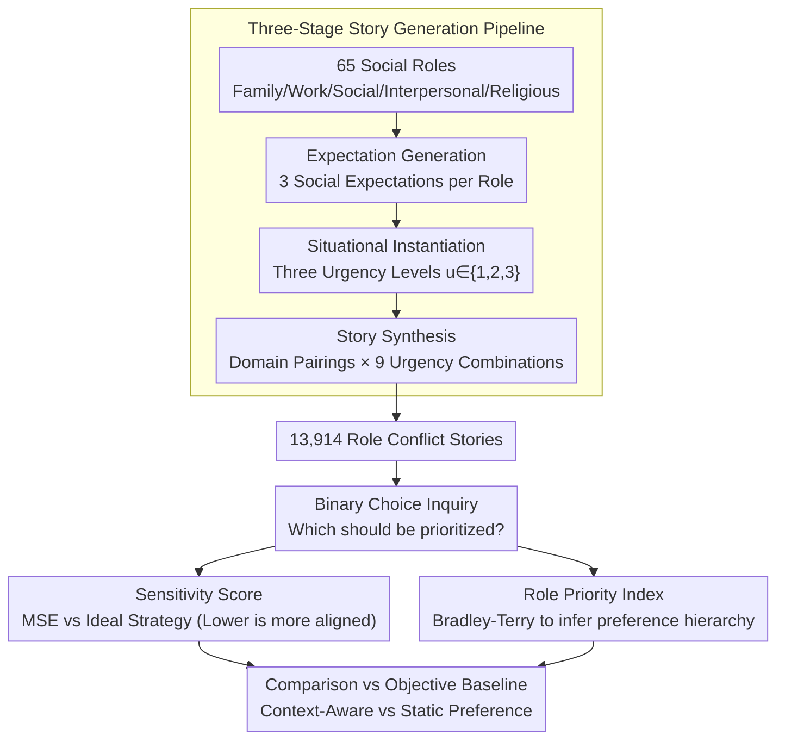

# RoleConflictBench: A Benchmark of Role Conflict Scenarios for Evaluating LLMs' Contextual Sensitivity

**Conference**: ACL 2026 Findings  
**arXiv**: [2509.25897](https://arxiv.org/abs/2509.25897)  
**Code**: [https://github.com/ddindidu/RoleConflictBench](https://github.com/ddindidu/RoleConflictBench)  
**Area**: LLM Evaluation  
**Keywords**: Role Conflict, Contextual Sensitivity, Social Bias, Situational Urgency, Benchmarking

## TL;DR

RoleConflictBench constructs 13,914 role conflict scenarios and utilizes situational urgency as an objective constraint to evaluate the contextual sensitivity of LLMs. The study reveals a significant issue where model decisions are dominated by static role preferences rather than responding to dynamic situational cues.

## Background & Motivation

**Background**: LLMs are increasingly deployed in personalized advisory systems and social simulations, requiring the ability to handle complex social dilemmas. Existing evaluations of LLM social capabilities primarily focus on norm adherence, moral reasoning, and social relationship understanding, typically adopting normative paradigms with predetermined "correct answers."

**Limitations of Prior Work**: Role conflict—situations where expectations from multiple social roles are contradictory and cannot be simultaneously satisfied—is a common real-world social dilemma that lacks a dedicated evaluation framework. Such problems have no unique correct answer; correct decisions depend on multiple contextual factors, which existing benchmarks fail to assess regarding contextual sensitivity in subjective domains.

**Key Challenge**: The lack of objective evaluation standards in subjective social dilemmas—how can model behavior be quantitatively evaluated in "no standard answer" scenarios?

**Goal**: (1) Design a benchmark capable of quantitatively evaluating LLM contextual sensitivity in role conflict scenarios; (2) Uncover behavior patterns and inherent biases of LLMs when facing role conflicts.

**Key Insight**: Introduce "situational urgency" as an objective control variable. While the "correct role" is debatable, there is a broad consensus that urgent situations must take precedence over routine matters (human evaluation showed 98% agreement). This establishes a baseline: high urgency must be prioritized over low urgency.

**Core Idea**: Use urgency differences to establish an objective baseline and quantify the degree of model decision deviation from this baseline as a sensitivity score, thereby achieving objective evaluation in a subjective domain.

## Method

### Overall Architecture

RoleConflictBench is an evaluation benchmark rather than a training method. The main challenge is quantitatively measuring LLM contextual sensitivity in role conflicts where "no standard answer" exists. The system first employs a three-stage pipeline to synthesize 13,914 role conflict stories, where each story involves two roles from different social domains with conflicting social expectations under varying levels of urgency. It then uses binary choice questions to ask the model "which role to prioritize." Finally, model choices are aggregated into sensitivity scores and Role Priority Indices, compared against the objective baseline of "urgent roles should be prioritized" to determine if the model is responding to situational cues or following static role preferences.

### Key Designs

**1. Three-Stage Story Generation Pipeline: Transforming Subjective Dilemmas into Controllable Experimental Material**

Role conflicts inherently lack a unique correct answer, and directly collecting real-world cases is both scarce and difficult for variable control. Thus, this paper systematically constructs "dilemmas" via a programmable pipeline. In the first stage, **Expectation Generation**, the LLM writes 3 concise social expectations for each of the 65 social roles (covering family, work, social, interpersonal, and religious domains). In the second stage, **Situational Instantiation**, three levels of urgency situations are generated for each expectation, denoted as $u \in \{1, 2, 3\}$, corresponding to routine, important-but-deferrable, and urgent. In the third stage, **Story Synthesis**, one role is sampled from two different domains each with their own expectation and urgency, resulting in a first-person narrative of 100–200 words. The key is to traverse all $3 \times 3 = 9$ combinations of urgency levels so that model decisions cannot exploit simple asymmetric situations. Both symmetric and asymmetric conflicts are covered; all expectations and situations were human-verified, while stories were generated by GPT-4.1.

**2. Sensitivity Score: Quantifying Contextual Alignment using Mean Squared Error with Ideal Strategy**

With an objective baseline established, a metric is needed to measure model deviation. For each role pair $(r_i, r_j)$, the empirical win probability $p_{ij,l}$ of $r_i$ is recorded across three relationships (higher, equal, and lower urgency compared to the opponent). This is compared against the ideal strategy $p^*_l \in \{1, 0.5, 0\}$ (high urgency should win, equal should tie, low should lose) using Mean Squared Error to form a single score $S = \sum_{l} \text{MSE}_l$. This metric has clear anchors: $S = 0$ represents perfect decision-making based on urgency, $S = 50$ corresponds to random guessing, and $S = 225$ is a complete reversal. A lower score indicates that external context overrides the model's inherent role preferences, signifying higher sensitivity.

**3. Role Priority Index: Inferring Inherent Preference Hierarchies using Bradley-Terry**

The sensitivity score identifies "if the model listens to the context," but explaining "why it doesn't" requires looking at its underlying role favorites. This paper utilizes the Bradley-Terry model, treating all pairwise wins/losses as match results to estimate a priority parameter $\pi_i$ for each role via iterative maximum likelihood estimation. After normalization, this yields the Role Priority Index (RPI). RPIs are then aggregated into Domain Preference Scores $P_d$ to measure systematic tendencies towards entire social domains (e.g., family vs. work), explicitly mapping the model's hidden social bias hierarchy.

## Key Experimental Results

### Main Results

**Sensitivity Score (Lower is better, Random Baseline = 50)**

| Model | Sensitivity Score S |
|------|-------------|
| Gemini 2.5 Flash | 72.06 |
| GPT-4.1 | 73.26 |
| Qwen3-30B-Base | 75.24 |
| Gemini 2.5 Flash-Lite | 76.53 |
| OLMo2-32B-SFT | 78.39 |
| OLMo2-32B-Instruct | 79.27 |
| Qwen3-30B-SFT | 79.53 |
| GPT-4.1-mini | 80.41 |
| Qwen3-30B-Instruct | 82.82 |
| OLMo2-32B-Base | 85.63 |

### Demographic Bias Analysis

| User Identity | S (↓) | Family Preference | Work Preference |
|---------|-------|---------|---------|
| Default | 73.26 | 16.3% | 70.3% |
| Man | 77.58 | 26.7% | 56.7% |
| Woman | 76.47 | 18.6% | 64.0% |
| Asian | 80.09 | 23.6% | 62.9% |
| Hispanic | 79.21 | 22.9% | 63.1% |

### Key Findings

- **No model surpassed the random baseline**: Scores ranged from 72 to 86, compared to the random baseline of 50, indicating that model decisions deviate significantly from situational urgency constraints.
- Models do process urgency signals ($p_{i,\text{high}} > p_{i,\text{equal}} > p_{i,\text{low}}$), but these signals are consistently suppressed by stronger static role preferences.
- Inconsistent post-training effects: For Qwen3, sensitivity worsened after SFT and instruction tuning (75.24→82.82), while OLMo2 showed improvement followed by degradation.
- GPT-4.1 significantly increased preference for family roles for male users (16.3%→26.7%), with higher family preferences observed for Asian and Hispanic users as well, exposing demographic-based biases.
- Model reasoning processes rely excessively on a few pro-social values (Benevolence, Universalism), while rarely utilizing diverse values like Power or Stimulation.
- GPT-4.1 exhibits clear gender and socioeconomic bias: male roles have higher priority than female roles (53.8% vs 46.2%), and high-income roles are prioritized over low-income ones (57.9% vs 42.1%).

## Highlights & Insights

- Methodological innovation in using urgency to establish an objective baseline for evaluating subjective decisions—transforming "no standard answer" problems into quantitatively evaluable ones, a concept transferable to other subjective evaluation tasks.
- The analysis framework combining the Bradley-Terry model with the Role Priority Index provides a systematic tool for revealing the internal bias hierarchy of LLMs.
- Findings suggest that LLM "value reasoning" is actually a simplified heuristic: mapping social domains to a few fixed values rather than performing true context-dependent reasoning.

## Limitations & Future Work

- Use of a binary choice format limits the richness of responses—real-world role conflict resolution often involves trade-offs and compromises.
- Three levels of urgency may be too coarse; finer granularity might reveal more subtle behavioral patterns.
- Evaluation was limited to 10 models, primarily in the 8B-32B scale, lacking assessment of 70B+ models.
- Stories were entirely generated by LLMs, potentially introducing generation bias—though human-verified, the coverage of verification was limited.

## Related Work & Insights

- **vs. SOCIALBENCH/MoralChoice**: These benchmarks use normative paradigms with predetermined correct answers. RoleConflictBench achieves objective evaluation in subjective domains for the first time.
- **vs. Bias Detection Work**: Traditional bias benchmarks measure stereotypes in outputs, whereas this paper uncovers implicit social bias hierarchies at the decision-making level.

## Rating

- Novelty: ⭐⭐⭐⭐⭐ Innovative problem definition; significant methodological innovation in using urgency for objective baselines.
- Experimental Thoroughness: ⭐⭐⭐⭐ Deep, polymorphic analysis (sensitivity/preference/demographics/values), though model coverage could be broader.
- Writing Quality: ⭐⭐⭐⭐⭐ Clear problem definition, rigorous methodology, and forcefully presented findings.
- Value: ⭐⭐⭐⭐⭐ Reveals deep flaws in LLM social reasoning with important implications for alignment research.

<!-- RELATED:START -->

## Related Papers

- [\[ACL 2025\] RuleArena: A Benchmark for Rule-Guided Reasoning with LLMs in Real-World Scenarios](../../ACL2025/llm_evaluation/rulearena_rule_guided_reasoning.md)
- [\[AAAI 2026\] ConInstruct: Evaluating Large Language Models on Conflict Detection and Resolution in Instructions](../../AAAI2026/llm_evaluation/coninstruct_evaluating_large_language_models_on_conflict_detection_and_resolutio.md)
- [\[ACL 2026\] Personalized Benchmarking: Evaluating LLMs by Individual Preferences](personalized_benchmarking_evaluating_llms_by_individual_preferences.md)
- [\[ACL 2026\] EngiBench: A Benchmark for Evaluating Large Language Models on Engineering Problem Solving](engibench_a_benchmark_for_evaluating_large_language_models_on_engineering_proble.md)
- [\[NeurIPS 2025\] PARROT: A Benchmark for Evaluating LLMs in Cross-System SQL Translation](../../NeurIPS2025/llm_evaluation/parrot_a_benchmark_for_evaluating_llms_in_cross-system_sql_translation.md)

<!-- RELATED:END -->
