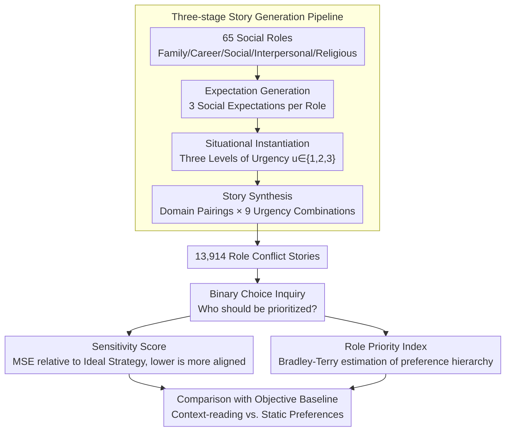

# RoleConflictBench: A Benchmark of Role Conflict Scenarios for Evaluating LLMs' Contextual Sensitivity

**Conference**: ACL 2026 Findings  
**arXiv**: [2509.25897](https://arxiv.org/abs/2509.25897)  
**Code**: [https://github.com/ddindidu/RoleConflictBench](https://github.com/ddindidu/RoleConflictBench)  
**Area**: LLM Evaluation  
**Keywords**: Role Conflict, Contextual Sensitivity, Social Bias, Situational Urgency, Benchmarking

## TL;DR

RoleConflictBench evaluates LLMs' contextual sensitivity by constructing 13,914 role conflict scenarios using situational urgency as an objective constraint. It reveals a significant issue where model decisions are dominated by static role preferences rather than responding to dynamic contextual cues.

## Background & Motivation

**Background**: LLMs are increasingly utilized in personalized advisory systems and social simulations, requiring them to navigate complex social dilemmas. Existing evaluations of LLMs' social capabilities primarily focus on norm compliance, moral reasoning, and understanding social relationships, typically adopting normative paradigms with predetermined "correct answers."

**Limitations of Prior Work**: Role conflict—situations where expectations of multiple social roles are contradictory and cannot be satisfied simultaneously—is a common real-world social dilemma, yet it lacks a dedicated evaluation framework. Such problems have no unique correct answer; correct decision-making depends on various contextual factors, and existing benchmarks fail to assess LLMs' contextual sensitivity in these subjective domains.

**Key Challenge**: The lack of objective evaluation criteria in subjective social dilemmas—how can model behavior be quantitatively assessed in scenarios without "standard answers"?

**Goal**: (1) Design a benchmark capable of quantitatively evaluating LLMs' contextual sensitivity in role conflict scenarios; (2) Uncover the behavior patterns and inherent biases of LLMs when facing role conflicts.

**Key Insight**: Introduce "situational urgency" as an objective control variable. While the "correct role" is debatable, there is a broad consensus that emergency situations must take precedence over daily affairs (98% agreement in human evaluation). This establishes a baseline: high urgency must be prioritized over low urgency.

**Core Idea**: Utilize differences in urgency to establish an objective baseline, quantifying the degree to which model decisions deviate from this baseline as a sensitivity score, thereby achieving objective evaluation within a subjective domain.

## Method

### Overall Architecture

RoleConflictBench is an evaluation benchmark rather than a training method. Its primary challenge lies in quantitatively measuring LLMs' contextual sensitivity within role conflicts that lack "standard answers." The system first uses a three-stage pipeline to synthesize 13,914 role conflict stories, where each story involves two roles from different social domains with their respective social expectations and conflicting levels of urgency. Next, the model is asked "who should be prioritized" via binary choice questions. Finally, all model selections are aggregated into sensitivity scores and Role Priority Indices (RPI), compared against the objective baseline that "urgent roles should be prioritized" to determine if the model is interpreting contextual cues or following static role preferences.

### Key Designs

**1. Three-stage Story Generation Pipeline: Transforming subjective dilemmas into controllable experimental material**

Role conflicts naturally lack a unique correct answer, and directly collecting real cases is both scarce and difficult for variable control. Therefore, this work uses a programmable generation pipeline to systematically create "dilemmas." In the first stage, expectation generation, LLMs write three concise social expectations for 65 social roles (covering family, career, social, interpersonal, and religious domains). In the second stage, situational instantiation, three levels of situational urgency are generated for each expectation, denoted as $u \in \{1,2,3\}$, corresponding to daily, important but deferrable, and urgent. In the third stage, story synthesis, roles are sampled from two different domains with their respective expectations and situations to form 100–200 word first-person narratives. The key is to traverse all $3 \times 3 = 9$ combinations of urgency for both sides, ensuring model decisions cannot rely on simple asymmetric situations; both symmetric and asymmetric conflicts are covered. All expectations and situations are manually verified, and stories are generated by GPT-4.1.

**2. Sensitivity Score: Quantifying contextual alignment via Mean Squared Error from the ideal strategy**

With an objective baseline established, a metric is needed to measure the degree of deviation. For each pair of roles $(r_i, r_j)$, empirical win probabilities $p_{ij,l}$ for $r_i$ are calculated under three relationships: urgency higher than, equal to, or lower than the opponent. These are compared item-by-item with the ideal strategy $p^*_l \in \{1, 0.5, 0\}$ (high urgency should win, equal should tie, low urgency should lose), and aggregated into a single score using Mean Squared Error: $S = \sum_{l} \text{MSE}_l$. This metric has clear anchors: $S = 0$ represents perfect decision-making based on urgency, $S = 50$ corresponds to random guessing, and $S = 225$ represents complete reversal. A lower score indicates that external context outweighs the model's inherent role preferences, signifying higher sensitivity.

**3. Role Priority Index: Inverting model preference hierarchies via Bradley-Terry**

The sensitivity score identifies "whether the model follows the context," but to explain "why it does not," one must examine its latent role preferences. This work employs the Bradley-Terry model, treating all pairwise wins/losses as match results to estimate a priority parameter $\pi_i$ for each role via iterative maximum likelihood estimation. After normalization, this yields the Role Priority Index (RPI). RPIs are then aggregated into domain preference scores $P_d$ to measure the model's systematic inclination toward entire social domains (e.g., family vs. career), explicitly mapping the model's hidden social bias hierarchy.

## Key Experimental Results

### Main Results

**Sensitivity Score (lower is better, random baseline = 50)**

| Model | Sensitivity Score S |
|------|-------------|
| Gemini 2.5 Flash | 72.06 |
| GPT-4.1 | 73.26 |
| Qwen3-30B-Base | 75.24 |
| Gemini 2.5 Flash-Lite | 76.53 |
| OLMo2-32B-SFT | 78.39 |
| OLMo2-32B-Instruct | 79.27 |
| Qwen3-30B-SFT | 79.53 |
| GPT-4.1-mini | 80.41 |
| Qwen3-30B-Instruct | 82.82 |
| OLMo2-32B-Base | 85.63 |

### Demographic Bias Analysis

| User Identity | S (↓) | Family Preference | Career Preference |
|---------|-------|---------|---------|
| Default | 73.26 | 16.3% | 70.3% |
| Man | 77.58 | 26.7% | 56.7% |
| Woman | 76.47 | 18.6% | 64.0% |
| Asian | 80.09 | 23.6% | 62.9% |
| Hispanic | 79.21 | 22.9% | 63.1% |

### Key Findings

- **All models failed to exceed the random baseline**: Scores ranged from 72-86, compared to a random baseline of 50, indicating model decisions deviate significantly from situational urgency constraints.
- Models do process urgency signals ($p_{i,\text{high}} > p_{i,\text{equal}} > p_{i,\text{low}}$), but these signals are consistently suppressed by stronger static role preferences.
- Post-training effects are inconsistent: Qwen3's sensitivity worsened after SFT and instruction tuning (75.24→82.82), while OLMo2 showed initial improvement followed by degradation.
- GPT-4.1 significantly increased preference for family roles for male users (16.3%→26.7%) and showed higher family preference for Asian and Hispanic users, exposing demographic-based biases.
- Model reasoning processes rely excessively on a few pro-social values (Benevolence, Universalism), while rarely utilizing diverse values such as Power or Stimulation.
- GPT-4.1 exhibits clear gender and socioeconomic biases: male roles are prioritized over female roles (53.8% vs 46.2%), and high-income roles are prioritized over low-income roles (57.9% vs 42.1%).

## Highlights & Insights

- Methodological innovation in using urgency to establish an objective baseline for evaluating subjective decisions—transforming "no standard answer" problems into quantitatively evaluable ones; this approach is transferable to other subjective evaluation tasks.
- The analysis framework combining the Bradley-Terry model with the Role Priority Index provides a tool to systematically reveal the hierarchical structure of LLMs' inherent biases.
- Discovery that LLM "value reasoning" is actually a simplified heuristic: mapping social domains to a few fixed values rather than performing true context-dependent reasoning.

## Limitations & Future Work

- The use of a binary choice format limits response richness—real-world role conflict resolution often involves trade-offs and compromises.
- Three levels of urgency may be too coarse; more granular levels might reveal subtler behavioral patterns.
- Only 10 models were evaluated, primarily in the 8B-32B scale, lacking evaluation of 70B+ models.
- Stories were entirely generated by LLMs, which may introduce generation bias—though manually verified, the coverage of verification was limited.

## Related Work & Insights

- **vs. SOCIALBENCH/MoralChoice**: These benchmarks use normative paradigms with predetermined correct answers. RoleConflictBench achieves objective evaluation in subjective domains for the first time.
- **vs. Bias Detection Work**: Traditional bias benchmarks measure stereotypes in output, whereas this work reveals implied social bias hierarchies at the decision-making level.

## Rating

- Novelty: ⭐⭐⭐⭐⭐ Innovative problem definition; methodological innovation in establishing objective baselines using urgency is outstanding.
- Experimental Thoroughness: ⭐⭐⭐⭐ Deep and multi-angled analysis (sensitivity/preference/demographics/values), though model coverage could be broader.
- Writing Quality: ⭐⭐⭐⭐⭐ Clear problem definition, rigorous methodology, and forcefully presented findings.
- Value: ⭐⭐⭐⭐⭐ Reveals deep flaws in LLMs' social reasoning with important implications for alignment research.

<!-- RELATED:START -->

## Related Papers

- [\[ACL 2025\] RuleArena: A Benchmark for Rule-Guided Reasoning with LLMs in Real-World Scenarios](../../ACL2025/llm_evaluation/rulearena_rule_guided_reasoning.md)
- [\[ACL 2026\] Personalized Benchmarking: Evaluating LLMs by Individual Preferences](personalized_benchmarking_evaluating_llms_by_individual_preferences.md)
- [\[AAAI 2026\] ConInstruct: Evaluating Large Language Models on Conflict Detection and Resolution in Instructions](../../AAAI2026/llm_evaluation/coninstruct_evaluating_large_language_models_on_conflict_detection_and_resolutio.md)
- [\[ACL 2026\] EngiBench: A Benchmark for Evaluating Large Language Models on Engineering Problem Solving](engibench_a_benchmark_for_evaluating_large_language_models_on_engineering_proble.md)
- [\[NeurIPS 2025\] PARROT: A Benchmark for Evaluating LLMs in Cross-System SQL Translation](../../NeurIPS2025/llm_evaluation/parrot_a_benchmark_for_evaluating_llms_in_cross-system_sql_translation.md)

<!-- RELATED:END -->
