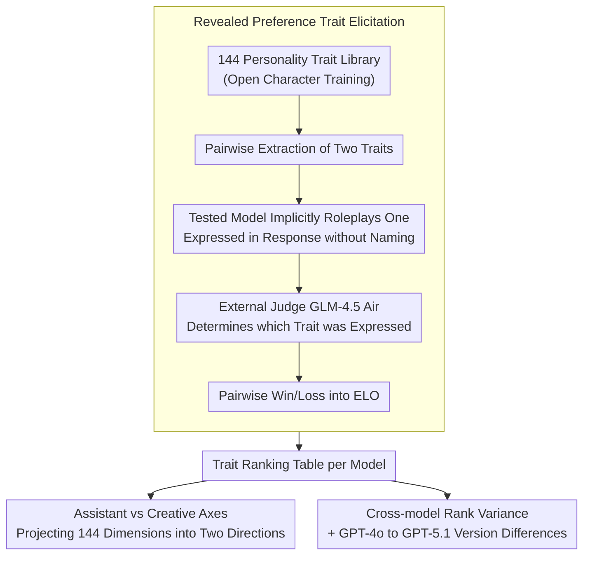

# Same Voice, Different Lab: On the Homogenization of Frontier LLM Personalities

**Conference**: ACL2026  
**arXiv**: [2605.02897](https://arxiv.org/abs/2605.02897)  
**Code**: https://github.com/p3rciv3l/character_elicitation  
**Area**: LLM Evaluation / Human-Computer Interaction / Model Personality  
**Keywords**: LLM personality, trait ELO, personality homogenization, character training, user experience

## TL;DR
This paper uses an external ELO preference evaluation of 144 personality traits to find that nine frontier LLMs, despite originating from different laboratories, generally converge toward a "structured, systematic, and precise" assistant-like personality. Distinctions are primarily concentrated in mid-range stylistic traits such as being poetic or playful.

## Background & Motivation
**Background**: User perception of LLM quality is not solely determined by mathematical, coding, or factual capabilities; it is also highly influenced by the "voice" and personality style of the model. After model updates, users often perceive responses as becoming colder, more mechanical, or less expressive.

**Limitations of Prior Work**: Early research on LLM personality often directly applied human psychological scales like the Big Five or MBTI, or simply asked models for self-descriptions. These methods are susceptible to anthropomorphic assumptions, model fawning tendencies, and construct misalignment, which may not accurately reflect the traits actually expressed during interaction.

**Key Challenge**: While developers pursue helpful, safe, and reliable assistant experiences, converging optimization goals, annotator preferences, and safety constraints may cause frontier models to lose stylistic diversity. In terms of user experience, this manifests as "different labs, the same voice."

**Goal**: The authors aim to measure the revealed preference of different frontier models across a wide range of interactive style traits and answer three questions: whether model personalities are converging; where the primary differences lie; and how model updates within the same company alter personality profiles.

**Key Insight**: Borrowing from the pairwise trait elicitation in Open Character Training, the tested model is prompted to implicitly choose one of two traits for a single-turn conversation without explicitly stating it. An external base model judge then determines which trait was expressed, and these results are aggregated into trait rankings using ELO.

**Core Idea**: Instead of asking a model "what is your personality," reveal its preferences through behavior using mass pairwise trait selections and external judging.

## Method

### Overall Architecture

This paper presents an evaluation framework to measure the "revealed preferences" of nine frontier LLMs regarding interaction styles, rather than their capabilities. The pipeline centers on 144 personality traits from Open Character Training: for each tested model, two candidate traits are provided in a single-turn dialogue, and the model is required to implicitly adopt one style. Subsequently, a neutral judge (GLM-4.5 Air) identifies which trait the response resembles. These pairwise outcomes are fed into ELO calculations. Across nine models (GPT-5.1, Claude Haiku 4.5, Gemini 3 Flash Preview, Qwen3 VL 235B A22B Thinking, DeepSeek-V3.2, Grok 4 Fast, Kimi K2 Thinking, Ministral-14b-2512, Trinity-Mini), a total of 102,560 single-turn responses were generated. Both the harness and data are open-sourced.

### Key Designs

**1. Revealed preference trait elicitation: Inferring personality from behavior rather than self-assessment**  
Directly asking a model about its personality often leads to fawning or echoing scale definitions, yielding a self-description rather than its actual interaction style. This paper utilizes revealed preference: in each round, the model is given two traits and must implicitly manifest one in its response. An external judge looks only at the output to decide which trait was expressed. This measures the model's actual linguistic tendencies, aligning more closely with the behavioral essence of LLMs and avoiding contamination from self-description.

**2. Assistant traits vs. Creative traits axes: Projecting 144 dimensions into interpretable directions**  
It is difficult to interpret user intuition through a raw list of 144 traits. The authors project the trait space onto two opposing axes: the Assistant group (e.g., systematic, structured, precise, methodical, analytical, focused) and the Creative group (e.g., creative, imaginative, poetic, artistic, playful, humorous, bold, visionary). Comparing the average ELO on these axes allows "mechanicalness" or "playfulness" to become quantifiable stylistic orientations.

**3. Cross-model rank variance and version difference analysis: Identifying where convergence and divergence occur**  
To determine if consensus or individuality exists in specific areas of the distribution, the authors calculate the standard deviation of rankings for each trait across the nine models. By layering these by average rank, they identify which traits are industry consensus (low variance) and which retain laboratory-specific characteristics (high variance). Statistically, Spearman correlation measures ranking consistency, while PCA analyzes which trait clusters drive the primary variations. Longitudinal comparisons between GPT-4o and GPT-5.1 further capture style drift across versions.

## Key Experimental Results

### Main Results

| Analysis Item | Result | Meaning |
|:---|:---|:---|
| Inter-model Spearman Correlation | 0.636 to 0.906, Mean 0.763 | Personality rankings across frontier models are highly similar overall. |
| Highest Correlated Model Pair | Claude 4.5 vs GPT-5, $\rho=0.906$ | Models from different labs can converge on nearly identical assistant styles. |
| Lowest Correlated Model Pair | Qwen 3 vs Trinity, $\rho=0.636$ | Some stylistic differences persist between specific models. |
| Mid-range Trait Variance | $\sigma=22.5$ for ranks 51-100 | Personality differences are concentrated in mid-level stylistic features. |
| Style Variance Explanation | 64.2% of inter-model variation | Differences are more about expression style than capability dimensions. |
| Total Responses | 102,560 single-turn responses | Scale is sufficient for trait-level ranking analysis. |

### Ablation Study

While the paper lacks traditional model ablations, it includes several stratified and comparative analyses acting as an analytical table for the evaluation design.

| Analysis Configuration | Key Metric | Description |
|:---|:---|:---|
| Top 20 traits | Mean $\sigma=9.2$ | The most frequently expressed traits (e.g., structured, systematic) are highly converged. |
| Ranks 21-50 | Mean $\sigma=18.5$ | Technicality, detail, and confidence remain relatively consistent. |
| Ranks 51-100 | Mean $\sigma=22.5$ | Mid-range traits like reflective, decisive, and verbose show the most divergence. |
| Ranks 100-144 | Mean $\sigma=15.7$ | Models also converge on traits they avoid, such as being foolish or sycophantic. |
| Creative vs Assistant | Assistant ELO > Creative ELO | Industry default style leans toward structured, objective, and restrained. |
| GPT-4o vs GPT-5.1 | $\rho=0.831$; Poetic rank: 29 $\to$ 124 | Version updates within a series can significantly shift expression styles. |

### Key Findings
- Frontier models consistently favor assistant-like traits (structured, systematic, precise) and suppress undesirable traits (foolish, sycophantic), suggesting an implicit cross-laboratory consensus in character training.
- Personality convergence follows an inverted U-curve: variance is low for the most and least expressed traits, while mid-range traits show the highest variance. A model's "individuality" stems from mid-tier traits like being poetic, contemplative, simplistic, or playful.
- Models from xAI, Alibaba, and Mistral are relatively more "Creative," with Creative ELOs closer to the neutral 1000. GPT-5 has the lowest Creative ELO at 757.
- GPT-5.1 is more professional and conservative compared to GPT-4o: patient (+62 ranks), conservative (+61 ranks), and structured (moved to #1). Conversely, poetic dropped from rank 29 to 124, with idealistic and enthusiastic traits also declining.
- Suppressing sycophancy may drive models toward more structured and restrained styles, potentially at the cost of expressivity and creativity.

## Highlights & Insights
- The use of behavioral preference evaluation instead of human psychological scales is more suitable for LLMs than MBTI or Big Five tests.
- The "inverted U-shaped personality variance" is a powerful explanatory finding: industry consensus shapes the most common and avoided expressions, leaving the middle ground for laboratory-specific style.
- The comparison between GPT-4o and GPT-5.1 translates abstract personality analysis into concrete user perception, explaining why users may feel newer models are "colder" or more "task-oriented."
- The paper serves as a reminder that alignment is not just about safety and factuality, but also a collective optimization of interaction aesthetics and cultural preferences.

## Limitations & Future Work
- The conclusions rely on the GLM-4.5 Air judge; though a base model was chosen to minimize bias, judges may still carry implicit stylistic preferences.
- The experiments only cover single-turn dialogues, whereas personality may shift based on multi-turn context, user persona, task pressure, and memory states.
- The trait list originates from Open Character Training; while extensive, it does not represent the full spectrum of personality, and trait interpretations may vary across cultures.
- Some models used smaller versions to save costs; while the authors argue family traits generalize, model size and product tuning still affect style.
- ELO compresses complex expressions into pairwise rankings, making it difficult to account for combinatorial effects and context dependency.

## Related Work & Insights
- **vs. Big Five / MBTI Testing**: Human scales assume personality constructs that apply to people; LLM outputs do not necessarily satisfy these factor structures. This work focuses on observable response styles.
- **vs. LLM Output Homogenization**: While prior work focuses on content homogenization, this paper shifts the focus toward character training and interaction personality.
- **vs. Open Character Training**: This paper reuses the revealed preference methodology but extends it to a 2026 cross-model comparison and longitudinal GPT analysis.
- **Insight**: Future LLM evaluations should report "capability leaderboards" and "style coordinates" separately, allowing users to understand a model's orientation regarding creativity, restraint, and directness.

## Rating
- Novelty: ⭐⭐⭐⭐☆ The method builds on existing revealed preference frameworks, but the systematic analysis of personality homogenization in frontier models is highly original.
- Experimental Thoroughness: ⭐⭐⭐⭐☆ Covers nine models, 144 traits, and 100k+ responses, though multi-turn and cross-cultural validation remain areas for improvement.
- Writing Quality: ⭐⭐⭐⭐☆ Clear narrative with charts capturing core phenomena; some conclusions still rely on judge-based assumptions.
- Value: ⭐⭐⭐⭐☆ Highly relevant for LLM product experience, evaluation, and character training design.

<!-- RELATED:START -->

## Related Papers

- [\[ICLR 2026\] Same Content, Different Representations: A Controlled Study for Table QA](../../ICLR2026/llm_evaluation/same_content_different_representations_a_controlled_study_for_t.md)
- [\[ICLR 2026\] Measuring LLM Novelty as the Frontier of Original and High-Quality Output](../../ICLR2026/llm_evaluation/measuring_llm_novelty_as_the_frontier_of_original_and_high-quality_output.md)
- [\[ACL 2026\] Stability vs. Manipulability: Evaluating Robustness Under Post-Decision Interaction in LLM Judges](stability_vs_manipulability_evaluating_robustness_under_post-decision_interactio.md)
- [\[ACL 2026\] Statistically Reliable LLM-Based Ranking Evaluation via Prediction-Powered Inference](statistically_reliable_llm-based_ranking_evaluation_via_prediction-powered_infer.md)
- [\[ACL 2026\] BadScientist: Can a Research Agent Write Convincing but Unsound Papers that Fool LLM Reviewers?](badscientist_can_a_research_agent_write_convincing_but_unsound_papers_that_fool_.md)

<!-- RELATED:END -->
