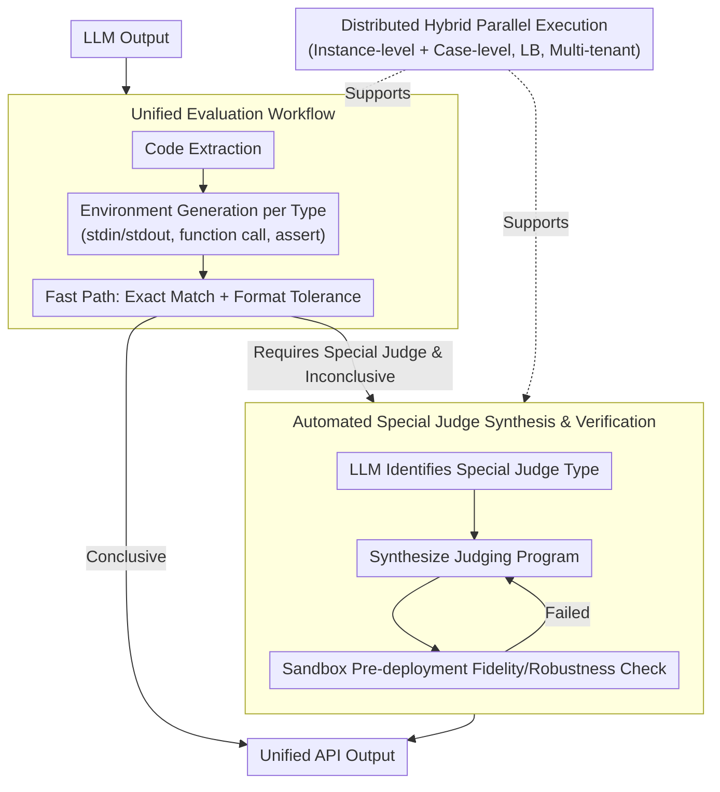

# ScaleBox: Enabling High-Fidelity and Scalable Code Verification for Large Language Models

**Conference**: ACL2026  
**arXiv**: [2604.27467](https://arxiv.org/abs/2604.27467)  
**Code**: https://github.com/icip-cas/ScaleBox  
**Area**: LLM Evaluation / Code Verification / RLVR Infrastructure  
**Keywords**: Code Sandbox, special judge, RLVR, reward noise, distributed evaluation

## TL;DR
ScaleBox improves verification accuracy and throughput in LLM code training and evaluation through automated special judge synthesis, unified verification workflows, and distributed fine-grained parallelism, yielding more stable Pass@1 gains in LiveCodeBench RLVR experiments.

## Background & Motivation
**Background**: Coding capability is a critical direction for LLM training and evaluation. Both benchmarks like HumanEval, MBPP, and LiveCodeBench, and RLVR training rely on sandbox systems to execute model-generated programs and return verifiable feedback.

**Limitations of Prior Work**: Mainstream code sandboxes often use exact match or simple heuristic comparisons. This assumes each problem has a unique standard output, whereas real programming tasks often allow multiple valid solutions, arbitrary valid paths, or floating-point tolerance. Analysis of 34,757 problems shows that 14.57% of tasks require a special judge, and 59.01% of correct reference solutions for these tasks are incorrectly rejected by exact match.

**Key Challenge**: RLVR training requires high-throughput feedback to prevent CPU-side execution from slowing down GPU/NPU utilization; however, high-quality verification cannot rely solely on fast exact matching. If reward signals contain high false negatives, the policy treats correct exploration as failure, damaging training stability and final coding capability.

**Goal**: The authors aim to build a high-fidelity and scalable code verification system supporting various evaluation forms like exact match, function call, assert, and special judge, providing stable and high-throughput feedback for large-scale RL training.

**Key Insight**: ScaleBox tackles the problem at two levels: at the accuracy level, it compensates for exact match defects using automated special judge synthesis and management; at the system efficiency level, it enhances CPU-side throughput via multi-node deployment and mixed instance-level and test-case-level parallelism.

**Core Idea**: The critical bottleneck in code RL lies not just with the model but in the reward infrastructure; if the verifier is both inaccurate and slow, the resulting policy is limited by both incorrect rewards and system throughput.

## Method

### Overall Architecture

ScaleBox is a distributed sandbox system for large-scale code training and evaluation, addressing two long-neglected bottlenecks in code RL: verifier inaccuracy (exact match misjudging valid alternative solutions) and slow execution (CPU execution lagging behind GPU/NPU). Built upon the SandboxFusion execution base, it adds three capabilities: end-to-end evaluation workflows, distributed deployment, and special judge support. The data flow for a single verification involves: extracting code from LLM output, generating the corresponding execution environment by problem type, and first attempting a "fast path" using lightweight exact match with common format tolerance rules; only when a problem is identified as requiring a special judge and preliminary checks are inconclusive is the programmable judging logic invoked. At the system level, NGINX load balancing, Docker health checks, multi-tenant workers, and test-case-level parallelism support the high concurrency required for RL training.

### Key Designs

**1. Unified Evaluation Workflow: Converging Heterogeneous Benchmarks and Output Formats into a Single Interface**

LLM output formats vary wildly, and test conventions across benchmarks differ significantly. Configuring a separate script for each dataset is error-prone and hard to reproduce. ScaleBox sequences request routing, code extraction, test case distribution, parallel execution, and multi-stage verification into a fixed pipeline, automatically identifying test forms (stdin/stdout, function call, assert) and generating execution wrappers. This unified entry point allows HumanEval, MBPP, LiveCodeBench, and AetherCode to share the same logic, reducing script fragmentation and improving reproducibility.

**2. Automated Special Judge Synthesis and Verification: Scaling High-Fidelity Rewards**

The paper notes that 14.57% of 34,757 problems require a special judge, and 59.01% of correct solutions for these are wrongly rejected by exact match—a primary source of RL reward noise. Manual special judge authoring is accurate but cannot cover thousands of training samples. ScaleBox uses a three-stage automated synthesis: first, an LLM determines if a problem belongs to a special judge type (e.g., multiple valid outputs, numerical tolerance); then, a judging program is synthesized; finally, fidelity and robustness checks are performed in a sandbox using known correct and incorrect solutions. This division—LLM for coverage and sandbox for quality control—allows high-fidelity rewards to scale while filtering out poor judging code before deployment.

**3. Distributed Hybrid Parallel Execution: Mitigating Host-Accelerator Imbalance in RL Training**

Code RL generates bursty, high-frequency verification requests. Queueing at the problem instance level wastes CPU resources and slows training. ScaleBox adds test-case-level parallelism, allowing multiple test cases for a single problem to execute simultaneously, significantly reducing latency. Multi-node coordination via load balancing, multi-tenant worker support, and a real-time monitoring dashboard ensure high-fidelity rewards do not come at the cost of throughput.

### Loss & Training

ScaleBox is a verification system and does not propose a new loss function. In its validation RL experiments, the authors use Qwen3-8B non-thinking as the base policy with GRPO in the verl framework. Training data is sourced from PrimeIntellect/verifiable-coding-problems, filtering 26K Python problems. Among these, 2.8K are identified as requiring special judges, with 1.2K forming a critical subset where "exact match rejects reference solutions but special judge validates them correctly," used to isolate the impact of reward fidelity.

## Key Experimental Results

### Main Results

| Experiment | Metric | Result | Description |
|--------|------|------|------|
| EM Vulnerability Analysis | Ratio of problems needing SPJ | 14.57% / 34,757 | Multi-solution or float tolerance types |
| EM False Negative | Ratio of correct solutions rejected | 59.01% | Source of reward noise |
| Single-node Efficiency | ScaleBox 39.31 tasks/s | verl Prime: 24.73, SandboxFusion: 14.92 | 1.59× faster than verl, 2.63× faster than SandboxFusion |
| Tri-node Efficiency | 62.10 tasks/s | 2.51× relative to single-node verl | Demonstrates multi-node scalability |
| Special Judge Fidelity | TPR $\ge$ 90.0%, TNR $\ge$ 84.0% | 27 complex problems, 529 submissions | Synthesized judges are generally reliable |

### Ablation Study

| Training Set | Reward Type | LCB-v5 Pass@1 | LCB-v6 Pass@1 | Description |
|------|---------|------|------|------|
| Base Model | - | 25.09 | 27.21 | Qwen3-8B initial policy |
| 1.2K SPJ subset | w/o SPJ (EM) | 27.24 | 27.94 | EM rewards contain heavy false negatives |
| 1.2K SPJ subset | w/ SPJ (Ours) | 33.15 | 32.35 | LCB-v5 Gain +5.91, LCB-v6 Gain +4.41 |
| 26K full dataset | w/o SPJ (EM) | 37.19 | 34.12 | Large-scale mixed training |
| 26K full dataset | w/ SPJ (Ours) | 38.17 | 36.03 | Even with ~10% SPJ tasks, LCB-v6 Gain +1.91 |

### Key Findings
- Special judges are not just evaluation refinements but alter RL reward density. For the 1.2K critical subset, EM treats valid exploration as failure, whereas SPJ significantly improves training rewards and final Pass@1.
- High-fidelity rewards improve training stability. Visualizations show the SPJ-enhanced model maintaining a performance lead, indicating cleaner rewards reduce credit assignment variance.
- System efficiency and verification accuracy must be optimized simultaneously. High accuracy with low throughput slows RL, while high speed with EM noise limits model potential.
- The one-click workflow supports benchmarks like HumanEval, MBPP, HumanEval+, MBPP+, LiveCodeBench, and AetherCode, proving it is not customized for a single dataset.

## Highlights & Insights
- The paper clearly identifies the "reward infrastructure" problem in code RL: model quality is directly capped by the verifier's false negative rate, a factor often underestimated in algorithmic papers.
- The three-stage special judge synthesis balances automation and quality control. LLMs provide coverage, while sandbox verification filters low-quality judges before deployment.
- Short-circuit verification is a practical engineering compromise: samples that can be judged by simple rules pass through a fast path, while complex samples use higher-cost judging logic.
- The experiments simultaneously demonstrate system throughput, judging accuracy, and RL performance, proving ScaleBox's value lies not just in "speed" but in generating more useful training signals.

## Limitations & Future Work
- Large-scale verification currently focuses on specific model scales, Python tasks, and mainstream benchmarks; multi-language and larger-scale RL training require further validation.
- Automated special judges depend on LLM synthesis and filtering; while TPR/TNR is high, errors may occur in complex interactive problems or those with hidden constraints.
- The system focuses on code training and benchmark evaluation, with limited extension to multi-turn code agents, automated software engineering, or long-horizon task environments.
- Although the ~10% SPJ coverage in the full dataset yielded significant gains, benefits depend on the proportion of complex problems in the dataset.
- The paper does not deeply discuss sandbox security isolation or resource abuse prevention boundaries; production deployment requires additional security assessment.

## Related Work & Insights
- **vs SandboxFusion**: SandboxFusion provides the execution foundation, but ScaleBox emphasizes high concurrency, multi-node scaling, and native special judge support for RL.
- **vs verl native execution**: verl supports RL workflows but has lower throughput; ScaleBox eases CPU-side bottlenecks through hybrid parallelism and batching.
- **vs Manual Special Judge**: Manual judges are accurate but not scalable; ScaleBox expands coverage through automated synthesis and pre-verification.
- **vs EM / Heuristic Matching**: EM is fast but systematically rejects correct programs in multi-solution problems; ScaleBox's core value is incorporating "semantic correctness" into verifiable rewards.
- **Insight**: For code model training, future algorithmic improvements should report reward verifier fidelity; otherwise, performance differences might stem from evaluation noise rather than model learning.

## Rating
- Novelty: ⭐⭐⭐⭐☆ High system integration; combining automated special judge synthesis with RLVR infrastructure is valuable, though individual components are not entirely ground-up.
- Experimental Thoroughness: ⭐⭐⭐⭐☆ Solid evidence across efficiency, fidelity, and RL performance; needs more languages and larger-scale training.
- Writing Quality: ⭐⭐⭐⭐☆ Clear problem definition and architecture; convincing experimental data.
- Value: ⭐⭐⭐⭐⭐ Extremely practical for code LLM training and evaluation infrastructure, particularly for reducing reward noise.

<!-- RELATED:START -->

## Related Papers

- [\[ICLR 2026\] AutoCodeBench: Large Language Models are Automatic Code Benchmark Generators](../../ICLR2026/llm_evaluation/autocodebench_large_language_models_are_automatic_code_benchmark_generators.md)
- [\[ACL 2025\] CodeMEnv: Benchmarking Large Language Models on Code Migration](../../ACL2025/llm_evaluation/codemenv_benchmarking_large_language_models_on_code_migration.md)
- [\[ACL 2026\] Zero-shot Large Language Models for Automatic Readability Assessment](zero-shot_large_language_models_for_automatic_readability_assessment.md)
- [\[ACL 2026\] NovBench: Evaluating Large Language Models on Academic Paper Novelty Assessment](novbench_evaluating_large_language_models_on_academic_paper_novelty_assessment.md)
- [\[ACL 2026\] Question Difficulty Estimation for Large Language Models via Answer Plausibility Scoring](question_difficulty_estimation_for_large_language_models_via_answer_plausibility.md)

<!-- RELATED:END -->
