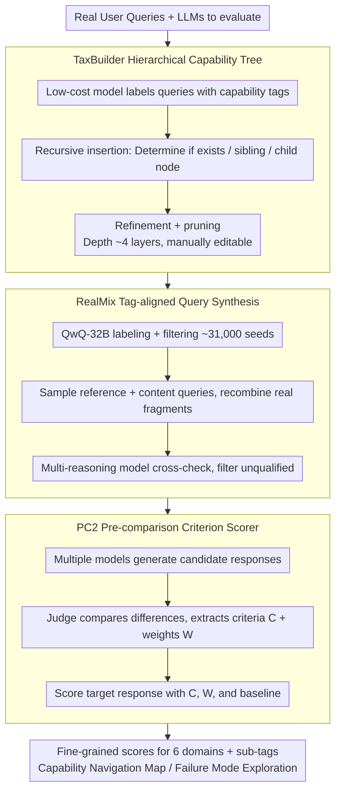

# SCAN: Structured Capability Assessment and Navigation for LLMs

**Conference**: ACL2026  
**arXiv**: [2505.06698](https://arxiv.org/abs/2505.06698)  
**Code**: https://github.com/liudan193/SCAN  
**Area**: LLM Evaluation / Capability Profiling  
**Keywords**: Fine-grained evaluation, capability taxonomy tree, synthetic evaluation data, LLM-as-a-Judge, model diagnosis

## TL;DR
SCAN advances LLM evaluation from a single leaderboard to a navigable capability profile: it automatically constructs a hierarchical capability taxonomy, generates realistic queries covering long-tail capabilities using RealMix, and improves automatic scoring reliability via the PC2 judge. This reveals fine-grained strengths and weaknesses across 21 mainstream LLMs that are otherwise masked by total scores.

## Background & Motivation
**Background**: LLM evaluation has long relied on leaderboard-style benchmarks like Chatbot Arena, MT-Bench, and AlpacaEval. These facilitate model releases and horizontal comparisons by providing overall rankings and approximating human preferences with a limited number of automatic evaluation samples.

**Limitations of Prior Work**: Leaderboards answer "who is stronger," but developers truly need to know "in which capabilities is this model strong, in which sub-capabilities is it weak, and are these weaknesses locatable." For instance, a model might achieve a high total score but perform inconsistently in Java, C, bioengineering knowledge, or role-playing; a single average score flattens these local failures.

**Key Challenge**: Fine-grained evaluation requires covering a vast array of capability tags, yet long-tail tags often lack sufficient samples. Furthermore, automatic scoring needs to scale across many models and questions, but classic pointwise judges are unreliable, and pairwise judges suffer from quadratic complexity. SCAN aims to simultaneously solve the issues of "broad coverage," "fine granularity," "sufficient samples," "accurate scoring," and "interpretable navigation."

**Goal**: The authors aim to construct a framework that starts from real user queries, automatically generates a capability taxonomy tree, supplements evaluation queries for each tag, and visualizes results as a capability map. Instead of just viewing a rank, users can drill down into the capability tree to identify specific shortcomings.

**Key Insight**: The paper observes that real user queries contain substantial capability signals, such as "Python programming," "Physics Q&A," or "Role-playing setup." Rather than manually enumerating capability dimensions, it is better to extract tags from real queries and organize them into a tree structure. Instead of randomly synthesizing tasks, content fragments from real queries are recombined under designated tags.

**Core Idea**: Replace static leaderboards with a "real-query-driven capability tree + tag-aligned data synthesis + pre-comparison criterion-extracted judge" to transform evaluation results into a searchable, diagnostic, and scalable model capability profile.

## Method

SCAN is an evaluation pipeline mapping "real user needs" to a "model capability navigation map," aiming to replace single leaderboards with drill-down, diagnostic profiles. It utilizes TaxBuilder to organize a hierarchical capability tree from massive real queries, RealMix to supplement realistic evaluation questions for each tag, and the PC2 scorer to grade model responses at a scalable cost, ultimately summarizing fine-grained strengths and weaknesses across six domains and their sub-tags.

### Overall Architecture

The input consists of a batch of real user queries and a set of LLMs to be evaluated. The output includes fine-grained scores, rankings, and failure modes for each model across six domains: writing, roleplay, knowledge, coding, mathematics, and reasoning. The system is organized into three layers: the taxonomy layer (TaxBuilder) inserts unstructured query tags into an editable hierarchical tree; the data layer (RealMix) uses real query fragments and tag constraints to synthesize evaluation queries, ensuring statistical significance for every tag; and the evaluation/navigation layer (PC2) uses query-specific criteria derived from pre-comparison to score responses, presenting results as a searchable capability map. SCAN-V0 comprises 2,082 tags and 3,343 evaluation queries, assessing 21 mainstream LLMs.

### Key Designs

**1. TaxBuilder Hierarchical Capability Tree: Decomposition of Tree Construction into Local Judgments**

If an LLM tries to position a new tag within a massive tree directly, the context becomes excessively long and reasoning harder. TaxBuilder first uses a low-cost model to assign capability tags to real queries, then inserts new tags one by one. Instead of processing the whole tree, it recursively traverses nodes at the current level, asking the LLM to judge only three relationships: whether the tag already exists, should be a sibling at the current level, or should be a child node. Thus, the long-context problem is decomposed into a sequence of short-context local decisions.

Three cleanup stages are then applied: node refinement to correct parent-child relationships, node pruning to split tags mixing multiple concepts, and hierarchical pruning to merge duplicate nodes while maintaining a depth of approximately 4 layers. The tree remains expandable by LLMs while providing entry points for human audit and editing.

**2. RealMix Tag-aligned Query Synthesis: Controllable Recombination of Real Content**

Long-tail capability tags often lack ready-made evaluation questions. Reusing existing data risks insufficient coverage or contamination, while random tag combinations can create unrealistic tasks. RealMix uses QwQ-32B to label domain, tags, and quality for real user queries, filtering approximately 31,000 high-quality seeds. During synthesis, it samples one reference query and three content queries, tasking the generator to extract appropriate real content fragments and recombine them into a new query matching the reference tag.

Post-generation, multiple reasoning models cross-check tag consistency and quality, filtering out unqualified samples. These synthesized questions inherit the content and tag distribution of real queries while directionally filling long-tail gaps, making them more realistic than template-based tasks.

**3. PC2 Pre-comparison Criterion Scorer: Pairwise Reliability at Pointwise Cost**

Pairwise evaluation is reliable because comparisons expose differences between responses; pointwise evaluation is often inaccurate due to the lack of a reference. PC2 brings the "discovery of differences" forward: for a single instruction, it generates candidate responses from multiple models. A judge then compares these to extract query-specific scoring criteria $C$ and weights $W$, constrained by $\sum_i w_i = 100$, formally expressed as $J(\{y^1,\dots,y^n\}\mid x,p_c,p_w)$ outputting the set $C$ and $W$.

During formal scoring, the judge is no longer isolated. It scores the target response using criteria $C$, weights $W$, and a reference evaluation of a baseline answer $y_b$, i.e., $J(y\mid x,p_c,y_b,C,W)\to s$. This retains the sensitivity to differences found in pairwise evaluation while avoiding the quadratic complexity of comparing all model pairs, allowing the evaluation to scale to more models and questions.

## Key Experimental Results

### Main Results
The data scale of SCAN-D-V0 demonstrates that it is not just a small prompt set, but a fine-grained evaluation suite structured around a capability tree.

| Domain | Samples | Tags | Min Samples per Tag | Avg Length |
|------|--------|--------|----------------|----------|
| Writing | 1,108 | 594 | 19 | 772.57 |
| Roleplay | 470 | 429 | 19 | 1008.46 |
| Knowledge | 540 | 315 | 20 | 608.57 |
| Coding | 636 | 369 | 19 | 1232.03 |
| Mathematics | 344 | 189 | 20 | 817.02 |
| Reasoning | 245 | 186 | 19 | 904.81 |
| Total | 3,343 | 2,082 | 19 | 880.92 |

The PC2 judge significantly outperforms naive pointwise evaluation across various judge backbones, indicating that "extracting criteria before scoring" is effective regardless of the specific model.

| Judge / Method | Accuracy |
|--------------|----------|
| Deepseek-R1 naive | 0.5694 |
| Deepseek-R1 direct metric decomposition | 0.6134 |
| Deepseek-R1 diverse pre-comparison | 0.6466 |
| Deepseek-R1 ours | 0.6962 |
| Qwen3-32B naive | 0.5181 |
| Qwen3-32B ours | 0.6535 |
| Claude-3.7-Sonnet naive | 0.5959 |
| Claude-3.7-Sonnet ours | 0.7453 |
| GPT-4.1 naive | 0.6116 |
| GPT-4.1 ours | 0.7201 |

### Ablation Study
The core ablation of the paper focuses on the components of PC2. Using Deepseek-R1 as the judge, accuracy improves step-by-step from naive pointwise to diverse pre-comparison to the full method.

| Configuration | Accuracy | Description |
|------|----------|------|
| naive pointwise | 0.5694 | Scoring responses in isolation, lacks comparison reference |
| direct metric decomposition | 0.6134 | Judge splits scoring dimensions directly, moderate improvement |
| metric decomposition (single model) | 0.5974 | Single-model pre-comparison is not diverse enough, limited gain |
| metric decomposition (diverse model) | 0.6466 | Multiple model responses provide richer differences |
| ours | 0.6962 | Best performance after adding criteria weights and baseline answer |

### Key Findings
- Fine-grained analysis reveals "capability peaks" hidden by total scores. GPT-OSS-120B shows strong overall performance but ranks only 7th in roleplay; GPT-OSS-20B is weaker overall but ranks 2nd in coding.
- Programming capability cannot be judged by target coding scores alone. GPT-OSS-120B is strong in Python, JavaScript, Go, and Rust, but weaker in C and Java; GPT-OSS-20B ranks 2nd in Python and Rust, exceeding the 120B version in C and C#.
- Knowledge domains also show significant non-uniformity. GPT-OSS-120B ranks 1st in computer science and aerospace engineering within technical engineering, but drops to 11th in bioengineering, suggesting local gaps in pre-training knowledge coverage.

## Highlights & Insights
- The most valuable contribution of this paper is shifting the evaluation object from "model rankings" to a "capability terrain map." This perspective is more practical for model development, where training data ratios, post-training strategies, and deployment scenarios require knowledge of specific weaknesses rather than average scores.
- TaxBuilder's recursive insertion is simple yet effective. It avoids requiring the LLM to comprehend the entire capability tree at once, treating tree construction as local decisions, which facilitates the continuous integration of new tasks, domains, and user needs.
- RealMix reflects a sound principle for evaluation data synthesis: do not create questions out of thin air; instead, perform controllable recombination on real user content. This reduces data contamination risks and remains closer to real usage scenarios than pure template-based questions.
- PC2 provides strong inspiration: the advantages of pairwise evaluation do not necessarily require quadratic complexity; the key is first identifying "where the differences in this specific query lie." this approach can be migrated to safety, factuality, or long-context evaluations requiring query-specific rubrics.

## Limitations & Future Work
- The authors state that SCAN currently focuses on language models and does not support multimodal models. Capability tags and data synthesis mechanisms need expansion for VLMs, embodied AI, or audio models; the paper mentions exploring SCAN-Anything in the future.
- Current implementation does not cover mechanism-based evaluations like safety, honesty, factuality, hallucination, or fairness. These dimensions often represent behavioral constraints rather than task capabilities and require additional taxonomy and judge designs.
- Automatic tree construction still relies on LLM labeling and judgment, potentially inheriting model biases. While pruning and manual editability mitigate this, the correctness of the tree structure itself requires continuous auditing.
- Evaluation queries derived from synthesis, even with RealMix using real query fragments, may not fully represent high-risk deployment scenarios. Future work could integrate online failure cases, user feedback, and red-teaming samples into the capability tree.

## Related Work & Insights
- **vs Chatbot Arena**: Chatbot Arena provides trusted rankings through massive human preferences; SCAN provides fine-grained capability profiles with smaller, structured datasets. The former is suitable for macro comparisons, while the latter is better for model diagnosis and training feedback.
- **vs AlpacaEval / MT-Bench**: These automatic evaluations focus more on overall instruction following or multi-turn dialogue. SCAN emphasizes extracting tags from real queries and deconstructing performance along a capability tree, providing higher interpretability.
- **vs pairwise LLM-as-a-Judge**: Pairwise is more reliable but costly. PC2 moves the "difference discovery" phase of pairwise to criterion extraction and then scores in a pointwise format, making it more feasible for large-scale evaluation.
- **Insight**: For any system where "average metrics mask local failures," one can learn from SCAN: first build a task taxonomy, then ensure each node has sufficient samples, and finally present results as a navigable failure map.

## Rating
- Novelty: ⭐⭐⭐⭐☆ Not the first automatic evaluation framework, but it combines taxonomy, synthetic data, PC2 judge, and diagnostic visualization into a complete evaluation paradigm.
- Experimental Thoroughness: ⭐⭐⭐⭐☆ Data scale, judge comparisons, and analysis of 21 models are solid, though more granular human evaluation and cross-domain validation could be strengthened.
- Writing Quality: ⭐⭐⭐⭐☆ Motivation is clear, and diagrams provide good support; appendix information is extensive, with some fine-grained results requiring reference to the project page.
- Value: ⭐⭐⭐⭐⭐ Highly practical for model developers, especially for shifting from "leaderboard optimization" to "weakness positioning and data loops."

<!-- RELATED:START -->

## Related Papers

- [\[ACL 2026\] Exploring the Capability Boundaries of LLMs in Mastering of Chinese Chouxiang Language](exploring_the_capability_boundaries_of_llms_in_mastering_of_chinese_chouxiang_la.md)
- [\[ACL 2026\] TaxPraBen: A Scalable Benchmark for Structured Evaluation of LLMs in Chinese Real-World Tax Practice](taxpraben_a_scalable_benchmark_for_structured_evaluation_of_llms_in_chinese_real.md)
- [\[ACL 2026\] Zero-shot Large Language Models for Automatic Readability Assessment](zero-shot_large_language_models_for_automatic_readability_assessment.md)
- [\[ACL 2026\] NovBench: Evaluating Large Language Models on Academic Paper Novelty Assessment](novbench_evaluating_large_language_models_on_academic_paper_novelty_assessment.md)
- [\[ACL 2026\] LLMs as annotators of credibility assessment in Danish asylum decisions: evaluating classification performance and errors beyond aggregated metrics](llms_as_annotators_of_credibility_assessment_in_danish_asylum_decisions_evaluati.md)

<!-- RELATED:END -->
