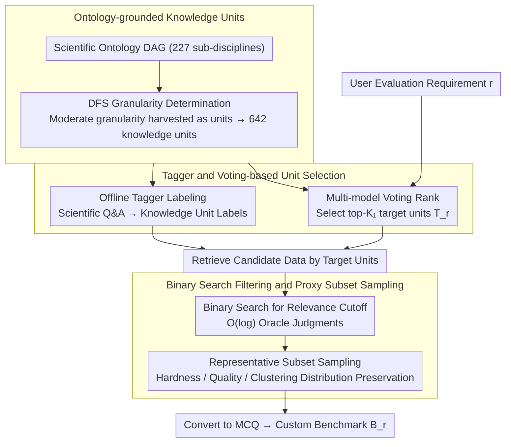

# SciCustom: A Framework for Custom Evaluation of Scientific Capabilities in Large Language Models

**Conference**: ACL2026  
**arXiv**: [2605.19357](https://arxiv.org/abs/2605.19357)  
**Code**: https://github.com/yjwtheonly/SciCustom  
**Area**: LLM Evaluation / Scientific Evaluation / Automated Benchmark Construction  
**Keywords**: Scientific LLM evaluation, custom benchmark, ontology, knowledge units, ranking consistency

## TL;DR
SciCustom decomposes scientific evaluation requirements into reusable ontological knowledge units and automatically constructs domain-specific benchmarks via a tagger, multi-model voting, binary-search relevance filtering, and proxy subset selection, achieving the highest Spearman rank consistency across 10/11 chemistry and medical subtasks.

## Background & Motivation
**Background**: LLMs are being utilized in scientific research for tasks ranging from literature comprehension and experimental hypothesis generation to medical and chemical Q&A. Users typically prioritize a model's performance in specific application scenarios—such as technical chemistry, drug discovery, or clinical knowledge—rather than its average score on a broad scientific benchmark.

**Limitations of Prior Work**: General benchmarks like GPQA, MMLU-Pro, or SimpleQA do not necessarily predict model performance on specialized scientific tasks; manual benchmark customization is costly and iterates slowly; direct LLM synthesis of questions often lacks grounded validity, making it difficult to ensure scientific facts originate from reliable data.

**Key Challenge**: Scientific tasks are both highly interdisciplinary and require factual grounding. Constructing a benchmark from scratch for every new requirement leads to redundant effort, while simple semantic retrieval or synthetic questions fail to precisely capture which specific scientific knowledge a requirement entails.

**Goal**: The authors aim to build a framework that requires no expert annotation and no purely synthetic questions to automatically generate application-specific scientific benchmarks based on user needs, such that the generated benchmarks can replicate the rankings of 10 LLMs produced by expert benchmarks.

**Key Insight**: SciCustom operates on the hypothesis that complex scientific applications can be approximated as combinations of several fine-grained knowledge units. By pre-mapping large-scale scientific Q&A data to these knowledge units, these units can be reused to dynamically construct benchmarks when new requirements arise.

**Core Idea**: Organize data using a scientific ontology offline, and then retrieve, filter, and sample grounded data using demand-related knowledge units online to convert them into multiple-choice questions for efficient evaluation.

## Method
SciCustom consists of two stages: offline indexing and online construction. In the offline stage, knowledge units of moderate granularity are extracted from scientific ontologies, and a tagger is trained to map large-scale scientific Q&A to these units. In the online stage, user requirements are received; multi-model voting identifies relevant units, followed by binary search filtering and proxy selection to generate a small yet discriminative benchmark.

### Overall Architecture
The input consists of a user evaluation requirement $r$ and a large scientific corpus $\mathcal{D}$, and the output is the corresponding benchmark $\mathcal{B}_r$. The framework first converts an ontology DAG of 227 scientific sub-disciplines into 642 knowledge units; it then uses a tagger to assign knowledge unit labels to each data instance. When a user submits a requirement, multiple LLMs vote to rank knowledge unit relevance, selecting target units. The system retrieves candidate data from the tagged corpus, uses binary search to find a relevance cutoff, and samples a representative proxy subset, finally converting the original Q&A into automatically evaluable MCQs.

### Key Designs

**1. Ontology-grounded Knowledge Units: Using Ontologies to Partition Scientific Capabilities into Reusable Semantic Skeletons**

Building a benchmark from scratch for every requirement reinvent the wheel, while incorrect granularity leads to failure—overly coarse concepts cannot distinguish specialized capabilities, while overly fine concepts are hard to reuse. SciCustom integrates multiple authoritative scientific ontologies to create a DAG covering 227 sub-disciplines, then traverses each node using DFS. LLMs judge the granularity: nodes judged as "coarse" are explored further, "moderate" nodes are harvested as knowledge units, and "fine" nodes are pruned. This results in 641 scientific units plus one "Non-Scientific" unit. This granularity, roughly equivalent to "textbook chapter titles," can explain a specific capability while allowing multiple units to combine into new requirements.

**2. Tagger and Voting-based Unit Selection: Archiving Corpora Offline and Mapping User Needs to Target Units**

Units alone are insufficient; massive scientific data must be reusable, and natural language requirements must be translated into specific units. The authors train a tagger to label each data instance with knowledge units. The training data consists of two parts: queries synthesized by LLMs from 1 to 5 sampled knowledge units combined with descendant keywords, and real scientific instruction data annotated with corresponding units by LLMs. Online, when a requirement is received, multiple heterogeneous LLMs rank candidate units. The system takes the average rank and selects the top-$K_1$ as the target unit set $\mathcal{T}_r$. The offline tagger ensures the same data serves different needs, while multi-model consensus mitigates the bias of a single LLM in understanding requirements.

**3. Binary Search Filtering and Proxy Subset Selection: Selecting Relevant and Discriminative Samples from Massive Candidates**

Judging the relevance of every candidate instance for target units using an LLM is cost-prohibitive. Furthermore, the most relevant samples are often high-frequency textbook knowledge that fails to distinguish model strength, causing a ceiling effect. SciCustom first ranks candidates by the intersection size and average rank of target units. Assuming relevance is generally monotonic after sorting, it uses binary search to locate the cutoff for "the last sample judged relevant by the majority of models," reducing required oracle judgments from linear to $O(\log(|\mathcal{D}'_r|))$. After obtaining the relevant range, a proxy subset is sampled using hardness scores, quality scores, and embedding clustering to maintain the distribution of the full set. The binary search cutoff relaxes relevance boundaries, and representative sampling preserves distribution, avoiding the ceiling effect caused by "overly canonical samples."

### Loss & Training
The paper does not introduce complex new losses; the primary training target is the tagger. Implementation-wise, the authors fine-tuned LLaMA-3-8B as the tagging model using 50,000 synthetic scientific queries and 30,000 real scientific queries over 22 epochs with a learning rate of $2e^{-5}$ on 8 NVIDIA A100 GPUs. The scientific corpus originates from SciRIFF, SciInstruct, Mol-Instruct, MultiMedQA, SciEval, MMLU-Pro, GPQA, IfBench, SimpleQA, etc., totaling 2,000,367 instances, with data overlapping with expert ground-truth benchmarks filtered to avoid leakage.

## Key Experimental Results

### Main Results
The primary metric is the Spearman / Kendall correlation between the rankings of 10 LLMs on SciCustom-constructed benchmarks and their rankings on expert ground-truth benchmarks. Spearman results are listed below.

| Domain Task | GPQA | MMLU / MedQA | GPT-5 synthetic | Embedding | SciCustom |
|-------------|------|--------------|-----------------|-----------|-----------|
| Analytical chemistry | 0.61 | 0.21 | -0.11 | -0.34 | 0.86 |
| Inorganic chemistry | 0.52 | 0.27 | 0.05 | -0.59 | 0.67 |
| Material science | 0.21 | -0.61 | -0.04 | -0.39 | 0.42 |
| Organic chemistry | 0.72 | 0.21 | 0.38 | 0.11 | 0.89 |
| Physical chemistry | 0.21 | 0.52 | 0.24 | -0.73 | 0.74 |
| Technical chemistry | 0.03 | 0.31 | -0.07 | -0.41 | 0.86 |
| Virology | -0.11 | 0.44 | 0.25 | 0.18 | 0.55 |
| Human aging | -0.10 | 0.62 | 0.20 | 0.21 | 0.49 |
| Medical genetics | -0.09 | 0.35 | 0.09 | -0.21 | 0.42 |
| Anatomy | 0.48 | -0.19 | 0.11 | -0.32 | 0.62 |
| Nutrition | 0.18 | 0.45 | 0.52 | 0.27 | 0.78 |

### Ablation Study
Component analysis indicates that ontology-driven units, binary-search cutoff, and subset selection are all indispensable.

| Configuration | Key Metric | Description |
|---------------|------------|-------------|
| SciCustom | Spearman optimal on 10/11 tasks | MedQA reached 0.62 on Human aging, higher than SciCustom's 0.49 |
| SciCustom top-1 Selection | 8/11 consistent with ground-truth | Helps users select the optimal model for specific needs |
| Tagger | Macro F1 75.2%, Micro F1 78.6% | Evaluated on 1,000 unseen compositional queries |
| Human Evaluation | Correctness 0.92, Relevance 0.70 | 50 chemistry questions, annotated by 3 AI4Chemistry Master's students |
| Greedy Search | Virology 0.21, Anatomy 0.24, Nutrition 0.31 | Simply picking top relevant samples lacks discriminative power |
| SciCustom binary strategy | Virology 0.55, Anatomy 0.62, Nutrition 0.78 | Closer to expert rankings than greedy search |

### Key Findings
- Rankings on general benchmarks often diverge from, or even negatively correlate with, specialized tasks; high scores on GPQA or MMLU do not directly imply strong capabilities in sub-discipline scientific areas.
- Fully synthetic GPT-5 benchmarks show unstable performance, and the Embedding baseline is weak, suggesting that both grounded data and ontology structures are essential.
- The Spearman correlation for Material science is 0.42; although seemingly low, the authors found the correlation between two expert benchmarks in this field was only $\rho=0.31, \tau_b=0.22$, indicating significant inherent differences in evaluation protocols in that domain.
- The Pericyclic Reaction case study demonstrates that SciCustom can locate relevant knowledge anchors like Cyclization, Aromatic hydrocarbon, and Ring compound for niche requirements without an existing benchmark.

## Highlights & Insights
- This paper shifts "evaluation customization" from a question generation problem to a knowledge organization problem. The real challenge is not having an LLM write questions, but knowing which grounded data represents a specific scientific capability.
- The granularity of knowledge units is insightful: too coarse leads to no distinction, too fine leads to no reusability; moderate granularity allows for compositional requirements.
- The counter-intuitive benefit of binary search is interesting. The most relevant samples might be too common to distinguish models; appropriately expanding the cutoff yields a more challenging benchmark with higher ranking resolution.
- Using model ranking consistency as the primary metric aligns better with the actual utility of benchmarks: users care about which model to choose, not how elegant a specific question is.

## Limitations & Future Work
- Current ontologies are primarily from OBO, BioPortal, and OLS, favoring biomedicine and chemistry; mathematics and theoretical physics are not yet included.
- SciCustom depends on the coverage of the source scientific corpus $\mathcal{D}$. High-quality benchmarks may not be constructed for low-resource knowledge units due to data sparsity.
- The Healthcare subset is used only for text Q&A evaluation; the authors emphasize no involvement in actionable biosecurity threats; extra governance is needed for future scenarios involving sensitive experimental design or clinical decisions.
- Relevance ranking does not strictly satisfy monotonicity; while experiments show binary search outperforms greedy search, there is room for further theoretical analysis.

## Related Work & Insights
- **vs GPQA / MMLU-Pro / MedQA**: These are fixed benchmarks suitable for general capability assessment; SciCustom dynamically constructs benchmarks for user needs, better suited for application-specific model selection.
- **vs Pure LLM-Synthesized Benchmarks**: GPT-5 synthetic baselines lack grounded data, leading to unstable ranking consistency; SciCustom uses real scientific Q&A as a foundation to avoid hallucinated questions.
- **vs Embedding Retrieval**: Semantic vector retrieval finds surface-level relevant data but lacks scientific ontological structure, making it difficult to capture cross-disciplinary compositional requirements.
- **Insight**: Domain evaluation systems can first build a "Knowledge Unit Index Layer," establishing benchmark generation, model selection, and capability diagnosis within the same interpretable knowledge space.

## Rating
- Novelty: ⭐⭐⭐⭐☆ The combination of ontological knowledge units and custom evaluation is solid, with a clear problem definition.
- Experimental Thoroughness: ⭐⭐⭐⭐☆ Includes chemistry, medicine, case studies, taggers, human evaluation, and ablations, though validation across more major scientific categories is needed.
- Writing Quality: ⭐⭐⭐⭐☆ Clear structure, reasonable primary metrics, and explained motivations and limitations for binary search.
- Value: ⭐⭐⭐⭐⭐ Directly valuable for scientific LLM selection, automated domain benchmark construction, and application capability diagnosis.

<!-- RELATED:START -->

## Related Papers

- [\[ACL 2026\] Capabilities and Evaluation Biases of Large Language Models in Classical Chinese Poetry Generation: A Case Study on Tang Poetry](capabilities_and_evaluation_biases_of_large_language_models_in_classical_chinese.md)
- [\[ACL 2026\] Reward Modeling for Scientific Writing Evaluation](reward_modeling_for_scientific_writing_evaluation.md)
- [\[ACL 2025\] AbGen: Evaluating Large Language Models in Ablation Study Design and Evaluation for Scientific Research](../../ACL2025/llm_evaluation/abgen_evaluating_large_language_models_in.md)
- [\[ACL 2026\] Zero-shot Large Language Models for Automatic Readability Assessment](zero-shot_large_language_models_for_automatic_readability_assessment.md)
- [\[ACL 2026\] NovBench: Evaluating Large Language Models on Academic Paper Novelty Assessment](novbench_evaluating_large_language_models_on_academic_paper_novelty_assessment.md)

<!-- RELATED:END -->
