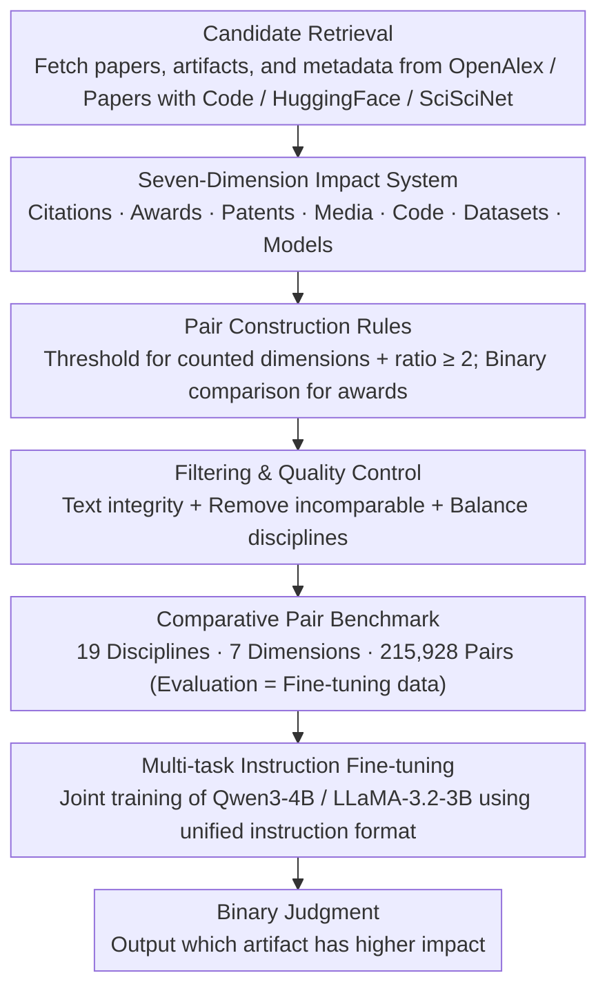

# SciImpact: A Multi-Dimensional, Multi-Field Benchmark for Scientific Impact Prediction

**Conference**: ACL 2026 Findings  
**arXiv**: [2604.17141](https://arxiv.org/abs/2604.17141)  
**Code**: [Project Homepage](https://flypig23.github.io/sciimpact-homepage/)  
**Area**: LLM Evaluation  
**Keywords**: Scientific impact prediction, multi-dimensional benchmark, citation prediction, academic awards, multi-task instruction tuning

## TL;DR

This paper constructs SciImpact—the first large-scale scientific impact prediction benchmark spanning 19 disciplines and 7 impact dimensions (citations, awards, patents, media, code, datasets, and models). It contains 215,928 comparative paper pairs, and multi-task fine-tuning enables a 4B model to outperform large models such as o4-mini.

## Background & Motivation

**Background**: The exponential growth of scientific literature necessitates automated methods for evaluating and predicting research impact. Existing work primarily focuses on citation count prediction.

**Limitations of Prior Work**: (1) Citation counts are only a proxy for impact, failing to capture other dimensions such as award recognition, public attention, and technical translation; (2) Existing datasets typically only cover computer science and biomedicine, lacking interdisciplinary coverage; (3) There is no unified benchmark supporting systematic multi-dimensional and multi-field comparisons.

**Key Challenge**: Scientific impact is multi-dimensional, yet evaluation benchmarks remain mono-dimensional.

**Goal**: To construct a unified prediction benchmark covering 7 impact dimensions and 19 academic disciplines.

**Key Insight**: Model impact prediction as a comparative pair classification (given two papers/artifacts, determine which has higher impact), integrating heterogeneous data sources (OpenAlex, Papers with Code, HuggingFace, SciSciNet).

**Core Idea**: Jointly train on all dimensions through multi-task instruction fine-tuning, allowing small models to surpass large models in multi-dimensional impact prediction.

## Method

SciImpact reformulates "scientific impact prediction" as a comparable and uniformly evaluable classification problem: given two papers or artifacts, judge which has greater impact in a specific dimension. The construction pipeline first retrieves candidates from heterogeneous data sources, then pairs them according to dimension-specific rules to create meaningful comparative pairs. Finally, through filtering and quality control, a benchmark of 215,928 pairs across 19 disciplines and 7 dimensions is obtained. Multi-task instruction fine-tuning is performed on this benchmark to enable small models to learn cross-dimensional impact discrimination.

### Overall Architecture

The construction consists of three stages. The candidate retrieval stage fetches papers, artifacts, and metadata from sources such as OpenAlex, Papers with Code, HuggingFace, and SciSciNet. The impact labeling and comparative pair generation stage pairs candidates into "who has more impact" based on rules for each dimension. The filtering and quality control stage ensures text integrity, removes incomparable samples, and balances discipline distributions. The resulting comparative pairs serve as both evaluation tasks and fine-tuning data—models receive descriptions of two artifacts in instruction format and output a binary judgment. Training and evaluation share the same comparative pair format.

### Key Designs

**1. Seven-Dimension Impact System: Expanding Single Citations into Seven Types of Influence**

Existing work almost exclusively looks at citation counts, but citations are merely a proxy for academic impact and cannot characterize honorary recognition, technical translation, or public attention. SciImpact therefore decomposes impact into seven dimensions, each corresponding to a quantifiable signal: citations (academic citation count), awards (Best Paper Awards / Nobel Prize / MDPI awards), patents (number of patent citations), media (mentions in news and social media), code (GitHub stars), and datasets/models (HuggingFace downloads).

These seven dimensions map to academic influence (citations), honorary recognition (awards), technical translation (patents), public attention (media), and practical adoption (code / data / models). This allows the benchmark to compare fundamentally different types of impact, such as "academic community recognition" and "industry adoption," within a unified framework, providing common coordinates for interdisciplinary comparison.

**2. Pair Construction Rules: Ensuring Each Pair Reflects Meaningful Differences**

Comparing any two random papers introduces two types of noise: trivial comparisons (e.g., 0 citations vs. 100 citations) and comparisons between papers that are inherently incomparable due to different years or venues. For counting-based dimensions, SciImpact requires both artifacts to exceed a minimum threshold (e.g., citations $\geq 10$) and maintain a high-to-low ratio of $\geq 2$, ensuring the gap is both real and significant. The awards dimension is designed as a binary comparison, such as award-winning papers vs. non-winning papers within the same venue.

To ensure the gap stems from "content quality" rather than external factors, additional constraints such as the same year, same venue, and same authors are applied during pairing to control for confounding variables. The resulting pairs eliminate trivial and incomparable samples, forcing the model to distinguish impact levels based on the paper's content itself.

**3. Multi-task Instruction Fine-tuning: Enabling Small Models to Leverage Cross-Dimensional Synergies**

Training a separate model for each of the seven dimensions is inefficient and fails to utilize commonalities. SciImpact aggregates comparative pairs from all dimensions and represents different prediction tasks via a unified instruction format for joint fine-tuning on Qwen3-4B and LLaMA-3.2-3B.

The underlying hypothesis is that transferable patterns exist across different impact dimensions—for example, clues for judging whether "the work is solid and addresses important problems" are common across citations, patents, and code adoption. Joint training allows models to learn these shared signals together, ultimately enabling the 4B model to outperform larger zero-shot models like o4-mini in multi-dimensional impact prediction.

### Loss & Training

Standard Instruction Fine-tuning (SFT) is employed, optimizing a binary discrimination objective with cross-entropy loss. Evaluation is uniformly measured using binary classification accuracy to determine the proportion of correctly identified higher-impact artifacts in each dimension.

## Key Experimental Results

### Main Results

| Model | Citation | Award | Patent | Media | Code | Dataset | Model | Average |
|------|------|------|------|------|------|--------|------|------|
| o4-mini | Medium | Medium | Medium | Medium | Medium | Medium | Medium | ~65% |
| Qwen3-4B (Original) | Low | Low | Low | Low | Low | Low | Low | ~55% |
| **SFT-Qwen3-4B** | **High** | **High** | **High** | **High** | **High** | **High** | **High** | **Highest** |

### Ablation Study

| Analysis Dimension | Result |
|----------|------|
| Single-task vs. Multi-task | Multi-task consistently outperforms single-task |
| Model Scale | 4B SFT > 30B Zero-shot |
| Dimensional Difficulty | Award and Model Download predictions are the most difficult |

### Key Findings

- Off-the-shelf LLMs show high variance in scientific impact prediction performance and inconsistency across dimensions.
- Multi-task SFT consistently improves all dimensions, with the 4B model surpassing o4-mini.
- Award prediction is the most difficult dimension—likely because award decisions involve non-content factors such as politics and networking.

## Highlights & Insights

- Expanding scientific impact from a single citation count to seven dimensions is a significant conceptual contribution.
- The effectiveness of multi-task fine-tuning suggests that transferable patterns exist between different impact dimensions.
- Coverage across 19 disciplines provides a foundation for interdisciplinary comparative research.

## Limitations & Future Work

- Pair construction relies on available metadata, leading to uneven data coverage.
- Predictions are based solely on text content and do not utilize graph structural information such as citation networks.
- Impact changes over time, while the current benchmark is a static snapshot.

## Related Work & Insights

- **vs. SciSciNet**: SciSciNet is a data lake, while SciImpact is an evaluation benchmark; the two are complementary.
- **vs. Citation Prediction Work**: This paper expands the prediction scope from citation counts to seven dimensions.

## Rating

- Novelty: ⭐⭐⭐⭐ Multi-dimensional impact prediction benchmark; significant conceptual contribution.
- Experimental Thoroughness: ⭐⭐⭐⭐ Comprehensive coverage with 11 models, 7 dimensions, and 19 fields.
- Writing Quality: ⭐⭐⭐⭐ Clear and transparent data construction process.
- Value: ⭐⭐⭐⭐ Provides a standardized evaluation tool for scientometrics.

<!-- RELATED:START -->

## Related Papers

- [\[ACL 2026\] K-MetBench: A Multi-Dimensional Benchmark for Fine-Grained Evaluation of Expert Reasoning, Locality, and Multimodality in Meteorology](k-metbench_a_multi-dimensional_benchmark_for_fine-grained_evaluation_of_expert_r.md)
- [\[ACL 2026\] MultiFileTest: A Multi-File-Level LLM Unit Test Generation Benchmark and Impact of Error Fixing Mechanisms](multifiletest_a_multi-file-level_llm_unit_test_generation_benchmark_and_impact_o.md)
- [\[ACL 2026\] Modeling Multi-Dimensional Cognitive States in Large Language Models under Cognitive Crowding](modeling_multi-dimensional_cognitive_states_in_large_language_models_under_cogni.md)
- [\[ACL 2026\] SessionIntentBench: A Multi-Task Inter-Session Intention-Shift Modeling Benchmark](sessionintentbench_a_multi-task_inter-session_intention-shift_modeling_benchmark.md)
- [\[AAAI 2026\] BCWildfire: A Long-term Multi-factor Dataset and Deep Learning Benchmark for Boreal Wildfire Risk Prediction](../../AAAI2026/llm_evaluation/bcwildfire_a_long-term_multi-factor_dataset_and_deep_learning_benchmark_for_bore.md)

<!-- RELATED:END -->
