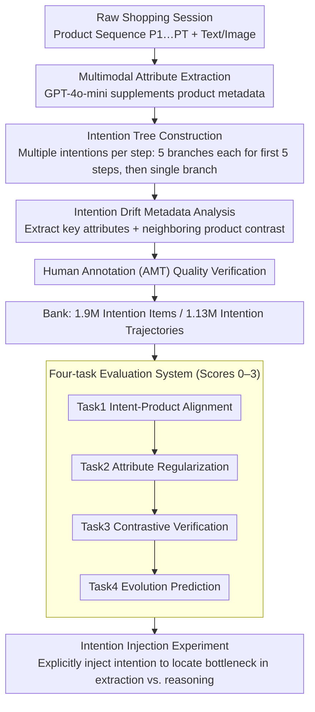

# SessionIntentBench: A Multi-Task Inter-Session Intention-Shift Modeling Benchmark

**Conference**: ACL 2026 Findings  
**arXiv**: [2507.20185](https://arxiv.org/abs/2507.20185)  
**Code**: None  
**Area**: LLM Evaluation  
**Keywords**: Shopping Intention, Session Modeling, E-commerce Recommendation, Intention Drift, Large Language Model Evaluation

## TL;DR

This paper proposes SessionIntentBench, a multi-task benchmark for evaluating the capability of L(V)LMs to understand cross-step intention drift in e-commerce shopping sessions. It comprises four progressive sub-tasks (intention purchase likelihood estimation, attribute regularization, intention verification contrast, and intention evolution modeling), featuring 1.9 million intention items and 1.13 million intention trajectories. Experiments indicate that over 20 current L(V)LMs perform poorly in capturing complex session intentions.

## Background & Motivation

**Background**: User intention modeling is crucial in e-commerce scenarios. Existing methods either analyze user profiles and purchase records or utilize surface-level information such as product titles and prices for single-purchase intention inference. Shopping sessions record user interaction behaviors across a series of browsing activities.

**Limitations of Prior Work**: (1) Existing works cover only single dimensions—either sessions or intentions—failing to model them jointly; (2) They rely solely on product titles and images as reasoning clues, missing rich product metadata; (3) There is a lack of automated intention data construction pipelines and systematic evaluation benchmarks.

**Key Challenge**: In complex multi-step shopping sessions, user intentions change dynamically (e.g., from red sneakers $\rightarrow$ white casual shoes $\rightarrow$ low-priced shoes), yet LLMs cannot effectively link scattered information across sessions to track this intention drift.

**Goal**: (1) Design the concept of intention trees and automated data construction pipelines; (2) Construct a multi-task benchmark to evaluate the cross-session intention understanding capabilities of L(V)LMs; (3) Verify the performance improvement of LLMs through explicit intention information injection.

**Key Insight**: Intention modeling is decomposed into four progressive sub-tasks: from verifying intention-product alignment, to checking key attributes, to contrasting adjacent products, and finally to predicting future exploration directions.

**Core Idea**: An intention tree is used to structurally represent the branches and evolution of intentions within a session. Intention metadata is automatically generated via multi-step L(V)LM prompting to construct a scalable intention modeling benchmark.

## Method

SessionIntentBench examines a task where LLMs often fail: tracking intention drift across multi-step shopping sessions (e.g., "red sneakers" $\rightarrow$ "white casual shoes" $\rightarrow$ "low-priced shoes") by connecting scattered clues. To achieve this, the authors utilize an automated pipeline to infer intentions from raw sessions, structure them into intention trees, and decompose intention understanding into four progressive evaluation tasks. Intention injection experiments are also conducted to locate the actual bottlenecks of the models.

### Overall Architecture

The construction pipeline consists of four stages. The multimodal attribute extraction stage uses GPT-4o-mini to extract standardized attributes from product text and images, supplementing metadata missing from titles and images alone. The intention generation stage infer a list of user intentions chronologically and organizes them into an intention tree. The intention drift metadata analysis stage extracts key attributes for each step and contrasts adjacent products. Finally, the human annotation stage involves AMT workers for quality verification on a sampled subset. The pipeline yields 1.9 million intention items and 1.13 million intention trajectories for the four-task evaluation, complemented by intention injection experiments to distinguish between extraction and reasoning bottlenecks.

### Key Designs

**1. Intention Tree Construction: Structuring Implicit Psychological States into Computable Trees**

The purchase intentions of real users under the same interaction history are often pluralistic; a single intention sequence cannot represent such branching. The intention tree uses the product sequence $P_1, P_2, \dots, P_T$ as the skeleton. At each time step, the LLM infers multiple possible intentions, forming a tree structure from root to leaf. Each path represents a "plausible intention hypothesis" given the interaction history. To control exponential growth, only the first 5 steps allow 5 branches each, with subsequent steps inferring only 1 intention. This maintains early-stage diversity while keeping the scale manageable, resulting in 1.13 million trajectories.

**2. Four-Task Evaluation System: Assessing Intention Understanding from Complementary Angles**

A single task cannot comprehensively evaluate intention understanding. Thus, it is decomposed into four progressive sub-tasks, each outputting a 0–3 score. Task 1 checks if inferred intentions match new products (Intent-Product Alignment); Task 2 verifies if key attributes are reflected in the new product (Attribute Regularization); Task 3 assesses if the contrast between adjacent products reasonably explains intention shifts (Contrastive Verification). Task 4 requires predicting the next direction—whether to keep recommending similar products, products of the same category with different features, or cross-category exploration (Evolution Prediction).

**3. Intention Injection Experiment: Locating Bottlenecks in "Extraction" vs. "Reasoning"**

Poor model performance may stem from an inability to understand intentions or a failure to extract them. The intention injection experiment separates these possibilities by explicitly adding inferred intention information (e.g., "The user may be looking for low-priced white sneakers") to the prompt. If performance improves significantly after injection, it indicates the model is capable of reasoning but lacks the ability to autonomously extract intentions from raw sessions, identifying the extraction step as the bottleneck.

### Loss & Training

The benchmark primarily utilizes zero-shot and few-shot prompting without specific training. Fine-tuning experiments were conducted using SFT on the training set for Llama-3.1-8B and Llama-3.2-3B. Human annotations were screened through multiple rounds on Amazon Mechanical Turk to ensure quality.

## Key Experimental Results

### Main Results

**Zero-Shot L(V)LM Performance (Accuracy %)**

| Model | Task 1 Acc | Task 2 Acc | Task 3 Acc | Task 4 Acc |
| :--- | :--- | :--- | :--- | :--- |
| Random | 50.00 | 50.00 | 50.00 | 54.38 |
| Majority | 62.30 | 54.35 | 71.80 | 63.15 |
| Qwen-2.5-7B | 58.62 | 51.02 | 70.59 | 40.07 |
| LLaVA-v1.6-vicuna-7b | 62.01 | 46.93 | 71.27 | 37.21 |
| Mistral-7B-v0.3 | 62.17 | 47.65 | 71.30 | 39.61 |

### Ablation Study

| Configuration | Effect | Description |
| :--- | :--- | :--- |
| Zero-shot | Baseline level | Most models perform near or below the majority baseline. |
| Few-shot | Minor gain | Some tasks actually show a decrease in performance. |
| Fine-tuning (SFT) | Mixed results | Improvements in some tasks but lacks comprehensive enhancement. |
| + Intention Injection | Significant gain | Demonstrates the value of explicit intention information. |

### Key Findings

- Over 20 L(V)LMs generally perform near or below the majority baseline across all four tasks, indicating current models cannot effectively understand session intentions.
- Task 2 (Attribute Regularization) is the most subjective and has the lowest inter-annotator agreement.
- Multimodal models (LVLM) do not consistently outperform text-only LLMs; product image information is not effectively utilized.
- Intention injection experiments prove that when provided with explicit intention information, LLM performance improves significantly, suggesting the bottleneck lies in intention extraction rather than reasoning.
- Fine-tuning yields inconsistent effects, likely because session intention understanding requires deeper reasoning rather than pattern memorization.

## Highlights & Insights

- The intention tree concept structures implicit mental states into computable tree structures, providing a new representation paradigm for intention modeling.
- The four-task evaluation system is cleverly designed, forming a progressive assessment from alignment $\rightarrow$ verification $\rightarrow$ contrast $\rightarrow$ prediction.
- The data scale is massive (1.9M intention items), yet the construction cost remains controlled through LLM automation and human sampling verification.

## Limitations & Future Work

- Intention generation relies on LLMs (GPT-4o-mini), whose quality is limited by the LLM's own capabilities.
- Human annotation only covers a sampled subset; the full dataset quality has not been comprehensively verified.
- The 0-3 scoring standard for the four tasks is subjective, particularly for Task 2.
- Future work could explore integrating intention modeling into the end-to-end training of recommendation systems.

## Related Work & Insights

- **vs. Amazon-M2 (Jin et al., 2023)**: Amazon-M2 provides raw session data; SessionIntentBench adds intention metadata and evaluation tasks on top.
- **vs. Sun et al. (2024)**: They optimize recommendation via intention ranking prompts; this work focuses on evaluating the intention understanding capabilities of the LLMs.
- **vs. Xu et al. (2024)**: They model intentions for co-purchase behaviors but only cover single interactions; this work models intention evolution across sessions.

## Rating

- Novelty: ⭐⭐⭐⭐ The intention tree and four-task system are meaningful new contributions.
- Experimental Thoroughness: ⭐⭐⭐⭐⭐ 20+ models, multiple evaluation settings, and human verification.
- Writing Quality: ⭐⭐⭐⭐ Tasks are clearly defined, although symbols are numerous.
- Value: ⭐⭐⭐⭐ Provides the first systematic benchmark for e-commerce intention modeling.

<!-- RELATED:START -->

## Related Papers

- [\[ACL 2025\] EcomScriptBench: A Multi-task Benchmark for E-commerce Script Planning via Step-wise Intention-Driven Product Association](../../ACL2025/llm_evaluation/ecomscriptbench.md)
- [\[ACL 2026\] SciImpact: A Multi-Dimensional, Multi-Field Benchmark for Scientific Impact Prediction](sciimpact_a_multi-dimensional_multi-field_benchmark_for_scientific_impact_predic.md)
- [\[ACL 2026\] Multi-Task Reinforcement Learning for Enhanced Multimodal LLM-as-a-Judge](multi-task_reinforcement_learning_for_enhanced_multimodal_llm-as-a-judge.md)
- [\[ACL 2026\] Modeling Multi-Dimensional Cognitive States in Large Language Models under Cognitive Crowding](modeling_multi-dimensional_cognitive_states_in_large_language_models_under_cogni.md)
- [\[ICLR 2026\] CatalystBench: A Comprehensive Multi-Task Benchmark for Advancing Language Models in Catalysis Science](../../ICLR2026/llm_evaluation/catalystbench_a_comprehensive_multi-task_benchmark_for_advancing_language_models.md)

<!-- RELATED:END -->
