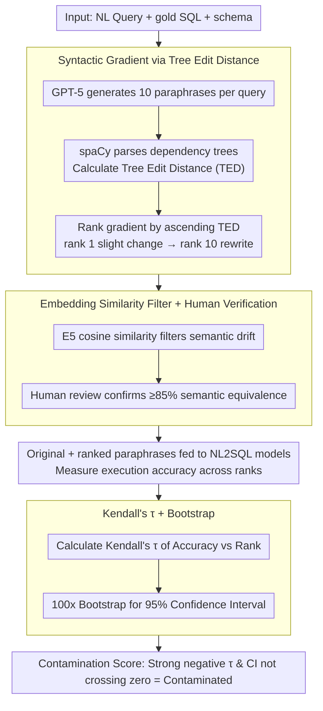

# SPENCE: A Syntactic Probe for Detecting Contamination in NL2SQL Benchmarks

**Conference**: ACL 2026  
**arXiv**: [2604.17771](https://arxiv.org/abs/2604.17771)  
**Code**: None  
**Area**: Interpretability  
**Keywords**: Data contamination detection, NL2SQL, Syntactic probe, Benchmark leakage, Generalization evaluation

## TL;DR

SPENCE detects and quantifies data contamination behaviors of LLMs on NL2SQL benchmarks by systematically rewriting benchmark queries syntactically and measuring the decay of execution accuracy with syntactic distance. It finds that older benchmarks (such as Spider) exhibit stronger contamination signals, while the newer BIRD benchmark is almost unaffected.

## Background & Motivation

**Background**: LLMs have achieved high execution accuracy on NL2SQL benchmarks (Spider, SParC, CoSQL, BIRD), but the academic community increasingly questions whether these scores reflect true generalization capabilities. Data contamination and benchmark leakage have been widely studied, with various methods (e.g., ConStat, Data Contamination Quiz, Min-K% Prob) detecting LLM memorization behaviors from different perspectives.

**Limitations of Prior Work**: Existing contamination detection methods either rely on string overlap checks, which fail to capture structural memorization, or require access to internal model parameters, making them impractical for black-box models. In the NL2SQL context, there is a lack of a systematic contamination detection framework specifically for SQL generation tasks—existing work by Ranaldi et al. (2024) only compares seen vs. unseen databases at the dataset level, without fine-grained probing along the syntactic axis.

**Key Challenge**: Reported high accuracies might stem from the model's memorization of the surface forms of benchmark queries rather than true compositional generalization. If a model merely remembers the syntactic patterns of original queries, its performance should degrade on semantically equivalent but syntactically distinct paraphrases. The core problem is how to distinguish "memorization" from "lack of generalization," and whether this behavior correlates with the release time of the benchmark.

**Goal**: Design a controlled syntactic probing framework to quantify the contamination sensitivity of NL2SQL models by generating paraphrases with increasing distance and performing comparative analyses across four benchmarks.

**Key Insight**: Utilize syntactic dependency Tree Edit Distance (TED) to rank paraphrases, operationalizing "contamination degree" as the "rate of accuracy decay over syntactic distance," and quantifying the significance of the trend using the Kendall's τ statistic.

**Core Idea**: Syntactic paraphrasing + distance ranking + accuracy decay analysis = contamination probe. Steeper decay on older benchmarks indicates more severe contamination.

## Method

### Overall Architecture

SPENCE operationalizes "contamination detection" as a controlled syntactic perturbation experiment: given a natural language query, gold SQL, and database schema from a test set, it first uses an LLM to generate a set of semantically equivalent but syntactically distant paraphrases for each query, ranked along a gradient by syntactic distance. Then, the original query and the paraphrases at various levels are fed into the NL2SQL model under test. The framework observes how execution accuracy changes along this gradient. If a model remembers surface syntactic patterns of benchmark queries rather than true compositional generalization, accuracy will monotonically decline with syntactic distance. Finally, Kendall's τ is used to compress this downward trend into a statistically testable contamination score.

### Key Designs

**1. Syntactic Gradient Based on Tree Edit Distance: Mapping "Syntactic Proximity" to a Continuous Scale**

The hardest part of contamination detection is the lack of a controlled continuous variable—simple lexical overlap only reflects surface synonym substitution and fails to capture deep structural changes like clause rearrangement. SPENCE uses GPT-5 to generate 10 paraphrases for each query, then uses spaCy to parse both the paraphrases and the original query into dependency trees. Structural difference is measured by $\text{TED}_i = \text{TreeEditDistance}(T_{p_i}, T_q)$, which allows for insertion, deletion, and substitution of dependency tree nodes. After ranking by ascending TED, rank 1 represents slight modifications closest to the original (low TED, surface lexical changes), while rank 10 represent structural rewrites furthest away (high TED, clause rearrangement). This transforms "syntactic proximity" into a controlled gradient, probing true syntactic robustness rather than pseudo-signals contaminated by lexical similarity.

**2. Embedding Similarity Filtering and Human Verification: Blocking Semantic Drift as a Confounding Source**

If a paraphrase changes semantics, the resulting accuracy drop cannot be distinguished between a contamination signal or semantic change, distorting the entire gradient. SPENCE calculates the E5-base-v2 embedding cosine similarity between each paraphrase and the original query, discarding those below a threshold. Furthermore, human review of 100 Spider samples across ranks 1/5/10 confirmed that more than 85% of the paraphrases are indeed semantically equivalent. Following this step, accuracy decay observed along the gradient can be attributed solely to syntactic changes, excluding interference from semantic drift.

**3. Kendall's τ Rank Correlation and Bootstrap Confidence Intervals: Turning the Downward Trend into a Testable Statistic**

Simply observing a curve that "seems to be declining" is insufficient for a conclusion; a statistically reliable contamination metric is required. SPENCE calculates the Kendall's τ $= (n_c - n_d) / \frac{1}{2}n(n-1)$ between accuracy and paraphrase rank for each model-dataset pair, where $n_c$ and $n_d$ are the number of concordant and discordant pairs, respectively. It then provides a 95% confidence interval using $B=100$ bootstrap resamples. A strong negative τ means accuracy monotonically decreases with syntactic distance, serving as a clear contamination signal. A τ near zero suggests the model is insensitive to syntactic perturbations. The trend is statistically significant only if the confidence interval does not cross zero.

## Key Experimental Results

### Main Results (Kendall's τ, averaged across 6 models)

| Dataset | Release Date | τ (All ranks) | τ (rank ≥ 3) |
|---------|--------------|---------------|--------------|
| Spider  | 2018.09      | -0.89         | -0.88        |
| SParC   | 2019.06      | -0.76         | -0.63        |
| CoSQL   | 2019.10      | -0.71         | -0.64        |
| BIRD    | 2023.05      | -0.35         | -0.37        |

### Control Experiments Excluding Alternative Explanations

| Controlled Variable | Method | Conclusion |
|---------------------|--------|------------|
| Query Length        | Compare length distributions of rank 1/5/10 | Distributions are similar; length effect excluded |
| Lexical Overlap     | Recalculate τ after Jaccard stratification | Negative correlation persists; lexical effect excluded |
| Schema linking      | Manual inspection of failure cases | No schema linking breakage found |
| Paraphrase Generator | Replace GPT-5 with LLaMA-4 Maverick | Decay patterns and slopes are consistent |

### Key Findings
- **Clear Temporal Gradient**: Older benchmarks show larger absolute τ values and stronger contamination signals. Spider (2018) is the strongest (-0.89), while BIRD (2023) is the weakest (-0.35).
- On Spider, all models show an accuracy drop of over 10-15 percentage points at rank 8-10, whereas BIRD remains stable or even slightly improves.
- Even when focusing only on long-distance paraphrases (rank ≥ 3), the negative correlation for Spider/SParC/CoSQL remain significant (τ between -0.57 and -1.00).
- Larger models (e.g., LLaMA-3.1-405B) decay more slowly on SParC, but no model is immune.

## Highlights & Insights
- **The syntactic probe design is highly ingenious**: By controlling the syntactic distance of paraphrases to construct a continuous gradient, contamination detection is transformed from a binary judgment (leaked vs. not) to a continuous measure (decay rate), which is more informative.
- **Four control experiments comprehensively exclude alternative explanations**: Effects of query length, lexical overlap, schema linking, and paraphrase generator bias were systematically ruled out, demonstrating rigorous methodology.
- This method is transferable to contamination detection for other NLP benchmarks: the SPENCE framework can be applied to any task where semantic-preserving paraphrasing is possible (QA, text classification, etc.).

## Limitations & Future Work
- The temporal gradient represents correlation rather than causation: older benchmarks may differ from newer ones in difficulty, annotation style, or distributional characteristics.
- Only general LLMs were evaluated; specialized SQL systems (e.g., OmniSQL, Arctic-Text2SQL-R1) were not covered.
- Paraphrase generation itself relies on an LLM (GPT-5); although results were consistent when using LLaMA-4, generator bias cannot be entirely excluded.
- For conversational benchmarks (SParC, CoSQL), only the last turn of the user question was paraphrased, which was not extended to earlier dialogue turns.
- Future work could combine sample-specific probes from ConStat to capture deeper forms of contamination.

## Related Work & Insights
- **vs ConStat**: ConStat defines contamination as non-generalizable performance inflation across syntax/sample/benchmark dimensions. SPENCE focuses on the syntax axis but provides finer distance gradient control.
- **vs Ranaldi et al.**: They detect dataset-level contamination by comparing Spider vs. a new dataset, Termite. SPENCE detects contamination within the same dataset through syntactic transformations, providing finer granularity.
- **vs Min-K% Prob**: Requires internal model token probabilities (white-box). SPENCE is entirely black-box, requiring only the observation of outputs.

## Rating
- Novelty: ⭐⭐⭐⭐ The combination of syntactic distance gradients and Kendall's τ for NL2SQL contamination detection is novel, although the general probe-based evaluation framework is not entirely new.
- Experimental Thoroughness: ⭐⭐⭐⭐⭐ Extremely comprehensive, involving four benchmarks, six models, four control experiments, bootstrap confidence intervals, and verification with alternative paraphrase generators.
- Writing Quality: ⭐⭐⭐⭐ Clear structure and informative charts, although the length could be slightly streamlined.
- Value: ⭐⭐⭐⭐ Provides the NL2SQL community with an actionable contamination detection tool, and the methodology is generalizable to other tasks.

<!-- RELATED:START -->

## Related Papers

- [\[ICLR 2026\] Detecting Data Contamination in LLMs via In-Context Learning](../../ICLR2026/llm_evaluation/detecting_data_contamination_in_llms_via_in-context_learning.md)
- [\[ICLR 2026\] Detecting Data Contamination from Reinforcement Learning Post-training for Large Language Models](../../ICLR2026/llm_evaluation/detecting_data_contamination_from_reinforcement_learning_post-training_for_large.md)
- [\[ACL 2026\] CLARITY: A Framework and Benchmark for Conversational Language Ambiguity and Unanswerability in Interactive NL2SQL Systems](clarity_a_framework_and_benchmark_for_conversational_language_ambiguity_and_unan.md)
- [\[ACL 2026\] Beyond Static Benchmarks: Synthesizing Harmful Content via Persona-based Simulation for Robust Evaluation](beyond_static_benchmarks_synthesizing_harmful_content_via_persona-based_simulati.md)
- [\[ACL 2026\] BenchMarker: An Education-Inspired Toolkit for Highlighting Flaws in Multiple-Choice Benchmarks](benchmarker_an_education-inspired_toolkit_for_highlighting_flaws_in_multiple-cho.md)

<!-- RELATED:END -->
