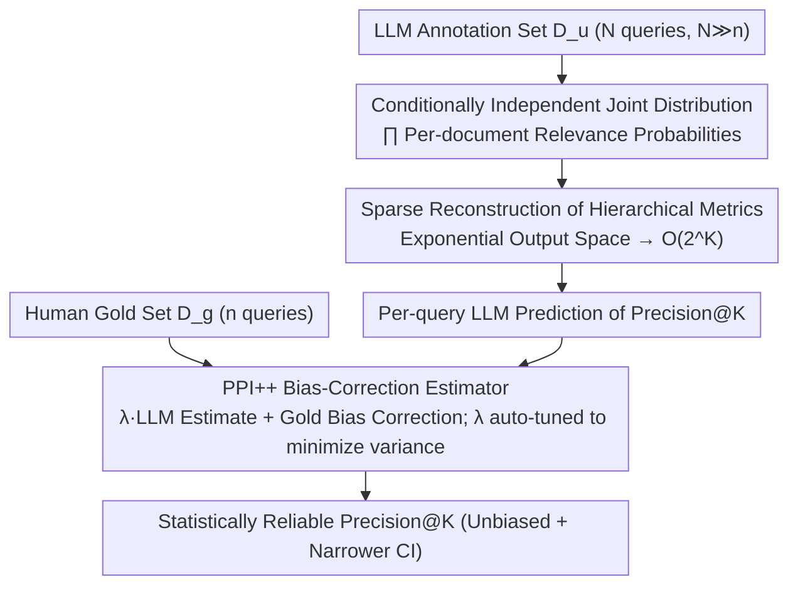

# Statistically Reliable LLM-Based Ranking Evaluation via Prediction-Powered Inference

**Conference**: ACL2026
**arXiv**: [2606.05308](https://arxiv.org/abs/2606.05308)  
**Code**: TBD  
**Area**: LLM Evaluation
**Keywords**: PPI, LLM-as-Judge, Bias Correction, Ranking Evaluation, Precision@K, Semi-supervised Estimation

## TL;DR

PRECISE extends Prediction-Powered Inference (PPI) to ranking evaluation metrics. By combining a small amount of human annotation with a large volume of LLM judgments, it corrects LLM systemic biases while reducing metric estimation variance, achieving statistically reliable evaluation of ranking systems.

## Background & Motivation

While LLM-as-a-Judge evaluation methods significantly reduce human annotation costs, they suffer from systemic biases; directly replacing human annotation can distort evaluation metrics. Existing work primarily focuses on building better judges through prompt engineering, fine-tuning, or multi-agent debate, but biases persist. This paper adopts an orthogonal approach: accepting that LLM judges are biased and correcting them using statistical methods.

The core challenge lies in a granularity mismatch for hierarchical metrics (e.g., Precision@K): human annotation is per-document, but metrics are calculated per-query. Standard PPI cannot handle this because the naive output space is $O(2^{|C|})$, making computation infeasible when the corpus scale reaches millions.

## Method

### Overall Architecture

PRECISE is based on the PPI++ (Prediction-Powered Inference++) semi-supervised estimation framework. It takes a small gold set $\mathcal{D}_g$ ($n$ queries with human relevance annotations) and a large unlabeled set $\mathcal{D}_u$ ($N$ queries with LLM judgments, $N \gg n$). The difficulty is that LLMs can only judge relevance per-document, whereas hierarchical metrics like Precision@K are calculated per-query—this results in a granularity mismatch. Furthermore, the output space for naively enumerating all relevance label combinations for a query is exponential. PRECISE first bridges the per-document probabilities from the LLM into per-query metric predictions (using conditionally independent joint distributions + sparse reconstruction). It then uses a PPI++ estimator to combine gold labels with LLM signals: the large-scale LLM predictions reduce variance, while the small gold set corrects the LLM's systemic bias, ultimately obtaining a statistically reliable (unbiased with narrower confidence intervals) metric estimation.

### Key Designs

1.  **Conditionally Independent Joint Distribution Modeling**: Hierarchical metrics are calculated per-query, but LLMs provide document-level relevance judgments. PRECISE assumes the LLM provides relevance probabilities $\tilde{p}'(d_k)$ independently for each of the $K$ documents in a query. These are combined into a joint distribution $\tilde{p}(y) = \prod_{k=1}^{K} \tilde{p}'(d_k)^{y_k}(1-\tilde{p}'(d_k))^{(1-y_k)}$ for the query label vector $y$, bridging per-document LLM outputs to per-query metric calculations.
2.  **Sparse Reconstruction of Hierarchical Metrics**: Naively enumerating all combinations of relevance labels results in an output space of $O(2^{|C|})$ ($|C|$ being the corpus size, which can be millions), which is computationally impossible. PRECISE leverages the fact that Precision@K only depends on the top-K retrieved documents, folding the probability mass of non-retrieved documents into an all-zero K-vector. This compresses the output space to $O(2^K)$. When $K \le 10$, the joint distribution can be exactly enumerated, making PPI feasible in real ranking evaluation scenarios.
3.  **PPI++ Bias-Correction Estimator**: Based on the per-query metric predictions, the estimator combines gold labels and LLM signals: $\hat{\mu}_{PPI} = \frac{\lambda}{N}\sum_{i=1}^{N}\tilde{\mu}_u^{(i)} + \frac{1}{n}\sum_{i=1}^{n}[\phi_i - \lambda\tilde{\mu}_g^{(i)}]$. The first term uses the large-scale LLM estimate to reduce variance, while the second term uses $n$ gold samples to correct the LLM's systematic bias. The parameter $\lambda \in [0,1]$ controls the weight of the LLM signal—$\lambda \approx 1$ when the LLM is well-calibrated to utilize unlabeled data, and $\lambda \approx 0$ when bias is high to revert to gold estimation. $\lambda$ is automatically tuned by minimizing the variance of $\hat{\mu}_{PPI}$, and the estimate remains unbiased for any $\lambda > 0$.

### Loss & Training

There is no training process. $\lambda$ is automatically tuned by minimizing the variance of $\hat{\mu}_{PPI}$, and the estimator remains unbiased for any $\lambda > 0$.

## Key Experimental Results

### Main Results

Evaluation of Precision@4 on the ESCI retrieval benchmark ($n=30$ gold labels, $N=60K$ LLM annotations):

| Estimator | Bias (↓) | Std. Err. (↓) | Inference Cost |
|---|---|---|---|
| Gold only (n=30) | 1.04 | 4.45 | — |
| + Claude 3 Sonnet | 0.70 | 3.50 | $946 |
| + Claude 3 Haiku | 0.29 | 3.86 | $79 |

### Ablation Study

-   **Unlabeled/Gold Ratio**: The framework saturates at a 100× ratio; $N=3,000$ LLM queries provide nearly the same standard error as $N=60,000$.
-   **Production A/B Testing**: Using $n=100$ human annotations + $N=8,400$ LLM judgments, the ranking of three system variants (T1 >> T2 >> Control) was completed within 2 hours. T1 showed an increase of +407 bps in daily sales and +571 bps in CTR. LLM-only estimates failed to distinguish variants due to systemic upward bias, while PPI correction restored discriminative power.

### Key Findings

-   The sampling distribution of PPI is narrower (lower variance) than gold-only estimation and is consistently centered on the ground truth (unbiased).
-   Haiku achieves the lowest bias (0.29) at a 12× lower cost, representing the most cost-effective choice.

## Highlights & Insights

-   **Statistical vs. Engineering Mindset**: Instead of striving for a "perfect" LLM judge, this approach accepts bias and corrects it statistically. Even a small gold set guarantees unbiasedness, and every additional LLM annotation reduces variance without introducing new bias.
-   **Engineering Value of Sparse Reconstruction**: It transforms the output space of hierarchical metrics from exponential to enumerable, making PPI applicable to real-world ranking evaluation.
-   **Production Validation**: Evaluation was completed within 2 hours in a live search system and validated by A/B tests, proving practical viability.

## Limitations & Future Work

-   Hierarchical PPI was only validated on Precision@K; other hierarchical metrics (e.g., per-claim factuality, per-turn dialogue quality) were not tested.
-   The conditional independence assumption may not hold in diversity-sensitive ranking scenarios where document relevancies are interdependent.
-   The gold set and unlabeled set must be identically distributed; temporal drift may degrade the effectiveness of bias correction.

## Related Work & Insights

-   **PPI/PPI++** (Angelopoulos et al., 2023/2024): The theoretical foundation of this work, applying semi-supervised estimation to ranking evaluation.
-   **LLM-as-a-Judge Bias Research** (Chen et al., 2024): Confirms the existence of systemic bias in LLM judges, supporting the motivation for bias correction.
-   **Doubly Robust Estimation** (Oosterhuis, 2023): Shares a theoretical basis and may provide a path for real-time online evaluation.

## Rating

| Dimension | Score (1-10) |
|---|---|
| Novelty | 7 |
| Utility | 9 |
| Clarity | 8 |
| Experimental Thoroughness | 6 |

## Rating
- Novelty: TBD
- Experimental Thoroughness: TBD
- Writing Quality: TBD
- Value: TBD

<!-- RELATED:START -->

## Related Papers

- [\[ICML 2026\] Margin-Adaptive Confidence Ranking for Reliable LLM Judgement](../../ICML2026/llm_evaluation/margin-adaptive_confidence_ranking_for_reliable_llm_judgement.md)
- [\[ICLR 2026\] Multi-LLM Adaptive Conformal Inference for Reliable LLM Responses](../../ICLR2026/llm_evaluation/multi-llm_adaptive_conformal_inference_for_reliable_llm_responses.md)
- [\[ACL 2025\] JuStRank: Benchmarking LLM Judges for System Ranking](../../ACL2025/llm_evaluation/justrank_llm_judge_system_ranking.md)
- [\[AAAI 2026\] LLM-as-a-Judge for Scalable Test Coverage Evaluation](../../AAAI2026/llm_evaluation/llm-as-a-judge_for_scalable_test_coverage_evaluation_accuracy_operational_reliab.md)
- [\[ACL 2026\] SciImpact: A Multi-Dimensional, Multi-Field Benchmark for Scientific Impact Prediction](sciimpact_a_multi-dimensional_multi-field_benchmark_for_scientific_impact_predic.md)

<!-- RELATED:END -->
