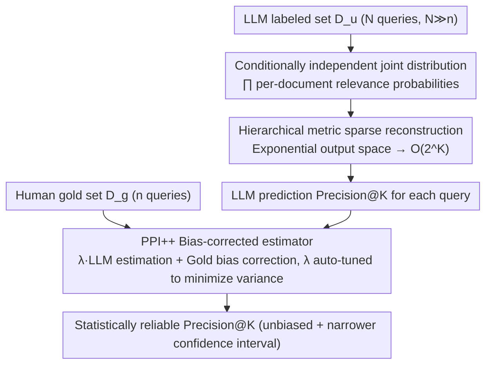

# Statistically Reliable LLM-Based Ranking Evaluation via Prediction-Powered Inference

**Conference**: ACL2026  
**arXiv**: [2606.05308](https://arxiv.org/abs/2606.05308)  
**Code**: TBD  
**Area**: LLM Evaluation  
**Keywords**: PPI, LLM-as-Judge, Bias Correction, Ranking Evaluation, Precision@K, Semi-supervised Estimation

## TL;DR

PRECISE extends Prediction-Powered Inference (PPI) to ranking evaluation metrics. By combining a small number of human annotations with a large volume of LLM judgments, it corrects systemic biases in LLM systems while reducing estimation variance, achieving statistically reliable ranking system evaluation.

## Background & Motivation

While LLM-as-a-Judge methods significantly reduce human annotation costs, they suffer from systemic biases; directly replacing human labels can distort evaluation metrics. Existing works primarily focus on constructing better judges through prompt engineering, fine-tuning, or multi-agent debate, yet bias persists. This paper adopts an orthogonal approach: accepting the presence of bias in LLM judges and correcting it via statistical methods.

The key challenge lies in the granularity mismatch of hierarchical metrics (e.g., Precision@K): human annotations are per-document, whereas metrics are calculated per-query. Standard PPI cannot handle this because the naive output space is $O(2^{|C|})$. When the corpus size reaches millions, calculation becomes infeasible.

## Method

### Overall Architecture

PRECISE is based on the PPI++ (Prediction-Powered Inference++) semi-supervised estimation framework. It takes as input a small human gold set $\mathcal{D}_g$ ($n$ queries with human relevance annotations) and a large unlabeled set $\mathcal{D}_u$ ($N$ queries with LLM judgments, $N \gg n$). The difficulty stems from LLMs only judging relevance per-document, while hierarchical metrics like Precision@K are query-based; there is a granularity mismatch, and the naive output space for all label combinations per query is exponential. PRECISE first bridges per-document LLM probabilities to per-query metric predictions (via a conditionally independent joint distribution and sparse reconstruction), then combines the gold standard with LLM signals using the PPI++ estimator. It utilizes large-scale LLM predictions to reduce variance and small-scale gold labels to correct LLM systemic bias, ultimately obtaining a statistically reliable (unbiased with narrower confidence intervals) metric estimation.

### Key Designs

1. **Conditionally Independent Joint Distribution Modeling**: Hierarchical metrics are calculated per-query, but LLMs provide relevance judgments per-document, causing a granularity mismatch. PRECISE assumes the LLM independently provides relevance probabilities $\tilde{p}'(d_k)$ for each of the $K$ documents in a query. These are combined into a joint distribution for the label vector $y$: $\tilde{p}(y) = \prod_{k=1}^{K} \tilde{p}'(d_k)^{y_k}(1-\tilde{p}'(d_k))^{(1-y_k)}$, thereby bridging per-document LLM outputs to per-query metric calculations.
2. **Sparse Reconstruction of Hierarchical Metrics**: Naively enumerating all relevance label combinations for a query yields an output space of $O(2^{|C|})$ (where $|C|$ is the corpus size, potentially in the millions), which is computationally intractable. PRECISE leverages the fact that Precision@K only depends on the top-K retrieved documents, folding the probability mass of non-retrieved documents into a zero K-vector to compress the output space to $O(2^K)$. For $K \leq 10$, the joint distribution can be exactly enumerated, making PPI feasible in real-world ranking evaluation scenarios.
3. **PPI++ Bias-Corrected Estimator**: Building on the per-query metric predictions, the estimator combines gold standards with LLM signals: $\hat{\mu}_{PPI} = \frac{\lambda}{N}\sum_{i=1}^{N}\tilde{\mu}_u^{(i)} + \frac{1}{n}\sum_{i=1}^{n}[\phi_i - \lambda\tilde{\mu}_g^{(i)}]$. The first term uses large-scale LLM estimates to reduce variance, while the second term uses $n$ gold samples to correct the LLM's systemic bias. The parameter $\lambda \in [0,1]$ controls the weight of the LLM signal—$\lambda \approx 1$ when the LLM is well-calibrated to fully utilize unlabeled data, and $\lambda \approx 0$ to fall back to pure gold estimation when bias is high. $\lambda$ is automatically tuned by minimizing the variance of $\hat{\mu}_{PPI}$, and the estimate remains unbiased for any $\lambda > 0$.

### Loss & Training

There is no training process. $\lambda$ is automatically tuned by minimizing the variance of $\hat{\mu}_{PPI}$, and the estimator remains unbiased for any $\lambda > 0$.

## Key Experimental Results

### Main Results

Evaluation of Precision@4 on the ESCI retrieval benchmark ($n=30$ gold, $N=60K$ LLM labels):

| Estimator | Bias (↓) | Std. Err. (↓) | Inference Cost |
|---|---|---|---|
| Gold only (n=30) | 1.04 | 4.45 | — |
| + Claude 3 Sonnet | 0.70 | 3.50 | $946 |
| + Claude 3 Haiku | 0.29 | 3.86 | $79 |

### Ablation Study

- **Unlabeled/Gold Ratio**: The framework reaches saturation at a 100× ratio; $N=3,000$ LLM queries provide nearly the same standard error as $N=60,000$.
- **Production A/B Testing**: Using $n=100$ human annotations + $N=8,400$ LLM judgments, the ranking of three system variants was completed within 2 hours (T1 >> T2 >> Control). T1 showed a +407 bps increase in daily sales and a +571 bps increase in CTR. LLM-only estimates failed to distinguish variants due to systemic upward bias, whereas PPI correction restored discriminative capability.

### Key Findings

- The sampling distribution of PPI is narrower (lower variance) than using gold labels alone and is always centered on the ground truth (unbiased).
- Haiku achieves the lowest bias (0.29) at a 12× lower cost, making it the most cost-effective choice.

## Highlights & Insights

- **Statistical vs. Engineering Approach**: Rather than pursuing a better LLM judge, the method accepts bias and corrects it statistically—guaranteeing unbiasedness with a few gold labels, where additional LLM annotations only reduce variance without introducing new bias.
- **Engineering Significance of Sparse Reconstruction**: Reducing the output space of hierarchical metrics from exponential to enumerable makes PPI applicable to real-world ranking evaluation scenarios.
- **Production Verification**: Evaluation was completed within 2 hours in a real-world search system and confirmed via A/B testing, proving practical utility.

## Limitations & Future Work

- Hierarchical PPI was only validated on Precision@K; other hierarchical metrics (e.g., per-claim factuality, per-turn dialogue quality) were not tested.
- The conditional independence assumption might not hold in diversity-sensitive ranking scenarios where document relevance is interdependent.
- The gold set and unlabeled set must be identically distributed; temporal drift may weaken the effectiveness of bias correction.

## Related Work & Insights

- **PPI/PPI++** (Angelopoulos et al., 2023/2024): The theoretical foundation of this work, applying semi-supervised estimation to ranking evaluation.
- **LLM-as-a-Judge Bias Research** (Chen et al., 2024): Confirms that LLM judges have systemic biases, supporting the motivation for bias correction in this paper.
- **Doubly Robust Estimation** (Oosterhuis, 2023): Shares a theoretical basis and may provide a path for real-time online evaluation.

## Rating

| Dimension | Score (1-10) |
|---|---|
| Innovation | 7 |
| Utility | 9 |
| Clarity | 8 |
| Experimental Thoroughness | 6 |

## Rating
- Novelty: TBD
- Experimental Thoroughness: TBD
- Writing Quality: TBD
- Value: TBD

<!-- RELATED:START -->

## Related Papers

- [\[ICML 2026\] Margin-Adaptive Confidence Ranking for Reliable LLM Judgement](../../ICML2026/llm_evaluation/margin-adaptive_confidence_ranking_for_reliable_llm_judgement.md)
- [\[ICLR 2026\] Multi-LLM Adaptive Conformal Inference for Reliable LLM Responses](../../ICLR2026/llm_evaluation/multi-llm_adaptive_conformal_inference_for_reliable_llm_response.md)
- [\[ACL 2025\] JuStRank: Benchmarking LLM Judges for System Ranking](../../ACL2025/llm_evaluation/justrank_llm_judge_system_ranking.md)
- [\[ICLR 2026\] Reliable Fine-Grained Evaluation of Natural Language Math Proofs](../../ICLR2026/llm_evaluation/reliable_fine-grained_evaluation_of_natural_language_math_proofs.md)
- [\[ACL 2026\] SciImpact: A Multi-Dimensional, Multi-Field Benchmark for Scientific Impact Prediction](sciimpact_a_multi-dimensional_multi-field_benchmark_for_scientific_impact_predic.md)

<!-- RELATED:END -->
