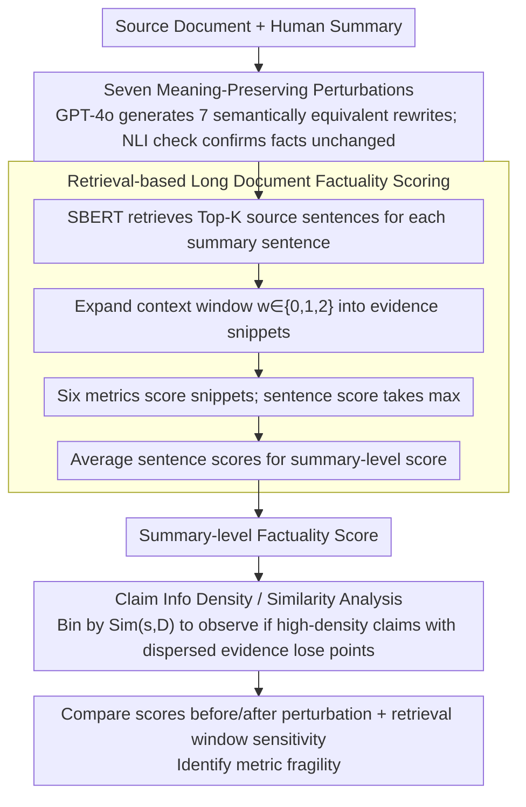

# Stress Testing Factual Consistency Metrics for Long-Document Summarization

**Conference**: ACL 2026  
**arXiv**: [2511.07689](https://arxiv.org/abs/2511.07689)  
**Code**: https://github.com/zainmujahid/metricEval-longSum  
**Area**: Text Generation / Evaluation  
**Keywords**: Factual Consistency, Long-Document Summarization, Robustness Evaluation, Retrieval-based Scoring, Metric Stress Testing  

## TL;DR
This paper stress-tests six commonly used reference-free factuality metrics in long-document summarization. It discovers that these metrics are significantly influenced by meaning-preserving paraphrasing, retrieval window sizes, and high-information-density claims, indicating that metrics designed for short summaries cannot be reliably transferred to long-document scenarios.

## Background & Motivation
**Background**: While abstractive summarization systems are becoming increasingly fluent, factual consistency remains a core risk. Traditional metrics like ROUGE/BLEU only measure surface overlap and cannot determine if summary facts are supported by the source document. Consequently, several reference-free factuality metrics have emerged, such as NLI-based SummaC, QA-based metrics, generation probability-based BARTScore, and more comprehensive metrics like MiniCheck, AlignScore, and UniEval.

**Limitations of Prior Work**: Most of these metrics were proposed and validated on short-document summaries, assuming that the source document and summary can be encoded together, or that evidence can be found in local contexts. Long-document summarization is different: evidence may span hundreds or thousands of tokens, a single summary sentence might compress information from multiple paragraphs or documents, and metrics often require retrieving evidence snippets before judging consistency.

**Key Challenge**: A factually consistent summary should remain factually sound after paraphrasing, simplification, compression, or synonym substitution. However, many factuality metrics may rely on local lexical matching, syntactic forms, or retrieved snippets, leading to score fluctuations in response to surface-level changes that preserve facts.

**Goal**: The authors aim to answer three questions: whether existing factuality metrics are stable under meaning-preserving perturbations; how long-document retrieval context windows affect these metrics; and whether the information density and evidence dispersion of summary claims cause metrics to fail.

**Key Insight**: Instead of proposing a new metric, the paper designs a stress-testing protocol. It generates seven categories of meaning-preserving perturbations for original summaries across three long-document datasets and employs a unified retrieval-based scoring framework to compare factuality scores before and after perturbation.

**Core Idea**: If a factuality metric truly assesses factual consistency, it should remain stable under semantically equivalent perturbations and provide reasonable scores in long documents as retrieval windows and claim densities vary. Conversely, large score fluctuations serve as evidence of metric fragility.

## Method
The methodology focuses on an evaluation protocol that combines perturbation generation, retrieval-based scoring, and claim density analysis to expose metric distortion in long-document summarization.

### Overall Architecture
The input consists of source documents and human summaries. First, the authors use GPT-4o to generate seven types of meaning-preserving perturbations for each summary, including paraphrased, simplified, synonym replaced, less diverse, logically equivalent negated, summarized, and added source text. For each sentence in both original and perturbed summaries, Top-K similar sentences are retrieved from the source document using SBERT, and the surrounding window is expanded as an evidence snippet. Each factuality metric scores the summary sentence against these candidate evidence snippets, taking the maximum as the sentence-level score, which is then averaged to obtain the summary-level score. Finally, the authors compare score differences and analyze the impact of retrieval window size and claim similarity on the metrics.

### Key Designs

**1. Seven Meaning-Preserving Perturbations: Using semantically equivalent but surface-distinct rewrites to test if metrics truly measure facts.**

Factuality evaluation in long documents is often influenced by style, syntax, or slight compression. If a metric is sensitive to these surface changes, it actually measures local form matching rather than factual support. To test this, the authors created seven "fact-constant, surface-variant" versions for each original summary: Paraphrased (modified syntax/wording), Simplified (shortened complex structures), Synonym Replaced (substituted synonyms), Less Diverse (reduced lexical variety), Negated (logically equivalent negative expressions), Summarized (further compression), and Added Source Text (inserted factual but less relevant sentences from the source). To ensure these perturbations indeed preserve facts, a sanity check using NLI-based faithfulness showed low contradiction rates (except for Negated). Thus, significant score fluctuations can be attributed to metric fragility.

**2. Retrieval-based Long Document Factuality Scoring: Adapting short-input metrics for long documents while observing the impact of retrieval granularity.**

Short-input metrics assume the source and summary can be encoded together, but long-document evidence often spans thousands of tokens, necessitating the retrieval of evidence snippets. For each summary sentence $s_j$, SBERT embeddings calculate similarity with every source sentence to retrieve Top-K sentences, each expanded by a window $w$ into a context snippet $d_{j,k}^{(w)}$. The metric $M$ scores $s_j$ against these snippets, with the sentence score defined as $\max_k M(s_j, d_{j,k}^{(w)})$. In experiments, $w$ values of $0, 1, 2$ were used to see if larger contexts yield higher, more stable scores. This design is clever: evidence often spans multiple sentences, so retrieving only one may lead to misjudgment; if a metric cannot utilize extra context, even a larger window will not improve performance—making window sensitivity a diagnostic probe for reliability.

**3. Claim Information Density / Similarity Analysis: Quantifying "compressed and dispersed" claims to see if metrics fail on distributed evidence.**

The hardest claims to evaluate in long summaries are those that synthesize multiple paragraphs into one sentence. The authors characterize such claims using the average cosine similarity between a summary sentence and all source sentences: $Sim(s_j,D)=\frac{1}{n}\sum_i \cos(e_j, e_i^D)$. High similarity indicates semantic overlap with many document locations (highly generalized/compressed), while low similarity typically indicates specific, local, easily verifiable claims. By grouping by similarity bins and observing average factuality scores, the "difficulty of long-document evaluation" is quantified as a drop in scores for high-density claims with dispersed evidence.

### Loss & Training
Ours does not involve model training. It evaluates six public factuality metrics: BARTScore, MiniCheck, SummaC-Conv, SummaC-ZS, AlignScore, and UniEval. All metrics are used in their public versions without task-specific fine-tuning. Experiments are conducted on three long-document datasets: SQuALITY (SF fiction), LexAbSumm (Legal judgments), and ScholarQABench (Scientific multi-document QA summaries).

## Key Experimental Results

### Main Results
The three datasets differ significantly: LexAbSumm has the longest documents and structured legal language, while ScholarQABench has the longest summaries.

| Dataset | Samples | Avg. Summary Sents | Avg. Summary Tokens | Avg. Doc Sents | Avg. Doc Tokens | Type |
|--------|---------|--------------------|---------------------|----------------|-----------------|------|
| SQuALITY | 260 | 12.5 | 273 | 456.6 | 6,131 | Human-written |
| LexAbSumm | 351 | 4.2 | 169 | 385.9 | 10,840 | Human-written |
| ScholarQABench | 100 | 43.2 | 1,158 | 575.4 | 14,652 | Human-written |

### Ablation Study
The core "ablation" here is the retrieval window size. Expanding the window generally improves factuality scores, particularly in the legal domain; however, NLI-based SummaC is less sensitive to window changes.

| Metric | ScholarQA w=0 | ScholarQA w=2 | SQuALITY w=0 | SQuALITY w=2 | LexAbSumm w=0 | LexAbSumm w=2 | Observation |
|------|---------------|---------------|--------------|--------------|---------------|---------------|------|
| BARTScore | 0.03 | 0.02 | 0.03 | 0.03 | 0.15 | 0.16 | Low scores, minimal window gain |
| MiniCheck | 0.17 | 0.15 | 0.11 | 0.19 | 0.47 | 0.60 | Clear benefit in SQuALITY/Legal |
| SummaC-Conv | 0.22 | 0.25 | 0.22 | 0.24 | 0.33 | 0.34 | Minimal change |
| SummaC-ZS | 0.14 | 0.20 | 0.11 | 0.14 | 0.36 | 0.39 | Slight improvement |
| AlignScore | 0.15 | 0.27 | 0.10 | 0.24 | 0.36 | 0.64 | Highly window-sensitive |
| UniEval | 0.72 | 0.74 | 0.67 | 0.70 | 0.81 | 0.84 | High baseline and stable |

### Key Findings
- MiniCheck and UniEval are overall the most stable, but they still struggle with logically equivalent negations. UniEval’s Negated scores drop significantly to approximately 0.32-0.39 across datasets.
- LexAbSumm is the least stable domain. Long sentences, specialized terminology, and complex logic in legal texts make AlignScore, SummaC-ZS, and UniEval more sensitive in terms of mean absolute score change.
- Larger retrieval windows generally help, especially in LexAbSumm; however, this indicates that metrics are heavily dependent on retrieval configurations rather than providing a context-independent factuality truth.
- Claim similarity analysis shows that in LexAbSumm and SQuALITY, high-similarity/high-density claims receive lower scores, indicating that highly compressed sentences with dispersed evidence are harder to evaluate. ScholarQABench sometimes shows an upward trend, possibly due to redundant evidence in multi-document settings.

## Highlights & Insights
- Instead of proposing a seventh metric, this paper systematically demonstrates *where* existing metrics are unreliable in long-document contexts. This is highly valuable for practical usage.
- The perturbation selection is comprehensive, covering everything from synonym replacement and simplification to inserting source sentences, allowing the identification of whether metrics fail due to lexical changes, logical changes, or content compression.
- The claim similarity analysis is insightful. It concretizes the "difficult long-document evaluation" into evidence dispersion and semantic hubness.
- "Added Source Text" is a realistic perturbation: inserted sentences are factually true but irrelevant to the main summary thread. This tests whether metrics distinguish "truth" from "relevance/appropriateness."

## Limitations & Future Work
- Perturbations were automatically generated by GPT-4o with only NLI-based sanity checks; there was no large-scale human verification of global equivalence. Negated items are particularly prone to misclassification by sentence-level NLI.
- Ours does not directly align metric outputs with human factuality judgments in long documents, reflecting only stability issues rather than the absolute proximity to human ground truth.
- The retrieval strategy is fixed to SBERT similarity and Top-K sentence windows, without exploring query-aware retrieval, multi-hop evidence retrieval, or cross-encoder reranking.
- The study only covers English SF, legal, and scientific data; medical, financial, news, or multilingual scenarios may exhibit different failure modes.

## Related Work & Insights
- **vs LongDocFACTScore**: Ours follows the retrieval-based sentence-level evaluation philosophy but focuses on analyzing the stability of different metrics under retrieval context changes rather than proposing a new score.
- **vs Robustness Testing by Ramprasad and Wallace (Short Doc)**: Ours migrates meaning-preserving perturbations to the long-document scenario and adds retrieval window and claim density analyses to reveal long-context-specific failure modes.
- **vs MiniCheck / UniEval**: While MiniCheck and UniEval are relatively stable, they still possess flaws regarding negation and specific domains, suggesting that high-performance metrics require long-document calibration.
- **Inspiration for Summarization Evaluation**: One should not report a single factuality score. It is more reasonable to simultaneously report perturbation stability, retrieval window sensitivity, and performance on high-density claim subsets.

## Rating
- Novelty: ⭐⭐⭐⭐☆ The contribution lies in the evaluation protocol and characterization of failure modes.
- Experimental Thoroughness: ⭐⭐⭐⭐☆ Six metrics, seven perturbations, and three datasets with window/claim analysis provide comprehensive coverage.
- Writing Quality: ⭐⭐⭐⭐☆ Logical and clear, with well-explained experimental designs.
- Value: ⭐⭐⭐⭐⭐ Highly instructive for users of factuality metrics and long-document summarization evaluation.

<!-- RELATED:START -->

## Related Papers

- [\[ACL 2026\] Comprehensiveness Metrics for Automatic Evaluation of Factual Recall in Text Generation](comprehensiveness_metrics_for_automatic_evaluation_of_factual_recall_in_text_gen.md)
- [\[ACL 2026\] Erosion of Correct Beliefs: A Study of LLM Cognitive Resilience under Clinical Stress](when_correct_beliefs_collapse_epistemic_resilience_of_llms_under_clinical_pressu.md)
- [\[ACL 2026\] Evaluating Temporal Consistency in Multi-Turn Language Models](evaluating_temporal_consistency_in_multi-turn_language_models.md)
- [\[ACL 2026\] VC-Inspector: Advancing Reference-free Evaluation of Video Captions with Factual Analysis](vc-inspector_advancing_reference-free_evaluation_of_video_captions_with_factual_.md)
- [\[ACL 2026\] LLMs as annotators of credibility assessment in Danish asylum decisions: evaluating classification performance and errors beyond aggregated metrics](llms_as_annotators_of_credibility_assessment_in_danish_asylum_decisions_evaluati.md)

<!-- RELATED:END -->
