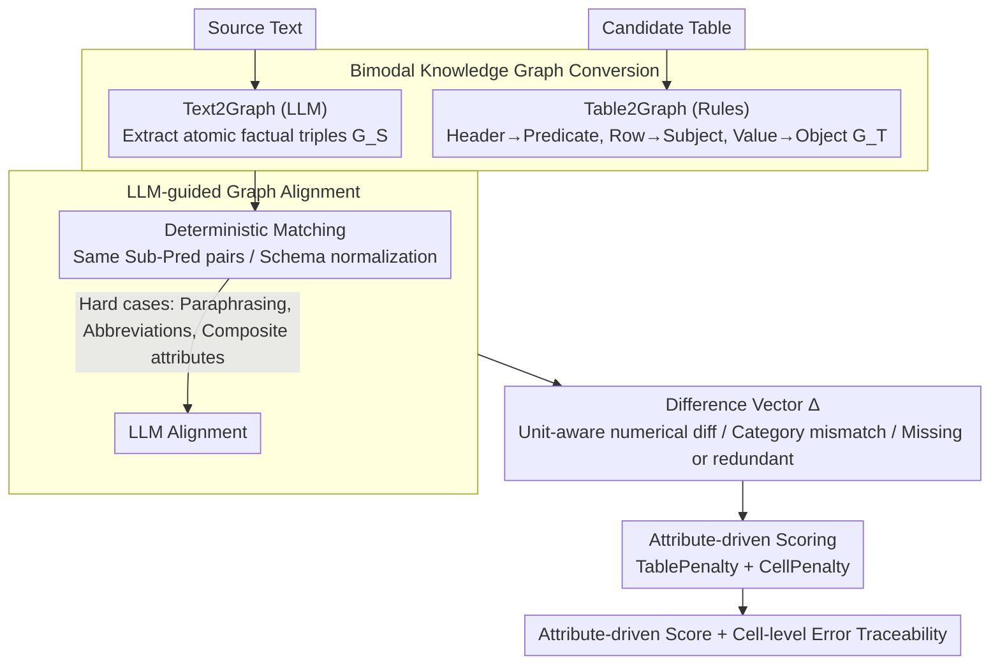

# TabReX: Tabular Referenceless eXplainable Evaluation

**Conference**: ACL 2026  
**arXiv**: [2512.15907](https://arxiv.org/abs/2512.15907)  
**Code**: [GitHub](https://github.com/TabReX)  
**Area**: Interpretability  
**Keywords**: Tabular evaluation metrics, referenceless evaluation, knowledge graph alignment, explainable evaluation, structured generation

## TL;DR

Ours proposes TabReX, a referenceless graph-reasoning-based framework for tabular generation evaluation. It converts source text and generated tables into knowledge graph (KG) triples and aligns them to compute explainable attribute-driven scores. TabReX significantly outperforms existing methods in correlation with human judgment and establishes a large-scale benchmark, TabReX-Bench.

## Background & Motivation

**Background**: As LLMs are increasingly utilized to generate or transform structured outputs (e.g., converting reports into financial tables, synthesizing patient data), automatic evaluation of table quality has become a critical requirement. Existing evaluation metrics include n-gram metrics (BLEU, ROUGE), embedding-based metrics (BERTScore, BLEURT), token-level exact matching (Exact Match, PARENT), QA-based referenceless metrics (QuestEval), and recent LLM-as-a-judge metrics (TabEval, TabXEval).

**Limitations of Prior Work**: (1) N-gram and embedding metrics flatten tables into text, completely ignoring row-column structures and unit semantics; (2) Token-level methods fail to distinguish harmless formatting adjustments from genuine factual errors; (3) QA metrics over-penalize layout changes (e.g., row reordering); (4) Most metrics require reference tables, limiting generalizability; (5) Existing benchmarks are small and feature single perturbation types, failing to comprehensively test metric robustness.

**Key Challenge**: Tabular evaluation must simultaneously consider structural fidelity and factual accuracy while distinguishing between data-preserving transformations (e.g., row reordering, unit conversion) and data-altering transformations (e.g., numerical tampering, row/column addition/deletion). Current metrics fail to perform well across both dimensions.

**Goal**: Design a referenceless, attribute-driven, and explainable tabular evaluation framework that provides cell-level error traceability and an adjustable sensitivity-specificity trade-off.

**Key Insight**: Tabular evaluation is framed as a graph alignment problem—both source text and generated tables can be represented as KG triples $[subject, predicate, object]$. Aligning these triples allows for precise localization of matching, missing, and redundant information.

**Core Idea**: Utilize Text2Graph and Table2Graph to unify both modalities into a triple space. Correspondences and discrepancies are identified through LLM-guided graph alignment, followed by an attribute-driven scoring function to compute explainable scores.

## Method

### Overall Architecture

TabReX reformulates the vague question of "is the table quality good" into a graph alignment problem. The input consists of the source text and a candidate table, while the output is an attribute-driven score with cell-level error traceability. It first compresses both modalities into KG triples via Text2Graph and Table2Graph. Subsequently, LLM-guided alignment identifies matches and discrepancies between the two sets of triples. Finally, a deterministic scoring function converts these discrepancies into structural and content penalties. The entire pipeline is referenceless and training-free, with the LLM utilized only for triple extraction and alignment.

### Key Designs

**1. Bimodal Knowledge Graph Conversion: Unifying Text and Tables in a Triple Space**

N-gram and embedding metrics often flatten tables into text strings, losing row-column structures and unit semantics. TabReX instead compares graphs. On the source text side, an LLM extracts atomic factual triples $\mathcal{G}_S = \{(s_i, p_i, o_i)\}$ based on entity-centric syntax, enforcing unified granularity, normalized predicates, and encoding numerical values with units. On the table side, triples are generated deterministically via lightweight rules without an LLM: headers serve as predicates, row identifiers as subjects, and cell values as objects. Placing both modalities in the same representation space eliminates modality-induced bias, while the deterministic rule-based path for tables ensures speed and reproducibility.

**2. LLM-guided Graph Alignment: Deterministic Matching followed by LLM Refinement**

Alignment is executed in two stages to separate mechanical matching from semantic reasoning. The first step involves deterministic matching, where triple pairs with identical subject-predicate pairs (or matching after schema normalization) are aligned directly for efficiency. The second step employs an LLM specifically for hard cases such as paraphrasing, abbreviations, and composite attributes (e.g., mapping "GDP growth (YoY)" to "growth_rate_2021"). Each aligned pair is associated with a difference vector $\Delta$, recording unit-aware numerical deviations, categorical mismatches, and missing/redundant flags. These discrepancies serve as the raw material for scoring and provide inherent traceability.

**3. Attribute-driven Scoring: Explainable with Adjustable Sensitivity-Specificity**

The scoring function derives two types of penalties from alignment results: TablePenalty measures the normalized ratio of missing entities (MI) and extra entities (EI) at the row/column level; CellPenalty measures cell-level missing, redundant, or partial matches (characterized by numerical deviation $\Gamma$). The final score is $\mathcal{S}_{\text{TabReX}} = \text{TablePenalty} + \text{CellPenalty}$. Practical utility is provided by weight parameters $(\alpha, \beta)$: increasing $\beta_{\text{MI}}$ shifts the metric toward sensitivity (rewarding information coverage), while increasing $\beta_{\text{EI}}$ shifts it toward specificity (penalizing hallucinations). This allow the framework to switch semantics for different scenarios (e.g., finance vs. clinical) via weights rather than changing metrics.

### Loss & Training

TabReX is a training-free, inference-time evaluation framework. The LLM is used only for Text2Graph and graph alignment, while the scoring function is entirely deterministic, introducing no learnable parameters.

## Key Experimental Results

### Main Results

Correlation with human rankings (Table 2):

| Metric Category | Method | Spearman ρ (↑) | Kendall τ (↑) | Tie ratio (↓) |
|---------|------|---------------|-------------|-------------|
| Non-LLM (Ref) | EM | 45.88 | 39.38 | 58.40 |
| Non-LLM (Ref) | BERTScore | 36.21 | 30.66 | 0.92 |
| LLM (Ref) | TabXEval | **80.27** | **72.37** | 45.33 |
| Referenceless | QuestEval | 62.93 | 52.29 | 3.03 |
| Referenceless | **TabReX** | **74.51** | **64.24** | **13.59** |

Under referenceless conditions, TabReX approaches the correlation of the strongest reference-based method, TabXEval, while maintaining a significantly lower tie ratio (13.6% vs 45.3%).

### Ablation Study

| Integration Method | Spearman ρ | Kendall τ | Description |
|---------|-----------|----------|------|
| Lex-Emb (Mean) | 38.43 | 32.65 | Lexical + Embedding Ensemble |
| LLM (Harmonic) | 56.00 | 46.93 | LLM Metric Ensemble |
| Hybrid (Harmonic) | 54.03 | 42.71 | Hybrid Ensemble |
| **TabReX** | **74.51** | **64.24** | Single Method |

### Key Findings

- TabReX as a single metric outperforms all ensemble methods, indicating the graph alignment paradigm is more effective than simple aggregation.
- The sensitivity-specificity trade-off of TabReX remains stable across easy to hard perturbations, whereas EM and H-Score degrade significantly.
- While TabXEval shows the highest correlation, its tie ratio is 45.3%, meaning nearly half of the distinct variants receive identical scores, indicating insufficient discriminative precision.
- TabReX-Bench (710 tables × 12 perturbations = 9120 instances, 6 domains, 3 difficulty levels) is currently the largest tabular evaluation benchmark.

## Highlights & Insights

- **KG Triples as Intermediate Representation**: This design simplifies modality alignment into a graph matching problem, naturally supporting dual evaluation of structure and semantics.
- **Adjustable Trade-off Utility**: The framework allows for domain-specific tuning (e.g., penalizing hallucinations in finance via higher $\beta_{\text{EI}}$ or ensuring completeness in clinical settings via higher $\beta_{\text{MI}}$).
- **Planner-driven Perturbation Generation**: Ensures benchmark diversity and reproducibility; a single LLM call generates 12 perturbations, ensuring higher consistency than sequential generation.

## Limitations & Future Work

- Text2Graph relies on LLMs for triple extraction, which may lack robustness for complex nested tables or non-standard formats.
- Evaluation costs depend on the number of LLM calls; latency and cost are non-negligible for large-scale use.
- Experiments focused on GPT-5-nano as the backbone; effectiveness with open-source models remains to be verified.
- Cross-table reasoning (requiring facts from multiple tables) is not yet covered.

## Related Work & Insights

- **vs. TabXEval**: TabXEval requires a reference and has high correlation but suffers from a high tie ratio; TabReX is referenceless and provides finer-grained discrimination.
- **vs. QuestEval**: Both are referenceless, but QuestEval relies on general QA signals and over-penalizes table-specific structural changes (e.g., row reordering); TabReX's graph alignment naturally ignores formatting variations.
- **vs. PARENT/BLEU**: These metrics are largely ineffective for structured output evaluation; TabReX represents a fundamental shift in the evaluation paradigm.

## Rating

- Novelty: ⭐⭐⭐⭐⭐ The referenceless tabular evaluation paradigm via graph alignment is a fresh approach; the attribute-driven scoring mechanism is sophisticated.
- Experimental Thoroughness: ⭐⭐⭐⭐⭐ TabReX-Bench is large and rigorously designed, with comprehensive baselines and human evaluation.
- Writing Quality: ⭐⭐⭐⭐ The framework is clearly described, though the density of formulas requires careful reading.
- Value: ⭐⭐⭐⭐⭐ Provides a significant push for structured generation evaluation with a generalizable and extensible framework.

<!-- RELATED:START -->

## Related Papers

- [\[ICLR 2026\] Human-LLM Collaborative Feature Engineering for Tabular Learning](../../ICLR2026/llm_evaluation/human-llm_collaborative_feature_engineering_for_tabular_data.md)
- [\[NeurIPS 2025\] ConTextTab: A Semantics-Aware Tabular In-Context Learner](../../NeurIPS2025/llm_evaluation/contexttab_a_semantics-aware_tabular_in-context_learner.md)
- [\[ACL 2026\] Reward Modeling for Scientific Writing Evaluation](reward_modeling_for_scientific_writing_evaluation.md)
- [\[ACL 2026\] IF-RewardBench: Benchmarking Judge Models for Instruction-Following Evaluation](if-rewardbench_benchmarking_judge_models_for_instruction-following_evaluation.md)
- [\[ACL 2026\] IF-Critic: Towards a Fine-Grained LLM Critic for Instruction-Following Evaluation](if-critic_towards_a_fine-grained_llm_critic_for_instruction-following_evaluation.md)

<!-- RELATED:END -->
