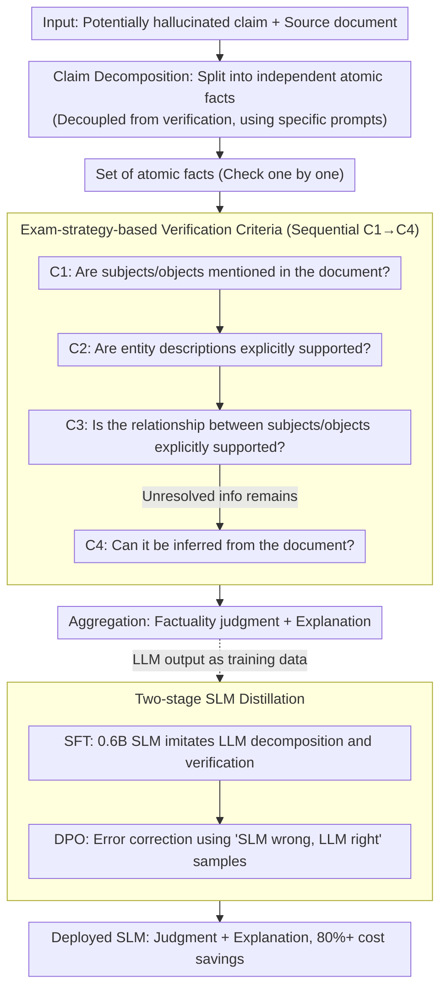

# Teaching Language Models to Check Grounded Claim Factuality with Human Test-Taking Strategies

**Conference**: ACL2026  
**arXiv**: [2605.29712](https://arxiv.org/abs/2605.29712)  
**Code**: https://github.com/Haruhi07/Test-Taking  
**Area**: LLM Evaluation  
**Keywords**: Fact-checking, Grounded fact-checking, LLM hallucination detection, Reading comprehension strategies, Small language model distillation

## TL;DR

This work reformulates grounded claim factuality checking as a True/False reading comprehension task. By incorporating structured prompts based on human test-taking strategies, LLMs can efficiently and accurately verify claims with minimal reasoning steps. Furthermore, Small Language Models (SLMs) are trained via Supervised Fine-Tuning (SFT) and Direct Preference Optimization (DPO) to replace Large Language Models, achieving over 80% savings in inference costs.

## Background & Motivation

**Background**: Large Language Models (LLMs) are widely used in generation tasks such as summarization and question answering. However, generated content often contains "hallucinations"—claims unsupported by the source document. This poses a significant threat to the credibility of applications like Retrieval-Augmented Generation (RAG). Existing factuality assessment methods generally fall into two categories: textual entailment classifiers, which are lightweight but require dataset-specific threshold tuning and lack universality; and the "LLM-as-a-judge" paradigm, which lacks explicit guidance for reasoning, resulting in lengthy reasoning steps and high costs.

**Limitations of Prior Work**: Textual entailment methods require document truncation or chunking, often leading to information loss. When LLMs perform direct judgment, they fail to fully utilize their reasoning capabilities—producing either overly long free-form reasoning or inconsistent judgments without structural guidance. Cross-dataset generalization remains weak.

**Key Challenge**: How to enable models to perform fact-checking systematically and interpretably without increasing inference costs? There is a tension between model complexity and reasoning efficiency; while large models are capable but expensive, small models are fast but have limited understanding.

**Goal**: To design a two-stage pipeline that decomposes claims into atomic facts and systematically verifies each fact. Additionally, to develop a method to distill LLM capabilities into SLMs to balance cost and performance.

**Key Insight**: The authors observe that human strategies for True/False reading comprehension in language exams are highly systematic: verifying explicitly mentioned information before reasoning about implicit information. This exam strategy is applicable to LLM fact-checking, as it can be converted into explicit verification criteria to guide the reasoning process.

**Core Idea**: Redefine the fact-checking problem as a reading comprehension task. Replace free-form reasoning with four exam-based verification criteria (C1-C4), enabling LLMs to generate judgments and explanations in a structured and controlled manner, significantly reducing inference costs.

## Method

### Overall Architecture

The method decomposes the verification of whether a claim is grounded in a source document into two sequential stages. Given a potentially hallucinated claim and the source document, the LLM first performs "claim decomposition" to split complex claims into independent atomic facts. Then, "fact verification" is performed for each atomic fact using a set of human-inspired criteria, concluding with a final judgment and explanation. The key insight is that complex claims often scatter information across different parts of a document; holistic verification leads to missed evidence or confusion, while a decompose-then-check approach focuses each step on a single target. Furthermore, SFT and DPO are used to distill these capabilities into a 0.6B SLM to achieve over 80% cost reduction.

### Key Designs

**1. Exam-Strategy-Based Verification Criteria: Reframing Vague Judgment as a Decision Tree**

Determining if a claim is "grounded" is often too vague, leading models to generate redundant reasoning or inconsistent results. Borrowing from human reading comprehension strategies—finding explicit evidence before inferring—the authors formalize four sequential criteria: C1 checks if the subjects/objects exist in the document; C2 verifies their descriptions; C3 validates the relationship between them; and C4 determines if remaining info can be logically inferred. This decision tree allows models to conclude early with explicit evidence and reserve expensive reasoning for the final step, improving both accuracy and computational efficiency.

**2. Decoupled Claim Decomposition and Fact Verification**

Combining "decomposition" and "verification" in a single call reduces parallelism and risks error propagation between tasks. This work decouples the stages: the first step uses few-shot prompting to split complex claims (e.g., "Ice can turn into liquid water, and liquid water into steam, and vice versa") into atomic facts ("Ice turns to water," "Water turns to steam," etc.). The second step applies C1-C4 to each fact. This ensures the model focuses solely on logical segmentation during decomposition and evidence retrieval during verification, while providing a clear interface for distilling specific stages into different model sizes.

**3. Two-Stage SLM Distillation Strategy: Imitation followed by Correction**

SLMs lack world knowledge and reasoning depth, making naive distillation ineffective. The authors use a two-stage approach: (1) SFT allows a 0.6B SLM to imitate LLM-generated atomic facts and verification processes to learn basic steps; (2) DPO focuses on "SLM wrong, LLM right" samples, treating LLM outputs as chosen completions and SLM errors as rejected completions. DPO is more effective than continued SFT because it maximizes the probability margin $\beta[s_\theta(x, y_c) - s_\theta(x, y_r)]$ between correct and incorrect samples. This mimics the human learning process of "understanding steps, then correcting mistakes," allowing the SLM to approach LLM accuracy while slashing costs.

### A Complete Example

For the claim "Ice can turn into liquid water, and liquid water into steam, and vice versa": decomposition first splits it into facts like "Ice turns to water," "Water turns into steam," and "Steam turns into ice." In the verification stage, each fact follows C1→C4. C1 confirms if "ice," "water," and "steam" appear in the document; C2 checks their descriptions; C3 verifies the "turns into" relationship. If information remains unresolved (e.g., the reverse phase transitions implied by "vice versa"), the model proceeds to C4 for inference. Aggregating these results provides the final factuality judgment and explanation.

### Loss & Training

SFT Objective (Claim Decomposition): $L(\theta) = \mathbb{E}_{(c,\{f_{\text{ref}}\}) \sim D_{\text{De}}}[\log P_\theta(\{f_{\text{ref}}\} | c)]$, where $c$ is the claim and $\{f_{\text{ref}}\}$ is the set of reference facts generated by the LLM.

SFT Objective (Fact Verification): $L(\theta) = \mathbb{E}_{D_{\text{Re\_SFT}}}[\log P_\theta(r_{\text{ref}} | x)]$, where $x$ contains the source document and atomic fact, and $r_{\text{ref}}$ is the reference explanation.

DPO Objective (Mistake Revision): $L(\theta) = -\mathbb{E}_{D_{\text{Re\_DPO}}}[\log \sigma[\beta(s_\theta(x, y_c) - s_\theta(x, y_r))]]$, where $y_c$ is the correct LLM output, $y_r$ is the incorrect SLM output, $s_\theta$ is the log probability, and $\beta$ is a temperature parameter.

## Key Experimental Results

### Main Results

Evaluated on two standard datasets: **FacTax-Benchmark** (news and dialogue summarization) and **LLM-AggreFact** (multi-source, LLM-generated claims). The metric used is **Balanced Accuracy** (BAcc) due to label imbalance: $\text{BAcc} = \frac{1}{2}(\text{TP}/(\text{TP}+\text{FN}) + \text{TN}/(\text{TN}+\text{FP}))$.

| Method | Model Size | FacTax | LLM-AggreFact | Avg. Rank |
|------|---------|-----------|---------------|---------|
| ChatGPT-3.5 (ZS) | - | 70.1 | 70.1 | 13.8 |
| TrueTeacher | 11B | 73.0 | 73.3 | 8.4 |
| FactCG | 0.4B | 67.0 | 75.6 | 5.8 |
| MiniCheck-BeSpoke | 7B | 71.4 | 77.4 | 3.3 |
| Qwen3-4B-Instruct (Ours) | 4B | 73.0 | 75.6 | 7.1 |
| Qwen3-30B-Instruct (Ours) | 30B | **78.0** | 76.3 | **3.6** |
| Qwen3-0.6B+SFT (Ours) | 0.6B | 68.9 | 71.3 | 12.1 |
| Qwen3-0.6B+SFT+DPO (Ours) | 0.6B | 72.6 | 73.6 | 7.2 |

Ours (Qwen3-30B-Instruct) achieves a **new SOTA** (78.0) on FacTax-Benchmark and ranks second on LLM-AggreFact. Importantly, the 0.6B SLM trained with SFT+DPO approaches ChatGPT-3.5 performance and is comparable to TrueTeacher (11B).

### Ablation Study

| Configuration | FacTax | LLM-AggreFact | Description |
|------|--------|---------------|------|
| Full Model | 73.0 | 75.6 | Decomposition + Verification Strategy |
| w/o Decomposition | 72.3 | 74.6 | Verification criteria only, no decomposition |
| w/o Strategy | 71.6 | 73.1 | Decomposition only, no C1-C4 guidance |
| w/o Both | 69.4 | 72.1 | Direct judgment of original claim |

**Key Findings**: (1) **Decomposition contributes steadily**—accuracy drops by 0.7-1.0% without it, proving it necessary but not the primary driver. (2) **Verification strategy is the core contribution**—accuracy drops by 1.4-2.5% without C1-C4 guidance. (3) **Significant token reduction**—compared to "thinking" modes, this method uses only 10.4%-10.5% (FacTax) and 12.5%-17.7% (LLM-AggreFact) of tokens, representing **over 80%** cost savings. (4) **SLM training requirements**—leave-one-out tests show performance drops significantly (e.g., from 71.3% to 62.1% on LLM-AggreFact if its data is removed), indicating SLMs need multi-source data for generalization.

## Highlights & Insights

- **Ingenious Transfer of Exam Strategies**: Using the "explicit evidence first, inference second" strategy from human language testing to guide ML tasks demonstrates the value of cross-domain knowledge transfer. This concise strategy avoids inefficient long-chain reasoning, yielding tangible >80% token savings.
- **Utility of Decoupled Design**: Breaking complex tasks into independent modules facilitates module-level optimization and allows for heterogeneous model combinations (e.g., small decomposer, large verifier).
- **Innovative Distillation Application**: Combining SFT and DPO to let the model learn the process and سپس correct its own errors outperforms pure SFT. This framework effectively combines the benefits of supervised and preference-based learning for resource-constrained scenarios.
- **Cross-dataset Robustness**: Competitive results on two distinct datasets (FacTax rank 3.6, LLM-AggreFact rank 4) demonstrate the universality of the design.

## Limitations & Future Work

- **SLM Generalization**: SLMs require substantial multi-source training data to generalize to new datasets, limiting applicability in low-resource settings. Future work could explore meta-learning or few-shot adaptation.
- **Struggle with Complex Documents**: Performance drops on datasets containing long/complex documents (e.g., LFQA, TOFUEVAL-MediaS), even for the teacher model. Integration of retrieval-augmented or information-compression techniques is needed.
- **Strictness vs. Inference Trade-off**: Ablation shows models can be overly strict when applying C3/C4, viewing minor phrasing differences as mismatches. Dynamic strictness adjustment or context-aware similarity metrics could be explored.
- **Inference Chain Length**: While token usage is reduced, more aggressive compression—such as one-step keyword extraction instead of sequential criteria checking—remains unexplored.

## Related Work & Insights

- **vs. Textual Entailment** (Zha et al., 2023; Laban et al., 2022): Entailment classifiers are light but require threshold tuning and are documentnd-length sensitive. Ours avoids thresholds and improves accuracy via strategy guidance.
- **vs. LLM Direct Judgment** (Luo et al., 2023; Xu et al., 2024): Previous works used free-form reasoning or simple error definitions. Our innovation lies in a **systematic verification workflow** that improves accuracy while cutting costs.
- **vs. QA-based Methods** (Fabbri et al., 2022; Wang et al., 2020): QA methods involve complex multi-step pipelines. Ours simplifies this to decomposition and criteria verification.
- **vs. Knowledge Distillation for Reasoning** (QwenTeam, 2025; DeepSeek-AI, 2025): While distillation is proven for math/reasoning, this work is among the first to apply the SFT+DPO combination to **fact-checking**, demonstrating SLM potential in verification.

## Rating

- **Novelty**: ⭐⭐⭐⭐ Systematic application of human exam strategies to guide model reasoning is a practical innovation; the SFT+DPO combination in this context is relatively novel.
- **Experimental Thoroughness**: ⭐⭐⭐⭐⭐ Comprehensive benchmarking against multiple baselines across two datasets. Includes multi-level ablation, hyperparameter sensitivity, and prompt robustness testing.
- **Writing Quality**: ⭐⭐⭐⭐ Clear logic and vivid examples (e.g., the phase transition case). Diagram design is intuitive, though slightly verbose in a few ablation sections.
- **Value**: ⭐⭐⭐⭐⭐ Addresses real-world RAG issues (hallucination detection) with a training-free LLM method and a clear path for low-cost SLM deployment. Highly relevant for both industry and academia.

<!-- RELATED:START -->

## Related Papers

- [\[ACL 2026\] Teaching Language Models to Forecast Research Success Through Comparative Idea Evaluation](teaching_language_models_to_forecast_research_success_through_comparative_idea_e.md)
- [\[ICLR 2026\] SimBench: Benchmarking the Ability of Large Language Models to Simulate Human Behaviors](../../ICLR2026/llm_evaluation/simbench_benchmarking_the_ability_of_large_language_models_to_simulate_human_beh.md)
- [\[ICLR 2026\] Train-before-Test Harmonizes Language Model Rankings](../../ICLR2026/llm_evaluation/train-before-test_harmonizes_language_model_rankings.md)
- [\[ACL 2026\] Revisiting the Reliability of Language Models in Instruction-Following](revisiting_the_reliability_of_language_models_in_instruction-following.md)
- [\[ACL 2026\] NovBench: Evaluating Large Language Models on Academic Paper Novelty Assessment](novbench_evaluating_large_language_models_on_academic_paper_novelty_assessment.md)

<!-- RELATED:END -->
