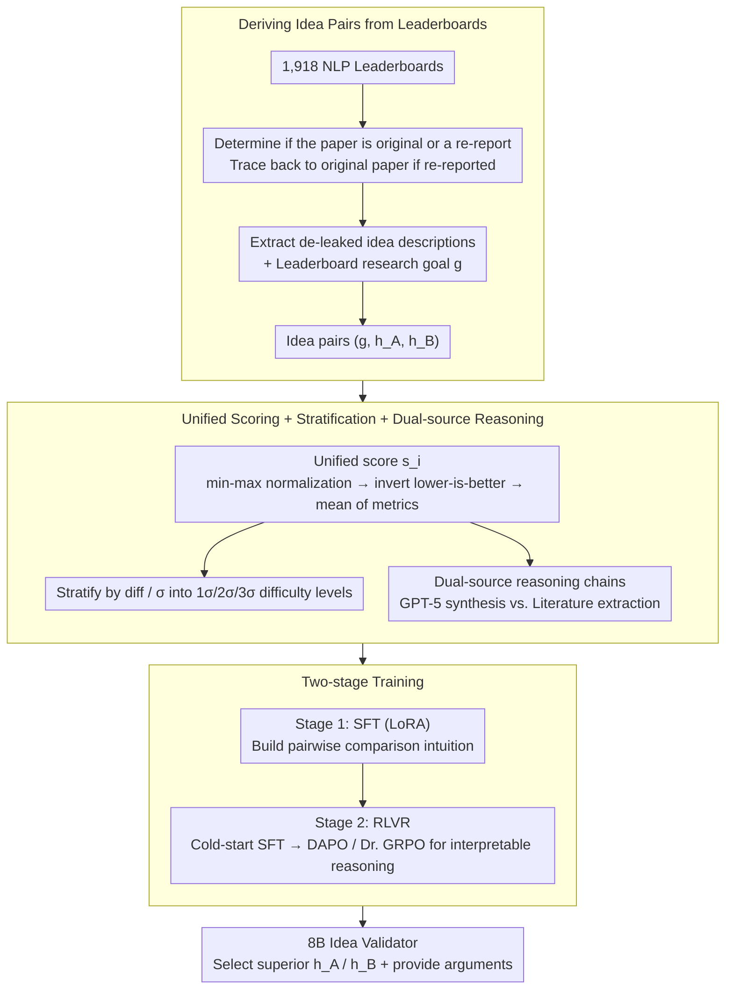

# Teaching Language Models to Forecast Research Success Through Comparative Idea Evaluation

**Conference**: ACL 2026 Findings  
**arXiv**: [2605.21491](https://arxiv.org/abs/2605.21491)  
**Code**: To be released  
**Area**: LLM Evaluation / LLM Reasoning  
**Keywords**: Comparative Prediction, LLM Evaluation, Research Idea Ranking, RL Reasoning

## TL;DR

This paper investigates whether language models can learn to predict the empirical success of research ideas. By constructing a dataset of 11,488 idea pairs (based on objective PapersWithCode outcomes) and training 8B models using SFT and RLVR, the models achieve 77.1% accuracy, surpassing GPT-5's 61.1% and serving as an effective idea validator for automated scientific discovery.

## Background & Motivation

**Background**: In recent years, LLMs have begun to act as autonomous scientific agents capable of automatically generating hypotheses, implementing experiments, and analyzing results. A typical paradigm is "high-throughput idea generation": given a research goal, models generate hundreds of candidate methods. However, current idea evaluation relies entirely on subjective LLM judgment (e.g., novelty, excitement, feasibility), which often serve as mere proxies—an idea might be novel but fail in practice.

**Limitations of Prior Work**: (1) Evaluation lacks objectivity: current systems use LLM scoring based on fabricated criteria rather than real experimental results; (2) Efficiency bottlenecks: hundreds of ideas cannot be verified through experiments one by one; (3) Lack of interpretability: black-box scoring fails to explain why one idea is superior to another.

**Key Challenge**: How to use objective empirical results to predict which idea will perform better without actually running experiments?

**Goal**: To explore whether LMs can learn to predict the empirical success of research ideas and support these predictions with interpretable reasoning chains.

**Key Insight**: Frame the problem as "comparative empirical prediction"—given a research goal and two ideas, predict which will achieve better results on a benchmark. The key observation is that while precise prediction is difficult, researchers routinely form intuitions by comparing existing works; the goal is to determine if LMs can acquire this intuition.

**Core Idea**: Extract a dataset of idea pairs from PapersWithCode benchmark leaderboards based on objective results. Use SFT and RL (with verifiable rewards) to train small LMs for comparative evaluation and reasoning, achieving performance superior to GPT-5.

## Method

### Overall Architecture

The study reframes "predicting success" as a verifiable comparative task: the input consists of a research goal $g$ and two de-identified idea descriptions $h_A, h_B$, and the output is the one that achieves better objective performance on the benchmark. To make this task learnable, the authors first extract "determined" idea pairs from PapersWithCode leaderboards, paired with unified win/loss labels derived from real experimental results and difficulty levels. A two-stage training approach—"Intuition building via SFT + Reasoning via RLVR"—is employed to transform an 8B model into an idea validator capable of both judgment and interpretable argumentation.

### Key Designs

**1. Deriving idea pairs from leaderboards: Ensuring labels come from real experiments rather than subjective scores.**  
The root cause of unreliable idea evaluation is that training signals are often fabricated—previously, LLMs scored "novelty/feasibility" subjectively. This work instead captures objective results from 1,918 NLP leaderboards. Each leaderboard record points to a Result-Reporting (RR) paper; an LLM determines if it is the original method proposer. If not, the system traces back to the original paper. Idea descriptions containing only algorithmic and mathematical details (removing results, authors, and dates to prevent leakage) are then extracted, alongside research goals (e.g., "detecting cyber threats"). Manual verification showed 92% accuracy, ensuring high-fidelity training pairs.

**2. Unified scoring + difficulty stratification + dual-source reasoning: Aligning heterogeneous benchmarks into comparable supervision signals.**  
Metrics across benchmarks are inherently incomparable (e.g., higher is better vs. lower is better for perplexity). The authors apply min-max normalization within each benchmark, inverting "lower is better" metrics, and take the mean to produce a unified score $s_i$. Pairs are categorized into 1σ (Hard), 2σ (Medium), and 3σ (Easy) based on the score difference relative to the standard deviation $\sigma$. To teach the model "how to argue" rather than just "which to pick," two types of reasoning chains are prepared: Synthesis (GPT-5 generates structured reasoning for 1,369 correct judgments, expanded to 2,738 via position swapping) and Literature (extracting existing arguments from the experimental discussions of papers that compare multiple methods).

**3. Two-stage training: Establishing intuition via SFT and learning interpretable reasoning via RLVR.**  
Allowing a small model to generate reasoning freely initially leads to performance drops, so training is split. The first step involves standard SFT on an 8B model using LoRA (rank=64, lr=2e-4) to optimize the classification loss $\mathcal{L}_{SFT}=-\log P(y\mid g,h_A,h_B)$, solidifying comparative intuition. The second step uses 170 labeled pairs for cold-start SFT to teach scientific argumentation style, followed by RLVR using DAPO and Dr. GRPO. Rewards are based on correctness (+3 for correct, -3 for incorrect) and format (+0.5 for thought/answer tags). Constrained style and format rewards prevent reward hacking, while Dr. GRPO corrects length bias introduced by standard GRPO deviation terms.

## Key Experimental Results

### Main Results: Base Performance

| Model | 1-σ | 2-σ | 3-σ | Total | Cross-domain |
|-------|-----|-----|-----|-------|--------------|
| Qwen3 Base | 18.4% | 26.1% | 11.0% | 20.1% | 3.6% |
| Direct-SFT | 70.9% | 85.6% | 84.6% | **77.1%** | 45.7% |
| Reason-SFT-DrGRPO | 66.2% | 76.4% | 83.5% | 71.4% | 49.1% |
| GPT-5 (High Reasoning) | 61.9% | 61.3% | 56.0% | 61.1% | 46.0% |

**Key Findings**: (1) SFT dramatically improves 8B model performance from 20% to 77%, exceeding GPT-5's 61.1%; (2) Difficulty stratification is effective (1σ < 2σ < 3σ); (3) While RL has slightly lower precision, it demonstrates better cross-domain generalization.

### Independent Test Sets and Robustness

| Model | Accuracy |
|-------|----------|
| Qwen3 Direct-SFT | 63.4% |
| Qwen3 Reason-SFT-DrGRPO | **67.5%** |
| GPT-4.1 + Retrieval | 51.4% |

**Key Findings**:
- The 8B model outperforms GPT-4.1 by 16 percentage points on independent datasets, proving it has learned transferable comparative reasoning.
- Position bias consistency exceeds 85%, indicating independence from input order.
- No length bias; the model does not favor longer descriptions.
- Accuracy remains stable after paraphrasing by Gemini-2.5, confirming content understanding.

## Highlights & Insights

- **Small Model Surpassing Large Models**: The 8B model after SFT outperforms GPT-5 by 16 points, demonstrating the power of task-specific fine-tuning.
- **Clever RL Reasoning Design**: Instead of using self-generated reasoning directly (which degrades performance), the model uses labeled cold-starts followed by RL exploration. This two-stage strategy prevents reward hacking and generates coherent explanations.
- **Unified Scoring Resolves Heterogeneity**: Using min-max normalization, direction checking, and averaging elegantly handles multi-metric issues across diverse benchmarks.

## Limitations & Future Work

- Data may inherit noise from PapersWithCode.
- The effectiveness of this scheme in real-world idea-screening workflows has not been fully verified.
- The dataset is limited to NLP; extending it to other domains requires additional effort.

**Additional Observation**: Synthetic reasoning chains were less effective than literature-derived ones; Dr. GRPO generates coherent explanations more stably than DAPO.

## Related Work & Insights

- **vs. Absolute Scoring** (Baek et al. 2025): Relative comparison is more objective and correlates better with experimental success than absolute scoring.
- **vs. Previous Comparison Work** (Wen et al. 2025): This work is more fine-grained, demonstrates small models surpassing large models, and provides interpretable reasoning.
- **vs. LLM Event Prediction** (Halawi et al. 2024): Applying event prediction to research idea comparison provides a more specialized application.

## Rating

- Novelty: ⭐⭐⭐⭐ The comparative framework is novel, and the idea dataset is unique, though increments are specialized.
- Experimental Thoroughness: ⭐⭐⭐⭐⭐ Includes multiple test sets, detailed ablation, and comprehensive robustness stress tests.
- Writing Quality: ⭐⭐⭐⭐ Clear and in-depth, though moving some technical details to the appendix is a minor drawback.
- Value: ⭐⭐⭐⭐⭐ Directly supports idea filtering for autonomous research systems; the efficient small-model solution is highly attractive for application.

<!-- RELATED:START -->

## Related Papers

- [\[ACL 2026\] Teaching Language Models to Check Grounded Claim Factuality with Human Test-Taking Strategies](teaching_language_models_to_check_grounded_claim_factuality_with_human_test-taki.md)
- [\[ACL 2026\] Aggregate vs. Personalized Judges in Business Idea Evaluation: Evidence from Expert Disagreement](aggregate_vs_personalized_judges_in_business_idea_evaluation_evidence_from_exper.md)
- [\[ACL 2026\] Enhancing Linguistic Competence of Language Models through Pre-training with Language Learning Tasks](enhancing_linguistic_competence_of_language_models_through_pre-training_with_lan.md)
- [\[ACL 2025\] AbGen: Evaluating Large Language Models in Ablation Study Design and Evaluation for Scientific Research](../../ACL2025/llm_evaluation/abgen_evaluating_large_language_models_in.md)
- [\[ACL 2026\] Language Models Don't Know What You Want: Evaluating Personalization in Deep Research Needs Real Users](language_models_dont_know_what_you_want_evaluating_personalization_in_deep_resea.md)

<!-- RELATED:END -->
