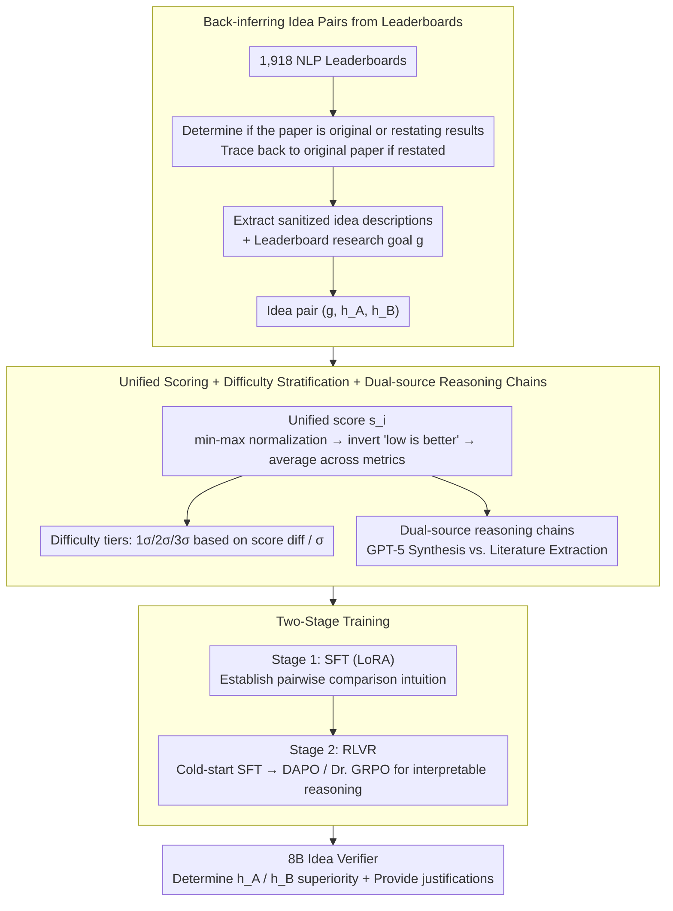

# Teaching Language Models to Forecast Research Success Through Comparative Idea Evaluation

**Conference**: ACL 2026 Findings  
**arXiv**: [2605.21491](https://arxiv.org/abs/2605.21491)  
**Code**: To be released  
**Area**: LLM Evaluation / LLM Reasoning  
**Keywords**: Comparative Forecasting, LLM Evaluation, Research Idea Ranking, Reinforcement Learning for Reasoning

## TL;DR

This paper investigates whether language models can learn to predict the empirical success of research ideas. By constructing a dataset of 11,488 idea pairs based on objective outcomes from PapersWithCode, the authors trained an 8B model using SFT and RLVR to achieve 77.1% accuracy, outperforming GPT-5's 61.1% and serving as an effective idea verifier for automated scientific discovery.

## Background & Motivation

**Background**: Recently, LLMs have begun to serve as autonomous research agents capable of automatically generating hypotheses, implementing experiments, and analyzing results. A typical paradigm is "high-throughput idea generation": given a research goal, the model generates hundreds of candidate methods. However, current idea evaluation relies entirely on subjective LLM judgments (novelty, excitement, feasibility, etc.), which often serve as mere proxies—an idea might be novel and interesting but fail completely in practice.

**Limitations of Prior Work**: (1) Evaluation lacks objectivity: current systems use LLM scoring based on fabricated criteria rather than real experimental results; (2) Evaluation efficiency bottleneck: hundreds of ideas cannot be validated through experiments one by one; (3) Lack of interpretability: black-box scoring fails to inform researchers why a specific idea is superior.

**Key Challenge**: How to use objective empirical results to predict which idea will perform better without actually running experiments?

**Goal**: To explore whether LMs can learn to predict the empirical success of research ideas and support these predictions with interpretable reasoning chains.

**Key Insight**: Framework the problem as "comparative empirical prediction"—given a research goal and two ideas, predict which will perform better on a benchmark. The key observation is that while precise absolute prediction is difficult, researchers routinely develop intuition by comparing existing works; the question is whether LMs can learn this intuition.

**Core Idea**: Extract a dataset of idea pairs from PapersWithCode benchmark leaderboards based on objective results. Use SFT and RL (with verifiable rewards) to train a small LM for comparative evaluation and reasoning, achieving performance superior to GPT-5.

## Method

### Overall Architecture

This paper reframes "predicting idea success" as a verifiable comparative task: the input consists of a research goal $g$ and two de-identified idea descriptions $h_A, h_B$, and the output predicts which one achieves better objective results on a benchmark. To make this task learnable, the authors first mined a large number of idea pairs with established outcomes from PapersWithCode leaderboards, paired them with unified win/loss labels and difficulty levels derived from real experimental results. This was followed by a two-stage training process: "SFT for intuition building + RLVR for reasoning learning," resulting in an 8B model that functions as an idea verifier identifying superior methods and providing interpretable arguments.

### Key Designs

**1. Back-inferring idea pairs from leaderboards: Deriving labels from real experiments rather than subjective scores.**  
The unreliability of idea evaluation stems from the fact that training signals are often fabricated—previous works used LLMs to provide subjective scores for "novelty/feasibility." This work instead extracts objective outcomes from 1,918 NLP leaderboards. Each leaderboard record points to a Result-Reporting (RR) paper. An LLM first determines if the paper is the original creator of the method or a restater; if the latter, it traces back to the original paper. Descriptions containing only algorithmic and mathematical details are extracted, stripping away results/authors/years to prevent leakage. Research goals (e.g., "detecting cyber threats") are extracted from official leaderboard descriptions. Manual validation showed 92% description accuracy (4% incomplete, 8% incorrect), ensuring the credibility of training pairs.

**2. Unified scoring + Difficulty stratification + Dual-source reasoning chains: Aligning heterogeneous benchmarks into comparable supervisory signals.**  
Metrics across benchmarks are naturally incomparable—some are higher-is-better, while others (like perplexity) are lower-is-better, with varying scales. The authors apply min-max normalization to all metrics within a benchmark, invert "lower-is-better" items, and average multiple metrics to obtain a unified score $s_i$. Pairs are categorized into 1σ (Hard), 2σ (Medium), and 3σ (Easy) based on the score difference relative to the standard deviation $\sigma$, facilitating analysis by difficulty level. To teach the model "how to argue" rather than just "which to pick," two types of reasoning chains were prepared: Synthesis used GPT-5 to generate structured reasoning traces for 2,125 pairs (filtering the 1,369 correct ones and expanding to 2,738 via position swapping), while Literature Extraction pulled arguments directly from experimental discussions in papers comparing multiple methods.

**3. Two-stage training: SFT for intuition and RLVR for interpretable reasoning.**  
Allowing a small model to generate reasoning freely can lead to performance drops, so training is split into two steps. Step one uses standard SFT on the 8B model with LoRA (rank=64, lr=2e-4) to optimize the classification loss $\mathcal{L}_{SFT}=-\log P(y\mid g,h_A,h_B)$, solidifying comparative intuition. Step two uses 170 labeled pairs for cold-start SFT to teach scientific argumentation style, followed by RLVR using DAPO and Dr. GRPO. Rewards are based on correctness (+3 for correct, -3 for incorrect) and format (+0.5 each for thought and answer tags). Constraints on argumentation style and format rewards suppress reward hacking, while Dr. GRPO corrects length bias introduced by standard GRPO variance terms. This combination allows the small model to maintain judgment accuracy while producing coherent, readable explanations.

## Key Experimental Results

### Main Results: Basic Performance

| Model | 1-σ | 2-σ | 3-σ | Overall | Cross-domain |
| :--- | :--- | :--- | :--- | :--- | :--- |
| Qwen3 Base | 18.4% | 26.1% | 11.0% | 20.1% | 3.6% |
| Direct-SFT | 70.9% | 85.6% | 84.6% | **77.1%** | 45.7% |
| Reason-SFT-DrGRPO | 66.2% | 76.4% | 83.5% | 71.4% | 49.1% |
| GPT-5 (High Reasoning) | 61.9% | 61.3% | 56.0% | 61.1% | 46.0% |

**Key Findings**: (1) SFT dramatically improves 8B model performance from 20% to 77%, surpassing GPT-5's 61.1%; (2) Difficulty stratification is effective, with 1σ < 2σ < 3σ; (3) While RL has slightly lower precision, it shows better cross-domain generalization.

### Independent Test Sets & Robustness

| Model | Accuracy |
| :--- | :--- |
| Qwen3 Direct-SFT | 63.4% |
| Qwen3 Reason-SFT-DrGRPO | **67.5%** |
| GPT-4.1 + Retrieval | 51.4% |

**Key Findings**:
*   The 8B model outperforms GPT-4.1 by 16 percentage points on independent datasets, proving it has learned transferable comparative reasoning.
*   Position bias consistency exceeds 85%, indicating no reliance on input order.
*   No length bias; the model does not prefer longer descriptions.
*   No significant performance drop after paraphrasing by Gemini-2.5, suggesting the model understands context.

## Highlights & Insights

*   **Small Models Outperforming Large Models**: The 8B model beats GPT-5 by 16 points after SFT, demonstrating the power of task-specific fine-tuning.
*   **Ingenious RL Reasoning Design**: Instead of using self-generated reasoning (which reduces performance), the authors use labeled cold-starts followed by RL exploration. This two-stage strategy avoids reward hacking and generates coherent explanations.
*   **Unified Scoring for Heterogeneity**: Min-max normalization + direction checking + averaging elegantly handles multi-metric problems across different benchmarks.

## Limitations & Future Work

**Limitations**:
*   The data may inherit noise from PapersWithCode.
*   The effectiveness of this approach in actual idea-screening workflows has not been fully validated.
*   The dataset is limited to NLP; extending to other domains requires additional work.

**Additional Observations**: Synthetic reasoning chains are less effective than literature-based ones; Dr. GRPO is more stable than DAPO in generating coherent explanations.

## Related Work & Insights

*   **vs. Absolute Scoring** (Baek et al. 2025): Relative comparison is more objective and corresponds better to experimental success than absolute scoring.
*   **vs. Previous Comparative Work** (Wen et al. 2025): This work is more fine-grained, demonstrates small models beating large ones, and provides interpretable reasoning.
*   **vs. LLM Event Forecasting** (Halawi et al. 2024): Applying event forecasting to research idea comparison makes it more specialized.

## Rating

*   Novelty: ⭐⭐⭐⭐ The comparative framework is novel and the idea dataset is distinctive, though increments are focused.
*   Experimental Thoroughness: ⭐⭐⭐⭐⭐ Comprehensive multiple test sets, detailed ablation, and robust pressure testing.
*   Writing Quality: ⭐⭐⭐⭐ The paper is clear and deep, though moving technical details to the appendix is a minor drawback.
*   Value: ⭐⭐⭐⭐⭐ Directly supports idea screening in autonomous research systems; the efficient small-model solution is attractive for applications.

<!-- RELATED:START -->

## Related Papers

- [\[ICML 2026\] InnoEval: On Research Idea Evaluation as a Knowledge-Grounded, Multi-Perspective Reasoning Problem](../../ICML2026/llm_evaluation/innoeval_on_research_idea_evaluation_as_a_knowledge-grounded_multi-perspective_r.md)
- [\[ACL 2026\] Teaching Language Models to Check Grounded Claim Factuality with Human Test-Taking Strategies](teaching_language_models_to_check_grounded_claim_factuality_with_human_test-taki.md)
- [\[ACL 2026\] Enhancing Linguistic Competence of Language Models through Pre-training with Language Learning Tasks](enhancing_linguistic_competence_of_language_models_through_pre-training_with_lan.md)
- [\[ACL 2026\] Aggregate vs. Personalized Judges in Business Idea Evaluation: Evidence from Expert Disagreement](aggregate_vs_personalized_judges_in_business_idea_evaluation_evidence_from_exper.md)
- [\[ACL 2026\] Capabilities and Evaluation Biases of Large Language Models in Classical Chinese Poetry Generation: A Case Study on Tang Poetry](capabilities_and_evaluation_biases_of_large_language_models_in_classical_chinese.md)

<!-- RELATED:END -->
