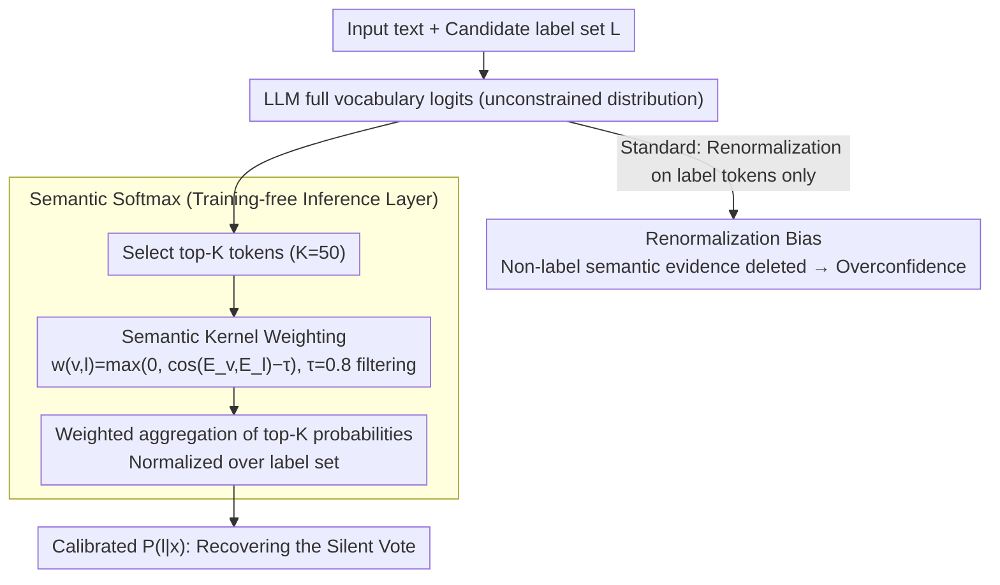

# The Silent Vote: Improving Zero-Shot LLM Reliability by Aggregating Semantic Neighborhoods

**Conference**: ACL 2026  
**arXiv**: [2605.09739](https://arxiv.org/abs/2605.09739)  
**Code**: None  
**Area**: LLM Evaluation / Calibration / Zero-shot Classification  
**Keywords**: Semantic Softmax, Calibration Error, Constrained Decoding, Semantic Neighborhoods, Uncertainty Estimation  

## TL;DR
This paper points out that constrained softmax in zero-shot LLM classification discards probability mass near label synonyms. It proposes a training-free Semantic Softmax that aggregates the "silent votes" of top-K vocabulary tokens back to target labels, significantly reducing ECE and Brier Score while improving AUROC/F1.

## Background & Motivation
**Background**: LLM-as-a-classifier has become a common paradigm for many text classification tasks. In practical deployment, to ensure the model outputs only valid categories, systems typically restrict the vocabulary to specific label tokens and perform softmax only among these tokens.

**Limitations of Prior Work**: While this constrained decoding ensures formatting correctness, it distorts probabilities. A model might consider an input closer to related words like "thrilling," "delightful," or "toxic-ish," but because these words are not in the candidate label set, they are directly masked before the softmax operation.

**Key Challenge**: Classification labels are discrete, but the distribution of semantic evidence in LLMs is spread across continuous semantic neighborhoods in the vocabulary. Treating all non-label tokens as irrelevant causes the remaining label probabilities to be renormalized to excessively high confidence, creating a systematic error the authors term Renormalization Bias.

**Goal**: The authors aim to make zero-shot classification probabilities closer to the true uncertainty of the model without fine-tuning or changing the model architecture, especially in tasks like sentiment and toxicity where annotator disagreement naturally exists.

**Key Insight**: The paper observes that the model's output embedding space already contains the "relationship between label tokens and similar semantic tokens." By aggregating the probability mass of these similar tokens to the target labels based on semantic weights, the Silent Vote discarded by constrained softmax can be recovered.

**Core Idea**: Instead of looking only at the logit of the label token itself, the method examines which tokens among the top-K vocabulary candidates semantically support that label. It then aggregates the probabilities of these tokens weighted by embedding similarity.

## Method
The proposed method is highly lightweight, centered on replacing the traditional constrained softmax with an inference-time aggregation layer. It requires no model retraining or external synonym dictionaries; instead, it uses the model's own output embeddings to define the semantic similarity between tokens and labels.

### Overall Architecture
Given an input text and a set of candidate labels $\mathcal{L}=\{l_1,l_2,\ldots,l_n\}$, the standard approach obtains the logit vector $z$ for the entire vocabulary $\mathcal{V}$, keeps only label tokens, and calculates $P(l_j \mid x)=\exp(z_{l_j}) / \sum_{l'\in\mathcal{L}}\exp(z_{l'})$. This probability, while normalized, has already discarded the mass of all non-label tokens.

The Semantic Softmax workflow consists of three steps. First, instead of blind aggregation over the entire vocabulary, it selects the top-K tokens with the highest probabilities from the unconstrained distribution; the main experiments use $K=50$. Second, it uses the model output embeddings $E$ to calculate the similarity between each top-K token $v$ and label token $l$, filtering noise with a threshold $\tau=0.8$: $w(v,l)=\max(0, \cos(E_v,E_l)-\tau)$. Third, it aggregates the top-K token probabilities weighted by $w(v,l)$ and normalizes them over the label set.

The effect of this design is as follows: if the model distributes probability across several words close to "joy," Semantic Softmax consolidates those votes back to "joy." If the model wavers between multiple semantic neighborhoods, the final distribution becomes softer, thus better reflecting human annotator disagreement.

### Key Designs

**1. Renormalization Bias Formalization: Clarifying why constrained softmax is systematically overconfident**

While poor calibration is often attributed to the model "not knowing the answer," the authors point out that the issue frequently stems from the inference layer. Standard practice renormalizes only within the label set $\mathcal{L}$, and all tokens $v\notin\mathcal{L}$ are discarded regardless of how semantically close they are to the labels. Consequently, a label that only weakly supports a class can be boosted to near 100% confidence simply because other candidates are even weaker—formatting constraints are mistaken for probability estimates. The authors formalize this systematic error created by masking and renormalization as Renormalization Bias, establishing a clear target for "recovering discarded probability."

**2. Semantic Kernel Aggregation: Incorporating semantic neighbor mass into classification scores**

Since discarded tokens harbor the model's true semantic evidence, these "votes" should be reclaimed based on semantics. For each top-K token $v$ and label $l$, the authors define weights using the cosine similarity of the model's output embeddings and subtract a threshold $\tau$ as a noise filter: $w(v,l)=\max(0,\cos(E_v,E_l)-\tau)$. Finally, $P_{sem}(l\mid x)$ is the weighted sum of all top-K token probabilities $P(v)$ and weights $w(v,l)$, normalized across the label set. Using the model's own embeddings makes deployment simple and independent of manual synonym tables, allowing automatic adaptation to the base model's semantic space. The threshold filter blocks "generalized related but not supportive" tokens, preventing noisy neighbors from biasing the distribution.

**3. Training-free Calibration Layer: Enabling direct integration into existing LLM classification services**

Enterprise deployments avoid high-risk changes. Semantic Softmax occurs only after the next-token distribution is calculated, without changing prompts, updating parameters, or requiring task training sets or labeled calibration sets. The authors demonstrated this on Qwen-3-1.7B and Phi-4-mini using the same logic, showing it is not a model-specific trick. Compared to temperature scaling or fine-tuning, this pure inference-time pluggable layer is easier to implement in zero-shot scenarios lacking calibration sets and aligns better with the requirements of live online services.

### Loss & Training
There is no training loss in this paper. All operations are completed at inference time. The key hyperparameters are the number of top-K tokens $K$ and the semantic threshold $\tau$. Main experiments use $K=50$ and $\tau=0.8$. The appendix indicates that results are insensitive to $K$ over a large range but more sensitive to $\tau$; values too low introduce noisy neighbors, while values too high miss useful synonym votes.

## Key Experimental Results

### Main Results
The experiments cover two models and two datasets: GoEmotions for recovering semantic neighborhoods in fine-grained labels, and an ambiguous subset of Civil Comments for calibration against human toxicity means and annotator disagreement. Metrics include ECE, Brier Score, AUROC, and Macro-F1.

| Model | Dataset | Method | ECE ↓ | Brier ↓ | AUROC ↑ | F1 ↑ |
|-------|---------|--------|-------|---------|---------|------|
| Qwen-3-1.7B | GoEmotions | Standard | 0.574 | 0.842 | 0.712 | 0.229 |
| Qwen-3-1.7B | GoEmotions | Semantic Softmax | 0.069 | 0.591 | 0.763 | 0.267 |
| Qwen-3-1.7B | Civil Comments | Standard | 0.482 | 0.571 | 0.784 | 0.412 |
| Qwen-3-1.7B | Civil Comments | Semantic Softmax | 0.108 | 0.517 | 0.882 | 0.451 |
| Phi-4-mini | GoEmotions | Standard | 0.421 | 0.795 | 0.744 | 0.236 |
| Phi-4-mini | GoEmotions | Semantic Softmax | 0.065 | 0.588 | 0.756 | 0.253 |
| Phi-4-mini | Civil Comments | Standard | 0.395 | 0.542 | 0.812 | 0.421 |
| Phi-4-mini | Civil Comments | Semantic Softmax | 0.092 | 0.498 | 0.835 | 0.451 |

### Ablation Study
The appendix provides a sensitivity analysis for $K$ and $\tau$. Key findings: at $\tau=0.8$, ECE is generally at its lowest; increasing $\tau$ beyond 0.85 significantly worsens ECE, indicating that overly strict similarity filtering discards useful semantic neighbors.

| K | τ=0.75 ECE ↓ | τ=0.80 ECE ↓ | τ=0.85 ECE ↓ | τ=0.80 F1 ↑ | Conclusion |
|---|--------------|--------------|--------------|------------|------------|
| 50 | 0.1497 | 0.1145 | 0.1840 | 0.4325 | Threshold near main experiments is stablest |
| 100 | 0.1514 | 0.1145 | 0.1923 | 0.4308 | Increasing K does not significantly improve ECE |
| 300 | 0.1491 | 0.1144 | 0.1987 | 0.4308 | $\tau=0.8$ maintains lowest ECE |
| 600 | 0.1498 | 0.1130 | 0.1986 | 0.4308 | Optimal ECE appears at medium threshold |
| 1000 | 0.1499 | 0.1162 | 0.1993 | 0.4317 | No performance degradation at large K |

### Key Findings
- The improvement in ECE from Semantic Softmax is far greater than the improvement in F1, indicating it primarily addresses probability reliability rather than just classification boundaries.
- The method does not sacrifice discriminative power. AUROC and Macro-F1 increased across all model-dataset combinations, suggesting that recovering semantic neighbor votes provides additional classification signals.
- Qualitative examples from Civil Comments show that standard constrained decoding often gives extreme scores (above 0.9) on ambiguous texts, while Semantic Softmax aligns better with human toxicity means.
- $\tau$ is the critical hyperparameter. Setting it too low allows weakly related tokens to interfere, while setting it too high causes it to degenerate into standard label-token-only behavior; $\tau=0.8$ is a robust balance point in these experiments.

## Highlights & Insights
- The term "Silent Vote" accurately identifies a specific but overlooked issue in LLM classification: models do express uncertainty, but we discard their vocabulary-level expressions.
- The method cleverly reuses output embeddings rather than introducing external dictionaries or synonym resources. This allows Semantic Softmax to adapt automatically to the base model's semantic space.
- Reporting calibration and discriminative performance simultaneously is effective. Many calibration methods soften distributions but hurt accuracy; here, recovering true semantic mass actually enhances AUROC/F1.
- This logic can be extended to multi-label classification, sentiment intensity estimation, and safety auditing, provided the task labels can be mapped to vocabulary tokens or label verbalizers.

## Limitations & Future Work
- The current method is primarily designed for "choose one from predefined labels" LLM-as-a-classifier scenarios. it may not be suitable for long-form text generation due to the accumulated latency of top-K retrieval and similarity calculations at each step.
- Experiments covered only small to medium models (Qwen-3-1.7B and Phi-4-mini); scaling behavior on larger models, closed-source APIs, and instruction-tuned models needs verification.
- The method assumes the geometric proximity of semantically similar tokens in the output embedding space is reliable. If a model exhibits high embedding anisotropy or poor synonym clustering, neighbor aggregation could introduce noise.
- Experiments were concentrated on English GoEmotions and Civil Comments. In multilingual scenarios, synonyms may be distributed across languages and tokenization segments, necessitating language-aware Semantic Kernel designs.

## Related Work & Insights
- **vs constrained decoding**: Traditional constrained decoding focuses on format validity; this paper argues that format constraints do not equal probability calibration, as masked softmax systematically produces overconfidence.
- **vs temperature scaling**: Temperature scaling requires a calibration set and only flattens the distribution globally, while Semantic Softmax utilizes sample-level semantic neighborhoods to redistribute mass according to label semantics.
- **vs verbalizer-based prompting**: Prompting/verbalizer methods often struggle with selecting the "best" label word; this paper offers a different path—even if the label word is imperfect, aggregating its semantic neighborhood reduces the fragility of single-token selection.
- **Insights for future research**: When performing zero-shot classification with LLMs, calibration metrics should be reported for both constrained softmax and full-vocabulary semantic aggregation, particularly in high-risk scenarios such as safety auditing, sentiment recognition, and medical triage.

## Rating
- Novelty: ⭐⭐⭐⭐☆ The problem is precisely identified, and Semantic Softmax is simple but effective; the core innovation lies in using vocabulary semantic neighborhoods for calibration.
- Experimental Thoroughness: ⭐⭐⭐⭐☆ Covers two models, two datasets, calibration and discrimination metrics, qualitative cases, and hyperparameter sensitivity, though larger models and multilingualism are pending verification.
- Writing Quality: ⭐⭐⭐⭐☆ Clear argumentation, intuitive explanations for Renormalization Bias and Silent Vote, and lightweight formulas.
- Value: ⭐⭐⭐⭐☆ Highly practical for zero-shot classification services, especially in deployment scenarios requiring reliable confidence scores rather than just hard labels.

<!-- RELATED:START -->

## Related Papers

- [\[ACL 2026\] HumanLLM: Benchmarking and Improving LLM Anthropomorphism via Human Cognitive Patterns](humanllm_benchmarking_and_improving_llm_anthropomorphism_via_human_cognitive_pat.md)
- [\[ACL 2026\] Zero-shot Large Language Models for Automatic Readability Assessment](zero-shot_large_language_models_for_automatic_readability_assessment.md)
- [\[ACL 2025\] Language Complexity Measurement as a Noisy Zero-Shot Proxy for Evaluating LLM Performance](../../ACL2025/llm_evaluation/language_complexity_measurement_as_a_noisy_zero-shot_proxy_for_evaluating_llm_pe.md)
- [\[ACL 2026\] Revisiting the Reliability of Language Models in Instruction-Following](revisiting_the_reliability_of_language_models_in_instruction-following.md)
- [\[ICCV 2025\] A Conditional Probability Framework for Compositional Zero-shot Learning](../../ICCV2025/llm_evaluation/a_conditional_probability_framework_for_compositional_zerosh.md)

<!-- RELATED:END -->
