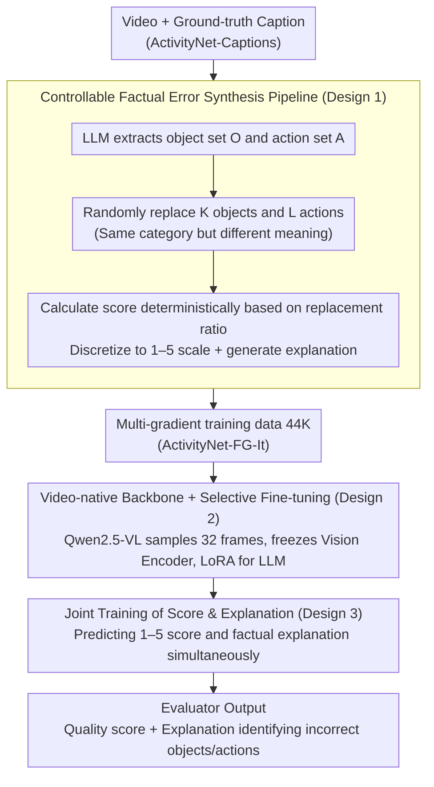

# VC-Inspector: Advancing Reference-free Evaluation of Video Captions with Factual Analysis

**Conference**: ACL 2026  
**arXiv**: [2509.16538](https://arxiv.org/abs/2509.16538)  
**Code**: [https://dipta007.github.io/VC-Inspector](https://dipta007.github.io/VC-Inspector)  
**Area**: Video Understanding / Caption Evaluation  
**Keywords**: Video Caption Evaluation, Reference-free Evaluation, Factual Accuracy, Large Multimodal Models, Hallucination Detection

## TL;DR

This paper proposes VC-Inspector, a reference-free video caption evaluation metric based on lightweight open-source multimodal models (Qwen2.5-VL 3B/7B). By generating training data through a controllable factual error synthesis pipeline, it achieves a human judgment correlation of $\tau_b$=42.58 on VATEX-Eval, surpassing the GPT-4o-dependent G-VEval ($\tau_b$=39.40), and reaches 99.6% accuracy on hallucination detection benchmarks.

## Background & Motivation

**Background**: Video caption evaluation primarily relies on text-matching metrics against reference captions (BLEU, ROUGE, CIDEr), but these are costly and struggle to capture semantic equivalence. Reference-free evaluation is a more practical direction but remains underdeveloped.

**Limitations of Prior Work**: (1) Reference-free metrics based on pre-trained vision-language embeddings (e.g., EMScore, CLIPScore) are limited by the context length of text encoders and lack a consistent scoring scale—score differences between different captions for the same video are too small to distinguish quality; (2) Methods using large proprietary models like GPT-4o (e.g., G-VEval) for scoring rely heavily on prompt engineering and are irreproducible; (3) Most existing methods are image-centric and fail to model the temporal dynamics of videos.

**Key Challenge**: Reliable caption evaluation should center on factual accuracy—errors in objects and actions should linearly decrease the score based on severity. However, existing metrics fail to detect even basic factual inconsistencies (e.g., incorrect objects).

**Goal**: To build a factual-accuracy-centric, interpretable, and open-source lightweight reference-free evaluation metric for video captions.

**Key Insight**: The primary bottleneck in training fact-aware evaluators is the lack of annotated captions with varying levels of factual quality—existing captions are either correct or incorrect, lacking intermediate gradients. The authors design an LLM-based controllable factual error synthesis pipeline to address this data scarcity.

**Core Idea**: Systematically replace objects and actions in ground truth captions using an LLM to generate pseudo-captions with varying degrees of errors, paired with deterministic scores and explanatory annotations, which are then used to fine-tune a lightweight multimodal model as an evaluator.

## Method

### Overall Architecture

VC-Inspector aims to be a reference-free, factual-accuracy-centric video caption evaluator. It takes a video and a candidate caption as input and outputs a quality score (1–5) along with a textual explanation identifying which objects/actions are incorrect. It bypasses the bottleneck of "lacking multi-gradient factual quality annotations" by starting with ground-truth captions from ActivityNet-Captions. An LLM is used to controllably replace objects and actions to synthesize pseudo-captions with varied error levels, where scores and explanations are determined based on replacement ratios. This data is then used for LoRA fine-tuning of Qwen2.5-VL (3B/7B), freezing the vision encoder and training only the LLM portion to allow the evaluator to "watch the video, verify facts, and provide scores with justifications."

### Key Designs

**1. Controllable Factual Error Synthesis: Creating multi-gradient quality data with deterministic perturbations.**  
The real obstacle to training fact-aware evaluators is data, not models—existing captions are binary (correct or incorrect), lacking intermediate levels, which prevents models from learning the scale of "how severe an error is." Given a ground-truth caption $X$, the LLM first extracts object set $\mathcal{O}$ and action set $\mathcal{A}$. Then, $K \sim \text{Unif}(0,M)$ objects and $L \sim \text{Unif}(0,N)$ actions are randomly sampled for replacement. Tokens are replaced with words of the same category but different meanings (e.g., car→truck instead of car→building) to ensure the perturbations are realistic. Instead of relying on subjective LLM judgment, the score is calculated deterministically based on the replacement ratio $score = 1 - |\mathcal{R}|/(|\mathcal{O}|+|\mathcal{A}|)$ and discretized into 1–5 points, avoiding the unreliability of LLM floating-point comparison. Each ground truth generates 10 pseudo-captions, resulting in 44K instances (ActivityNet-FG-It) after balanced sampling. Unlike PAC-S/FactVC which only create binary positive/negative samples, this multi-gradient data allows the evaluator to distinguish finer quality differences.

**2. Video-native Backbone + Selective Fine-tuning: Supporting long-video reasoning with temporal context.**  
Image-encoder-based metrics (like CLIP-based EMScore) cannot perceive actions or event order, while G-VEval relies on GPT-4o but is restricted to 3 concatenated frames and is irreproducible. VC-Inspector utilizes Qwen2.5-VL, which natively supports video and has a 32K context window, as its backbone. It uniformly samples 32 frames per video at 224×224 resolution. By freezing the vision encoder and projection layer and fine-tuning only the LLM portion with LoRA ($\alpha=r=32$, dropout=0.05), the model preserves pre-trained visual representations while focusing computational resources on learning factual judgment. Inference uses temperature=0 to ensure reproducibility.

**3. Joint Training of Score & Explanation: Turning interpretability into a fact-anchored supervision signal.**  
Outputting only a scalar score provides no reasoning and makes error correction difficult. VC-Inspector requires the model to predict a score $S \in \{1,...,5\}$ while simultaneously generating an explanation $E$ identifying specific factual errors. This explanation serves as auxiliary supervision, forcing the model to anchor its score to concrete factual evidence. Ablations show that adding explanations improves the $\tau_b$ on VATEX-Eval from 34.29 to 37.99 (+3.7). Furthermore, these explanations can serve as revision feedback—experiments demonstrate that using VC-Inspector's explanations to guide Qwen2.5-VL in iterative caption refinement improves quality across multiple dimensions.

### Loss & Training

Standard language modeling loss (next-token prediction) is employed with LoRA fine-tuning. The model is trained with a global batch size of 128 and a learning rate of 1e-4 for approximately 32 GPU hours on 4×A100.

## Key Experimental Results

### Main Results

**Correlation with Human Judgment on VATEX-Eval (Reference-free setting)**

| Method | $\tau_b$ | $\rho$ | Model Scale | Open Source |
|------|---------|--------|---------|------|
| VC-Inspector-7B | **42.58** | **45.99** | 7B | ✓ |
| G-VEval | 39.40 | - | GPT-4o | ✗ |
| VC-Inspector-3B | 37.99 | 42.45 | 3B | ✓ |
| Qwen2.5-VL-7B | 34.70 | 39.40 | 7B | ✓ |
| ViCLIPScore | 30.92 | 39.86 | - | ✓ |
| EMScore | 22.88 | 29.79 | - | ✓ |
| CLIPScore | 22.33 | 29.09 | - | ✓ |

**Flickr8K-Expert/CF Reference-free Setting ($\tau_b$)**

| Method | Expert | CF |
|------|--------|-----|
| VC-Inspector-7B | **63.4** | **46.0** |
| VC-Inspector-3B | 59.9 | 39.0 |
| HICE-S | 55.9 | 37.2 |
| PAC-S | 53.9 | 36.0 |
| CLIPScore | 51.1 | 34.4 |

### Ablation Study

| Configuration | $\tau_b$ (VATEX-Eval) | Description |
|------|----------------------|------|
| Objs + Actions (Full) | 37.99 | Best |
| Objs Only | 36.40 | -1.59 |
| Actions Only | 33.23 | -4.76 |
| Without Explanation | 34.29 | Explanation brings +3.7 gain |

**Hallucination Detection Accuracy**

| Method | FOIL-COCO | ActivityNet-FOIL |
|------|-----------|-----------------|
| VC-Inspector-3B | **99.6** | **99.3** |
| FLEUR | 96.8 | - |
| PAC-S | 90.2 | 91.0 |

### Key Findings

- In the reference-free setting, VC-Inspector-7B not only surpasses all reference-free methods but also exceeds most metrics that require reference captions.
- Both object and action errors are crucial, but object errors contribute more to evaluation quality ($\tau_b$=36.40 for objects only vs 33.23 for actions only).
- Joint training with explanations provides a significant boost (+3.7 $\tau_b$ points), and explanations can be used to iteratively improve caption quality.
- Computational efficiency is superior to existing methods: 0.30s/video vs 0.42s for EMScore (on a single A100).

## Highlights & Insights

- The deterministic scoring mechanism (based on replacement ratio) is superior to letting models or humans assign scores—it avoids subjectivity and inconsistency while ensuring scores remain within a fixed [0, 1] range to maintain ordinal relationships.
- Explanations are not just interpretability tools; they are effective training signals—this "scoring + explanation" joint training paradigm can be transferred to other evaluation tasks (e.g., text summarization or dialogue quality evaluation).
- Achieving SOTA results on Flickr8K by treating images as single-frame videos suggests that the fact-anchoring capability learned by the model possesses cross-modal generalization.

## Limitations & Future Work

- Currently focuses only on object and action errors, without covering finer-grained errors such as attributes (color, size), spatial relationships, or temporal sequencing.
- Training data is derived from ActivityNet; generalization to highly specialized videos (medical, industrial) requires further validation.
- Evaluation dimensions could be extended to temporal consistency, level of detail, and stylistic alignment.

## Related Work & Insights

- **vs EMScore**: EMScore relies on frame/video-level embedding matching via CLIP image encoders; it is limited by context length and lacks factual anchoring. VC-Inspector uses an LMM for direct factual reasoning.
- **vs G-VEval**: G-VEval depends on GPT-4o, uses only 3 frames, and is not reproducible. VC-Inspector is open-source, lightweight (3B/7B), uses native video encoding, and performs better.
- **vs PAC-S/FactVC**: These only perform binary positive/negative data synthesis. VC-Inspector generates multi-gradient quality data for more nuanced evaluation.

## Rating

- Novelty: ⭐⭐⭐⭐ The combination of controllable factual error synthesis and joint score-explanation training is a clever design.
- Experimental Thoroughness: ⭐⭐⭐⭐⭐ Comprehensive evaluation across five benchmarks, multiple settings, ablations, and efficiency analysis.
- Writing Quality: ⭐⭐⭐⭐ Clear motivation and rigorous experimental logic.
- Value: ⭐⭐⭐⭐⭐ Provides the first open-source factual evaluation tool for video captions, usable directly as an RL reward model.

<!-- RELATED:START -->

## Related Papers

- [\[ACL 2026\] Comprehensiveness Metrics for Automatic Evaluation of Factual Recall in Text Generation](comprehensiveness_metrics_for_automatic_evaluation_of_factual_recall_in_text_gen.md)
- [\[ICLR 2026\] Talk, Evaluate, Diagnose: User-aware Agent Evaluation with Automated Error Analysis](../../ICLR2026/llm_evaluation/talk_evaluate_diagnose_user-aware_agent_evaluation_with_automated_error_analysis.md)
- [\[ACL 2026\] TabReX: Tabular Referenceless eXplainable Evaluation](tabrex_tabular_referenceless_explainable_evaluation.md)
- [\[ACL 2026\] Stress Testing Factual Consistency Metrics for Long-Document Summarization](stress_testing_factual_consistency_metrics_for_long-document_summarization.md)
- [\[ACL 2026\] Illusions of the Gold Standard: A Large-scale Analysis of Human Evaluation Protocols for Long-form Text Generation](illusions_of_the_gold_standard_a_large-scale_analysis_of_human_evaluation_protoc.md)

<!-- RELATED:END -->
