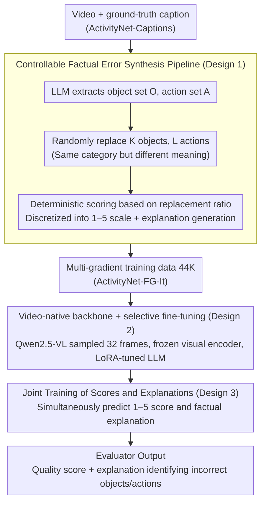

# VC-Inspector: Advancing Reference-free Evaluation of Video Captions with Factual Analysis

**Conference**: ACL 2026  
**arXiv**: [2509.16538](https://arxiv.org/abs/2509.16538)  
**Code**: [https://dipta007.github.io/VC-Inspector](https://dipta007.github.io/VC-Inspector)  
**Area**: Video Understanding / Caption Evaluation  
**Keywords**: Video Caption Evaluation, Reference-free Evaluation, Factual Accuracy, Large Multimodal Models, Hallucination Detection

## TL;DR

This paper proposes VC-Inspector, a reference-free video caption evaluation metric based on open-source lightweight multimodal models (Qwen2.5-VL 3B/7B). By generating training data via a controllable factual error synthesis pipeline, it achieves a human judgment correlation of $\tau_b$=42.58 on VATEX-Eval, surpassing GPT-4o-based G-VEval ($\tau_b$=39.40), and reaches 99.6% accuracy on hallucination detection benchmarks.

## Background & Motivation

**Background**: Video caption evaluation primarily relies on text-matching metrics (BLEU, ROUGE, CIDEr) using reference captions, which are costly and struggle to capture semantic equivalence. Reference-free evaluation is a more practical direction but remains underdeveloped.

**Limitations of Prior Work**: (1) Reference-free metrics based on pre-trained vision-language embeddings (e.g., EMScore, CLIPScore) are limited by text encoder context length and lack a consistent scoring scale—score differences between different captions for the same video are minimal, making quality distinction difficult; (2) Methods using large proprietary models like GPT-4o (e.g., G-VEval) for scoring rely on prompt engineering and are irreproducible; (3) Most existing methods are image-centric and fail to model temporal dynamics of video.

**Key Challenge**: Reliable caption evaluation should centralize factual accuracy—errors in objects and actions should linearly decrease scores according to severity—but existing metrics fail to detect even basic factual inconsistencies (e.g., incorrect objects).

**Goal**: Construct a fact-based, interpretable, open-source, and lightweight reference-free evaluation metric for video captions.

**Key Insight**: The main bottleneck in training fact-aware evaluators is the lack of annotated captions with varying quality levels—existing captions are either correct or incorrect with no intermediate gradients. The authors design a controllable factual error synthesis pipeline based on LLMs to address this data bottleneck.

**Core Idea**: Systematically replace objects and actions in ground truth captions using LLMs to generate pseudo-captions with different error magnitudes, accompanied by deterministic scores and explanatory annotations, to fine-tune a lightweight multimodal model as an evaluator.

## Method

### Overall Architecture

VC-Inspector functions as a reference-free, factual accuracy-centered video caption evaluator. It takes a video and a candidate caption as input and outputs a quality score (1–5) along with a textual explanation identifying incorrect objects/actions. It bypasses the bottleneck of "lack of multi-gradient factual quality annotations" by starting with ground-truth captions from ActivityNet-Captions and using an LLM to controllably replace objects and actions to synthesize pseudo-captions with varying error levels. Scores and explanations are determined based on replacement ratios. Subsequently, Qwen2.5-VL (3B/7B) is fine-tuned via LoRA, freezing the visual encoder and training only the LLM part to let the evaluator learn to "see videos, verify facts, and provide scores with justifications."

### Key Designs

**1. Controllable Factual Error Synthesis Pipeline: Generating multi-gradient quality data via deterministic perturbations.** 

The real obstacle for fact-aware evaluators is data, not models—existing captions are either binary correct or incorrect, lacking scale for "severity of error." Given a ground-truth caption $X$, the LLM extracts object set $\mathcal{O}$ and action set $\mathcal{A}$. Then, $K \sim \text{Unif}(0,M)$ objects and $L \sim \text{Unif}(0,N)$ actions are randomly sampled for replacement with words of the same category but different meanings (e.g., car→truck instead of car→building) to ensure realistic perturbations. Scores are not based on subjective LLM judgment but calculated deterministically as $score = 1 - |\mathcal{R}|/(|\mathcal{O}|+|\mathcal{A}|)$ and discretized into 1–5, avoiding LLM unreliability with floating-point numbers. Generating 10 pseudo-captions per ground truth results in 44K instances (ActivityNet-FG-It) after balanced sampling. This multi-gradient data allows the evaluator to distinguish finer quality differences compared to binary methods like PAC-S/FactVC.

**2. Video-native Backbone + Selective Fine-tuning: Supporting long video reasoning with temporal context.** 

Metrics based on image encoders (e.g., CLIP-based EMScore) cannot see actions and event sequences, while G-VEval relies on GPT-4o but only concatenates 3 frames and is irreproducible. VC-Inspector uses Qwen2.5-VL, which natively supports video and 32K context, as the backbone. 32 frames (224×224) are uniformly sampled per video. The visual encoder and projection layers are frozen, and only the LLM is fine-tuned using LoRA ($\alpha=r=32$, dropout=0.05) to concentrate computation on learning factual judgment while preserving pre-trained visual representations. Inference uses temperature=0 for reproducibility.

**3. Joint training of scores and explanations: Turning interpretability into fact-anchored supervision signals.** 

Outputting only a scalar score provides no basis for judgment and makes error correction difficult. VC-Inspector requires the model to predict $S \in \{1,...,5\}$ while generating an explanation $E$ identifying incorrect objects/actions. This explanation acts as auxiliary supervision, forcing the model to anchor scores to specific factual evidence. Ablations show that adding explanations increases $\tau_b$ from 34.29 to 37.99 (+3.7) on VATEX-Eval. Furthermore, these explanations can serve as rewrite feedback; experiments show that using VC-Inspector explanations to guide iterative caption revision improves quality across multiple dimensions.

### Loss & Training

Standard language modeling loss (next-token prediction) is used with LoRA fine-tuning. Global batch size is 128, learning rate is 1e-4, and training takes approximately 32 GPU hours on 4×A100.

## Key Experimental Results

### Main Results

**Human judgment correlation under reference-free setting on VATEX-Eval**

| Method | $\tau_b$ | $\rho$ | Model Size | Open Source |
|------|---------|--------|---------|------|
| **Ours-7B** | **42.58** | **45.99** | 7B | ✓ |
| G-VEval | 39.40 | - | GPT-4o | ✗ |
| **Ours-3B** | 37.99 | 42.45 | 3B | ✓ |
| Qwen2.5-VL-7B | 34.70 | 39.40 | 7B | ✓ |
| ViCLIPScore | 30.92 | 39.86 | - | ✓ |
| EMScore | 22.88 | 29.79 | - | ✓ |
| CLIPScore | 22.33 | 29.09 | - | ✓ |

**Flickr8K-Expert/CF reference-free setting ($\tau_b$)**

| Method | Expert | CF |
|------|--------|-----|
| **Ours-7B** | **63.4** | **46.0** |
| **Ours-3B** | 59.9 | 39.0 |
| HICE-S | 55.9 | 37.2 |
| PAC-S | 53.9 | 36.0 |
| CLIPScore | 51.1 | 34.4 |

### Ablation Study

| Config | $\tau_b$ (VATEX-Eval) | Notes |
|------|----------------------|------|
| Full (Obj+Act) | 37.99 | Best |
| Obj only | 36.40 | -1.59 |
| Act only | 33.23 | -4.76 |
| No explanation | 34.29 | Explanation gives +3.7 boost |

**Hallucination detection accuracy**

| Method | FOIL-COCO | ActivityNet-FOIL |
|------|-----------|-----------------|
| **Ours-3B** | **99.6** | **99.3** |
| FLEUR | 96.8 | - |
| PAC-S | 90.2 | 91.0 |

### Key Findings

- VC-Inspector-7B not only outperforms all reference-free methods but also exceeds most metrics requiring reference captions in the reference-free setting.
- Both object and action errors are important, but object errors contribute more to evaluation quality ($\tau_b$=36.40 for objects only vs 33.23 for actions only).
- Explanation-assisted training provides a significant boost (+3.7 $\tau_b$ points), and explanations can be used for iterative quality improvement.
- Computational efficiency is superior to existing methods: 0.30s/video vs 0.42s for EMScore (single A100).

## Highlights & Insights

- Deterministic scoring (based on replacement ratio) is superior to model/human scoring—avoiding subjectivity and inconsistency while ensuring scores stay within a fixed 0-1 range and maintain order relationships.
- Explanations are not just interpretability tools but effective training signals—this "score + explanation" joint training paradigm is transferable to other evaluation tasks (e.g., summarization or dialogue quality evaluation).
- Achieving SOTA results on Flickr8K by treating images as single-frame videos demonstrates the cross-modal generalization of the learned factual anchoring capability.

## Limitations & Future Work

- Currently focuses only on object and action errors, without covering fine-grained errors like attributes (color, size), spatial relationships, or temporal order.
- Training data is from ActivityNet; generalization to highly specialized videos (medical, industrial) remains to be verified.
- Evaluation dimensions can be further extended to temporal consistency, level of detail, and style adaptation.

## Related Work & Insights

- **vs EMScore**: EMScore relies on frame/video-level embedding matching with CLIP-based image encoders, limited by context length and lacking factual anchoring. VC-Inspector uses LMMs for direct factual reasoning.
- **vs G-VEval**: Relies on GPT-4o, concatenates only 3 frames, and is irreproducible. VC-Inspector is open-source, lightweight (3B/7B), uses native video encoding, and performs better.
- **vs PAC-S/FactVC**: These methods use binary positive/negative data synthesis, whereas VC-Inspector generates multi-gradient quality data for finer evaluation.

## Rating

- Novelty: ⭐⭐⭐⭐ Controllable factual error synthesis + joint score-explanation training is a clever combination.
- Experimental Thoroughness: ⭐⭐⭐⭐⭐ Five benchmarks, multiple settings, ablation, and computational efficiency analyses are comprehensive.
- Writing Quality: ⭐⭐⭐⭐ Clear motivation and rigorous experimental logic.
- Value: ⭐⭐⭐⭐⭐ Provides the first open-source factual evaluation tool for video captions, usable as a reward model for RL.

<!-- RELATED:START -->

<!-- RELATED:END -->

## Related Papers

- [\[ACL 2026\] Comprehensiveness Metrics for Automatic Evaluation of Factual Recall in Text Generation](comprehensiveness_metrics_for_automatic_evaluation_of_factual_recall_in_text_gen.md)
- [\[ICLR 2026\] Talk, Evaluate, Diagnose: User-aware Agent Evaluation with Automated Error Analysis](../../ICLR2026/llm_evaluation/talk_evaluate_diagnose_user-aware_agent_evaluation_with_automated_error_analysis.md)
- [\[ACL 2026\] TabReX: Tabular Referenceless eXplainable Evaluation](tabrex_tabular_referenceless_explainable_evaluation.md)
- [\[ACL 2026\] Stress Testing Factual Consistency Metrics for Long-Document Summarization](stress_testing_factual_consistency_metrics_for_long-document_summarization.md)
- [\[ACL 2026\] Identifying the Achilles' Heel: An Iterative Method for Dynamically Uncovering Factual Errors in Large Language Models](identifying_the_achilles_heel_an_iterative_method_for_dynamically_uncovering_fac.md)

<!-- RELATED:END -->
