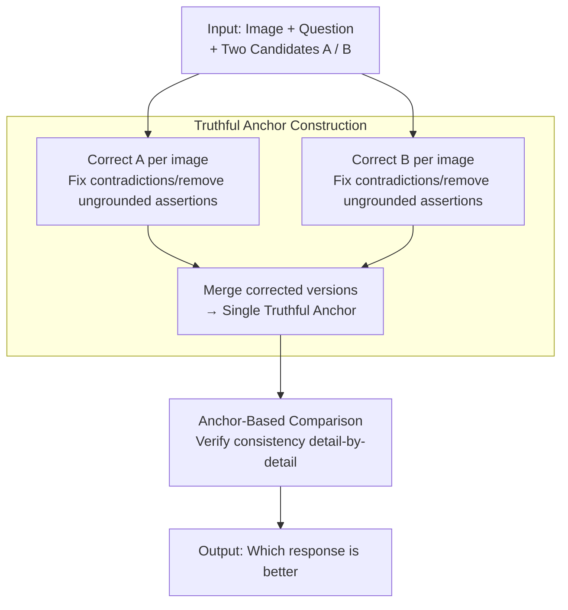

# When Vision-Language Models Judge Without Seeing: Exposing Informativeness Bias

**Conference**: ACL 2026  
**arXiv**: [2604.17768](https://arxiv.org/abs/2604.17768)  
**Code**: None  
**Area**: Multimodal VLM  
**Keywords**: VLM-as-a-Judge, Informativeness Bias, Image Anchoring, Evaluation Reliability, Multimodal Evaluation

## TL;DR

This paper reveals a severe "informativeness bias" in VLM-as-a-Judge systems—where judges tend to favor more detailed and rich responses even when they contradict visual content. It proposes the BIRCH paradigm, which reduces bias by up to 17% and improves performance by up to 9.8% by calibrating candidate answers before comparison.

## Background & Motivation

**Background**: VLM-as-a-Judge (using vision-language models as automated evaluators) has become the mainstream method for evaluating VLM output quality. Drawing from the LLM-as-a-Judge approach, a powerful VLM is used to score or rank candidate responses, replacing expensive human evaluation.

**Limitations of Prior Work**: The authors' analysis uncovers a concerning issue—VLM judges often fail to pay sufficient attention to images. They tend to blindly prefer more informative and detailed descriptions, even when those descriptions contradict the actual image content. Surprisingly, even if a judge identifies an inconsistency in a response, it might still choose it because it "appears richer."

**Key Challenge**: VLM judges face an implicit trade-off between informativeness and correctness. Existing evaluation paradigms conflate these two dimensions, causing the judge's attention to drift from visual grounding to surface-level text quality.

**Goal**: (1) Systematically quantify the severity of informativeness bias in VLM-as-a-Judge; (2) Design a new evaluation paradigm that shifts the focus from informativeness to image-based correctness.

**Key Insight**: The authors propose splitting the evaluation process into two steps: first correcting the content in candidate answers that is inconsistent with the image (eliminating interference from informativeness differences), and then comparing based on these corrected versions. This forces the judge to focus on "who is more correct" rather than "who says more."

**Core Idea**: By introducing a "Truthful Anchor"—generated by creating image-consistent corrected versions—the judge can compare correctness under conditions where informativeness is balanced.

## Method

### Overall Architecture

VLM judges prefer "more detailed" responses because existing paradigms evaluate informativeness and correctness simultaneously, allowing the judge's attention to slip from visual grounding to surface quality. Empirical tests show that judges barely look at images (adding images yields less than 3~5% accuracy improvement) while exhibiting 30~50% informativeness bias. BIRCH (Balanced Informativeness and CoRrectness with a Truthful AnCHor) addresses this by splitting the judgment: the judge first corrects each candidate answer point-by-point according to the image (fixing contradictions and deleting ungrounded assertions), then merges these two corrected versions into a single "Truthful Anchor"—which is both faithful to the image and retains informativeness comparable to the candidates. Subsequently, the judge no longer compares the original answers directly; instead, each candidate is verified for consistency against this anchor detail-by-detail. Given an image, a question, and two candidates, the process replaces the distraction of "who says more" with a comparison of "who is more consistent with the image."

### Key Designs

**1. Definition and Quantification of Informativeness Bias: Measuring the Severity**

Prior work has not systematically studied this specific bias in VLM judges. To evaluate solutions, a metric is required. The authors split paired data into two halves based on whether the more informative response is correct: the Informativeness-Driven Subset (IDS, where the more detailed one is correct) and the Correctness-Driven Subset (CDS, where the more detailed one is actually incorrect). Informativeness bias is quantified as the difference in accuracy between the two: $IB = Acc_{IDS} - Acc_{CDS}$. They also use the Image Reliance Score (IRS, the accuracy gain from adding images) to measure how much the judge actually looks at the image. Results reveal three things: IRS is generally below 3~5%, indicating judges barely rely on images; IB is as high as 30~50%, misleading even the strongest models; and IB remains 26~45% even after aligning candidate lengths, proving it is not a mere byproduct of length bias.

**2. Truthful Anchor Construction: Creating a Detailed and Correct Reference**

A naive idea is to have the judge answer the question first and use that as a reference, but this leads to over-correction: correct details not mentioned in the reference might be unfairly penalized, dropping accuracy on IDS. BIRCH's key innovation is making the anchor "as detailed as the candidates." The judge corrects **each** candidate (fixing contradictions and removing ungrounded claims with justification), then merges the two corrected versions into one anchor. This anchor encompasses all image-relevant details from both candidates while ensuring they are correct—balancing informativeness with the candidates to isolate correctness.

**3. Anchor-Based Comparison: Shifting Criteria to Image Consistency**

With a faithful and detailed anchor, the judgment no longer directly compares the two original answers. Instead, each candidate is checked against the anchor: every description in the candidate can be compared to a correct version in the anchor. The one more consistent with the anchor is deemed more reliable. Since informativeness is balanced by the anchor and the pull of surface richness is bypassed, the judge's attention is forced back to visual grounding, eliminating the source of bias at its root.

## Key Experimental Results

### Main Results

| Benchmark/Judge Model | Original Bias Rate | Bias Post-BIRCH | Bias Reduction | Accuracy Gain |
|-----------------------|--------------------|-----------------|----------------|---------------|
| GPT-4V Judge          | Baseline           | Reduced         | -17%           | +9.8%         |
| Gemini Judge          | Baseline           | Reduced         | -14%           | +7.2%         |
| LLaVA Judge           | Baseline           | Reduced         | -11%           | +5.6%         |
| Average across Bench. | High Bias          | Sig. Lower      | -12~17%        | +5~9.8%       |

### Ablation Study

| Configuration                | Bias Rate | Accuracy | Description |
|------------------------------|-----------|----------|-------------|
| BIRCH Full Solution          | Lowest    | Highest  | Both correction and comparison steps included |
| Correction only (no comp.)   | Medium    | Medium   | Proves the comparison strategy is also vital |
| Direct "focus on correctness" prompt | Still High| Limited  | Proves simple prompting cannot eliminate implicit bias |
| Different VLMs as correctors | Similar   | Stable   | Method is insensitive to the choice of correction model |

### Key Findings

- Informativeness bias is universal across all tested VLMs, even affecting the strongest models like GPT-4V.
- Bias remains significant even when judges are explicitly instructed to "ignore informativeness and focus on correctness," suggesting a deep-seated model tendency rather than an instruction-following issue.
- Both steps of BIRCH contribute: the correction step removes content bias, while the comparison step avoids residual informativeness interference.
- The more complex the visual description task, the more severe the informativeness bias, and the greater the benefit provided by BIRCH.

## Highlights & Insights

- **Problem discovery as a major contribution**: Informativeness bias was previously overlooked but has far-reaching consequences; if automated evaluation is unreliable, model selection and training based on it may be misled.
- **The "Correct-then-Compare" paradigm is highly effective**: It does not rely on making the judge "smarter" but eliminates the source of bias through preprocessing. This "change the input, not the model" approach can be applied broadly to other evaluation biases.
- **Transferability**: The approach can likely be migrated to similar bias scenarios in LLM-as-a-Judge, such as preferences for length or specific formatting.

## Limitations & Future Work

- The correction step itself depends on the VLM's visual understanding—if the corrector's vision is flawed, new biases may be introduced.
- The two-step process increases inference costs (requiring extra calls for correction), sacrificing some efficiency.
- Currently focuses on "informativeness bias"; VLM judges may harbor other biases (e.g., position bias, length bias).
- Future work could explore training specialized "debiased" judges that internalize the BIRCH logic into the model itself.

## Related Work & Insights

- **vs. LLM-as-a-Judge Bias Research**: Previous work focused on position and verbosity bias in LLM judges; this paper is the first to systematically study informativeness bias unique to VLM judges.
- **vs. Direct Scoring Methods**: Methods that have VLMs assign scores directly are equally susceptible to informativeness bias; BIRCH's correction logic is applicable to scoring scenarios.
- **vs. Human Evaluation**: BIRCH narrows the gap between automated and human evaluation, though human judgment remains indispensable for highly subjective dimensions.

## Rating

- Novelty: ⭐⭐⭐⭐⭐ First to reveal and systematically quantify informativeness bias in VLM judges; the problem definition is novel and important.
- Experimental Thoroughness: ⭐⭐⭐⭐ Comprehensive experiments across multiple models and benchmarks with solid ablation.
- Writing Quality: ⭐⭐⭐⭐ Clear motivation and logically rigorous experimental design.
- Value: ⭐⭐⭐⭐⭐ Significant impact on the VLM automated evaluation field; both the identified problem and the proposed solution are broadly meaningful.

<!-- RELATED:START -->

## Related Papers

- [\[ACL 2026\] Contrastive Decoding Mitigates Score Range Bias in LLM-as-a-Judge](contrastive_decoding_mitigates_score_range_bias_in_llm-as-a-judge.md)
- [\[ICLR 2026\] BiasScope: Towards Automated Detection of Bias in LLM-as-a-Judge Evaluation](../../ICLR2026/llm_evaluation/biasscope_towards_automated_detection_of_bias_in_llm-as-a-judge_evaluation.md)
- [\[ACL 2026\] IF-RewardBench: Benchmarking Judge Models for Instruction-Following Evaluation](if-rewardbench_benchmarking_judge_models_for_instruction-following_evaluation.md)
- [\[ICLR 2026\] Can Vision–Language Models Assess Graphic Design Aesthetics? A Benchmark, Evaluation, and Dataset Perspective](../../ICLR2026/llm_evaluation/can_vision_language_models_assess_graphic_design_aesthetics_a_benchmark_evaluati.md)
- [\[ICLR 2026\] Rethinking LLM-as-a-Judge: Representation-as-a-Judge with Small Language Models via Semantic Capacity Asymmetry](../../ICLR2026/llm_evaluation/rethinking_llm-as-a-judge_representation-as-a-judge_with_small_language_models_v.md)

<!-- RELATED:END -->
## Related Papers

- [\[ACL 2026\] Contrastive Decoding Mitigates Score Range Bias in LLM-as-a-Judge](contrastive_decoding_mitigates_score_range_bias_in_llm-as-a-judge.md)
- [\[ICLR 2026\] BiasScope: Towards Automated Detection of Bias in LLM-as-a-Judge Evaluation](../../ICLR2026/llm_evaluation/biasscope_towards_automated_detection_of_bias_in_llm-as-a-judge_evaluation.md)
- [\[ACL 2026\] IF-RewardBench: Benchmarking Judge Models for Instruction-Following Evaluation](if-rewardbench_benchmarking_judge_models_for_instruction-following_evaluation.md)
- [\[ICLR 2026\] Can Vision–Language Models Assess Graphic Design Aesthetics? A Benchmark, Evaluation, and Dataset Perspective](../../ICLR2026/llm_evaluation/can_vision_language_models_assess_graphic_design_aesthetics_a_benchmark_evaluati.md)
- [\[ACL 2025\] Exposing Numeracy Gaps: A Benchmark to Evaluate Fundamental Numerical Abilities in Large Language Models](../../ACL2025/llm_evaluation/exposing_numeracy_gaps_a_benchmark_to_evaluate_fundamental_numerical_abilities_i.md)

<!-- RELATED:END -->
