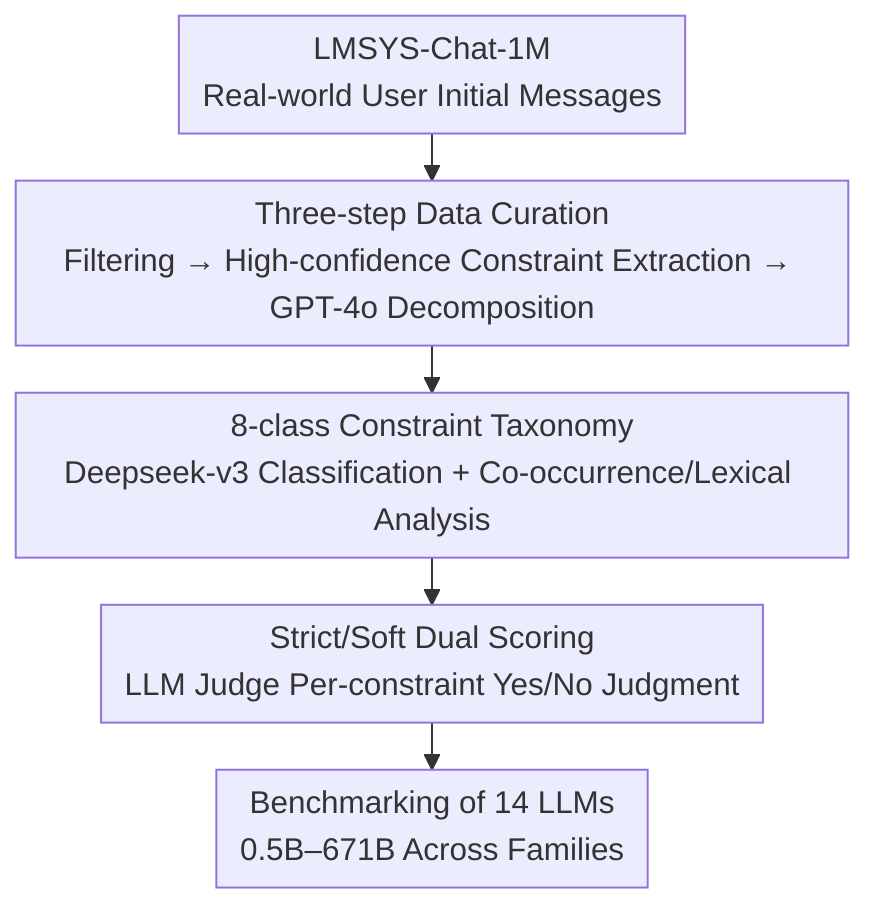

# WildIFEval: Instruction Following in the Wild

**Conference**: ACL2026  
**arXiv**: [2503.06573](https://arxiv.org/abs/2503.06573)  
**Code**: https://github.com/gililior/wild-if-eval-code  
**Area**: LLM Evaluation / Instruction Following  
**Keywords**: Instruction Following, Constraint Generation, Real-world User Data, Constraint Decomposition, LLM-as-judge

## TL;DR
WildIFEval is a single-turn constraint generation benchmark extracted from real-world user conversations, comprising 7,523 tasks and 24,731 constraints. It automatically decomposes each user instruction into fine-grained constraints categorized into 8 major classes and employs an LLM-as-judge for "strict/soft" dual scoring. This work characterizes the distribution and co-occurrence of constraints in real-world instructions for the first time and reveals a capacity bottleneck where the overall success rate drops sharply as the number of constraints increases, while the success rate per individual constraint remains nearly unchanged.

## Background & Motivation
**Background**: As LLMs become increasingly proficient at following instructions, user instructions themselves are growing more complex—a request like "Summarize this text" now often becomes "Summarize this movie review in two paragraphs, the first focusing on the plot and the second on whether it's worth watching." These personalized tasks contain explicit or implicit constraints that the model must satisfy simultaneously during generation.

**Limitations of Prior Work**: Existing instruction-following benchmarks (IFEval, FollowBench, InFoBench) are mostly constructed "bottom-up"—starting with a set of mechanically verifiable constraints or a taxonomy of constraint types, followed by manual or synthetic instruction generation. This approach may fail to capture the types, combinations, and complexity of constraints posed by real users. Furthermore, they are small in scale, cover primarily "hard constraints" that are easy to verify, and struggle with "soft constraints" such as content, quality, or style.

**Key Challenge**: There is a tension between the "verifiability" of synthetic data and the "diversity and authenticity" of real-world data—the more one pursues rule-based verification, the further one deviates from how real users actually propose constraints in the wild.

**Goal**: To construct a multi-constraint instruction benchmark derived from real users that is significantly larger than existing English datasets, remains challenging for SOTA models, and supports fine-grained (per-constraint) evaluation.

**Key Insight**: Extract constraint generation tasks from real conversation logs in Chatbot Arena (LMSYS-Chat-1M) and automatically **decompose each task into atomic constraints**. This preserves the diversity of real-world user language while obtaining the granularity required for per-constraint scoring.

**Core Idea**: Utilize a pipeline of "real logs → high-precision filtering of constraint tasks → LLM-based constraint decomposition → 8-class taxonomy + strict/soft dual scoring" to transform "instruction-following capability in the wild" into a quantifiable and analyzable benchmark.

## Method
The "method" of WildIFEval is a data construction and evaluation protocol pipeline rather than a new model. Its value lies in how it cleanly extracts constraints from noisy real logs, verifies extraction quality, and quantifies "constraint satisfaction" into comparable scores.

### Overall Architecture
The first user message from each conversation in LMSYS-Chat-1M is taken and processed through three curation steps to obtain 7,523 constraint generation tasks, each accompanied by a constraint list (24,731 unique constraints in total, averaging 3.25 per task). Deepseek-v3 is then used to categorize all constraints into 8 types. For evaluation, responses from 14 LLMs are judged by an LLM judge on a per-constraint basis to aggregate strict scores (pass only if all met) and soft scores (percentage of constraints met).

### Key Designs

**1. Three-step Data Curation: High-precision extraction and atomic decomposition of constraints from real logs**

To address the limitation that synthetic data cannot capture real-world diversity, the authors designed a three-step pipeline. First step: Filtering (non-English, programming tasks, and toxic language via Detoxify). Second step: Screening constraint generation tasks by having Llama3.1-405B answer yes/no. Instead of simple string parsing, **the probability of the "yes" token is used as a confidence score**, and only the top 10% of tasks with the highest certainty are retained (threshold ~0.94, compared to a mean of 0.29 and median of 0.07). This ensures a high-precision, conservative subset. Third step: Decomposition via GPT-4o into individual constraints, with downsampling for high-frequency constraints (affecting only 15 items, <0.15%) and filtering of extreme tasks with >8 constraints.

**2. 8-class Taxonomy: Data-driven categorization filling gaps in existing systems**

To address the issue where existing work is either too granular (e.g., "part-of-speech rules") or too broad (e.g., "content constraints"), the authors combined existing classifications with data-driven observations to define 8 primary categories: Include/Avoid, Editing, Ensure Quality, Length, Format and Structure, Focus/Emphasis, Persona and Role, and Style and Tone. Include/Avoid and Focus/Emphasis are the most frequent. tSNE visualization reveals that content-related constraints are widely dispersed in semantic space, while form-related ones (Length, Format) form clear clusters. PMI analysis of co-occurrences showed that only a few combinations (e.g., Persona and Style/Tone) appeared significantly more often than expected.

**3. Strict/Soft Dual Scoring + LLM-as-judge: Quantifying constraint satisfaction across two complementary metrics**

To handle both mechanically verifiable hard constraints and subjective soft constraints, an LLM judge $J$ provides a yes/no judgment $J(t_i,r_i,c_i^j)\in\{0,1\}$ for task $t_i$, model response $r_i=M(t_i)$, and individual constraint $c_i^j$. The two scores are defined as:

$$soft(r_i\mid t_i)=\frac{1}{N(t_i)}\sum_{j=1}^{N(t_i)}J(t_i,r_i,c_i^j), \qquad strict(r_i\mid t_i)=\prod_{j=1}^{N(t_i)}J(t_i,r_i,c_i^j)$$

where $N(t_i)$ is the number of constraints. The soft score represents the proportion of satisfied constraints, while the strict score is a binary "pass" only if all constraints are met. Deepseek-v3 was chosen as the judge as it showed the highest consistency with GPT-4o; the benchmark also showed a Kendall's Tau correlation of >0.82 with IFEval/MMLU/GPQA, confirming reliable signals.

## Key Experimental Results

The pipeline was validated via human experts: on two random subsets of 100 tasks each, decomposition quality received 1–5 Likert scores of 4.71 / 4.64 / 4.77 for correctness, completeness, and independence, respectively. In screening effectiveness, the top 10% certainty threshold achieved 75.8% agreement with human judgment. The evaluation covered 14 instruction-tuned LLMs from 5 families, ranging from 0.5B to 671B parameters in a zero-shot setting.

### Benchmarking Comparison

| Benchmark | Data Source | Evaluation Method | # Tasks | # Constraints |
|-----------|-------------|-------------------|---------|---------------|
| IFEval | Synthetic | Rule-based | 541 | - |
| FollowBench | Crowdsourced + Synthetic | Model/Rule | 1,852 | - |
| InFoBench | Crowdsourced | Model/Rule | 500 | 2,217 |
| **WildIFEval (Ours)** | **Real-world Users** | **Model-based** | **7,523** | **24,731** |

WildIFEval is currently the largest English instruction-following benchmark composed of real-world user instructions, with an average of 3.25 constraints per task.

### Model Evaluation and Analysis

| Dimension | Key Observation |
|-----------|-----------------|
| Overall Difficulty | The strongest models achieve a strict score of ~0.7; Deepseek-v3 and Llama3.3-70B still fail to meet all constraints in 25–30% of tasks. |
| Scaling Effects | Larger models within the same family consistently outperform smaller ones (Exception: Llama3.3-70B outperforms Llama3.1-405B). |
| Increased Constraints | Strict scores plummet as the number of constraints increases, but soft scores (single constraint success rate) remain almost constant. |
| Difficulty by Type | Models struggle most with Length, followed by Format and Structure; soft constraints like Focus/Emphasis are relatively easier. |
| Decomposition Quality (Human) | Correctness 4.71 / Completeness 4.64 / Independence 4.77 (out of 5). |

### Key Findings
- **Capacity Bottleneck vs. Ability Degradation**: As constraints increase, strict scores drop significantly while soft scores remain stable. This suggests models do not "lose" the ability to follow instructions but rather struggle with "juggling" multiple constraints simultaneously—a capacity bottleneck.
- **Hard Constraints are Harder than Soft Constraints**: Models fail most frequently on rigid, formal constraints such as Length (especially exact word/syllable counts) and Format. Error analysis shows that the vast majority of failures involve Length constraints.
- **Length Constraints Can Be Reliably Judged by LLMs**: The authors compared the LLM judge against a heuristic (regex extraction of 700 length constraints + space-based word counting). Deepseek-v3 achieved 86.66% agreement, proving LLM-as-judge is comparable to heuristics for length and can handle complex phrasing.
- **Ranking Correlations and Variations**: While model rankings are generally consistent across most constraint types (suggesting shared underlying capabilities), rankings induced by Length constraints differ significantly from Persona/Style, highlighting distinct skill dimensions.

## Highlights & Insights
- **Using yes-token probability as a confidence measure for the top 10% is a clever high-precision filter**: Compared to parsing yes/no strings, probability thresholds yield a conservative, high-purity subset of constraint tasks.
- **Strict/Soft dual scoring clearly diagnoses the "multi-constraint dilemma"**: The sensitivity of the strict score versus the stability of the soft score differentiates "capacity bottlenecks" from "ability degradation," a diagnostic approach applicable to any multi-objective evaluation.
- **The paradigm of real logs + automatic decomposition is highly reusable**: Harvesting tasks from real logs like Chatbot Arena and using LLMs to decompose them into atomic units for fine-grained evaluation is a generalizable recipe for building "in the wild" benchmarks.

## Limitations & Future Work
- **Single Data Source**: Data is sourced entirely from Chatbot Arena, reflecting the biases of that platform's user base and topics, which may not represent all LLM use cases.
- **Subjectivity of Certain Constraints**: Constraints like "the story should be suitable for a nine-year-old" are difficult to judge objectively, introducing noise or bias.
- **Blurry Boundaries Between Constraints and Tasks**: Some decomposed constraints essentially define the task itself, potentially conflating "task completion" with "constraint satisfaction" in final scores.
- **Judge Self-Bias Concerns**: The top-performing model (Deepseek-v3) also serves as the judge. Although mitigated by cross-validation with GPT-4o, Llama3.3-70B, and Qwen-2.5-72B, self-bias remains a potential issue.
- **Future Directions**: Future work could incorporate more diverse real-world data sources, design human-in-the-loop evaluation for subjective constraints, and create dedicated stress tests for "constraint count vs. capacity."

## Related Work & Insights
- **vs. IFEval (Zhou et al., 2023)**: IFEval uses synthetic instructions and rule-based verification, covering only mechanically verifiable hard constraints. WildIFEval uses real user data and LLM judges, enabling evaluation of soft constraints at a scale an order of magnitude larger.
- **vs. FollowBench / InFoBench (Jiang/Qin et al., 2024)**: These use crowdsourcing and LLM evaluation but are smaller in scale and lack constraint diversity. WildIFEval provides the first large-scale analysis of real-world constraint distribution, co-occurrence, and lexical long-tails.
- **vs. RealInstruct (Ferraz et al., 2024)**: Also uses real user instructions but was not publicly released. WildIFEval contributes a constraint taxonomy and public dataset.
- **vs. CFBench (Chinese)**: Extracts constraints from real scenarios but reflects different cultural/linguistic patterns, serving as a complement to the English-focused WildIFEval.

## Rating
- Novelty: ⭐⭐⭐⭐ First large-scale real-world multi-constraint English benchmark with comprehensive distribution analysis.
- Experimental Thoroughness: ⭐⭐⭐⭐⭐ 14 models across families, dual scoring, human validation, and extensive judge/length verification.
- Writing Quality: ⭐⭐⭐⭐⭐ Logical progression from motivation to curation and analysis, supported by strong visualization.
- Value: ⭐⭐⭐⭐⭐ Public data and insights into the "multi-constraint capacity bottleneck" provide direct value for LLM training and evaluation.

<!-- RELATED:START -->

## Related Papers

- [\[ACL 2026\] Revisiting the Reliability of Language Models in Instruction-Following](revisiting_the_reliability_of_language_models_in_instruction-following.md)
- [\[ACL 2026\] IF-RewardBench: Benchmarking Judge Models for Instruction-Following Evaluation](if-rewardbench_benchmarking_judge_models_for_instruction-following_evaluation.md)
- [\[ACL 2026\] IF-Critic: Towards a Fine-Grained LLM Critic for Instruction-Following Evaluation](if-critic_towards_a_fine-grained_llm_critic_for_instruction-following_evaluation.md)
- [\[ACL 2025\] StructFlowBench: A Structured Flow Benchmark for Multi-turn Instruction Following](../../ACL2025/llm_evaluation/structflowbench_a_structured_flow_benchmark_for_multi-turn_instruction_following.md)
- [\[ICLR 2026\] DARE-bench: Evaluating Modeling and Instruction Fidelity of LLMs in Data Science](../../ICLR2026/llm_evaluation/dare-bench_evaluating_modeling_and_instruction_fidelity_of_llms_in_data_science.md)

<!-- RELATED:END -->
