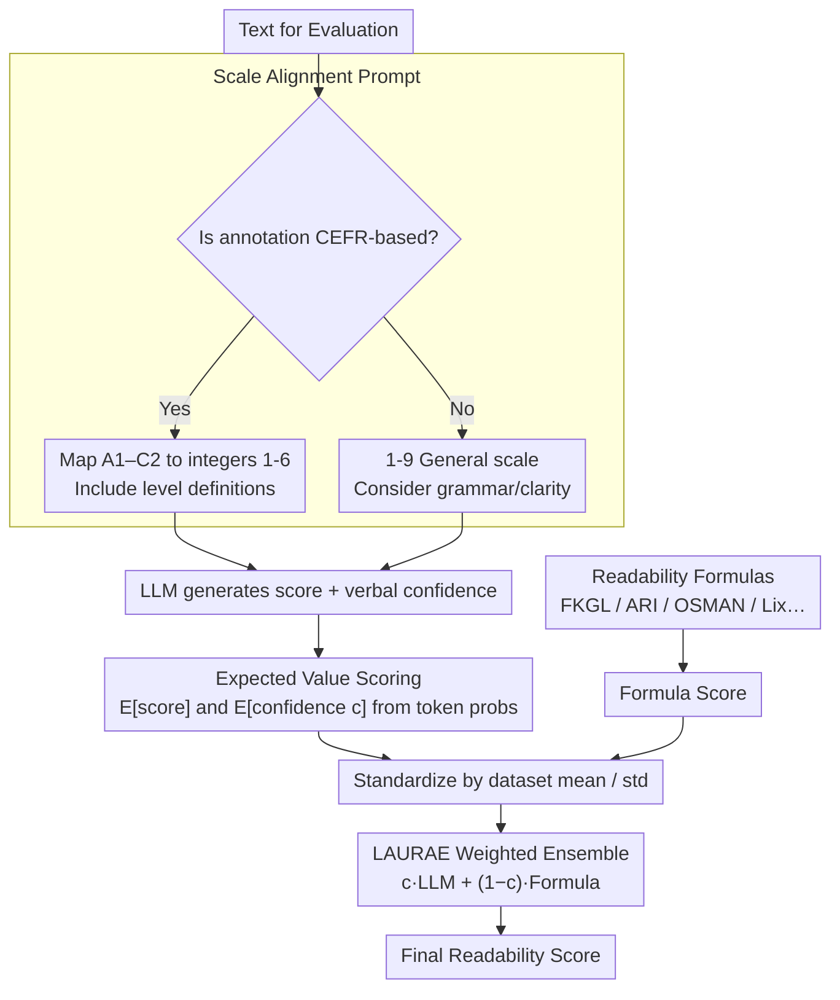

# Zero-shot Large Language Models for Automatic Readability Assessment

**Conference**: ACL2026  
**arXiv**: [2604.24470](https://arxiv.org/abs/2604.24470)  
**Code**: https://github.com/rag24/LAURAE  
**Area**: Automatic Readability Assessment / Medical Text Readability / NLP Evaluation  
**Keywords**: Readability Assessment, Zero-shot LLM, LAURAE, Confidence Ensemble, Medical Text

## TL;DR
This paper systematically evaluates the zero-shot ARA capabilities of 10 open-source LLMs across 14 multilingual readability datasets and proposes LAURAE: an ensemble method that weights the LLM's expected readability score against traditional formulas using verbal confidence, outperforming existing unsupervised methods on 13/14 datasets.

## Background & Motivation
**Background**: Automatic Readability Assessment (ARA) has long served education, medicine, government, and text simplification research. Particularly in medical contexts, the comprehensibility of patient materials directly impacts decision-making and health outcomes. Traditional formulas like FKGL and ARI rely on shallow features such as sentence length and syllable counts; they remain widely adopted in 2025 applications due to their ease of implementation.

**Limitations of Prior Work**: While easy to use, traditional formulas ignore semantics, context, and technical terminology. Supervised BERT/ML models offer higher accuracy but require labeled data, training resources, and domain expertise. Recent studies on zero-shot ARA with GPT-4 show potential, but most focus on a single English dataset or closed-source models, failing to address whether open-source LLMs are reliable across non-English languages, technical texts, or varying text lengths.

**Key Challenge**: Researchers and practitioners need unsupervised ARA methods more accurate than formulas without the costs of supervised training. While LLMs possess semantic understanding, they may exhibit instability on short texts, children’s literature, or low-resource languages. Over-reliance on LLMs could sacrifice the robustness and low cost associated with formulaic methods.

**Goal**: The authors aim to provide a reproducible unsupervised ARA solution. This involves improving zero-shot LLM scoring, conducting a comprehensive evaluation of 10 open-source LLMs across 14 datasets, and proposing LAURAE—an ensemble that combines the semantic capability of LLMs with the shallow features of traditional formulas.

**Key Insight**: Instead of replacing formulas with LLMs, the authors argue that the two capture different signals. LLMs better grasp context and difficulty definitions, whereas formulas stably capture surface-level cognitive burdens (e.g., word and sentence length). By using the LLM's self-reported verbal confidence to determine weights, a more robust unsupervised readability score can be achieved.

**Core Idea**: Align LLM scoring with the same scale used in human annotations and calculate expected scores via output token probabilities. These scores are then fused with traditional formula scores using weightings derived from LLM verbal confidence, forming the LAURAE method.

## Method
The paper presents technical contributions at two levels. First, it improves zero-shot LLM ARA by prompting models to use the same scale as human annotations (e.g., CEFR A1-C2) and providing level definitions. Second, it introduces LAURAE: an ensemble where standardized LLM scores and formula scores are averaged, weighted by the LLM’s self-reported confidence.

### Overall Architecture
The input is a text segment for evaluation. If the dataset uses CEFR labels, the prompt requires the LLM to provide an integer score from 1-6 (mapping A1-C2) with explicit definitions; otherwise, a general 1-9 scale is used considering grammar and clarity. Instead of taking the greedy output, the system analyzes the probabilities of all numeric tokens at the output position to calculate the expected value for both the score and confidence.

Subsequently, LAURAE selects a traditional unsupervised formula as a shallow feature (e.g., FKGL for English, OSMAN for Arabic, Lix for Hindi/Greek). Scores are standardized based on dataset mean and standard deviation. The LLM confidence $c$ acts as the weight: higher confidence favors the LLM score, while lower confidence shifts the weight toward the formula.

### Key Designs

**1. Scale Alignment Prompting: Aligning LLM Output Space with Ground Truth**
If an LLM scores based on its internal defaults while human annotators use CEFR, correlation is unnecessarily lowered. The authors include the rating scale explicitly in the prompt. For 7 CEFR datasets, A1-C2 definitions and their 1-6 mappings are provided. This clarifies the task ontology for the model, which is particularly effective for non-English datasets where model "intuition" of difficulty might vary.

**2. Expected Value Scoring: Mitigating Discretization via Token Probabilities**
Readability is inherently continuous. Greedy decoding loses the model's "hesitation." By collecting probabilities for all numeric tokens at the target position, the score is treated as a probability-weighted expected value. This reduces ties (equal scores) in pairwise comparison tasks.

**3. LAURAE Confidence-Weighted Ensemble: Integrating Semantic Judgment and Shallow Robustness**
LLMs understand technical terms but may be unstable on extremely short sentences or low-resource languages; formulas are the inverse. The LLM outputs a 1-9 confidence value (also calculated via expected value), which is normalized to $c \in [0,1]$. The final score is:
$$Score_{final} = c \cdot LLM_{std} + (1-c) \cdot Formula_{std}$$
Since the weight is self-reported rather than tuned on a validation set, LAURAE remains fully unsupervised and adaptive to the model's perceived certainty.

### Loss & Training
This work utilizes unsupervised inference without fine-tuning. Experiments involve 10 open-source instruction-tuned LLMs (including Llama 3.1 8B/70B, Aya Expanse, Mixtral 8x7B, etc.). For English, Llama 70B is the primary driver, while Aya 32B is used for multilingual data. Metrics include Pearson correlation for rating datasets and Accuracy for pairwise comparison datasets.

## Key Experimental Results

### Main Results
The 14 datasets cover 6 languages, varying lengths, technical medical texts (MedReadMe), and pairwise simplification tasks.

| Dataset | Language | N | Avg Length | Ground Truth |
|--------|------|---:|---------:|--------------|
| ReadMe | EN/FR/HI/AR/RU | 163-296 | 22-25 | CEFR rating |
| MedReadMe | EN | 1,140 | 25 | CEFR rating (Medical) |
| CLEAR | EN | 1,890 | 201 | non-CEFR rating |
| Asset | EN | 485 | 21 | pairwise comparison |

LAURAE achieved an average performance of 0.740, the highest across unsupervised baselines, and was the top performer on 13/14 datasets.

| Dataset | LAURAE | LLM-v-ns | Formula | RSRS |
|--------|-------:|---------:|--------:|-----:|
| MedReadMe | 0.770 | 0.736 | 0.469 | 0.646 |
| ReadMe (ru) | 0.803 | 0.393 | 0.639 | 0.694 |
| Average | 0.740 | 0.595 | 0.599 | 0.592 |

### Ablation Study
Expected value scoring improved results across all 14 datasets (12 significantly). Including CEFR scale definitions significantly boosted 5/7 CEFR datasets, with the largest gains in non-English contexts.

| Ensemble Variant | Avg Change vs Standalone LLM |
|----------|-----------------------------:|
| LAURAE | +0.027 |
| LAURAE-naive (Equal weight) | +0.015 |
| LAURAE-entropy | +0.006 |

### Key Findings
- Evaluating only on English datasets overestimates zero-shot ARA generalizability.
- Llama 70B is strongest for English, but Aya 32B is more robust for multilingual tasks, suggesting specialized multilingual training outweighs parameter scale.
- LAURAE significantly improves performance on technical medical text (MedReadMe), where traditional formulas (0.469) struggle compared to the ensemble (0.770).

## Highlights & Insights
- Comprehensive evaluation across dimensions (language, length, technicality, task type).
- Explicit task ontology (scale definitions) in prompts significantly improves calibration for non-English data.
- Verbal confidence is a clever unsupervised weight, avoiding the need for a validation set while outperforming entropy-based uncertainty.
- Practical utility for medical NLP: Provides a high-performance alternative for evaluating patient materials without requiring labeled data.

## Limitations & Future Work
- Resource Intensive: Requires high-end GPUs for models like Llama 70B, unlike instantaneous formulas.
- Interpretability: LAURAE is less transparent than a simple formula based on word/sentence count.
- Absolute Calibration: The study focuses on correlation; further work is needed to assess absolute grade-level accuracy.
- Ethics: Not recommended for evaluating individual writing style due to potential biases; primarily intended for material comparison and corpus analysis.

## Related Work & Insights
- **vs Formulas**: LAURAE integrates semantic depth, boosting average correlation from ~0.60 to ~0.74.
- **vs Supervised Models**: LAURAE matches high performance without the need for target labels.
- **vs RSRS**: While RSRS uses surprisal, LAURAE leverages the high-level reasoning and multilingual capacity of modern LLMs.
- **Insight**: The "semantic + surface + confidence weighting" paradigm can be adapted to other unsupervised NLP evaluation tasks like toxicity or clarity assessment.

## Rating
- Novelty: ⭐⭐⭐⭐
- Experimental Thoroughness: ⭐⭐⭐⭐⭐
- Writing Quality: ⭐⭐⭐⭐
- Value: ⭐⭐⭐⭐⭐

<!-- RELATED:START -->

## Related Papers

- [\[ACL 2026\] NovBench: Evaluating Large Language Models on Academic Paper Novelty Assessment](novbench_evaluating_large_language_models_on_academic_paper_novelty_assessment.md)
- [\[NeurIPS 2025\] Benchmarking Large Language Models for Zero-Shot and Few-Shot Phishing URL Detection](../../NeurIPS2025/llm_evaluation/benchmarking_large_language_models_for_zero-shot_and_few-shot_phishing_url_detec.md)
- [\[ICLR 2026\] AutoCodeBench: Large Language Models are Automatic Code Benchmark Generators](../../ICLR2026/llm_evaluation/autocodebench_large_language_models_are_automatic_code_benchmark_generators.md)
- [\[ACL 2026\] The Silent Vote: Improving Zero-Shot LLM Reliability by Aggregating Semantic Neighborhoods](the_silent_vote_improving_zero-shot_llm_reliability_by_aggregating_semantic_neig.md)
- [\[ACL 2026\] SCAN: Structured Capability Assessment and Navigation for LLMs](scan_structured_capability_assessment_and_navigation_for_llms.md)

<!-- RELATED:END -->
