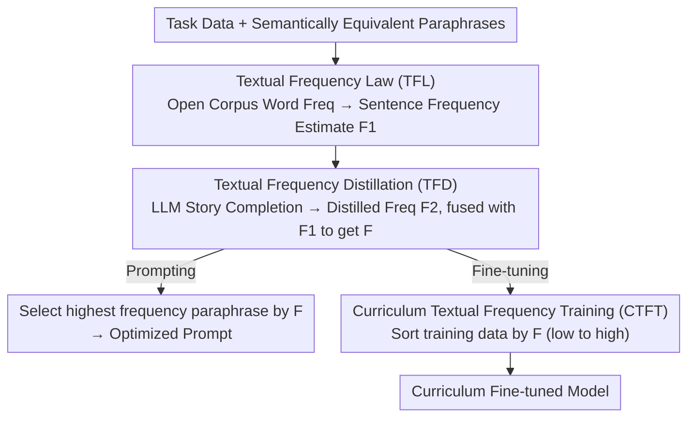

# Adam's Law: Textual Frequency Law on Large Language Models

**Conference**: ACL 2026  
**arXiv**: [2604.02176](https://arxiv.org/abs/2604.02176)  
**Code**: [https://github.com/HongyuanLuke/frequencylaw](https://github.com/HongyuanLuke/frequencylaw)  
**Area**: LLM/NLP  
**Keywords**: Text frequency, paraphrase selection, curriculum learning, prompt optimization, fine-tuning strategy

## TL;DR
This paper proposes the "Textual Frequency Law" (TFL), revealing that for identical semantics, utilizing higher-frequency textual expressions to prompt or fine-tune LLMs yields superior performance. It further introduces frequency distillation and curriculum training strategies to leverage this law.

## Background & Motivation

**Background**: Large Language Models (LLMs) have achieved significant progress in tasks like mathematical reasoning, machine translation, and common sense reasoning. Recent research indicates that data quality and quantity are critical to LLM performance; however, the "frequency" dimension—how often a specific expression appears in the training corpus—remains largely unexplored.

**Limitations of Prior Work**: Existing studies found that semantically identical but differently phrased prompts lead to significant variations in LLM output quality, but no clear conclusion explains the underlying drivers. Furthermore, there is a lack of guiding principles for selecting optimal training data from multiple paraphrases when resources are limited.

**Key Challenge**: LLMs encounter high-frequency expressions more often during pre-training and should theoretically handle such inputs more effectively. However, existing methods do not systematically exploit this intuition. Additionally, as most LLM training data is private, the exact frequency of a sentence during pre-training is not directly accessible.

**Goal**: (1) Verify whether high-frequency textual expressions indeed outperform low-frequency ones; (2) Design a method to estimate sentence frequency without access to private training data; (3) Propose a curriculum learning strategy that optimizes fine-tuning order using frequency information.

**Key Insight**: Drawing from word frequency effects in human cognitive research (high-frequency words induce stronger neural activation and easier semantic retrieval), the authors hypothesize that this law applies to LLMs—high-frequency expressions are encountered more during pre-training and are thus more easily processed by the model.

**Core Idea**: Estimate sentence-level frequency using word frequencies from open-source corpora to select high-frequency paraphrases for prompting/fine-tuning; distill frequency estimates via the model's own story continuation; and finally, perform curriculum fine-tuning by ordering data from low to high frequency.

## Method

### Overall Architecture

The core intuition is that LLMs process high-frequency paraphrases more effectively because they appeared more often during pre-training. Since most LLM training data is proprietary, the framework facilitates this through three steps: first, the Textual Frequency Law (TFL) approximates sentence-level frequency using open-source word frequencies; second, Textual Frequency Distillation (TFD) leverages LLM-generated text to correct biases between open-source statistics and actual pre-training distributions; finally, Curriculum Textual Frequency Training (CTFT) orders fine-tuning data from low to high frequency. The input consists of task data and its paraphrases, and the output is frequency-optimized prompts or a model fine-tuned via the frequency curriculum.

### Key Designs

**1. Textual Frequency Law (TFL) and Sentence Frequency Estimation: Using Open-Source Word Frequencies to Approximate Pre-training Frequency**

Since training data is private, word frequency is used as a proxy due to its relative consistency across corpora. Sentence-level frequency is defined as the inverse normalized product of word-level frequencies: $\text{sfreq}(\mathbf{x}, \mathcal{D}) = \sqrt[\mathbb{K}]{\frac{1}{\prod_{k=1}^{\mathbb{K}} \text{wfreq}(\mathbf{x}_k, \mathcal{D})}}$, where $\text{wfreq}$ is derived from open corpora (e.g., Zipf frequency). This position-independent multiplicative aggregation calculates scores for semantically identical paraphrases, allowing the selection of the highest-frequency version for prompting or fine-tuning.

**2. Textual Frequency Distillation (TFD): Refining Frequency Estimates via Model Generations**

Open-source word frequency may miss specific patterns encountered by LLMs. TFD prompts the LLM to perform story completion on training set texts, collecting these results into a distilled corpus $\mathcal{D}'$ to obtain a new estimate $\mathcal{F}_2$. This is then fused with the original estimate $\mathcal{F}_1$: $\mathcal{F}(x) = \alpha \mathcal{F}_1(x) + (1 + \zeta \mathbb{1}(\mathcal{F}_1(x)=0)) \beta \mathcal{F}_2(x)$. The indicator function term ensures that when the open corpus yields zero frequency ($\mathcal{F}_1(x)=0$), the weight of the distilled frequency is amplified by factor $\zeta$ to avoid blind spots in external corpora.

**3. Curriculum Textual Frequency Training (CTFT): Data Ordering from Low to High Frequency**

Inspired by curriculum learning, the sorting dimension is shifted to frequency. Low-frequency expressions are rarer and more diverse, making them harder to learn; thus, they are trained first to expand representation capability. High-frequency expressions serve as "easy" samples for consolidation. All samples in the training set $\mathcal{T}$ are sorted in ascending order of $\mathcal{F}(x_n)$ and fed into the model in this sequence each epoch.

### Loss & Training

Fine-tuning utilizes LoRA based on standard language modeling cross-entropy loss. CTFT only modifies the data sequence and does not change the loss function itself. Comparative experiments include reverse ordering (high to low frequency) and traditional easy-to-hard curriculum learning (sorted by syntax tree depth) to verify the effectiveness of frequency-based ascending order.

## Key Experimental Results

### Main Results

| Model | Low-Freq Accuracy | High-Freq Accuracy | Gain |
|------|-----------|-----------|------|
| GPT-4o-mini (MR) | 0.8266 | 0.8523 | +2.57% |
| DeepSeek-V3 (MR) | 0.8964 | 0.9119 | +1.55% |
| Llama-3.3-70B (MR) | 0.9092 | 0.9295 | +2.03% |
| GPT-4o-mini (CR) | 0.6747 | 0.6974 | +2.27% |
| DeepSeek-V3 (CR) | 0.7043 | 0.7235 | +1.92% |

In machine translation experiments across 100 languages, DeepSeek-V3 showed BLEU improvements in 99/100 languages when using high-frequency paraphrases, and GPT-4o-mini improved in 95/100 languages.

### Ablation Study

| Configuration | BLEU (kea) | BLEU (kik) | BLEU (pag) | BLEU (lvs) |
|------|-----------|-----------|-----------|-----------|
| High-Freq Fine-tuning | **4.48** | **3.22** | **29.73** | **15.91** |
| Low-Freq Fine-tuning | 3.92 | 2.77 | 28.68 | 14.83 |
| CTFT (Low→High) | **4.78** | **3.51** | **30.12** | **16.25** |
| Reverse CTFT (High→Low) | 4.21 | 3.05 | 29.15 | 15.44 |
| Trad. Curriculum Learning | 4.35 | 3.12 | 29.47 | 15.62 |

### Key Findings
- High-frequency paraphrases outperform low-frequency ones across all models and most languages, validating the universality of TFL.
- TFD further improves frequency estimation quality, increasing performance in tool-calling tasks from 84.21% to 87.72%.
- CTFT (low-to-high order) consistently outperforms reverse order and traditional curriculum learning, suggesting frequency is a better ranking dimension for data than syntactic complexity.
- Improvements in low-resource languages are particularly significant, suggesting high-frequency expressions aid LLM understanding of unfamiliar inputs.

## Highlights & Insights
- **Textual frequency as a new data quality dimension**: Unlike traditional dimensions like quality (clean/noisy) or quantity, frequency offers a new perspective on data selection—choosing high-frequency options for the same semantics. This approach is simple yet effective and can be applied to any prompting scenario at zero cost.
- **Using LLM self-generation to estimate training distributions**: The TFD approach is clever—it "peeks" at the internal word frequency distributions of black-box models through story completion, providing a new way to understand and utilize the training preferences of closed-source models.
- **Low-to-high frequency curriculum learning**: This challenges the traditional "easy-to-hard" curriculum learning paradigm and proposes a frequency-based sorting strategy, providing new guiding principles for training data arrangement.

## Limitations & Future Work
- Sentence frequency estimation via word frequency product ignores word order and collocations, potentially losing accuracy in syntactically complex or rare collocation scenarios.
- The high cost of generating paraphrases and manual labeling limited the dataset scale (retaining only 56% of GSM8K and 52% of FLORES-200 samples).
- CTFT is currently validated only on LoRA fine-tuning; full-parameter fine-tuning or larger-scale models have not been tested.
- The significance of frequency effects in reasoning-heavy tasks such as code generation and long-chain reasoning has not been explored.

## Related Work & Insights
- **vs. Traditional Curriculum Learning**: Traditional methods sort by difficulty (e.g., syntax tree depth), whereas this paper sorts by frequency. The superior results of frequency suggest it reflects LLM learning preferences more accurately than complexity.
- **vs. Data Augmentation (Paraphrasing)**: Previous methods typically include all paraphrases for augmentation. This paper suggests selecting high-frequency paraphrases, providing a selection criterion for paraphrase augmentation.
- **vs. Prompt Engineering**: While prompt optimization usually focuses on semantics and format, this work reveals frequency as a neglected factor that can serve as an additional signal for prompt selection.

## Rating
- Novelty: ⭐⭐⭐⭐ Systematically introduces textual frequency to LLM prompt and fine-tuning optimization for the first time.
- Experimental Thoroughness: ⭐⭐⭐⭐ Covers 4 tasks, multiple models, and 100 languages.
- Writing Quality: ⭐⭐⭐⭐ Clear logic, progressing from law to estimation, distillation, and curriculum training.
- Value: ⭐⭐⭐⭐ High-frequency paraphrase selection strategy is low-cost and immediately applicable.

<!-- RELATED:START -->

## Related Papers

- [\[ACL 2025\] Better Embeddings with Coupled Adam](../../ACL2025/llm_nlp/better_embeddings_with_coupled_adam.md)
- [\[ACL 2026\] Repeated Sequences Reveal Gaps between Large Language Models and Natural Language](repeated_sequences_reveal_gaps_between_large_language_models_and_natural_languag.md)
- [\[ACL 2025\] Assessing and Enhancing the Causal Reasoning Abilities of Language Models via Faithful Textual Interpretation](../../ACL2025/llm_nlp/assessing_and_enhancing_the_causal_reasoning_abilities_of_language_models_via_fai.md)
- [\[ACL 2026\] MoRI: Learning Motivation-Grounded Reasoning for Scientific Ideation in Large Language Models](mori_learning_motivation-grounded_reasoning_for_scientific_ideation_in_large_lan.md)
- [\[ACL 2026\] SteerEval: How Controllable Are Large Language Models? A Unified Evaluation across Behavioral Granularities](how_controllable_are_large_language_models_a_unified_evaluation_across_behaviora.md)

<!-- RELATED:END -->
