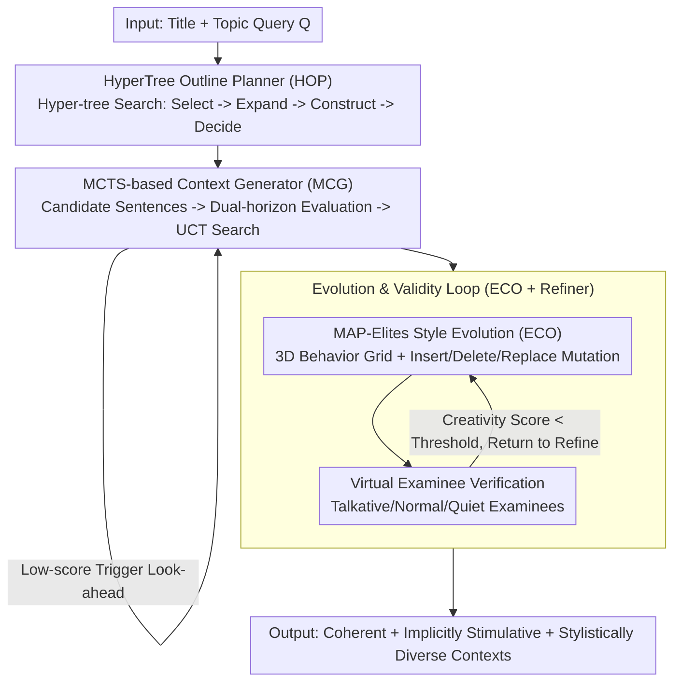

# AlphaContext: An Evolutionary Tree-based Psychometric Context Generator for Creativity Assessment

**Conference**: ACL 2026  
**arXiv**: [2604.18398](https://arxiv.org/abs/2604.18398)  
**Code**: [https://github.com/yxwang19/AlphaContext](https://github.com/yxwang19/AlphaContext)  
**Area**: LLM/NLP  
**Keywords**: Creativity Assessment, Psychometrics, Evolutionary Algorithms, MCTS Text Generation, MAP-Elites

## TL;DR
AlphaContext is proposed as an evolutionary tree-based psychometric context generator. By integrating four modules—HyperTree outline planning, MCTS-based sentence-by-sentence generation, MAP-Elites diversity optimization, and assessment-guided iterative refinement—it automatically generates high-quality long-text contexts for creativity assessment, outperforming competing methods by an average of 8% across seven evaluation dimensions.

## Background & Motivation

**Background**: Creativity assessment is increasingly vital in the LLM era. Psychometric research posits that context-based assessment is an effective way to measure creative thinking—providing subjects with a future-oriented scenario and requiring them to identify potential challenges to stimulate creativity. This paradigm originates from the Future Problem Solving Program (FPSP).

**Limitations of Prior Work**: High-quality psychometric assessment contexts still rely on manual expert design, leading to a severe production bottleneck (one context requires at least a week). Existing LLM generation methods face two major challenges: (1) difficulty in simultaneously embedding implicit assessment cues and maintaining global narrative coherence; (2) difficulty in achieving diversity while ensuring quality and measurement validity.

**Key Challenge**: Psychometric contexts differ from ordinary stories; they require assessment cues to be implicitly embedded within a coherent narrative, and these cues must effectively stimulate creative thinking. General story generation frameworks fail to satisfy these fine-grained constraints.

**Goal**: To automatically generate psychometric contexts that can replace expert designs while ensuring narrative coherence, assessment cue alignment, and stylistic diversity.

**Key Insight**: Context generation is decomposed into three stages—planning, generation, and evolution—using search algorithms to guarantee global structure, local quality, and diverse coverage respectively.

**Core Idea**: A HyperTree is used to structure the expert outline design process; MCTS performs an optimal sentence-level search under outline constraints; MAP-Elites iterates through a stylistic behavior space for evolution; and virtual examinees simulate responses to verify assessment validity.

## Method

### Overall Architecture

AlphaContext decomposes the expert task of "writing a psychometric context" into three progressive stages corresponding to four serial modules. Given a title and topic query $Q$, the HyperTree Outline Planner first searches for a hierarchical outline. This is passed to the MCTS-based Context Generator for sentence-by-sentence searching under outline constraints to produce a seed context. Subsequently, the Evolutionary Context Optimizer uses MAP-Elites to mutate and evolve the context within a stylistic behavior space. Finally, the Assessment-Guided Evolution Refiner validates validity through virtual examinee simulations; contexts that fail to elicit creativity are returned for further refinement. The system finally outputs long-text contexts that are coherent, implicitly stimulative, and stylistically diverse.

### Key Designs

**1. HyperTree Outline Planner (HOP): Formalizing the "Global-to-Local" Expert Design Habit into Hyper-tree Search**

Experts typically construct a framework before filling in details; standard tree structures struggle to represent the "one parent node expanding into multiple sub-theme sets" divide-and-conquer process. HOP defines a Hyper-tree $\mathcal{H} = (N, Q, \mathcal{R})$ where hyper-edges connect a parent to sets of child nodes. It iterates through four steps: HT-Select evaluates and prunes hyper-links to select optimal leaf nodes; HT-Expand applies expansion rules to generate candidate sub-groups; HT-Construct builds iteratively until termination; and HT-Decide performs a global evaluation to select the final outline. This step is critical for relevance; ablation studies show Relevance drops from 79.06% to 70.20% without HOP.

**2. MCTS-based Context Generator (MCG): Transforming Long-text Writing into Sentence-level Search for Long-range Consistency**

Asking an LLM to write a full context at once often results in topical drift and loss of outline constraints. MCG instead views generation as sentence-level decision making. At each step, the LLM proposes candidate sentences, which are scored via dual-horizon evaluation. High-score nodes adopt immediate evaluation (weighted mean of cue alignment $S_{sc}$, imagery vividness $S_{im}$, and coherence $S_{co}$, multiplied by a hallucination penalty $(1-S_{ha})$). Low-score nodes trigger a short look-ahead script to re-evaluate based on future potential, using the UCT formula to balance exploration and exploitation. This sentence-level search ensures coherence; without MCG, Coherence drops from 81.28% to 74.38%.

**3. Evolutionary Context Optimizer (ECO) + Assessment-Guided Refiner: "Diversity × Quality" Optimization via Stylistic Space and Closed-loop Validation**

A single theme requires diverse styles for different assessment groups. ECO defines a 3D behavior space—proximity range $\phi_1$, knowledge density $\phi_2$, and perspective diversity $\phi_3$—discretized into a grid where each cell retains the current best context. Seed contexts are mutated via insertion, deletion, or replacement, and elites are updated based on a fitness function (mean of coherence, relevance, and engagement). MAP-Elites naturally optimizes for both stylistic coverage and quality. The Assessment-Guided Refiner adds a validity loop: virtual examinees (talkative/normal/quiet) simulate responses. Contexts with creativity scores below a threshold are sent back for further evolution.

### Mechanism

Taking "Future Urban Water Crisis" as a theme: HOP first constructs a hyper-tree outline spanning "Background Setting $\rightarrow$ Conflict of Interest $\rightarrow$ Implicit Challenges." MCG searches sentence-by-sentence under this outline, triggering look-ahead for critical transitions to select sentences that are both coherent and embed challenge cues. ECO maps the seed context into the style grid, mutating variants with "High Knowledge Density" or "Strong Perspective Conflict." The Refiner simulates examinee responses; if a didactic variant fails to elicit creativity, it is returned to ECO for evolution until it exceeds the creativity score threshold.

### Loss & Training

AlphaContext is an unsupervised search framework and does not involve a traditional loss function. Quality evaluation is provided by an LLM scorer (DeepSeek-V3.1). The evolution stage is driven by a fitness function $F(C) = \text{Avg}(S_{coh}(C) + S_{rel}(C) + S_{eng}(C))$ to update elites.

## Key Experimental Results

### Main Results

| Method | Coherence↑ | Relevance↑ | Engagement↑ | Significance↑ | Uncertainty↑ |
|------|-----------|-----------|------------|--------------|-------------|
| GPT-5.1 | 70.44 | 70.20 | 65.39 | 50.37 | 68.60 |
| Gemini-3.0-Pro | 72.54 | 75.37 | 62.56 | 48.40 | 63.30 |
| SS-GEN | 60.22 | 69.69 | 56.40 | 60.10 | 53.57 |
| **Ours** | **81.28** | **79.06** | **79.93** | **71.06** | **80.30** |

### Ablation Study

| Configuration | Coherence | Relevance | Engagement | Uncertainty |
|------|-----------|-----------|------------|-------------|
| Full AlphaContext | 81.28 | 79.06 | 79.93 | 80.30 |
| w/o HOP | 77.96 | 70.20 | 76.85 | 76.11 |
| w/o MCG | 74.38 | 71.80 | 72.17 | 71.92 |
| w/o ECO | 75.62 | 70.57 | 71.80 | 70.69 |

### Key Findings
- AlphaContext ranks first across all 7 dimensions, with the largest advantages in Significance (+10.96% vs. second best) and Uncertainty (+11.7% vs. second best).
- In human preference evaluations, AlphaContext achieves a 62% win rate against GPT-5.1 and 74% against Gemini, with high inter-rater reliability (Cohen's $\kappa > 0.8$).
- Real-world human experiments: Creativity scores of 36 middle school students followed a normal distribution and showed a Pearson correlation of 0.377 with standardized AUT tests, demonstrating significant criterion validity.
- Generating a context takes approximately 227 seconds—significantly faster than expert design (~one week)—at an acceptable cost.

## Highlights & Insights
- The "Planning-Search-Evolution" design is highly systematic: HyperTree ensures global structure, MCTS optimizes local quality, and MAP-Elites expands diversity. This framework is transferable to other structured long-text generation scenarios (e.g., lesson planning, exam generation).
- Using virtual examinee simulations to verify assessment validity is a clever closed-loop design that avoids the high cost of human-in-the-loop experiments.
- Real-world human experiments validating the psychometric validity of generated contexts are rare in NLP papers and provide strong empirical support.

## Limitations & Future Work

- Generation costs are high (~12.9k tokens per context) due to multiple LLM calls; future work could involve distilling the process into a lightweight generator.
- The CreaTE dataset consists of manually constructed Title-Topic pairs by experts and is limited in scale (203 entries); domain coverage needs expansion.
- The system is currently focused on future-oriented scenarios; its applicability to other types of creativity assessments (e.g., open-ended tasks) remains unverified.
- The representativeness of the virtual examinee simulator depends on how well the LLM approximates real human creative behavior.
- The efficiency of sentence-level MCTS and MAP-Elites is sensitive to the choice of the underlying LLM and evaluator.

## Related Work & Insights
- **vs. DOC/CRITICS**: These story generation frameworks focus on narrative entertainment and fluency, failing to meet the quality and validity requirements of psychometrics.
- **vs. SS-GEN**: SS-GEN is designed for social stories in autism intervention, which differs fundamentally from creativity assessment contexts.
- **vs. CPIG**: CPIG generates short items and is unsuitable for long-text contexts requiring discourse coherence and implicit cues.

## Rating
- Novelty: ⭐⭐⭐⭐⭐ The combination of HyperTree, MCTS, and MAP-Elites is highly novel for text generation.
- Experimental Thoroughness: ⭐⭐⭐⭐⭐ Includes ablation, human preference, real-world human experiments, and case studies.
- Writing Quality: ⭐⭐⭐⭐ Clear structure, though notation-heavy.
- Value: ⭐⭐⭐⭐ Establishes a new direction for LLM-assisted psychometric context generation.

<!-- RELATED:START -->

## Related Papers

- [\[ICLR 2026\] LLEMA: Evolutionary Search with LLMs for Multi-Objective Materials Discovery](../../ICLR2026/llm_nlp/llema_evolutionary_search_with_llms_for_multi-objective_material_design.md)
- [\[ACL 2026\] Text-to-Distribution Prediction with Quantile Tokens and Neighbor Context](text-to-distribution_prediction_with_quantile_tokens_and_neighbor_context.md)
- [\[ICLR 2026\] Evaluating Text Creativity across Diverse Domains: A Dataset and Large Language Model Evaluator](../../ICLR2026/llm_nlp/evaluating_text_creativity_across_diverse_domains_a_dataset_and_large_language_m.md)
- [\[ICLR 2026\] In-Context Algebra](../../ICLR2026/llm_nlp/in-context_algebra.md)
- [\[ACL 2025\] Evaluating Implicit Bias in Large Language Models by Attacking from a Psychometric Perspective](../../ACL2025/llm_nlp/evaluating_implicit_bias_in_large_language_models_by_attacking_from_a_psychometr.md)

<!-- RELATED:END -->
