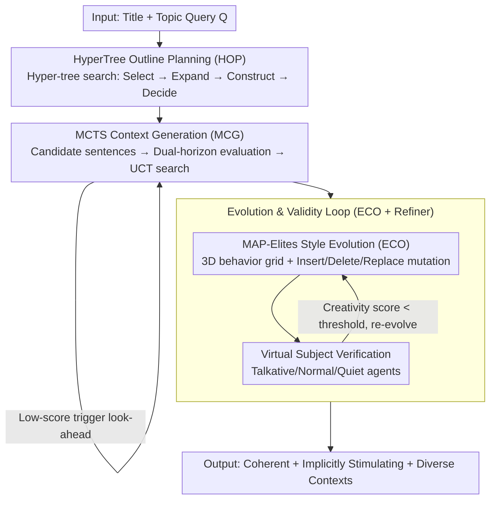

# AlphaContext: An Evolutionary Tree-based Psychometric Context Generator for Creativity Assessment

**Conference**: ACL 2026  
**arXiv**: [2604.18398](https://arxiv.org/abs/2604.18398)  
**Code**: [https://github.com/yxwang19/AlphaContext](https://github.com/yxwang19/AlphaContext)  
**Area**: LLM/NLP  
**Keywords**: Creativity assessment, psychometrics, evolutionary algorithms, MCTS text generation, MAP-Elites

## TL;DR
AlphaContext is proposed as an evolutionary tree-based psychometric context generator. Through four modules—HyperTree outline planning, MCTS sentence-by-sentence generation, MAP-Elites diversity optimization, and assessment-guided iterative refinement—it automatically generates high-quality long-text contexts for creativity assessment, outperforming baseline methods by an average of 8% across seven evaluation dimensions.

## Background & Motivation

**Background**: Creativity assessment has become increasingly important in the era of LLMs. Psychometric research suggests that context-based assessment is an effective way to measure creative thinking—providing subjects with a future-oriented scenario to identify potential challenges and stimulate creativity. This paradigm originates from the Future Problem Solving Program (FPSP).

**Limitations of Prior Work**: High-quality psychometric contexts still rely on manual expert design, creating a severe production bottleneck (one context requires at least one week). Existing LLM generation methods face two major challenges: (1) difficulty in simultaneously embedding implicit assessment cues and maintaining global narrative coherence; (2) difficulty in achieving diversity while ensuring quality and measurement validity.

**Key Challenge**: Psychometric contexts differ from ordinary stories—they require evaluation cues to be implicitly embedded within a coherent narrative, and these cues must effectively stimulate creative thinking. General story generation frameworks fail to meet these fine-grained constraints.

**Goal**: To automatically generate psychometric contexts capable of replacing expert designs while ensuring narrative coherence, assessment cue alignment, and stylistic diversity.

**Key Insight**: Context generation is decomposed into three stages—planning, generation, and evolution—using search algorithms to guarantee global structure, local quality, and diverse coverage, respectively.

**Core Idea**: Structuralize the expert outline design process using HyperTree, utilize MCTS to search for optimal text sentence-by-sentence under outline constraints, iteratively evolve within a stylistic behavior space using MAP-Elites, and simulate validation of assessment effectiveness via virtual subjects.

## Method

### Overall Architecture

AlphaContext decomposes the expert task of writing a psychometric context into three progressive stages: planning, generation, and evolution, corresponding to four cascaded modules. Given a title and topic query $Q$, the HyperTree Outline Planner (HOP) first searches for a hierarchical outline. This is passed to the MCTS-based Context Generator (MCG), which searches for a seed context sentence-by-sentence under the outline constraints. Subsequently, the Evolutionary Context Optimizer (ECO) iteratively mutates and evolves the seed in a stylistic behavior space via MAP-Elites. Finally, the Assessment-Guided Evolution Refiner uses virtual subjects to simulate responses; contexts that fail to elicit creativity are sent back for further refinement. The final output consists of long-text contexts that are coherent, capable of implicitly stimulating creativity, and stylistically diverse.

### Key Designs

**1. HyperTree Outline Planner (HOP): Formalizing expert top-down design as hyper-tree search**

Experts do not write sentences immediately but build a skeleton first. Standard tree structures struggle to represent the "divide and conquer" process where a single parent node expands into multiple sets of sub-themes. HOP defines a hyper-tree $\mathcal{H} = (N, Q, \mathcal{R})$, allowing hyper-edges to connect one parent node to a set of child nodes. It follows a four-step search cycle: HT-Select evaluates and prunes hyper-links to select optimal leaf nodes, HT-Expand applies expansion rules to generate candidate sub-groups, HT-Construct iteratively builds until termination, and HT-Decide performs a global evaluation to select the final outline. This step determines topic relevance—removing HOP in ablation studies caused Relevance to drop from 79.06% to 70.20%.

**2. MCTS-based Context Generator (MCG): Turning long-text writing into sentence-level search for long-range consistency**

Generating full contexts in one pass often leads to topic drift and loss of outline constraints. MCG treats generation as a sentence-by-sentence decision process. At each step, the LLM proposes candidate sentences, which are scored via dual-horizon evaluation. High-score nodes are adopted based on immediate evaluation—a weighted mean of cue alignment $S_{sc}$, imagery vividness $S_{im}$, and discourse coherence $S_{co}$, multiplied by a hallucination penalty $(1-S_{ha})$. Low-score nodes trigger a short look-ahead continuation for re-evaluation, using the UCT formula to balance exploration and exploitation. This improves coherence; without MCG, Coherence fell from 81.28% to 74.38%.

**3. Evolutionary Context Optimizer (ECO) + Assessment-Guided Refiner: Dual "Diversity × Quality" optimization with closed-loop validation**

A single theme requires multiple styles for different assessment populations. ECO defines a 3D behavior space—proximity range $\phi_1$, knowledge density $\phi_2$, and perspective diversity $\phi_3$—discretized into a grid where each cell retains the best context. Seed contexts are mutated via insertion, deletion, or replacement. MAP-Elites naturally optimizes for both diversity and quality by updating the "elite" pool based on a fitness function (mean of coherence, relevance, and engagement). The Assessment-Guided Refiner completes the loop by having talkative, normal, and quiet virtual subjects simulate responses. Contexts that yield low creativity scores are returned for further evolution.

### A Full Example

Using "Future Urban Water Crisis" as a theme: HOP first constructs a hyper-tree outline covering "background setting → conflict of interest → implicit challenges." MCG searches sentence-by-sentence under this outline, triggering look-ahead at critical transitions to ensure subsequent sentences maintain coherence while embedding challenge cues. ECO maps the seed context into the style grid, mutating versions with "high knowledge density" or "strong conflicting viewpoints." The Refiner tests these on virtual subjects; if a didactic variant fails to elicit creativity, it is sent back to ECO until it surpasses the creativity threshold.

### Loss & Training

AlphaContext is an unsupervised search framework and does not utilize a traditional loss function. Quality evaluation is provided by an LLM scorer (DeepSeek-V3.1). The evolution stage is driven by a fitness function $F(C) = \text{Avg}(S_{coh}(C) + S_{rel}(C) + S_{eng}(C))$ to update the elite pool.

## Key Experimental Results

### Main Results

| Method | Coherence↑ | Relevance↑ | Engagement↑ | Significance↑ | Uncertainty↑ |
|------|-----------|-----------|------------|--------------|-------------|
| GPT-5.1 | 70.44 | 70.20 | 65.39 | 50.37 | 68.60 |
| Gemini-3.0-Pro | 72.54 | 75.37 | 62.56 | 48.40 | 63.30 |
| SS-GEN | 60.22 | 69.69 | 56.40 | 60.10 | 53.57 |
| **AlphaContext** | **81.28** | **79.06** | **79.93** | **71.06** | **80.30** |

### Ablation Study

| Configuration | Coherence | Relevance | Engagement | Uncertainty |
|------|-----------|-----------|------------|-------------|
| Full AlphaContext | 81.28 | 79.06 | 79.93 | 80.30 |
| w/o HOP | 77.96 | 70.20 | 76.85 | 76.11 |
| w/o MCG | 74.38 | 71.80 | 72.17 | 71.92 |
| w/o ECO | 75.62 | 70.57 | 71.80 | 70.69 |

### Key Findings
- AlphaContext ranks first across all seven dimensions, with the largest leads in Significance (+10.96% vs. runner-up) and Uncertainty (+11.7% vs. runner-up).
- In human preference evaluations, AlphaContext achieves a 62% win rate against GPT-5.1 and 74% against Gemini, showing high agreement between humans and LLM judges (Cohen's κ > 0.8).
- Real-world human experiments: Creativity scores from 36 middle school students followed a normal distribution and showed a Pearson correlation of 0.377 with standardized AUT tests, demonstrating significant criterion validity.
- Generation takes approximately 227 seconds per context, significantly faster than expert design (~one week), at an acceptable cost.

## Highlights & Insights
- The "plan-search-evolve" tripartite design is highly systematic: HyperTree ensures global structure, MCTS optimizes local quality, and MAP-Elites expands diversity. This framework is transferable to other structured long-text generation scenarios (e.g., lesson planning, exam generation).
- Using virtual subjects to verify assessment validity is an ingenious closed-loop design that avoids the high cost of human-in-the-loop experiments.
- Real-world human validation of psychometric validity is rare in NLP papers and provides strong evidence for the system's utility.

## Limitations & Future Work

- High generation cost (~12.9k tokens per context) due to multiple LLM calls; future work could involve distillation into lightweight generators.
- The CreaTE dataset consists of only 203 expert-crafted title-theme pairs; domain coverage needs expansion.
- Currently limited to future-oriented contexts; applicability to other creativity assessments (e.g., open-ended tasks) remains unverified.
- Virtual subject simulation depends on how well LLMs approximate real human creative behavior.
- Efficiency of sentence-level MCTS and MAP-Elites is sensitive to the choice of underlying LLMs and evaluators.

## Related Work & Insights
- **vs. DOC/CRITICS**: These story generation frameworks focus on entertainment and fluency, failing to meet psychometric quality and validity requirements.
- **vs. SS-GEN**: SS-GEN generates social stories for autism intervention, which differs fundamentally from creativity assessment.
- **vs. CPIG**: CPIG generates short items and is unsuitable for long-text contexts requiring discourse coherence and implicit cues.

## Rating
- Novelty: ⭐⭐⭐⭐⭐ The combination of HyperTree, MCTS, and MAP-Elites is highly novel for text generation.
- Experimental Thoroughness: ⭐⭐⭐⭐⭐ Includes ablation, human preference, real-world human experiments, and case studies.
- Writing Quality: ⭐⭐⭐⭐ Clear structure, though somewhat notation-heavy.
- Value: ⭐⭐⭐⭐ Establishes a new direction for LLM-assisted psychometric context generation.

<!-- RELATED:START -->

## Related Papers

- [\[ACL 2026\] VISTA: Verification In Sequential Turn-based Assessment](vista_verification_in_sequential_turn-based_assessment.md)
- [\[ICLR 2026\] LLEMA: Evolutionary Search with LLMs for Multi-Objective Materials Discovery](../../ICLR2026/llm_nlp/llema_evolutionary_search_with_llms_for_multi-objective_material_design.md)
- [\[ACL 2026\] Text-to-Distribution Prediction with Quantile Tokens and Neighbor Context](text-to-distribution_prediction_with_quantile_tokens_and_neighbor_context.md)
- [\[ICLR 2026\] Evaluating Text Creativity across Diverse Domains: A Dataset and Large Language Model Evaluator](../../ICLR2026/llm_nlp/evaluating_text_creativity_across_diverse_domains_a_dataset_and_large_language_m.md)
- [\[ICLR 2026\] In-Context Algebra](../../ICLR2026/llm_nlp/in-context_algebra.md)

<!-- RELATED:END -->
