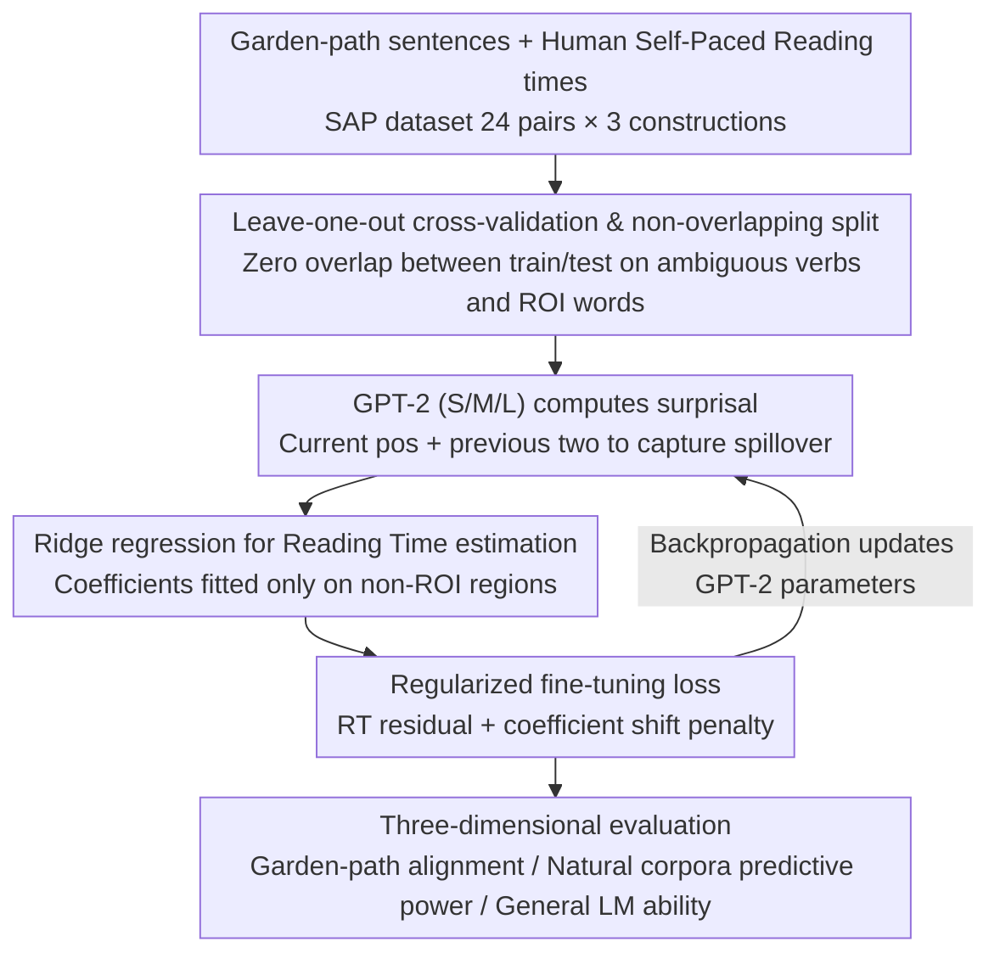

# An Existence Proof for Neural Language Models That Can Explain Garden-Path Effects via Surprisal

**Conference**: ACL 2026  
**arXiv**: [2604.18293](https://arxiv.org/abs/2604.18293)  
**Code**: [github](https://github.com/osekilab/RE-GPE)  
**Area**: LLM/NLP  
**Keywords**: Surprisal Theory, Garden-Path Effects, Human Reading Times, LM Fine-tuning, Psycholinguistics

## TL;DR

By fine-tuning neural language models on garden-path sentences, this work demonstrates the existence of a neural LM capable of simultaneously explaining garden-path effects and natural reading times via surprisal, providing an existence proof for Surprisal Theory.

## Background & Motivation

**Background**: Surprisal Theory posits that human sentence processing difficulty is linearly related to the negative log-probability (surprisal) of a word. Recently, researchers have used language models as proxies for human expectations to validate this hypothesis.

**Limitations of Prior Work**: Although neural LM surprisal captures human reading times on natural corpora well, it severely underestimates processing difficulty in sentences requiring syntactic disambiguation (e.g., garden-path sentences like "the horse raced past the barn fell")—predicting only 1/10 to 1/30 of the observed human reading slowdown.

**Key Challenge**: This failure has sparked a debate between two explanations: either neural LM probability estimates differ from humans, or garden-path effects inherently cannot be reduced to surprisal. Many recent studies favor the latter, suggesting Surprisal Theory is insufficient for these phenomena.

**Goal**: To investigate the first possibility—whether it is truly impossible to construct a neural LM that explains garden-path effects through surprisal.

**Key Insight**: Instead of evaluating off-the-shelf LMs, this study aligns LM surprisal estimates with actual human reading times via fine-tuning.

**Core Idea**: By fine-tuning GPT-2 on garden-path sentences to better match human reading times, the authors provide an "existence proof"—showing that a neural LM can explain both garden-path effects and natural reading times simultaneously.

## Method

### Overall Architecture

This study does not evaluate existing models but constructs an "existence proof" by actively fine-tuning neural LM surprisal estimates to align with human reading times. Following the alignment fine-tuning approach of Kiegeland et al. (2024), surprisal is mapped to reading time estimates via ridge regression. GPT-2 (S/M/L) is then fine-tuned with the goal of "approximating real human reading times." Finally, the model is evaluated across three dimensions: generalization to unseen garden-path items, predictive power for natural corpora reading times, and general LM capability degradation.

### Key Designs

**1. Leave-one-out cross-validation and non-overlapping split: Strictly isolating training and testing on small data**  
With a small dataset (24 pairs per construction), the risk of overfitting is high. The "existence proof" must withstand generalization tests. Each fold leaves out one pair from each garden-path construction for testing, ensuring no overlap between training and test sets regarding ambiguous verbs and ROIs (Regions of Interest, i.e., disambiguation positions and the two subsequent spillover positions). The resulting coverage reflects true generalization to new items rather than memorization.

**2. Ridge regression-based reading time estimation: Using "ordinary" reading times outside ROI to calibrate coefficients for explaining ROI slowdown**  
Surprisal itself is not reading time; a mapping is required. The feature vector includes surprisal at the current and two preceding positions (capturing syntactic spillover), along with control variables like word length and position. Critically, regression coefficients are fitted only on "ordinary" regions unaffected by disambiguation (outside the ROI). However, the same coefficients must explain the reading slowdown within the ROI—preventing the model from simply "hardcoding" the answer.

**3. Regularized fine-tuning loss: Forcing the model to adapt probability distributions rather than cheating with ROI estimates**  
Simply minimizing reading time residuals provides a shortcut: the model could suppress surprisal outside the ROI to numerically inflate estimated RTs within the ROI without learning a plausible distribution. The loss function includes two terms: the mean squared error of RT residuals and a penalty for regression coefficient deviation from initial values. This regularization forces improvements to stem from changes in the surprisal distribution itself.

### Loss & Training

The loss function $\mathcal{L}_B(\theta)$ consists of a mean squared residual term (measuring the difference between predicted and actual reading times) and a coefficient shift penalty (preventing regression coefficients from drifting too far). Training utilizes balanced batch sampling, containing equal numbers of different garden-path constructions to prevent any single type from dominating the optimization.

## Key Experimental Results

### Main Results

| Model | Construction | Pre-tuning ROI 1 Coverage | Post-tuning ROI 1 Coverage |
|------|------|-------------------|-------------------|
| GPT-2 Small | MVRR | 7% | 73% |
| GPT-2 Small | NPS | 19% | 83% |
| GPT-2 Small | NPZ | 15% | 73% |

### Ablation Study

| Configuration | Key Findings | Description |
|------|---------|------|
| Single-construction tuning → Cross-construction transfer | MVRR tuning → NPS 51.5ms (Baseline 9.6ms) | Cross-construction transfer is effective |
| SRC/ORC asymmetric tuning | Captured only 22% of human effect | Limited effect where Surprisal Theory is not applicable |
| Natural corpora predictive power | Improved across the board post-tuning | Garden-path tuning unexpectedly improves natural text prediction |

### Key Findings
- Post-tuning GPT-2 Small performed best, capturing approximately 73%-83% of human reading slowdown at ROI 1, significantly exceeding the 7%-19% pre-tuning baseline.
- The tuned model correctly reproduced the ranking of slowdown magnitudes across constructions (MVRR > NPZ > NPS).
- Predictive power for human reading times on natural corpora actually improved after fine-tuning.
- Single-construction tuning transferred to other constructions, suggesting the model learned a general mechanism for garden-path effects.
- Fine-tuning had limited success on SRC/ORC asymmetries (phenomena where Surprisal Theory is considered less applicable), indicating the method is not a "magic bullet" and respects theoretical boundaries.

## Highlights & Insights
- Ingenious research design: Transforms a theoretical debate into an actionable empirical question—not by proving Surprisal Theory is "correct," but by providing a constructive existence proof.
- The improvement on garden-path sentences also boosted natural corpora predictions, implying systematic biases between original LMs and human expectations.
- Negative results on SRC/ORC are valuable, showing that the limitations of the method align with the boundary of Surprisal Theory's applicability.
- Raises profound theoretical questions: If the LM space is unbounded, Surprisal Theory might become practically unfalsifiable.

## Limitations & Future Work
- Small data scale (24 pairs × 3 constructions) requires validation on larger datasets.
- The internal mechanisms changed by fine-tuning remain unexplored.
- An existence proof does not guarantee that existing LMs naturally learn the "correct" human-like probability distribution.
- The authors suggest two directions to improve the falsifiability of Surprisal Theory: constraining probability distributions or requiring psychological reality in the parsing distribution.

## Related Work & Insights
- **vs van Schijndel & Linzen (2021)**: They argued that neural LM surprisal's failure to explain garden-path effects evidences against Surprisal Theory; this paper challenges that conclusion.
- **vs Kiegeland et al. (2024)**: They fine-tuned LMs on natural corpora; this work extends the approach to garden-path sentences.
- **vs Huang et al. (2024)**: They systematically showed the extent to which LM surprisal underestimates garden-path effects; this work provides a counterexample.

## Rating
- Novelty: ⭐⭐⭐⭐ Innovative transformation of theoretical debate into structural existence proof.
- Experimental Thoroughness: ⭐⭐⭐⭐ Multi-dimensional evaluation with both positive and negative results, though data scale is small.
- Writing Quality: ⭐⭐⭐⭐⭐ Clear theoretical background and rigorous logical flow.
- Value: ⭐⭐⭐⭐ Significant contribution to the theoretical discourse in computational psycholinguistics.

<!-- RELATED:START -->

## Related Papers

- [\[ACL 2026\] Clozing the Gap: Exploring Why Language Model Surprisal Outperforms Cloze Surprisal](clozing_the_gap_exploring_why_language_model_surprisal_outperforms_cloze_surpris.md)
- [\[ACL 2026\] Expect the Unexpected? Testing the Surprisal of Salient Entities](expect_the_unexpected_testing_the_surprisal_of_salient_entities.md)
- [\[ACL 2025\] Can Input Attributions Explain Inductive Reasoning in In-Context Learning?](../../ACL2025/llm_nlp/can_input_attributions_explain_inductive_reasoning_in_in-context_learning.md)
- [\[ICLR 2026\] Neural Synchrony Between Socially Interacting Language Models](../../ICLR2026/llm_nlp/neural_synchrony_between_socially_interacting_language_models.md)
- [\[ACL 2025\] Neural Topic Modeling with Large Language Models in the Loop](../../ACL2025/llm_nlp/neural_topic_modeling_with_large_language_models_in_the_loop.md)

<!-- RELATED:END -->
