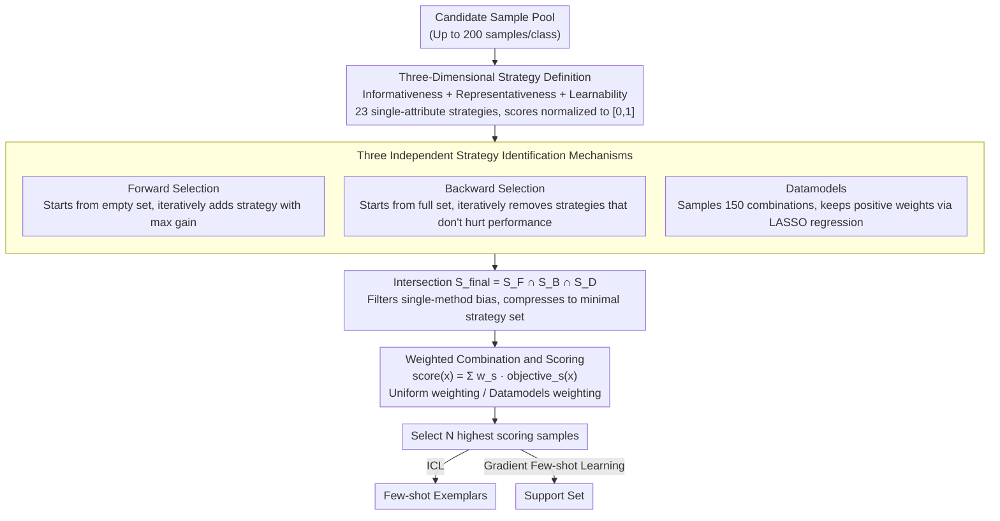

# Automatic Combination of Sample Selection Strategies for Few-Shot Learning

**Conference**: ACL 2026 Findings  
**arXiv**: [2402.03038](https://arxiv.org/abs/2402.03038)  
**Code**: [https://github.com/kinit-sk/ACSESS](https://github.com/kinit-sk/ACSESS)  
**Area**: LLM/NLP  
**Keywords**: Few-shot learning, Sample selection, Strategy combination, In-context learning, Meta-learning

## TL;DR

This paper proposes the ACSESS method, which automatically identifies and combines complementary sample selection strategies through three mechanisms: forward selection, backward selection, and Datamodels. Validated across 23 strategies, 5 ICL models, 3 gradient-based few-shot learning methods, and 14 datasets (6 text, 8 image), the combined strategy consistently outperforms single strategies and ICL-specific baselines.

## Background & Motivation

**Background**: Few-shot learning faces a critical challenge in sample selection—performance can fluctuate drastically depending on the samples chosen. Existing selection strategies typically focus on a single attribute (such as similarity, diversity, or informativeness). While many new strategies specifically for In-Context Learning (ICL) are effective, they are often designed for specific scenarios and exhibit poor transferability.

**Limitations of Prior Work**: (1) Single-attribute strategies have inherent limitations—the most informative samples may be difficult to learn, while the most similar samples may lack diversity. (2) ICL-specific strategies (e.g., LENS, Active Prompt, EXPLORA, CASE) are optimized for specific scenarios and have limited generalization. (3) Classic supervised learning selection strategies (e.g., active learning, coreset selection) have been systematically overlooked in LLM contexts.

**Key Challenge**: A single sample attribute cannot comprehensively measure a sample's contribution to few-shot learning, but the computational cost of exhaustively searching all strategy combinations is unacceptable.

**Goal**: Automatically identify complementary sample selection strategies and optimize their combination so that a mixture of classic selection strategies can match or exceed ICL-specific strategies.

**Key Insight**: Drawing inspiration from feature selection methods in traditional machine learning (forward/backward selection) and the Datamodels concept, these approaches are elevated from the sample level to the strategy level.

**Core Idea**: The "quality" of a sample cannot be measured by a single attribute—informativeness, representativeness, and learnability are complementary dimensions. Automatically combining strategies from these dimensions can identify high-quality samples with complementary properties.

## Method

### Overall Architecture

The core mechanism of ACSESS is that the "utility" of a sample is not determined by a single attribute. Instead, multiple complementary selection strategies should be automatically combined. It elevates the logic of feature selection from traditional machine learning to the strategy level in three steps: first, defining a candidate pool of 23 single-attribute strategies across three families (informativeness, representativeness, and learnability); second, using three independent methods—forward selection, backward selection, and Datamodels—to identify high-contribution strategy subsets and taking their intersection; and finally, scoring each sample using a weighted combination of the selected strategies to pick the top $N$ samples as few-shot exemplars or support sets.

### Key Designs

**1. Three-Dimensional Strategy Definition (23 Single-Attribute Strategies): Creating a unified candidate pool of complementary attributes.**

Different few-shot learning methods prefer different sample attributes—ICL favors hard-to-learn samples, while gradient-based learning favors easy-to-learn samples; neither similarity nor diversity alone is comprehensive. ACSESS systematically deploys candidate strategies across three families: Informativeness (including similarity, diversity, active learning like Entropy/Margin, and coreset selection like GraNd/Graph-Cut); Representativeness (Herding, KCenter, CRAIG, Glister); and Learnability (Forgetting frequency and Cartography categorization). Each strategy normalizes sample scores to $[0,1]$ for equitable comparison and combination.

**2. Three Independent Strategy Identification Mechanisms: Using intersections to filter bias and identify a robust minimal strategy set.**

With 23 candidates, exhaustive combinations are impossible, and any single search method may be biased. ACSESS runs three identification methods in parallel: Forward selection iteratively adds strategies to an empty set based on performance gains; Backward selection removes strategies from the full set that do not degrade performance; and Datamodels randomly samples 150 combinations to train a LASSO regression, retaining strategies with positive weights. The final set $S_{final} = S_F \cap S_B \cap S_D$ preserves only the most robust strategies while minimizing computational overhead.

**3. Weighted Combination and Scoring: Merging multiple strategies into a single sample score with a choice between robust defaults and optimal performance.**

Once the strategy set is determined, the integrated score for each sample is $score(x) = \sum_{s \in S} w_s \cdot objective_s(x)$. The paper provides three schemes for weights $w_s$: Uniform weighting ($w_s = 1/|S_{final}|$), which has the lowest cost and strongest transferability (lagging behind weighted schemes by only 0.10–0.25 pp); Datamodels weighting, which reuses LASSO weights for optimal performance on specific datasets/models; and random weighting, which typically performs worse. Uniform weighting serves as a robust default with zero extra cost.

### Loss & Training

ACSESS does not train models but functions as a pre-processing step for sample selection. For ICL, selected samples are used directly as exemplars. For gradient-aware few-shot learning (Prototypical Networks, MAML, Few-Shot Fine-Tuning), selected samples form the support set. Evaluations use a 5-way 5-shot setting, with 5 data splits × 10 random seeds × 300/600 tasks to control variance.

## Key Experimental Results

### Main Results

**ACSESS vs. ICL-specific Baselines (Avg. Accuracy Gain on Text Datasets relative to Classic selection)**

| Method | ICL Avg. Gain (pp) | Type |
|------|-----------------|------|
| ACSESS (Weighted) | +2.5 | Ours |
| CASE (Purohit et al., 2025) | +2.34 | ICL-specific |
| EXPLORA (Purohit et al., 2024) | +1.8 | ICL-specific |
| Active Prompt (Diao et al., 2024) | +1.6 | ICL-specific |
| LENS (Li & Qiu, 2023) | +1.55 | ICL-specific |
| Best Single-Attribute (Cartography-Hard) | +2.0 | Single Strategy |
| Random selection | 0.0 | Baseline |

ACSESS achieved statistical significance via Wilcoxon tests in all comparisons.

### Ablation Study

**Impact of Sample Count on Selection Strategy Effectiveness**

| Number of Shots | ACSESS vs Random (ICL, pp) | ACSESS vs Random (Gradient, pp) |
|-----------|--------------------------|--------------------------|
| 1-shot | +4 ~ +7 | +7 |
| 5-shot | +2.5 | +1.8 |
| 20-shot | +10-12 (Old models) / +2-3 (New models) | Peak Performance |
| 30-40-shot | Returns begin to diminish | Regresses to Random |
| 50-shot | ICL performance drops | — |

**Impact of Dataset Size**
- ICL: Using only 25% (50 samples/class) matches full dataset selection performance.
- Gradient Learning: Using only 10% (20 samples/class) matches performance.
- Effectiveness of selection drops by 20-40% when reduced to 10 samples/class.

### Key Findings

- **Learnability is the most critical attribute for few-shot learning**: ICL prefers difficult samples (Cartography-Hard), while gradient-based learning prefers easy+ambiguous samples and those with low forgetting frequencies. Representativeness strategies were entirely excluded from the final ACSESS selections.
- The optimal strategy combination identified by ACSESS varies by learning method—ICL favors Cartography-Hard + Forgetting + Margin + Entropy, while gradient-based learning favors Cartography-Easy&Ambiguous + Forgetting + Margin + Graph-Cut.
- A uniform combination of Cartography + Margin (+ optional Forgetting) serves as a recommended default with zero extra computational cost.
- As the number of samples increases to 30-40, all strategies regress toward random selection levels, indicating that sample selection is primarily valuable in extremely low-sample scenarios.
- More samples are not always better—ICL performance declines at 50+ shots, likely due to context length constraints.

## Highlights & Insights

- Systematic comparison of 23 sample selection strategies across ICL and gradient few-shot learning for the first time in a unified framework.
- Elevating Datamodels from the sample level to the strategy level is an elegant abstraction—enabling effective search in combination space at lower cost.
- The importance ranking of "Learnability > Informativeness > Representativeness" challenges intuition, as much previous work focused on similarity and diversity.
- The practical suggestion of a uniform Cartography + Margin combination lowers the threshold for adopting the method.
- The finding that sample selection matters at low shots but fails at higher shots provides direct guidance for practitioners.

## Limitations & Future Work

- Assumes a sufficiently large labeled dataset for selection (up to 200 samples/class); true extremely low-resource scenarios require different solutions.
- Limited to 5-way classification; ICL performance may degrade in higher-way settings due to context limits.
- Lack of extensive prompt engineering may underestimate the effectiveness of certain strategies.
- High computational cost for the analysis phase (approx. 2500 A100 GPU hours, 270 kgCO2).
- Future work could explore strategy selection in unlabeled scenarios and performance on larger-scale LLMs.

## Related Work & Insights

- **vs LENS (Li & Qiu, 2023)**: LENS uses a two-step search (informativeness + diversity); ACSESS automatically discovers optimal strategy combinations and performs better in most scenarios.
- **vs CASE (Purohit et al., 2025)**: The strongest ICL-specific baseline; ACSESS matches it with uniform combination and exceeds it by +0.16pp with a weighted combination.
- **vs Datamodels (Ilyas et al., 2022)**: Original Datamodels operate at the sample level; ACSESS abstracts this to the strategy level to reduce computational complexity.

## Rating

- Novelty: ⭐⭐⭐⭐ Automatic combination at the strategy level is a valuable methodological innovation, though the individual components (selection methods, Datamodels) are established.
- Experimental Thoroughness: ⭐⭐⭐⭐⭐ Extremely large scale (23 strategies × 5 ICL models × 3 gradient methods × 14 datasets) with comprehensive ablations.
- Writing Quality: ⭐⭐⭐⭐ Clearly structured with explicit practical recommendations, though quite lengthy.
- Value: ⭐⭐⭐⭐ Provides direct guidance for sample selection practice in few-shot learning; the unified comparison fills a significant gap.

<!-- RELATED:START -->

## Related Papers

- [\[ICML 2025\] Random Registers for Cross-Domain Few-Shot Learning](../../ICML2025/llm_nlp/random_registers_for_cross-domain_few-shot_learning.md)
- [\[ACL 2026\] UCS: Estimating Unseen Coverage for Improved In-Context Learning](ucs_estimating_unseen_coverage_for_improved_in-context_learning.md)
- [\[ACL 2026\] DeCoVec: Building Decoding Space based Task Vector for Large Language Models via In-Context Learning](decovec_building_decoding_space_based_task_vector_for_large_language_models_via_.md)
- [\[ACL 2026\] FastDiSS: Few-step Match Many-step Diffusion Language Model on Sequence-to-Sequence Generation](fastdiss_few-step_match_many-step_diffusion_language_model_on_sequence-to-sequen.md)
- [\[ACL 2025\] From Selection to Generation: A Survey of LLM-based Active Learning](../../ACL2025/llm_nlp/from_selection_to_generation_a_survey.md)

<!-- RELATED:END -->
