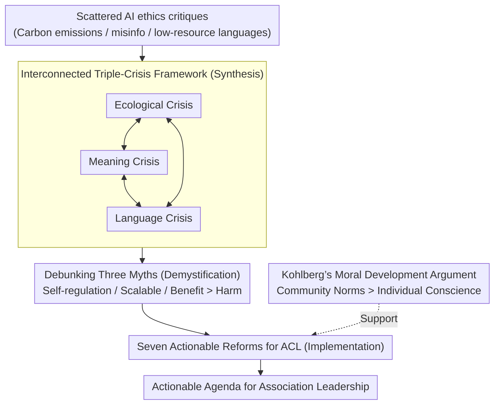

# Big AI is Accelerating the Metacrisis: What Can We Do?

**Conference**: ACL 2026  
**arXiv**: [2512.24863](https://arxiv.org/abs/2512.24863)  
**Code**: None (Policy Position Paper)  
**Area**: AI Ethics / Position Paper / NLP Governance  
**Keywords**: metacrisis, Big AI, ACL Code of Ethics, ecological crisis, linguistic diversity, ethics washing

## TL;DR
In this ACL 2026 position paper, Steven Bird argues that "Big AI"—industrialized LLM engineering driven by a few giants—is simultaneously accelerating three interconnected crises: the **ecological crisis**, the **meaning crisis**, and the **language crisis**. Given that ACL is the primary publisher of LLM research, it must shift from "individual compliance" to "collective action of a professional community." The author proposes seven specific reforms for ACL, including prioritizing public interest, resisting corporate capture, protecting critical NLP, and establishing an NLP policy track.

## Background & Motivation

**Background**: ACL is likely the world's largest publisher of peer-reviewed LLM research. Its Code of Ethics explicitly mandates that the "public good is the paramount consideration." However, in reality, the vast majority of ACL papers contribute to Big AI (OpenAI / Google / Meta / Microsoft / various startup giants)—with the reviewing ecosystem, SOTA competitions, and conference sponsorships all being subject to corporate capture.

**Limitations of Prior Work**: The author lists multiple harms in the NLP field that are often ignored or "ethics-washed": (1) Data centers lead to greenhouse gas emissions, e-waste, water consumption, and rare mineral mining; (2) LLM content erodes critical thinking, creative work, knowledge diversity, and democracy; (3) 90% of the world's languages lack standardized writing, and multilingual LLMs do not solve the political roots of language death; (4) AI safety is inherently non-scalable, and "adding guardrails is a game of whack-a-mole" used by Big AI to maintain a deregulated space; (5) Academia is repeatedly corrupted by corporate philanthropy and ethics washing.

**Key Challenge**: Individual researchers face an ethical conflict between "public interest as paramount" vs. "demands of industrial funders/employers." Using Kohlberg’s stages of moral development, the author points out that relying solely on individual compliance (Level 3: postconventional) is unreliable as only a minority of adults reach this stage. A more realistic approach is Level 2 (conventional): shaping behavior through the **collective expectations and norms** of a prestigious group like ACL.

**Goal**: (a) Systematically demonstrate the causal chain between Big AI and the metacrisis; (b) debunk three myths regarding "AI self-governance," "scalability," and "benefits outweighing harms"; (c) propose seven actionable reforms for ACL.

**Key Insight**: The author adopts the perspective of "language engineers as a professional community," elevating the conflict from an "individual moral dilemma" to "professional organizational governance."

**Core Idea**: **The acceleration of the metacrisis by Big AI cannot be solved by individual conscience alone. As the largest professional organization for language engineering, ACL must act collectively through mechanisms such as collective standards, policy tracks, and independent spaces for critical NLP.**

## Method

### Overall Architecture
This is a policy position paper where the logic flows from "phenomena" to "action": first, the ecological, meaning, and language crises involved with LLMs are synthesized into a feedback-loop system representing a metacrisis (§2). Next, the three myths—that Big AI will self-regulate, that scalability is feasible, and that benefits outweigh harms—are dismantled (§3). Finally, the critique is translated into seven actionable reforms for ACL as a professional community (§4), supported by Kohlberg’s moral development theory to explain why community norms are superior to individual conscience (§5). In other words, the input is scattered AI ethics critiques, processed through "synthesis → demystification → implementation," and the output is an actionable agenda for the association's leadership.

### Key Designs

**1. A Causal Framework of Interconnected Crises: Upgrading Isolated Critiques into Systemic Arguments**

Traditional AI ethics literature tends to treat "carbon emissions," "misinformation," and "low-resource languages" in isolation. This allows researchers to easily bypass responsibility by claiming "I only work on A, not B or C." The author maps these three into a feedback loop (Fig 1): ecological anxiety is turned into "attention capture" by LLM content, and doomscrolling in turn numbs ecological concern (Ecology ↔ Meaning); LLM content in dominant languages squeezes out local languages, while language loss dismantles elder roles and knowledge transmission (Meaning ↔ Language); language loss weakens the ability of Indigenous people to steward ancestral lands (hotspots of biodiversity), while climate disasters and mineral extraction for data centers displace Indigenous peoples and erase language communities (Language ↔ Ecology). These loops close to form a single **metacrisis** (Morin & Kern 1999, Lawrence et al. 2024), making it difficult for readers to evade holistic responsibility.

**2. Debunking Three Myths: Blocking Rationalizations Before Proposing Reforms**

The author anticipates three common narratives used to dismiss the proposed suggestions and counters them preemptively. Myth 1, "Big AI will self-regulate": Citing Phan, Zuboff, Shelby, and Ressa, the author argues that Big Tech weaponizes AI ethics to delay regulation, notes the irony of ethics-washing at GMU/Stanford and industry sponsorship of FAccT, and draws parallels to the Big Tobacco playbook (Abdalla & Abdalla 2021). Myth 2, "Scalability is feasible": Resource consumption (carbon/water/minerals) has breached planetary boundaries; AI safety is inherently non-scalable (a perpetual game of whack-a-mole), and annotation sweatshops exploit low-wage laborers in "hidden outposts of AI." Myth 3, "Benefits outweigh harms": Sequence models differ fundamentally from natural language (Bender & Koller 2020), SOTA-chasing is a shallow fashion, and bias is treated as a bug rather than an inherent feature of classification (Crawford 2021), while exponential resource growth yields only linear performance gains (Schwartz et al. 2020).

**3. Seven Actionable Reforms for ACL: Translating Philosophical Critique into Organizational Actions**

To prevent the critique from being dismissed as just another "anxiety piece," the author breaks down the propositions into seven specific proposals for the ACL Executive Board: Reiterate that the "public good is paramount" in the Code of Ethics should bind member behavior, not just papers; resist image-washing from corporate sponsorships (e.g., Meta); reassert in CFPs that computational linguistics studies "natural human language" and encourage degrowth + small LMs; establish independent tracks and review processes for critical NLP to avoid suppression by mainstream reviewers; create an NLP policy research track to prepare for future regulation; issue public statements in ACL's name; and advocate for a life-sustaining research vision (Ethics of Care, data feminism, decolonizing methods, etc.).

## Key Experimental Results

### Main Results: Empirical Evidence for the Triple Crisis (Facts cited in the paper)

| Crisis Dimension | Key Facts / Citations |
|---|---|
| Planetary Boundary Breach | **6 out of 9** planetary boundaries have been breached (Richardson et al., 2023) |
| Data Center Consumption | Increased GHG, e-waste, water use, and rare earth mineral extraction (Crawford 2021; UNEP 2024) |
| Language Writing Rate | Approximately **90% of global languages** have no standardized writing (Bird, 2026, etc.) |
| Multilingualism | Most global populations are already multilingual, using dozens of contact languages for information and economy |
| SOTA Resource Ratio | Resource consumption **grows exponentially** for **linear** performance gains (Schwartz et al., 2020) |
| Multilingual LLM Limits | There will "never be enough data" for low-resource languages to train robust models |
| Moral Development | Kohlberg Level 3 is "reached by only a minority of adults"—individual conscience is insufficient |

### Ablation Study: Three Myths vs. Reality

| Myth | Big AI Narrative | Reality Counter-argument | Key Citations |
|---|---|---|---|
| Myth 1: Self-regulation | Ethics frameworks are sufficient | Ethics washing; FAccT sponsored by Big Tech | Slee 2020; Ochigame 2022; Bietti 2021 |
| Myth 2: Scalability | Data/Compute scaling is sustainable | Planetary boundaries breached; guardrails are not scalable | Bender & Hanna 2025; Slee 2020; Crawford 2021 |
| Myth 3: Benefit > Harm | "Solves poverty, sustainability, education" | Sequence models ≠ Natural language; SOTA-chasing is fashion | Bender & Koller 2020; Church & Kordoni 2022; Bender & Hanna 2025 |

### Key Findings
- **Big AI as the Common Cause**: The author's most persuasive conclusion is mapping the feedback loops of ecological, meaning, and language crises into a single system (Fig 1).
- **Kohlberg Level 2/3 Argument**: Grounding ACL reform suggestions in empirical psychology regarding moral stages is more effective than simple ethical slogans.
- **Conflict of Interest**: The paper explicitly names corporate capture phenomena, such as Meta sponsorship and the dominance of Big Tech employees in the review process.
- **Call for Degrowth + Small LMs**: Instead of over-funded SOTA-chasing, the author recommends the degrowth/small LM paths of Vetter (2017), Meyers (2023), Wang et al. (2025), and Church (2026).

## Highlights & Insights
- **The "Metacrisis" Framework**: By synthesizing dispersed critiques (Bender, Crawford, Strubell, Birhane) into a systemic argument, the impact is synergistic ($1+1>2$).
- **ACL Code of Ethics as a Leverage Point**: Using the existing "public good paramount" commitment to hold ACL accountable is more actionable than proposing entirely new clauses.
- **Big Tobacco Analogy**: The precision of comparing philanthropic funding, academic capture, and lobbying to the tobacco industry enables immediate reader comprehension.
- **Countering "Don't Want to Get Political"**: Citing the Black Project, the author argues that those claiming to be apolitical are actually maintaining political structures that favor them.
- **Individual-to-Community Shift**: Moving the moral burden from the individual researcher to organizational governance avoids individual guilt and focuses on collective mechanisms.

## Limitations & Future Work
- The author admits: (1) "Big AI" is not explicitly tied to specific companies but refers to a direction; (2) it only covers three crises, excluding war, inequality, and privacy; (3) Fig 1 omits direct relationships between government, military, and academia; (4) ACL is a member organization with structural limits on collective action.
- Personal Observations: (a) The paper is purely normative and **lacks quantitative metrics** to judge the success of reforms (e.g., a "Big Tech paper percentage" threshold); (b) the definition of "small LM" or "life-sustaining research" is vague; (c) the discussion on fairness for researchers in developing countries regarding "degrowth" needs more detail.
- Potential Improvements: (a) Aligning with other researchers for a joint ACL board petition; (b) designing mandatory carbon/water reporting for paper ethics statements; (c) collaborating with law schools and planetary research centers for the NLP policy track.

## Related Work & Insights
- **vs. Bender et al. 2021 (Stochastic Parrots)**: While Parrots focused on the cognitive risks of LMs, this paper expands the view to the planetary ecosystem level.
- **vs. Bender & Hanna 2025 (The AI Con)**: This paper serves as an actionable academic reflection of the critiques against the Big AI business model.
- **vs. Crawford 2021 (Atlas of AI)**: It uses the anthropological evidence of AI's materiality to build an NLP-specific reform agenda.
- **vs. Abdalla & Abdalla 2021 (Grey Hoodie)**: It uses quantitative data on Big Tech's academic penetration as evidence for corporate capture.
- **vs. Schwartz et al. 2020 (Green AI)**: It elevates efficiency claims to a political-economic level of "degrowth + anti-scalability."
- **Inspiration**: (a) The "metacrisis + governance reform" framework can be applied to other "AI for X" fields; (b) Kohlberg’s community norm leverage is applicable to other ethics-heavy engineering fields (bioethics, nuclear ethics).

## Rating
- Novelty: ⭐⭐⭐⭐ The integration of the metacrisis framework with seven specific ACL reforms is a first for the community.
- Experimental Thoroughness: ⭐⭐⭐ As a position paper, it relies on high-density citations (~80 references) rather than experiments, making it robust within its genre.
- Writing Quality: ⭐⭐⭐⭐⭐ Clear hierarchy, powerful rhetoric, and comprehensive self-rebuttal.
- Value: ⭐⭐⭐⭐⭐ Directly addresses ACL leadership and may influence future conference policies and reviewing practices.

<!-- RELATED:START -->

## Related Papers

- [\[ACL 2026\] Can AI Be a Good Peer Reviewer? A Survey of Peer Review Process, Evaluation, and the Future](can_ai_be_a_good_peer_reviewer_a_survey_of_peer_review_process_evaluation_and_th.md)
- [\[ACL 2025\] BIG-Bench Extra Hard](../../ACL2025/llm_nlp/big-bench_extra_hard.md)
- [\[ICLR 2026\] d²Cache: Accelerating Diffusion-Based LLMs via Dual Adaptive Caching](../../ICLR2026/llm_nlp/d2cache_accelerating_diffusion-based_llms_via_dual_adaptive_caching.md)
- [\[ACL 2026\] From Fallback to Frontline: When Can LLMs be Superior Annotators of Human Perspectives?](from_fallback_to_frontline_when_can_llms_be_superior_annotators_of_human_perspec.md)
- [\[ACL 2026\] An Existence Proof for Neural Language Models That Can Explain Garden-Path Effects via Surprisal](an_existence_proof_for_neural_language_models_that_can_explain_garden-path_effec.md)

<!-- RELATED:END -->
