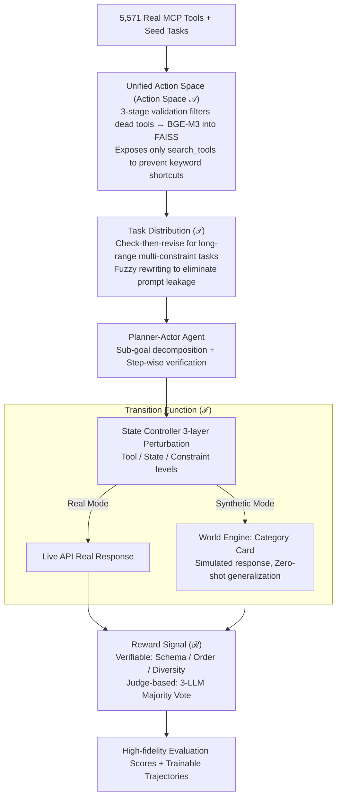

# C-World: A Computer Use Agent Environment Creator

**Conference**: ACL 2026  
**arXiv**: [2601.06328](https://arxiv.org/abs/2601.06328)  
**Code**: https://ziqiao-git.github.io/C-World/ (Available)  
**Area**: LLM Agent / Computer Use / Agent Environment  
**Keywords**: MCP Tools, Long-range Tasks, World Model, State Perturbation, Evaluation+Training Data Engine

## TL;DR
The authors formalize the "agent environment" as an Action / Task / Transition / Reward quadruple and implement it as C-World. It utilizes 5,571 real MCP tools, automated task synthesis, state controller perturbations, and dual-signal rewards for high-fidelity evaluation. Furthermore, it employs a "World Engine" to simulate tool responses without live APIs, enabling scalable training. Evaluation of 9 frontier LLMs reveals that "planning is generally strong while execution is generally weak." Fine-tuning with as few as 1,170 C-World trajectories outperforms a baseline trained on 119k samples.

## Background & Motivation

**Background**: Performance on single-round function-calling has reached saturation (with benchmarks like BFCL nearing perfection). However, real-world "computer use" tasks involve dozens of rounds of interaction, cross-app workflows, fuzzy constraints, and dynamic failures. Existing agent benchmarks (AgentBench, ToolBench, WebArena, etc.) either have a limited number of tools ($<600$) or consist of static problem sets that cannot support continuous training.

**Limitations of Prior Work**: (1) Small tool pools and narrow domains fail to reflect the breadth of real workflows; (2) Static tasks cannot "self-evolve" new constraints; (3) Lack of "perturbation"—most tasks follow the "happy path," failing to test an agent's recovery or replanning capabilities; (4) Simple evaluation signals (pass/fail or LLM judge) cannot separate "planning failure" from "execution failure"; (5) Training relies entirely on live APIs, restricted by cost, rate limits, and state instability, making large-scale trajectory collection impossible.

**Key Challenge**: To enable agents to learn in complex environments like humans, the environment must be "broad, deep, perturbable, and scalably low-cost." Manually constructing such environments is prohibitively expensive, while relying on live APIs is hindered by the rate, cost, and instability of external services.

**Goal**: (1) Formalize the necessary components of an "agent environment"; (2) Construct a system capable of generating new environments on demand rather than a fixed benchmark; (3) Provide a "world model" mode independent of live APIs for scalable training.

**Key Insight**: Adapt the mature MDP quadruple (action space, transition, reward, task distribution) from RL directly to LLM agents, modeling "tool call responses" as a transition function simulated by an LLM $\rightarrow$ World Engine.

**Core Idea**: Define the $(\mathcal{A},\mathcal{T},\mathcal{F},\mathcal{R})$ quadruple components and implement them via dual tracks (Real Mode / Synthetic Mode); all four components utilize "automated synthesis + LLM simulation" instead of manual labor.

## Method

### Overall Architecture
C-World translates the MDP quadruple from RL textbooks to LLM agents, formalizing the "agent environment" into four components $(\mathcal{A},\mathcal{T},\mathcal{F},\mathcal{R})$—Action Space, Task Distribution, Transition Function, and Reward. An additional World Engine is integrated to model "tool responses" as transitions simulated by LLMs. The input consists of 5,571 real MCP tools and a set of seed tasks. The system automatically synthesizes long-range tasks, which are executed by a Planner-Actor agent under perturbations injected by a State Controller, and finally scored by dual-signal rewards for high-fidelity evaluation. In Synthetic Mode, the World Engine generates "highly realistic" tool responses without live APIs, decoupling training trajectory collection from external service constraints. Both modes share the same formal framework, allowing the environment to serve as both an evaluation platform and a training data engine.

### Key Designs

**1. Action Space: Converting 5,000+ real tools into a "comprehensive and dynamic" searchable action pool**

Previous benchmarks either hard-coded a small set of tools (unrealistic) or provided many invalid tools (non-executable), often allowing agents to take shortcuts via keywords. C-World utilizes registry crawlers and manual supplements to collect 276 MCP servers and 5,571 tools from Smithery (covering 204 apps like Gmail/GitHub/Slack). It configures dedicated virtual accounts for authenticated services and performs three-stage validation (authenticated availability $\rightarrow$ successful invocation $\rightarrow$ usable responses). Valid tools are stored in FAISS using BGE-M3 embeddings of their "server identity + tool name + description + schema." At runtime, only a `search_tools(query, k)` interface is exposed; the agent must retrieve and load tools as needed, ensuring realistic scale and blocking keyword shortcuts.

**2. Task Distribution: Creating long-range, multi-app, constrained tasks without human annotation**

Synthetic tasks often suffer from being too short, being artificially elongated, or leaking answers through synthesis prompts. C-World samples 1–3 seed tools, uses their descriptions to retrieve a larger candidate set, and performs round-robin sampling across servers to ensure cross-app interaction. LLMs generate initial queries followed by a check-then-revise loop based on two metrics: tool coverage (rational activation of candidates) and constraint quality (diversity/coupling/long-range dependencies). Tasks are rewritten until they meet these criteria. Finally, fuzzy rewriting (e.g., using "let the team know" instead of "use slack_post_message") forces agents to decompose sub-queries for retrieval, eliminating "prompt leakage."

**3. Transition Function: Enabling realistic failure reproduction and live API-independent scaling**

Agents cannot learn from purely random noise, yet relying on live APIs is hindered by speed and cost. Thus, the transition layer must handle both "reproducible targeted perturbations" and "low-cost scalability." The State Controller is a lightweight Python middleware within the agent runtime that intercepts MCP traffic and injects three types of perturbations based on an "adversity budget": tool-level (timeout/unavailability), state-level (payload truncation/session expiration), and constraint-level (mid-task rule additions). For fairness, the total perturbation budget is constant across models, with only the timing randomized. The World Engine categorizes tools into "category cards" (containing response patterns, field structures, and failures) and uses LLMs to generate responses conditioned on the schema and session logs. Since it relies on cards and schemas, it generalizes zero-shot to unseen tools and can simulate non-existent enterprise environments for stress testing. The Spearman correlation between World Engine and live execution model rankings is $\rho=0.883$.

**4. Reward Signal: Separating "machine-verifiable" and "semantic understanding" scores**

Binary pass/fail metrics are too coarse to distinguish between planning and execution errors, while pure LLM judges are noisy and potentially biased. C-World splits rewards into two signals. The "verifiable" path is calculated deterministically from execution logs: schema compliance (official JSON validation), order constraints (timestamp against dependency graph), and information diversity (unique servers/sources visited). The "judge-based" path addresses semantic intent using a majority vote from three frontier models (GPT-4o, GPT-5.1, DeepSeek-V3.2) across dimensions like completeness, grounding (avoiding hallucination), format, and tradeoff handling. This integration achieves human alignment at Spearman $\rho\approx0.73\text{–}0.76$, nearing the human ceiling of 0.773.

### Loss & Training
The training side filters 1,170 samples from the "first-round effective actions" of 50 seed tasks. These are converted to ms-swift format for SFT using Hermes-style agent supervision. Compared to Toucan (119k) and ToolACE (11.3k), 1.2k C-World trajectories outperform the baseline, indicating that "long-range + constraint-dense + perturbed" trajectories are significantly more valuable than massive volumes of "happy path" data.

## Key Experimental Results

### Main Results
Total scores of 9 frontier LLMs in C-World Real Mode (10-point scale + %):

| Model | Overall | Completeness | Recovery% | Format% | Tool Calls |
|------|---------|-----|-----|-----|-----|
| gemini-3-pro-preview | **5.87** | 4.75 | 89.0 | 53.9 | 47.9 |
| claude-opus-4.5 | 5.42 | 4.70 | 83.7 | 51.0 | 45.2 |
| deepseek-v3.2 | 4.97 | 4.00 | **90.6** | 39.5 | 21.7 |
| grok-4 | 4.78 | 3.80 | 89.0 | **68.3** | 27.4 |
| gpt-oss-120b | 4.66 | 3.42 | 72.7 | 35.8 | 14.4 |
| gpt-5.2 | 4.43 | 3.42 | 79.3 | 12.4 | 29.2 |
| qwen3-235b-a22b | 3.53 | 2.56 | 88.1 | 31.3 | 11.2 |
| gpt-4o-mini | 3.07 | 1.13 | 50.6 | 3.3 | 51.7 |

### Ablation Study

| Model / Training Data | Sample Count | BFCL | MCP-Universe |
|------|-----|------|------|
| Qwen2.5-7B base | – | 19.93% | 4.40% |
| + Toucan | 119k | 27.18% | 15.28% |
| + ToolACE | 11.3k | 27.06% | 2.23% |
| **+ C-World (Ours)** | **1.2k** | **28.58%** | **15.30%** |

| Evaluation Mode | Spearman ρ |
|------|------|
| World Engine (Synthetic) vs Real Exec | **0.883** |
| DeepSeek-V3.2 judge vs Human | 0.759 |
| Human vs Human ceiling | 0.773 |

### Key Findings
- **Execution Is the Bottleneck**: All models scored 7.7~8.6 on Goal Decomposition (planning), but Completeness varied from 1.13 to 4.75, showing the gap lies in "action," not "thought."
- **Tool Call Count $\neq$ Success Rate**: gpt-4o-mini called tools 51.7 times (highest) but performed worst; Gemini-3-Pro used 47.9 calls for the top score, indicating activity must be paired with reasoning.
- **Constraint Following is a Major Failure Mode**: Format compliance varied drastically (3.3% to 68.3%).
- **World Engine effectively replaces live APIs**: High Spearman correlation (0.883) with real rankings.
- **Surprising Data Efficiency**: 1,170 C-World trajectories outperformed 119k Toucan samples.

## Highlights & Insights
- Formalizing agents using the $(\mathcal{A},\mathcal{T},\mathcal{F},\mathcal{R})$ quadruple is a brilliant "deconstruction" that clarifies how each component can be independently improved and evaluated.
- The "category card" design in World Engine is key to zero-shot generalization—cheaper than per-tool demonstrations and allows for stress testing with non-existent tools.
- The "constant adversity budget + randomized timing" is an elegant fairness design.
- The data efficiency finding (1.2k > 119k) suggests that the core of tool learning is "rare and hard" trajectories rather than "massive and easy" ones.

## Limitations & Future Work
- The evaluation set is limited to 50 seed scenarios, which covers only a fraction of the tool-server-constraint combinatorial space.
- Analysis focuses primary on frontier/large open-source models; the stability of small model training via C-World needs further verification.
- World Engine absolute scores have a systematic bias compared to live execution (e.g., DeepSeek-V3.2 synthetic Pass% is much lower than real).
- Future Work: (1) Continuous evolution of task synthesis; (2) Confidence estimation for the World Engine; (3) Expanding primary analysis to sub-10B models.

## Related Work & Insights
- **vs AgentBench / WebArena**: These are static benchmarks with fewer tools; C-World is an "evolvable" environment with state perturbation.
- **vs ToolBench / Toucan**: Both synthesize data, but C-World's finding of 1.2k > 119k challenges the practice of simply scaling data volume.
- **vs MCP-Bench**: C-World is the first to formalize a "tool response simulator" (World Engine) that is empirically equivalent to live APIs.

## Rating
- **Novelty**: ⭐⭐⭐⭐⭐ "Environment creation system" over "benchmark" is a paradigm shift.
- **Experimental Thoroughness**: ⭐⭐⭐⭐ Covers 9 frontier LLMs and dual modes, though seed count is relatively small.
- **Writing Quality**: ⭐⭐⭐⭐ Clear formalization with distinct sections for each component.
- **Value**: ⭐⭐⭐⭐⭐ Most practical infrastructure for training/evaluating computer-use agents currently available.

<!-- RELATED:START -->

## Related Papers

- [\[ACL 2025\] AXIS: Efficient Human-Agent-Computer Interaction with API-First LLM-Based Agents](../../ACL2025/llm_nlp/axis_efficient_human-agent-computer_interaction_with_api-first_llm-based_agents.md)
- [\[ACL 2025\] ASPERA: A Simulated Environment to Evaluate Planning for Complex Action Execution](../../ACL2025/llm_nlp/aspera_a_simulated_environment_to_evaluate_planning_for_complex_action_execution.md)
- [\[ICML 2026\] In-Context Routing (ICR): Train-Once, Use-Everywhere Attention-Level Implicit ICL](../../ICML2026/llm_nlp/train_once_reuse_everywhere_generalizable_implicit_in-context_learning_by_routin.md)
- [\[ICML 2026\] Express Your Doubts: Probabilistic World Modeling Should Not Be Based on Token logprobs](../../ICML2026/llm_nlp/express_your_doubts_--_probabilistic_world_modeling_should_not_be_based_on_token.md)
- [\[ACL 2026\] LinkNav: Surfacing Interconnected Information in Scientific Articles](linknav_surfacing_interconnected_information_in_scientific_articles.md)

<!-- RELATED:END -->
