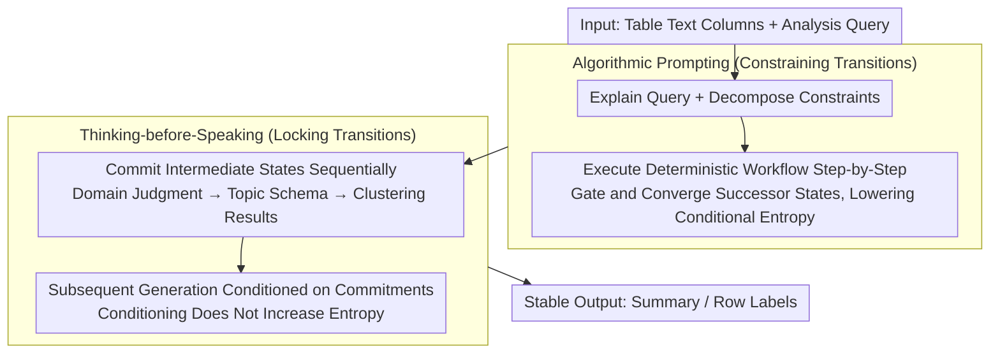

# CAST: Achieving Stable LLM-based Text Analysis for Data Analytics

**Conference**: ACL 2026 Findings  
**arXiv**: [2602.15861](https://arxiv.org/abs/2602.15861)  
**Code**: [https://github.com/jxtse/CAST-text-analysis](https://github.com/jxtse/CAST-text-analysis)  
**Area**: LLM Evaluation  
**Keywords**: Output Stability, Text Analysis, Tabular Data, Algorithmic Prompting, Intermediate State Commitment

## TL;DR

The CAST framework is proposed to constrain the potential reasoning paths of LLMs through two mechanisms: Algorithmic Prompting and Thinking-before-Speaking. This significantly enhances inter-run stability for text summarization and labeling tasks without sacrificing output quality.

## Background & Motivation

**Background**: Text Analysis for Data Analysis (TADA) is a paradigm that transforms free-text columns in tables into structured representations (e.g., summary topics, row-level labels). LLMs are natural candidates for TADA, as a single model can perform various text analysis tasks through natural language queries.

**Limitations of Prior Work**: A fundamental conflict exists between the probabilistic nature of LLM generation and the deterministic requirements of data analysis. The same input may produce semantically drifted outputs across different runs (e.g., the same comment marked as "Customer Service" or "Support Team"), leading to inconsistent downstream filtering, grouping, and aggregation, which undermines reproducibility and trust.

**Key Challenge**: The root cause of instability lies in the unconstrained latent reasoning trajectories within the LLM. From a probabilistic perspective, prompting an LLM induces a distribution over possible reasoning paths; when the entropy of this distribution is high (indicating model uncertainty about the next step), minor random fluctuations result in output drift. Existing methods like Self-Consistency improve correctness through multi-sample voting but are not designed for stability.

**Goal**: To achieve output stability by constraining reasoning paths during the generation process without relying on redundant sampling.

**Key Insight**: The authors observe that requiring the model to generate relevant intermediate reasoning states before the final output significantly reduces the variance in output length and content, even without specifying the exact content of those states.

**Core Idea**: Use Algorithmic Prompting to provide a procedural scaffold for constraining reasoning transitions, and the Thinking-before-Speaking mechanism to explicitly fix key intermediate states. These work in synergy to concentrate reasoning paths onto a few high-probability trajectories.

## Method

### Overall Architecture

CAST formulates the "output stability" problem as an "entropy of the reasoning path distribution" issue. Before generating a final structured result, an LLM implicitly traverses a latent reasoning trajectory; high entropy in this distribution leads to output drift from random perturbations. The framework utilizes a single structured LLM call, taking tabular text columns and analysis queries as input to produce stable summaries or row-level labels. It constrains state transitions through procedural scaffolding and forces the model to explicitly record key intermediate states, compressing reasoning into high-probability trajectories. The same template can be reused for summarization and labeling by switching task-specific schemas and constraints, requiring no repeated sampling or voting. (Stability metrics CAST-S / CAST-T are used for post-hoc evaluation and are not part of the inference chain.)

### Key Designs

**1. Algorithmic Prompting (AP): Pruning Invalid Reasoning Paths with Deterministic Workflows**

Instability stems from the model having numerous "plausible" next states at each step without transition constraints. AP encodes classic deterministic analysis workflows and expert heuristics into structured prompt sequences—e.g., for summarization, the model is first asked to explain the query and decompose constraints, then follow a fixed algorithmic flow. Formally, this introduces a gating function $g_t(z_t, z_{<t}, x)$ at each reasoning step, using hard masks or soft weighting to concentrate probability mass on fewer valid successor states, thereby reducing local conditional entropy $H(Z_t|Z_{<t}, x, \mathcal{C}_{AP})$. The scaffold acts as a strong prior, effectively pruning large areas of the reasoning space before sampling.

**2. Thinking-before-Speaking (TbS): Fixing Key Intermediate States Explicitly**

If a model traverses the reasoning trajectory implicitly and only outputs the final answer, randomness at each step accumulates in the output. TbS reverses this by requiring the model to generate and "commit" to a series of intermediate states (e.g., domain judgment, topic schema, clustering results) sequentially. This is grounded in the information-theoretic fact that conditioning does not increase entropy: $H(Z_{>t}|X=x, Z_{\leq t}) \leq H(Z_{>t}|X=x)$. Once the schema, topic set, or domain decision is fixed, subsequent generation is forced to remain consistent with these commitments, making the entire path less sensitive to minor random fluctuations. AP constrains "how to transition," while TbS locks "where to transition."

**3. Stability Metrics CAST-S / CAST-T: Tailored for Inter-run Consistency**

General metrics like ROUGE-L or Cosine Similarity are insensitive to semantic drift and ordering changes critical in analysis. The authors propose two new metrics. CAST-S for summarization combines a semantic score $S_{sem}$ for content overlap and a ranking consistency score $S_{pos}$ based on Kendall's Tau: $S_{CAST-S}(\alpha) = \alpha \cdot S_{sem} + (1-\alpha) \cdot S_{pos}$. At $\alpha=0.9$, it shows the highest correlation with human judgment ($r=0.813$). CAST-T for labeling first uses an LLM to cluster labels from multiple runs by semantic equivalence, then uses the proportion of the dominant cluster as the stability score, identifying drifts like "Customer Service" vs. "Support Team."

### Loss & Training

CAST is a pure inference-time method involving no training or fine-tuning. All constraints are implemented via carefully designed structured prompts within a single API call, requiring no multiple sampling, voting, or post-processing overhead.

## Key Experimental Results

### Main Results

| Model | Method | Summarization Stability (CAST-S)↑ | Independent Labeling Accuracy↑ | Joint Labeling Stability (CAST-T)↑ |
|------|------|---------------------|-----------------|------------------------|
| GPT-5.2 | Baseline | 9.24 | 95.0% | 9.40 |
| GPT-5.2 | Self-Consistency | 7.40 | 96.2% | 9.16 |
| GPT-5.2 | **Ours (CAST)** | **9.39** | **98.2%** | **9.60** |
| DeepSeek-V3.2 | Baseline | 8.15 | 92.7% | 8.78 |
| DeepSeek-V3.2 | **Ours (CAST)** | **9.47** | 95.6% | **9.14** |
| Gemini-3-Flash | Baseline | 9.80 | 96.0% | 8.18 |
| Gemini-3-Flash | **Ours (CAST)** | **9.93** | **96.8%** | 8.26 |

### Ablation Study

| Configuration | Summarization Stability (DeepSeek) | Description |
|------|----------------------|------|
| Full CAST (AP+TbS) | 9.47 | Complete Model |
| AP Only | 8.97 | Algorithmic Prompting only |
| TbS Only | 9.46 | Thinking-before-Speaking only |
| Few-shot | 8.96 | Few-shot prompting |
| Self-Consistency | 7.06 | Multiple sampling/voting performs worse |

### Key Findings
- Self-Consistency performs worst in stability because divergent sampling is unsuitable for reliable post-hoc aggregation, and it incurs over 3x the computational cost of CAST.
- AP and TbS exhibit synergy; the full CAST framework typically outperforms either component used in isolation.
- CAST slightly improves summarization quality (recall increased from 0.854 to 0.879) while significantly enhancing stability.

## Highlights & Insights
- Formalizes the mechanism of LLM output instability—high reasoning path entropy—from an information-theoretic perspective, providing a theoretical framework for reasoning constraint rather than empirical tuning.
- Observes that merely requiring the model to produce relevant intermediate reasoning lowers output variance even without pre-specifying the content of those states, a highly practical finding.
- The CAST-S/CAST-T metrics fill a gap in stability quantification, applicable to any scenario requiring consistent LLM outputs.

## Limitations & Future Work
- Algorithmic scaffolds currently require manual design, which may limit scalability to entirely new task domains.
- Experiments primarily cover summarization and labeling; effectiveness in more complex TADA composite workflows is not yet verified.
- Over-constraint might suppress subtle, valuable variations required in certain analytical contexts.

## Related Work & Insights
- **vs Self-Consistency**: SC improves correctness via majority voting but does not guarantee stability and is computationally expensive. CAST achieves stability in a single call by constraining the reasoning path.
- **vs Algorithm-of-Thoughts**: While AoT aims to improve correctness, CAST targets stability, representing a different application direction for the "constrained reasoning" concept.

## Rating
- **Novelty**: ⭐⭐⭐⭐ First systematic study of LLM output stability in data analysis scenarios.
- **Experimental Thoroughness**: ⭐⭐⭐⭐ Validated across 3 models, multiple baselines, ablations, and human-verified metrics.
- **Writing Quality**: ⭐⭐⭐⭐⭐ Strong integration of theoretical framework and empirical observations with clear narration.
- **Value**: ⭐⭐⭐⭐ Highly relevant for the reliable deployment of LLMs in production environments.

<!-- RELATED:START -->

## Related Papers

- [\[ACL 2026\] Synthetic Eggs in Many Baskets: The Impact of Synthetic Data Diversity on LLM Fine-Tuning](synthetic_eggs_in_many_baskets_the_impact_of_synthetic_data_diversity_on_llm_fin.md)
- [\[AAAI 2026\] Collaborative LLM Numerical Reasoning with Local Data Protection](../../AAAI2026/llm_nlp/collaborative_llm_numerical_reasoning_with_local_data_protection.md)
- [\[ACL 2025\] Enabling LLM Knowledge Analysis via Extensive Materialization](../../ACL2025/llm_nlp/enabling_llm_knowledge_analysis_via_extensive_materialization.md)
- [\[CVPR 2026\] LLM-Guided Probabilistic Fusion for Label-Efficient Document Layout Analysis](../../CVPR2026/llm_nlp/llm-guided_probabilistic_fusion_for_label-efficient_document_layout_analysis.md)
- [\[ICLR 2026\] Fine-Grained Activation Steering: Steering Less, Achieving More](../../ICLR2026/llm_nlp/fine-grained_activation_steering_steering_less_achieving_more.md)

<!-- RELATED:END -->
