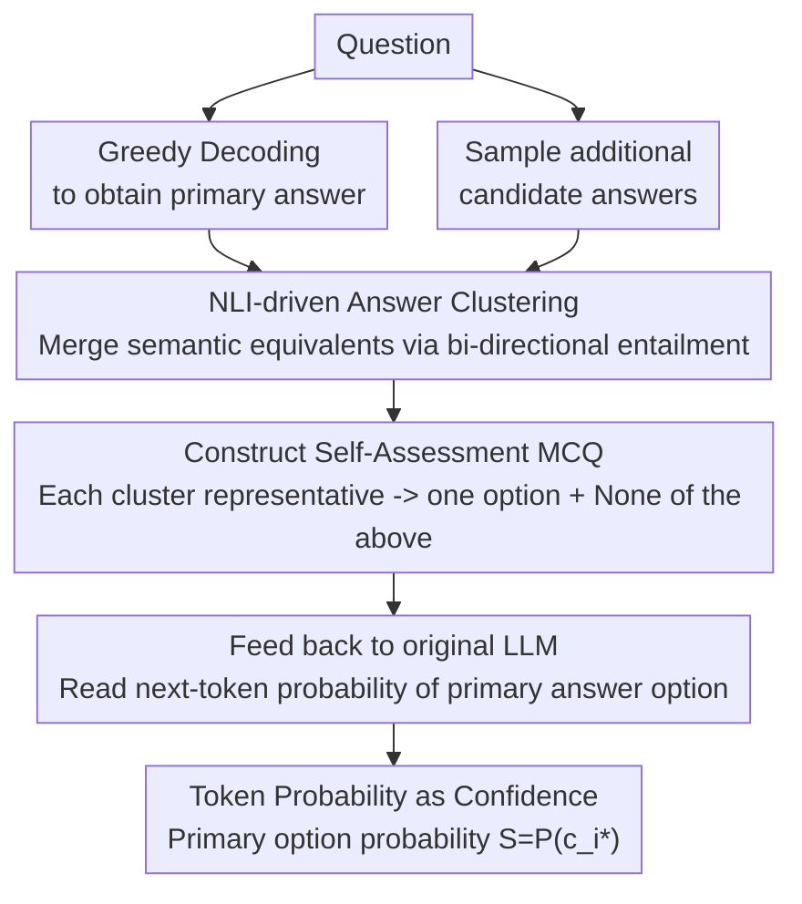

# Clustered Self-Assessment: A Simple yet Effective Method for Uncertainty Quantification in Large Language Models

**Conference**: ACL2026 Findings  
**arXiv**: [2606.03846](https://arxiv.org/abs/2606.03846)  
**Code**: https://github.com/ccqq77/clustered_self_assessment  
**Area**: LLM Uncertainty Estimation / NLP Understanding  
**Keywords**: LLM Calibration, Uncertainty Quantification, Semantic Clustering, Self-Assessment, MCQ Reformulation

## TL;DR
This paper proposes Clustered Self-Assessment: a method that first clusters multiple sampled LLM responses into mutually exclusive semantic options, and then prompts the same LLM to assign confidence scores to original answers via multiple-choice question (MCQ) probabilities. This approach yields superior AUROC and Brier calibration performance over baselines like semantic entropy and $P(\text{True})$ on TQA, NQ, and XSum.

## Background & Motivation
**Background**: LLMs demonstrate strong capabilities in QA, summarization, and open-ended generation, yet they frequently produce fluent but incorrect answers. In practical deployments, users require not only the answer itself but also the model's certainty, making uncertainty quantification (UQ) a fundamental component of reliable LLM systems.

**Limitations of Prior Work**: One class of methods prompts models to express "uncertainty" in natural language, but prior research has observed that LLMs tend to be overconfident. Another class calculates uncertainty based on disagreement among multiple sampled answers, such as predictive entropy, semantic entropy, EigV, Deg, and SAR. While these capture output divergence, they typically produce indirect scores that are difficult for users to interpret and fail to leverage the model’s internal evaluative capabilities regarding candidate answers.

**Key Challenge**: Sampling-based methods reveal the "possible answer space," while self-assessment methods capture "how the model compares candidates," but the two are often decoupled. Directly using all sampled answers as options leads to the fragmentation of probability mass among semantically equivalent responses. Conversely, without sampling (i.e., just asking $P(\text{True})$), the model evaluates only a single answer in isolation, lacking competitive candidates.

**Goal**: The authors aim to construct a training-free, interpretable, and sample-efficient uncertainty estimation method: one that retains the candidate space provided by sampled answers, merges semantically identical answers into clear options, and utilizes the LLM's probability assigned to option tokens directly as a confidence score.

**Key Insight**: The observation is that LLMs provide clearer relative preferences when presented with structured multiple-choice questions. If the options are derived from the model's own sampled answers and deduplicated via semantic clustering, the MCQ task effectively forces the model to perform an explicit self-assessment of "which of its own possible answers" it truly believes.

**Core Idea**: Use NLI-driven semantic clustering to transform sampled answers into mutually exclusive MCQ options, and then use the original LLM’s token probability $S=P(c_{i^*})$ for the target answer option as an interpretable confidence score.

## Method

### Overall Architecture
Clustered Self-Assessment is a two-stage pipeline. Given a question, the model first uses greedy decoding to obtain the primary answer for evaluation, while simultaneously sampling several additional candidate answers. The method then employs an NLI model to compare semantic relationships between these answers, merging mutually compatible or entailing answers into the same cluster. A representative answer from each cluster is converted into an MCQ option, with an additional "None of the above" option included. Finally, the MCQ is fed back into the original LLM, and the next-token probability of the option label corresponding to the primary answer is read as its confidence score.

The core of this workflow is turning uncertainty estimation into a single-token probability lookup rather than a long-form generation task. Sampling exposes the answer space, clustering compresses semantic redundancy, and the MCQ format triggers the model's comparative self-assessment.

### Key Designs

**1. NLI-driven answer clustering: Merging semantic duplicates before using them as options**

Directly inserting all sampled answers into an MCQ is problematic: if the same meaning is expressed in multiple ways, the model's probability mass is split across equivalent options, causing the confidence to be underestimated. Conversely, merging semantically conflicting answers would mask genuine uncertainty. The authors use NLI relationships to define this boundary—for any answer pair $(a_i, a_j)$, an external NLI model checks if the relationship is entailment, neutral, or contradiction. Answers are processed sequentially; a new answer is merged into an existing cluster if there is no contradiction or if bi-directional entailment is sufficiently met. Entailment is used rather than embedding similarity because UQ requires determining if answers support each other, a task where vector distance often fails.

**2. Self-assessment MCQ construction: Translating "Is the answer correct?" into "Which candidate is most credible?"**

When models provide verbal confidence, they are often overconfident, and pure entropy scores are indirect values that users cannot interpret. This step transforms open-ended evaluation into a structured comparison: each answer cluster serves as an MCQ option, including the primary answer's cluster, plus a "None of the above" option for cases where no candidates are reliable. The model does not generate long text; it only assigns probabilities to labels like A/B/C. This format naturally maps "how certain am I" to "which of my own sampled answers do I prefer," which is more stable than verbalizing confidence and easier to explain than entropy.

**3. Token probability as confidence: Directly reading the model's probability for the correct option without training a calibrator**

With the MCQ format, confidence is straightforward. Given the LLM's output vocabulary logits $\mathbf{z}$, the probability of an option label token $c_i$ is:

$$P(c_i)=\frac{\exp(z_{c_i})}{\sum_v \exp(z_v)},$$

The probability of the option $c_{i^*}$ corresponding to the primary answer, $S=P(c_{i^*})$, serves as the confidence score. This score resides directly in the probability mass the model assigns to candidates, making it naturally normalized, comparable across samples, and directly usable for calibration evaluation without an external calibrator. It is more semantically grounded than indirect metrics like semantic entropy because it reflects exactly "how much the model believes this specific answer" after clustering has compressed semantic redundancy.

### Loss & Training
The main method is training-free. In experiments, the authors evaluate 7 open-source models across the Qwen2.5, Qwen3, and Gemma-3 series. Sampling methods use 8 samples by default at temperature $\tau=0.5$. Answer clustering defaults to `deberta-large-mnli`. The paper also trains probes using these confidence scores as supervision: one using a 0.5 threshold binary labels and another using soft labels; soft-label probes proved more stable than baselines like SEP in out-of-distribution settings.

## Key Experimental Results

### Main Results
Evaluation was conducted on TriviaQA (TQA, 9,960 samples), Natural Questions (NQ, 3,610 samples), and XSum (11,334 samples) using AUROC as the primary metric. The following table highlights ablation results on Qwen2.5-32B and Gemma-3-27B, showing the performance gap when removing clustering or sampling.

| Dataset | Model | Ours (AUROC) | w/o clustering | w/o sampling |
|--------|------|-----------:|---------------:|-------------:|
| TQA | Qwen2.5-32B | 0.940 | 0.874 | 0.890 |
| NQ | Qwen2.5-32B | 0.850 | 0.741 | 0.785 |
| TQA | Gemma-3-27B | 0.924 | 0.895 | 0.789 |
| NQ | Gemma-3-27B | 0.821 | 0.766 | 0.659 |

### Main Results (Calibration)
Calibration is measured by Brier score (lower is better). The method outperforms P(True), raw generation probability, and normalized semantic entropy (NSE) across datasets and models.

| Dataset | Model | Ours | P(True) | Probability | NSE |
|--------|------|-----:|--------:|------------:|----:|
| TQA | Qwen2.5-32B | 0.0843 | 0.1172 | 0.2267 | 0.1200 |
| NQ | Qwen2.5-32B | 0.1597 | 0.1918 | 0.3155 | 0.1993 |
| TQA | Gemma-3-27B | 0.0721 | 0.1758 | 0.1975 | 0.0937 |
| NQ | Gemma-3-27B | 0.1736 | 0.2354 | 0.3503 | 0.2462 |

### Key Findings
- **Both components are critical**: Removing clustering allows equivalent answers to compete for probability mass; removing sampling reduces the method to an isolated assessment like $P(\text{True})$, lacking candidate contrast.
- **Significant calibration gains**: Improvements in Brier score indicate the method is not just good at ranking correct/incorrect answers but is also more suitable as a user-facing confidence metric.
- **NLI clustering is more robust than embedding-based clustering**: Explicit entailment modeling outperforms K-means or thresholding based on OpenAI/MPNet/LLM hidden embeddings in most configurations.

## Highlights & Insights
- **Reformulating UQ as MCQ Self-Assessment**: This simple step elegantly converts open-ended evaluation into a single-token probability reading, bypassing the overconfidence issues of natural language confidence expressions.
- **Semantic Clustering as a Calibration Pre-processor**: Rather than just sampling more answers, the method eliminates semantic redundancy. This ensures probability mass aligns with "distinct answer hypotheses."
- **User Interpretability**: Unlike semantic entropy or graph-based metrics, the option probability can be naturally interpreted as "the model's probability of selecting the original answer among these candidates."
- **Signal for Probe Training**: The score can supervise hidden-state probes, suggesting that it closely aligns with the model's internal representation of uncertainty.

## Limitations & Future Work
- The method requires access to output logits, making it inapplicable to closed-source APIs that only return text or mask token probabilities.
- Clustering relies on external NLI models, introducing overhead and potential out-of-distribution shifts. NLI errors in specialized domains or long-form answers could directly impact confidence scores.
- Currently validated primarily on QA and summarization; it remains unclear if it is equally effective for long-chain reasoning, code generation, or safety auditing.
- Future work could replace external NLI with internal LLM representations or turn clustering, MCQ construction, and calibration into end-to-end learnable modules.

## Related Work & Insights
- **vs Semantic Entropy**: Semantic Entropy measures generation divergence via semantic clusters but outputs indirect entropy scores. This work further transforms clusters into MCQs for explicit comparison.
- **vs P(True)**: $P(\text{True})$ evaluates a single answer's truthfulness without reference to alternatives; this work provides context through sampled candidates.
- **vs SAR / EigV / Deg**: These baselines focus on inter-sample relationships; this work uses those relationships as a pre-processing step for MCQ construction, while the final score still originates from the LLM’s own option probabilities.

## Rating
- Novelty: ⭐⭐⭐⭐☆ Combines sampling, clustering, and MCQ probabilities in a natural way.
- Experimental Thoroughness: ⭐⭐⭐⭐☆ Covers multiple models, QA/Summarization tasks, calibration, and sensitivity analyses.
- Writing Quality: ⭐⭐⭐⭐☆ Clear methodology and organized results.
- Value: ⭐⭐⭐⭐⭐ Highly practical for LLM systems requiring interpretable confidence, especially for open-source deployments.

<!-- RELATED:START -->

## Related Papers

- [\[ACL 2025\] Revisiting Uncertainty Quantification Evaluation in Language Models: Spurious Interactions with Response Length Bias Results](../../ACL2025/llm_nlp/revisiting_uncertainty_quantification_evaluation_in_language_models_spurious_int.md)
- [\[ACL 2025\] Uncertainty Unveiled: Can Exposure to More In-context Examples Mitigate Uncertainty for Large Language Models?](../../ACL2025/llm_nlp/uncertainty_unveiled_can_exposure_to_more_in-context_examples_mitigate_uncertain.md)
- [\[ACL 2025\] Towards Harmonized Uncertainty Estimation for Large Language Models](../../ACL2025/llm_nlp/towards_harmonized_uncertainty_estimation_for_large_language_models.md)
- [\[ACL 2025\] SConU: Selective Conformal Uncertainty in Large Language Models](../../ACL2025/llm_nlp/sconu_selective_conformal_uncertainty_in_large_language_models.md)
- [\[ACL 2025\] Theory of Mind in Large Language Models: Assessment and Enhancement](../../ACL2025/llm_nlp/theory_of_mind_llm.md)

<!-- RELATED:END -->
